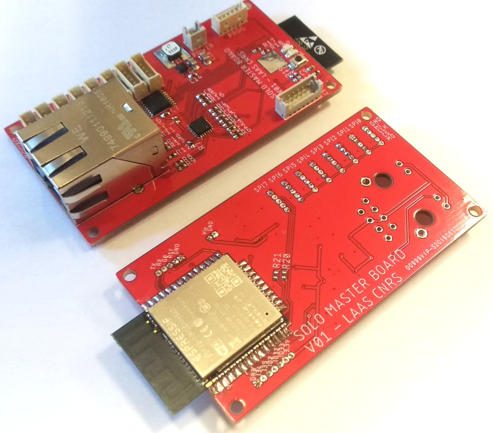
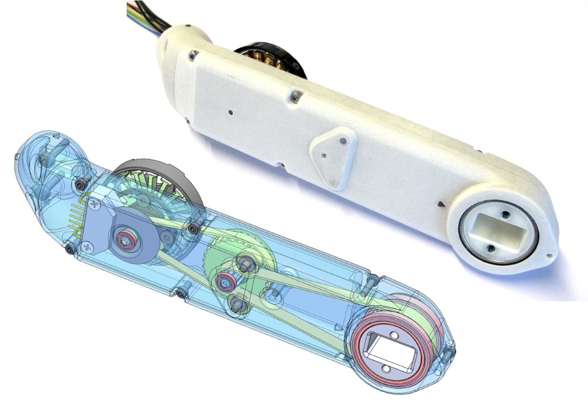
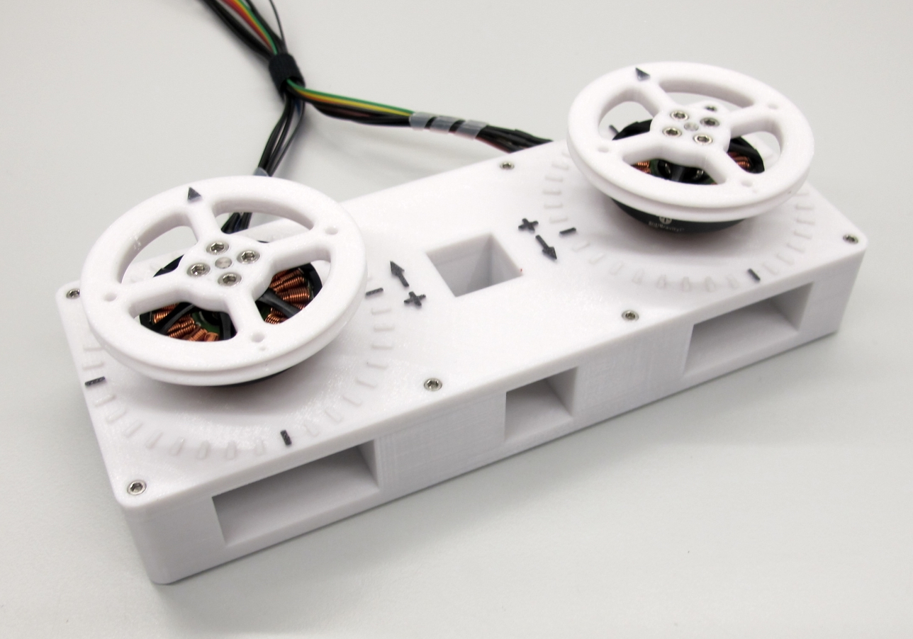
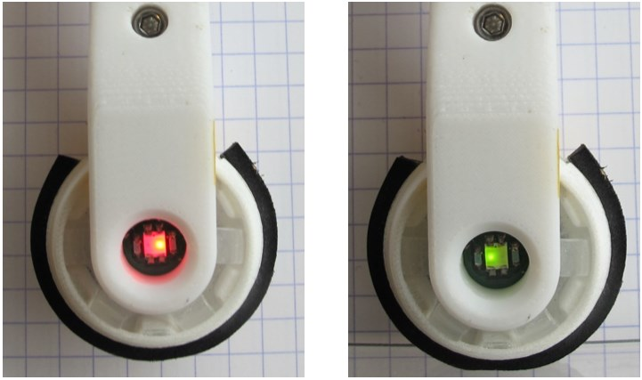
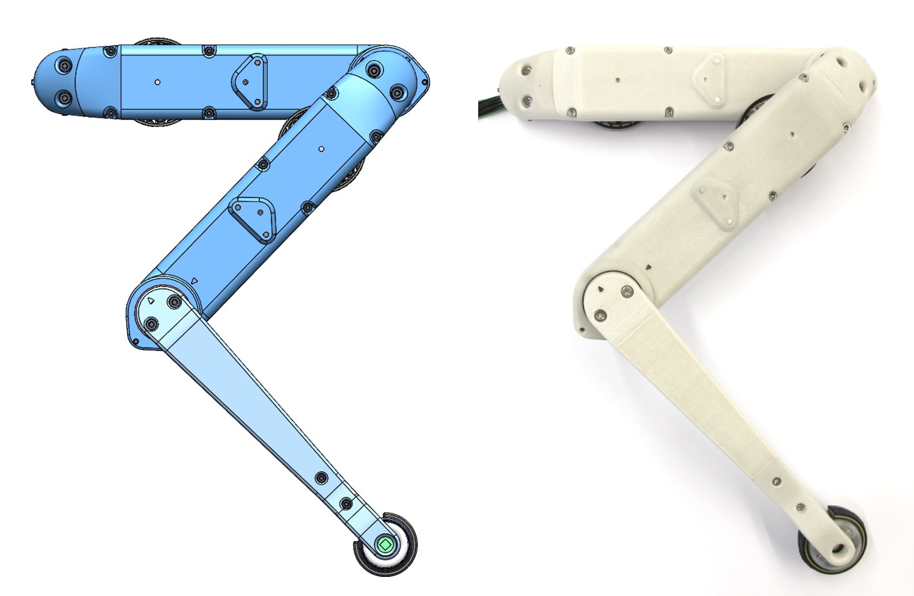

# Open Robot Actuator Hardware

 **Klick on the pictures below for more information**
## Electronics
| TI Evaluation Boards  | BLMC µDriver | Master Board |
| ---------------  | ------------- |------------- |
| |   |   |

## Mechanics
| Actuator Module  | Dual Motor Testbed | Foot Contact Switch |
| ---------------  | ------------- |------------- |
| |   |   |

| 2dof Leg  | Leg Test Stand | Quadruped Robot |
| ------------- | ------------- |------------- |
| |   |   |

Authors
--------
Jonathan Fiene  
Thomas Flayols  
Felix Grimminger  

License
-------
BSD 3-Clause License

Copyright
-----------
Copyright (c) 2019, Max Planck Gesellschaft, New York University

More Information
----------------
[Open Dynamic Robot Initiative](https://open-dynamic-robot-initiative.github.io)  
[Software Overview](https://github.com/open-dynamic-robot-initiative/open-dynamic-robot-initiative.github.io/wiki/Open-Dynamic-Robot-Initiative-Documentation)
