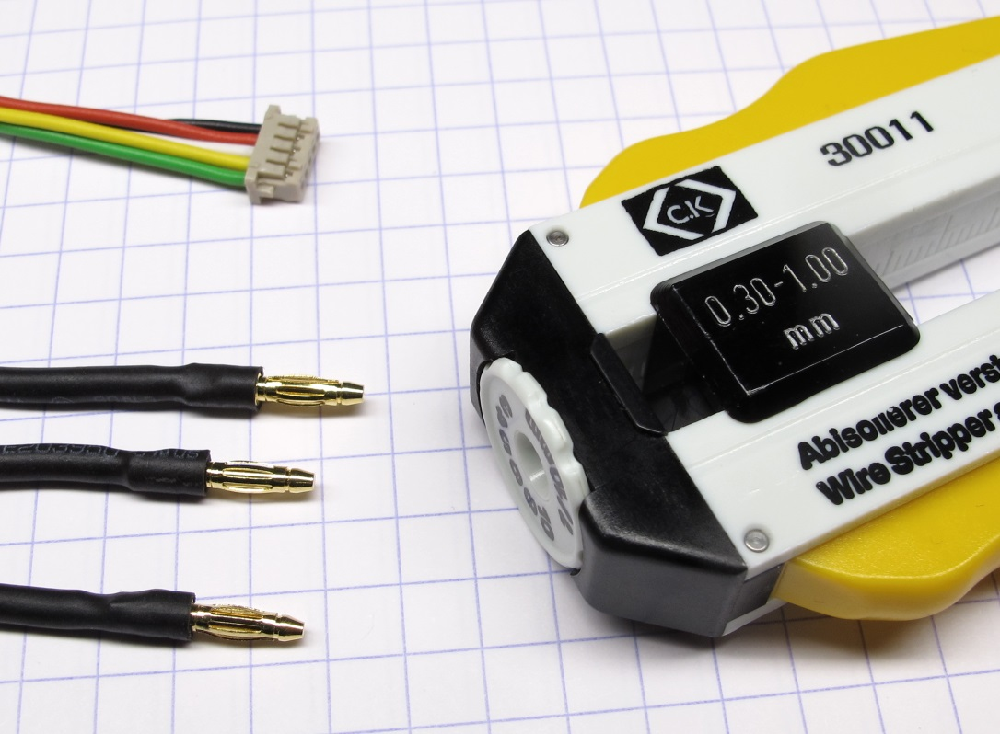

# Open Robot Actuator Electronics

 **Klick on the pictures below for more information**

| TI Evaluation Boards  | BLMC µDriver | Master Board |Components and Tools |
| ---  | --- |--- |---|
| |   |  | |

## Authors
Jonathan Fiene  
Thomas Flayols  
Felix Grimminger  

## License
BSD 3-Clause License

## Copyright
Copyright (c) 2019-2020, Max Planck Gesellschaft and New York University

## More Information
[Open Dynamic Robot Initiative - Webpage](https://open-dynamic-robot-initiative.github.io)  
[Open Dynamic Robot Initiative - YouTube Channel](https://www.youtube.com/channel/UCx32JW2oIrax47Gjq8zNI-w)   
[Open Dynamic Robot Initiative - Forum](https://odri.discourse.group/categories)  
[Open Dynamic Robot Initiative - Paper](https://arxiv.org/pdf/1910.00093.pdf)  
[Hardware Overview](../../README.md#open-robot-actuator-hardware)  
[Software Overview](https://github.com/open-dynamic-robot-initiative/open-dynamic-robot-initiative.github.io/wiki)
