# Details Electronic Components and Tools

## Hirose DF13 Sockets
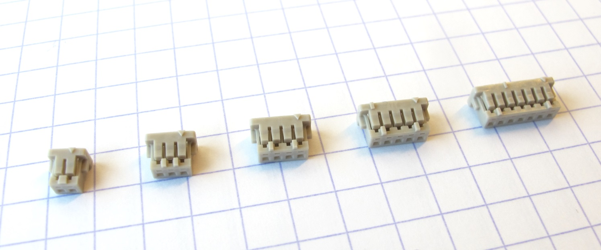  *Hirose Socket Connectors*

|Description|Details|Ordering Information|Comments|
|---|---|---|---|
|Hirose DF13 Socket 2 Pin|DF13-2S-1.25C|RS 503-7748 Digi-Key H2179-ND||
|Hirose DF13 Socket 3 Pin|DF13-3S-1.25C|RS 142-999 Digi-Key H2180-ND||
|Hirose DF13 Socket 4 Pin|DF13-4S-1.25C|RS 143-009 Digi-Key H2181-ND||
|Hirose DF13 Socket 5 Pin|DF13-5S-1.25C|RS 143-015 Digi-Key H2182-ND||
|Hirose DF13 Socket 7 Pin|DF13-7S-1.25C|RS 143-037 Digi-Key H2184-ND||  

## Hirose DF13 Straight Pin Headers
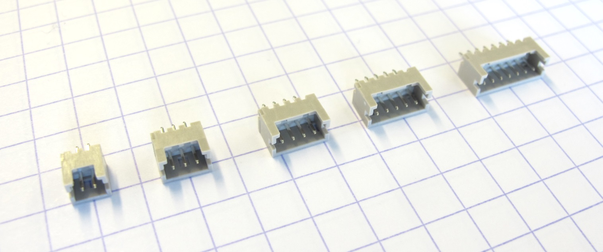  *Hirose Straight Pin Headers*

|Description|Details|Ordering Information|Comments|
|---|---|---|---|
|Hirose DF13 Straight Header 2 Pin|DF13-2P-1.25DSA|Digi-Key H2191-ND||
|Hirose DF13 Straight Header 3 Pin|DF13-3P-1.25DSA|Digi-Key H2192-ND||
|Hirose DF13 Straight Header 4 Pin|DF13-4P-1.25DSA|Digi-Key H2193-ND ||
|Hirose DF13 Straight Header 5 Pin|DF13-5P-1.25DSA|Digi-Key H2194-ND||
|Hirose DF13 Straight Header 7 Pin|DF13-7P-1.25DSA|Digi-Key H2196-ND ||

## Hirose DF13 Right Angle Pin Headers
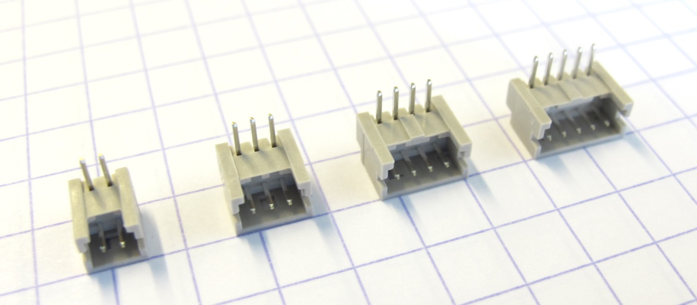  *Hirose Right Angle Pin Headers*

|Description|Details|Ordering Information|Comments|
|---|---|---|---|
|Hirose DF13 Right Angle Header 2 Pin|DF13-2P-1.25DS(20)|Digi-Key H2199-ND||
|Hirose DF13 Right Angle Header 3 Pin|DF13-3P-1.25DS(20)|Digi-Key H2260-ND||
|Hirose DF13 Right Angle Header 4 Pin|DF13-4P-1.25DS(20)|Digi-Key H2201-ND||
|Hirose DF13 Right Angle Header 5 Pin|DF13-5P-1.25DS(20)|Digi-Key H2202-ND||
|Hirose DF13 Right Angle Header 7 Pin|DF13-7P-1.25DS(20)|Digi-Key H2204-ND||

## Hirose DF13 Crimp Terminals
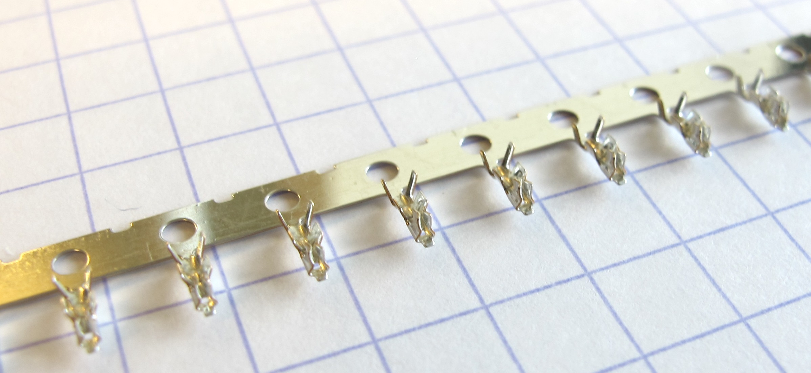  *Hirose Crimp Terminals*

|Description|Details|Ordering Information|Comments|
|---|---|---|---|
|Crimp Terminal Contact 26-30 AWG Cut tape|DF13-2630SCF|RS 503-8325 Digi-Key H9992CT-ND||
|Crimp Terminal Contact 26-30 AWG Reel with 10000 crimp terminals|DF13-2630SCF|Digi-Key H9992TR-ND||

## Hirose Crimp Tool
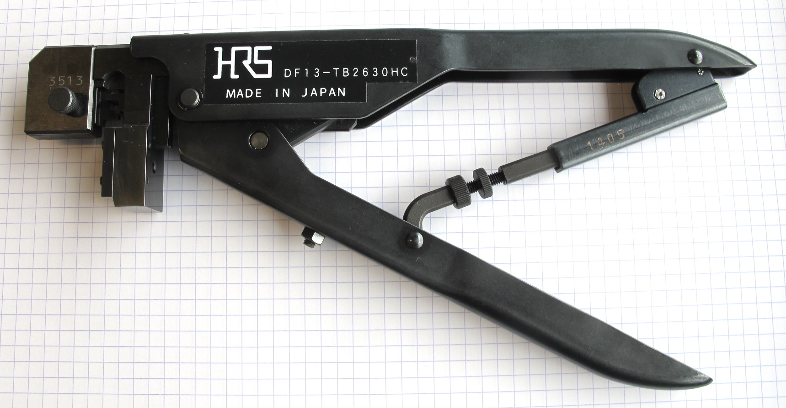  *Hirose Crimp Tool*

|Description|Details|Ordering Information|Comments|
|---|---|---|---|
|Hirose Crimping Tool for DF13 Crimp Terminals|DF13-TB2630HC|RS 503-8331||

## 30cm Pre-Crimped Hirose Wires
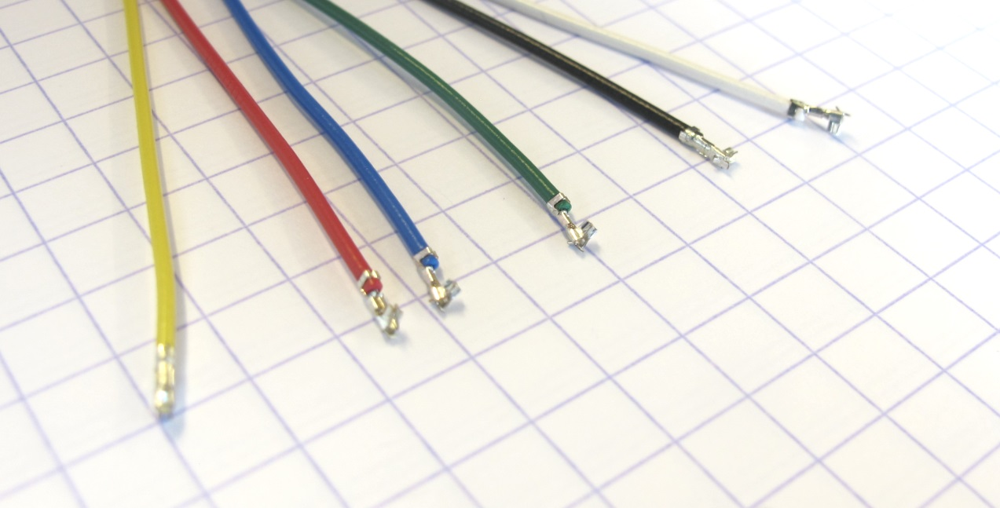  *Precrimped Hirose Wires*

|Description|Details|Ordering Information|Comments|
|---|---|---|---|
|30cm pre-crimped DF13 Hirose Wire Red|Pack of 5 wires|RS 180-6028||
|30cm pre-crimped DF13 Hirose Wire Black|Pack of 5 wires|RS 180-6026||
|30cm pre-crimped DF13 Hirose Wire Green|Pack of 5 wires|RS 180-6034||
|30cm pre-crimped DF13 Hirose Wire Yellow|Pack of 5 wires|RS 180-6038||
|30cm pre-crimped DF13 Hirose Wire White|Pack of 5 wires|RS 180-6027||
|30cm pre-crimped DF13 Hirose Wire Blue|Pack of 5 wires|RS 180-6042||

## Power Connectors
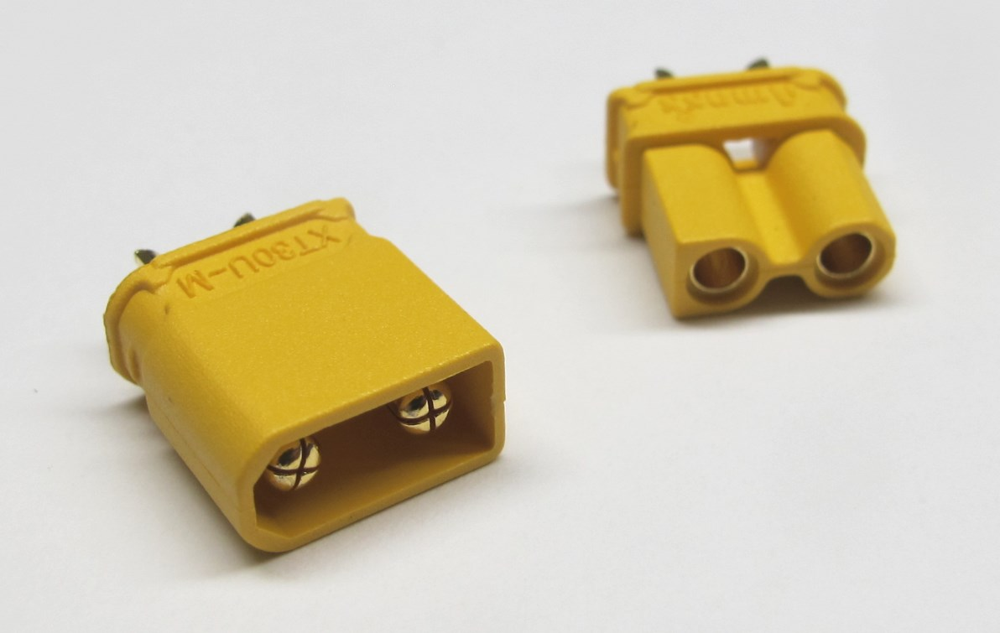  *XT30 Connectors*

|Description|Details|Ordering Information|Comments|
|---|---|---|---|
|XT30U  Connector Receptacle 20 Amps|Reely RE-6619107|Conrad 2206369||
|XT30U Connector Plug 20 Amps|Reely RE-6619104|Conrad 2206368||

## Ethernet Connector
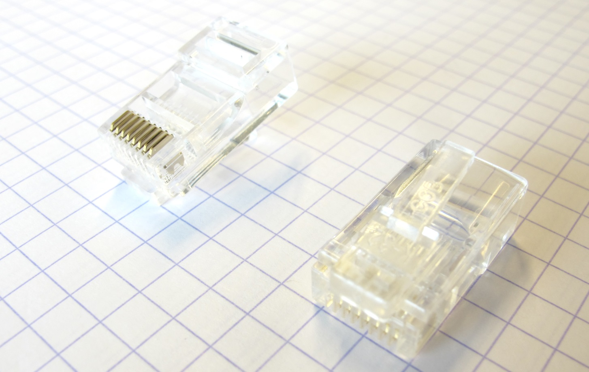  *Ethernet Connector*

|Description|Details|Ordering Information|Comments|
|---|---|---|---|
|RJ45 Connector Plug Cat5e|Pack of 5 connectors|RS 821-2949||

## Crimp Tool Ethernet Connector
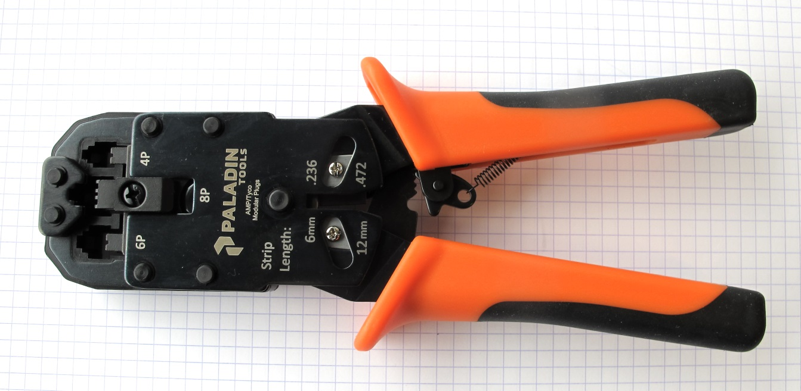  *Crimp Tool Ethernet Connector*

|Description|Details|Ordering Information|Comments|
|---|---|---|---|
|Crimping Tool for RJ45 connectors |Paladin|RS 472-6762||

## Ethernet Jack
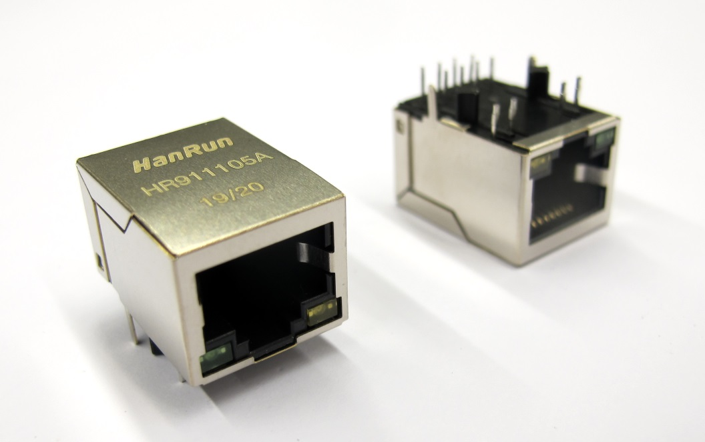  *HanRun Ethernet Jack*

|Description|Details|Ordering Information|Comments|
|---|---|---|---|
|Ethernet Jack|HanRun RJ45 HR911105A|[CSD Electronics](https://csd-electronics.de/Mechanical-Comp-/Connectors/Modular/Network/HanRun-RJ45-jack-HR911105A-2xLED::12367.html?MODsid=foornd5v6nnu0bs9n58bvpqck1)|Used for MasterBoard.|

## Neo Pixel Leds
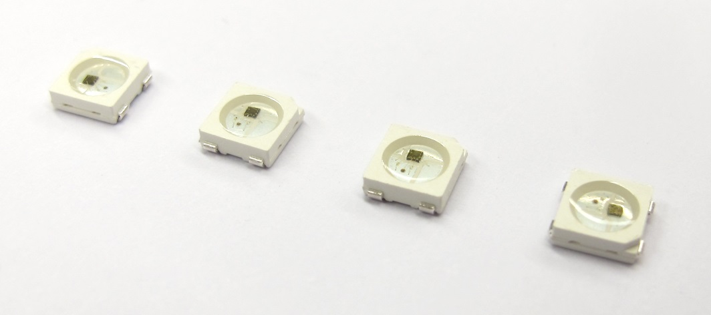  *NeoPixel Leds*

|Description|Details|Ordering Information|Comments|
|---|---|---|---|
|Neo Pixel Led|WS2818B LED SMD 5050 with WS2811 controller|Amazon|Used for MasterBoard.|

## Neo Pixel Led Rings
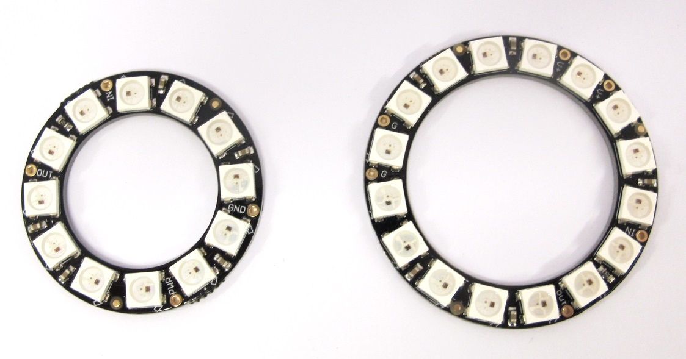  *NeoPixel Led Rings*

|Description|Details|Ordering Information|Comments|
|---|---|---|---|
|NeoPixel Ring RGB LED 12 x WS2812|Adafruit 1643|Mouser 485-1643||
|Neo Pixel Ring RGB LED 16 x WS2812 |Adafruit 1463|Mouser 485-1463||

## Motor Phase Connectors
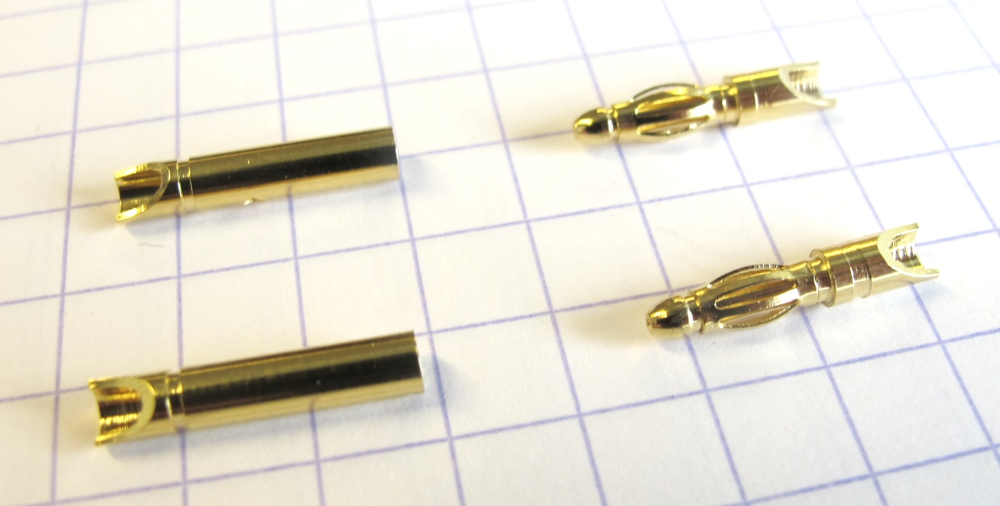  *Motor Phase Connectors*

|Description|Details|Ordering Information|Comments|
|---|---|---|---|
|2mm Gold Connector|Reely RE-1373188 2 pairs per pack|Conrad 1373188||

## Motor Phase Wires
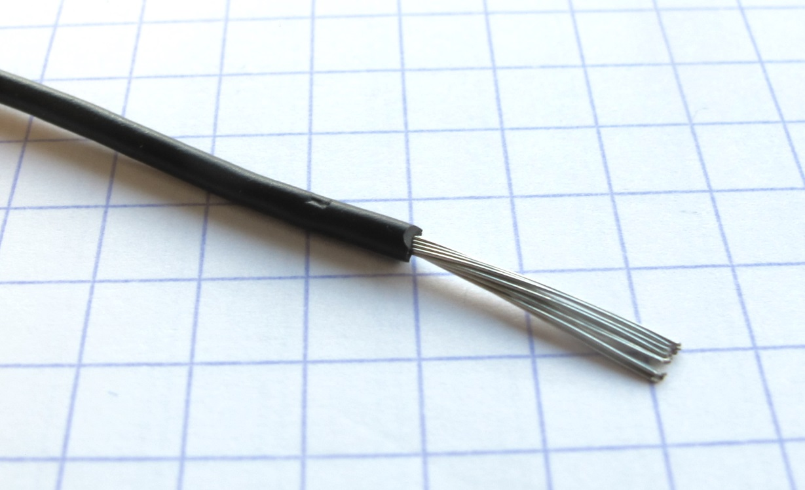  *Motor Phase Wire*

|Description|Details|Ordering Information|Comments|
|---|---|---|---|
|LifY 0,50 mm² black|100m|Kabeltronik 160105009|Highly flexible|
|LiY Wire 0,50 mm² black|25m|Conrad 1567229|Alternative to Kabeltronik wire|

## Kabeltronik Encoder Wires
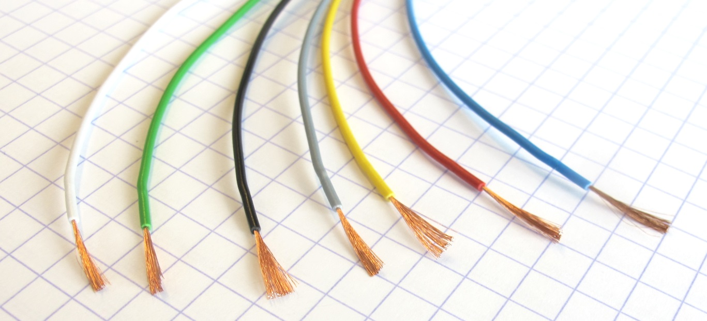  *Kabeltronik Encoder Wires*

|Description|Details|Ordering Information|Comments|
|---|---|---|---|
|LifY Cable 0,14 mm² Red|100m| Kabeltronik 160101408||
|LifY Cable 0,14 mm² Blue|100m| Kabeltronik 160101407||
|LifY Cable 0,14 mm² Yellow|100m| Kabeltronik 160101404||
|LifY Cable 0,14 mm² Green|100m| Kabeltronik 160101403||
|LifY Cable 0,14 mm² White|100m| Kabeltronik 160101401||
|LifY Cable 0,14 mm² Black|100m| Kabeltronik 160101409||
|LifY Cable 0,14 mm² Green|100m| Kabeltronik 160101405||
|LifY Cable 0,14 mm² Purple|100m| Kabeltronik 160101410||

## Heat Shrink
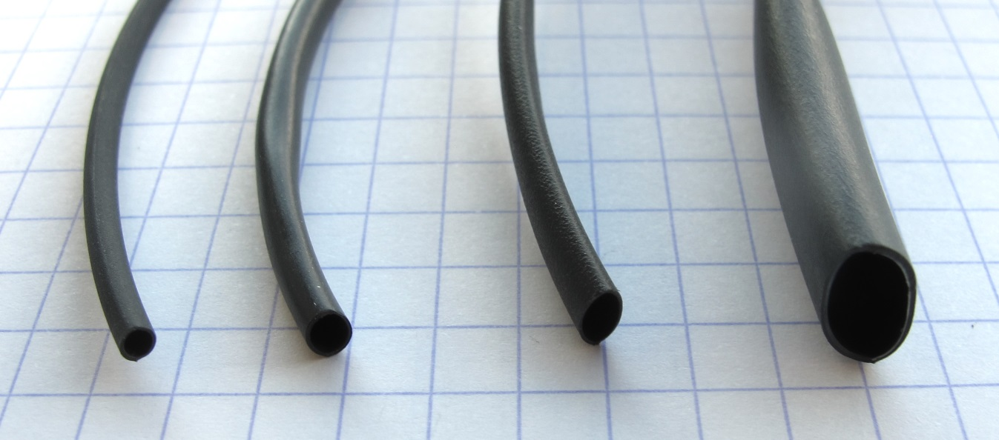  *Heat Shrink Tubing*

|Description|Details|Ordering Information|Comments|
|---|---|---|---|
|Black Heat Shrink Tubing 1.1mm|Alpha Wire FIT-221 / 2:1 Ratio|RS 8395457||
|Black Heat Shrink Tubing 1.5mm|HellermannTyton 10m / 3:1 Ratio|RS 448-247||
|Black Heat Shrink Tubing 2.4mm |HellermannTyton 10m / 2:1 Ratio|RS 914-6821||
|Black Heat Shrink Tubing 3mm |HellermannTyton 10m / 3:1 Ratio|RS 501-4133||
|Black Heat Shrink Tubing 6mm |HellermannTyton 5m / 3:1 Ratio|RS 501-4385||
|Black Heat Shrink Tubing 9mm |HellermannTyton 5m / 3:1 Ratio|RS 447-399||
|Black Heat Shrink Tubing 12mm |HellermannTyton 5m / 3:1 Ratio|RS 501-4111||

## Braided Cable Sleeve
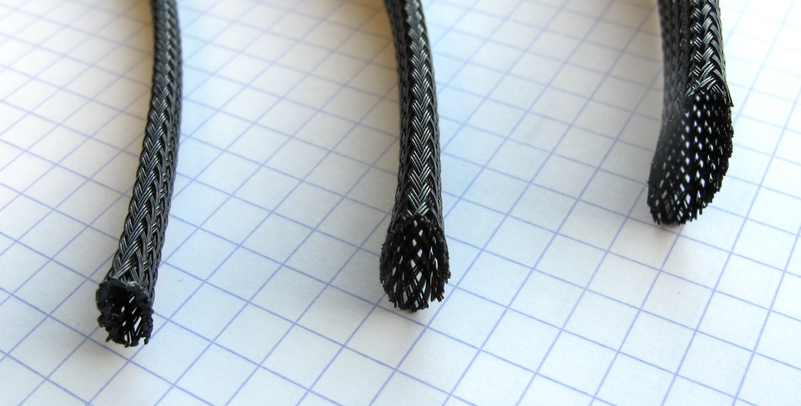  *Braided Cable Sleeves*

|Description|Details|Ordering Information|Comments|
|---|---|---|---|
|Braided Cable Sleeve 3mm Black|HellermannTyton|RS 187-4600||
|Braided Cable Sleeve 4mm Black|HellermannTyton|RS 187-4616||
|Braided Cable Sleeve 5mm Black|HellermannTyton|RS 187-4622||
|Braided Cable Sleeve 6mm Black|HellermannTyton|RS 187-4638||
|Braided Cable Sleeve 8mm Black|HellermannTyton|RS 187-4644||
|Braided Cable Sleeve 10mm Black|HellermannTyton|RS 187-4650||

## Flashing Connectors
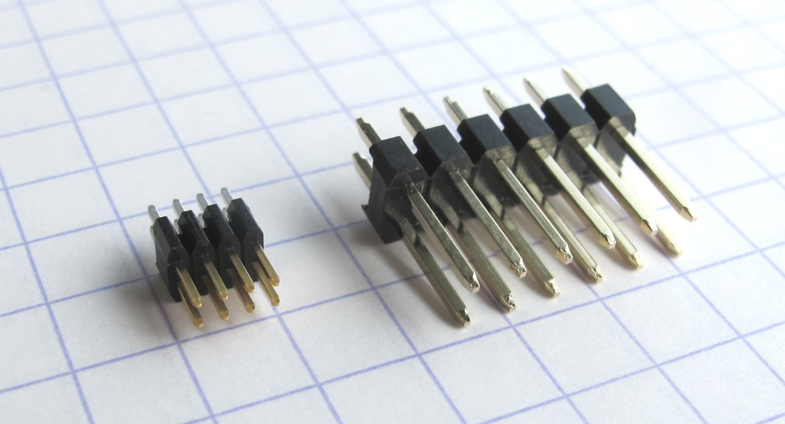  *Flashing Connectors*

|Description|Details|Ordering Information|Comments|
|---|---|---|---|
|Pin Header 8 Position 1.27mm pitch|Amphenol ICC 20021111-00008T4LF|Digi-Key 609-3711-ND|Flash Cable Micro Driver Side|
|Pin Header 2,54 mm pitch|Assmann AWL254-DG-G72A|RS 674-2347|Flash Cable Flasher Side|

## Ribbon Cable
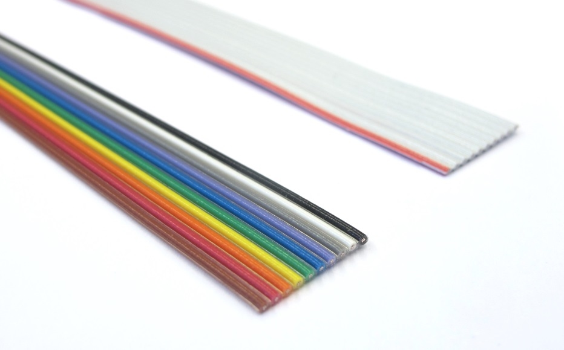  *Ribbon Cables*

|Description|Details|Ordering Information|Comments|
|---|---|---|---|
|Ribbon Cable Gray|HARTING 09180107001|DigiKey 1195-4452-ND|Pitch 1,27mm / 0,050" / 10 conductors|
|Ribbon Cable Multicolor|3M 3302-10|DigiKey MC10M-25-ND RS 105-5281|Pitch 1,27mm / 0,050" / 10 conductors|

## IMU Cable
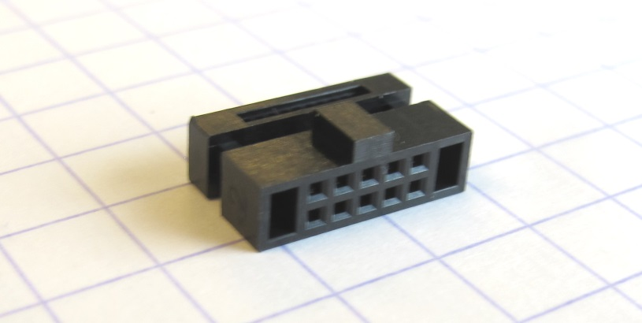  *Connector for Microstrain IMU*

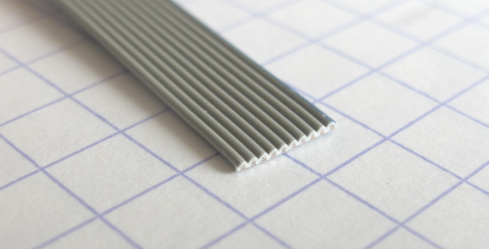  *Ribbon Cable for Microstrain IMU*

|Description|Details|Ordering Information|Comments|
|---|---|---|---|
|10 Position Rectangular Connector for Cable Mount|HARWIN M50-3300542|Digi-Key 952-2561-ND RS 909-4391|IMU connector|
|Ribbon Cable|10 conductors - pitch 0,050" /1,27mm - AWG28|Digi-Key AE10G-300-ND|IMU cable|

## Power Connectors and Cable
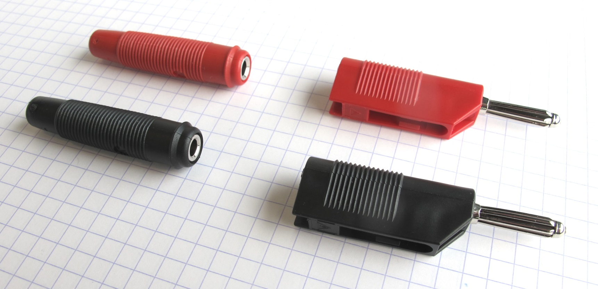  *Power Supply Connectors*

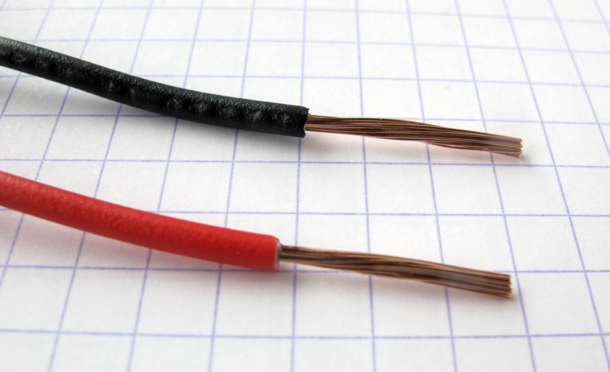  *Power Supply Cable*

|Description|Details|Ordering Information|Comments|
|---|---|---|---|
|Power Connector male 4mm black|Hirschmann 930729100|RS 738-884||
|Power Connector male 4mm red|Hirschmann 930729101|RS 738-890||
|Power Connector female 4mm black|Hirschmann 931804100|RS 175-8974||
|Power Connector female 4mm red|Hirschmann 931804101|RS 175-8980||
|Power Wire 1mm² black|LifY 1mm² - 100m|Kabeltronik 160110009|Highly flexible|
|Power Wire 1mm² red|LifY 1mm² - 100m|Kabeltronik 160110008|Highly flexible|
|Power Wire 1mm² black|Lapp H05V-K 100m|RS 724-4364|Alternative to Kabeltronik wire|
|Power Wire 1mm² red|Lapp H05V-K 100m|RS 724-4361|Alternative to Kabeltronik wire|

## Wire Splice Connectors

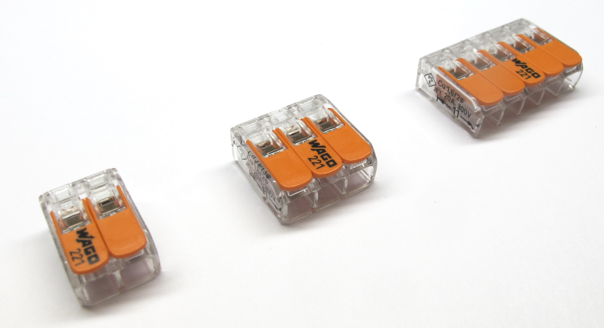  *Wire Splice Connectors*

|Description|Details|Ordering Information|Comments|
|---|---|---|---|
|2 Conductor Wire Splice Connector|Wago 221-412|RS 883-7544|0,2 – 4mm² 24 – 12 AWG|
|3 Conductor Wire Splice Connector|Wago 221-413|RS 883-7548|0,2 – 4mm² 24 – 12 AWG|
|5 Conductor Wire Splice Connector|Wago 221-415|RS 883-7557|0,2 – 4mm² 24 – 12 AWG|

## E-Stop Switch
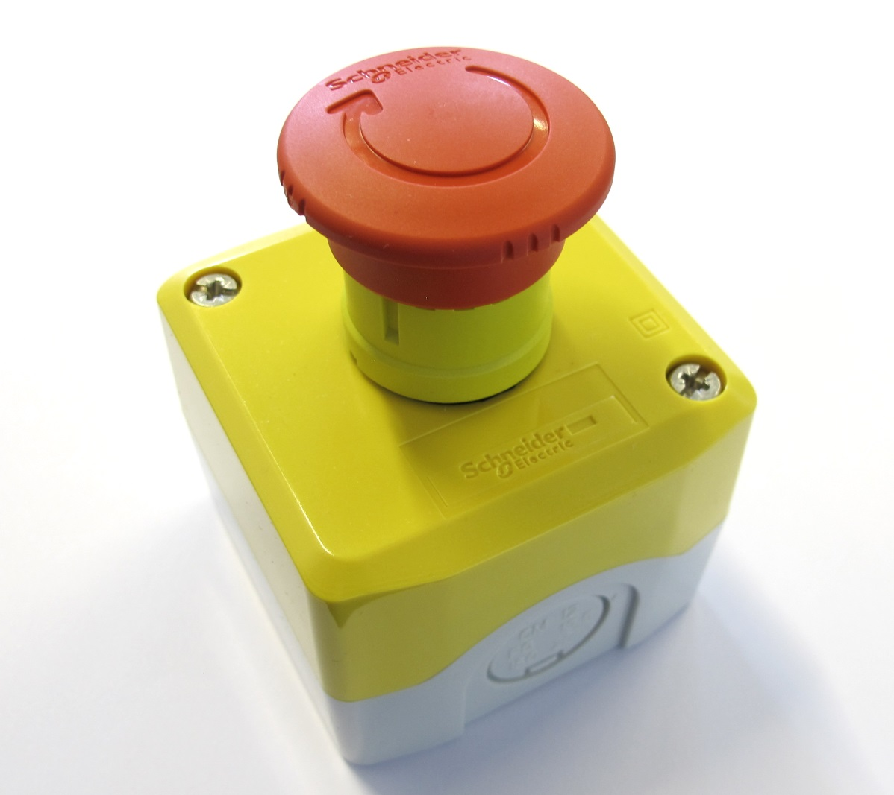  *E-Stop Switch*

|Description|Details|Ordering Information|Comments|
|---|---|---|---|
|E-Stop Switch|Schneider Electric Harmony XALK Ø 40mm|RS 330-8587||
|Cable Gland for E-Stop|M20 thread Maximum wire diameter 9mm|RS 669-4660||

## JTAG Flash Programmer
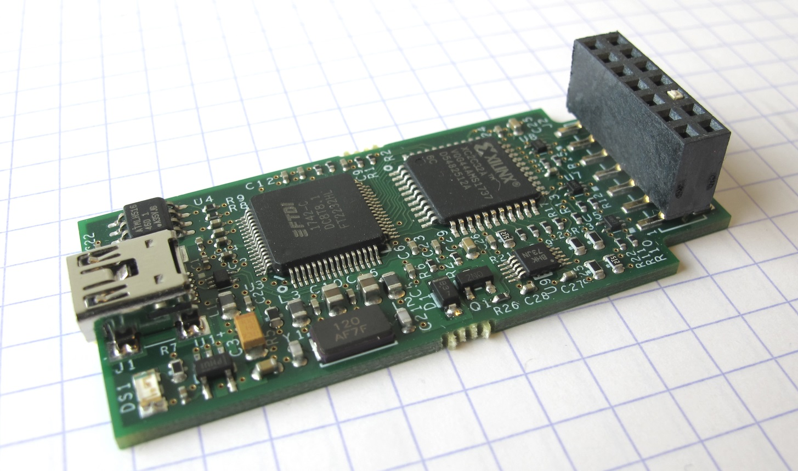  *JTAG Flash Programmer*

|Description|Details|Ordering Information|Comments|
|---|---|---|---|
|JTAG EMULATOR XDS100V2 USB|Spectrum Digital XDS100V2 JTAG|Digi Key 702302-ND  Farnell 1831927||

## Precision Resistors
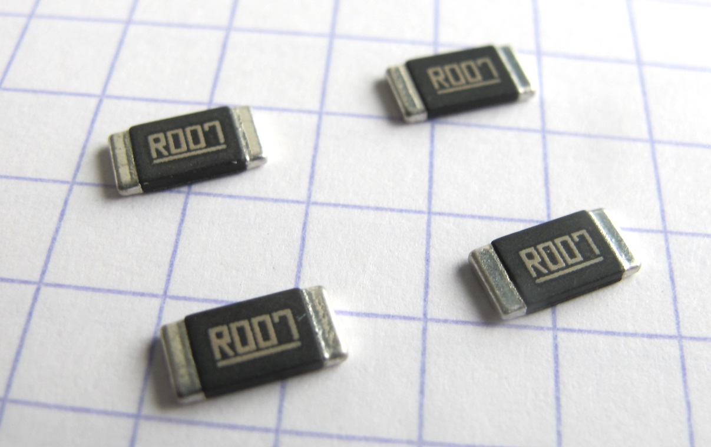  *Precision Resistors for Micro Driver Electronics*

|Description|Details|Ordering Information|Comments|
|---|---|---|---|
|Precision Resistors 7mΩ ±1%|CRE2512-FZ-R007E-3|RS 824-0348 |Phase Current Measurement Micro Driver Board|

## Right Angle Pin Headers
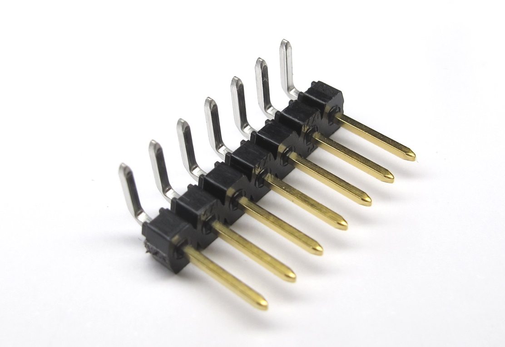  *Right angle pin headers for connecting the motor phase wires*

|Description|Details|Ordering Information|Comments|
|---|---|---|---|
|Right Angle Pin Header|Molex 1 Row Right Angle Pin Header Pitch 2.54mm|RS 360-6364 |Motor Phase Connection Micro Driver Board|

## Power Supply
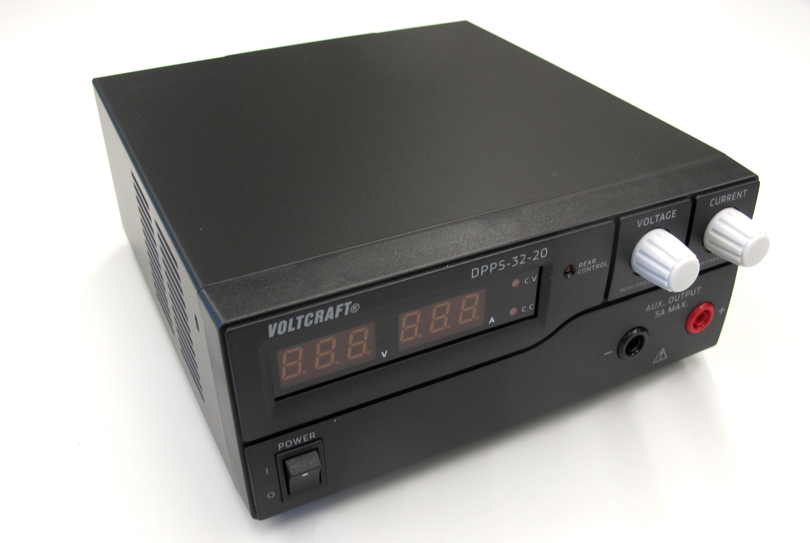  *Voltcraft Power Supply*

|Description|Details|Ordering Information|Comments|
|---|---|---|---|
|Lab Power Supply VOLTCRAFT DPPS-32-20|1-32V DC 0-20A 640 W Supply Voltage 230V|Conrad 1086560|20A max.|
|Lab Power Supply VOLTCRAFT DPPS-32-30|1-32V DC 0-30A 960 W Supply Voltage 230V|Conrad 1086563|30A max.|

## CAN Card
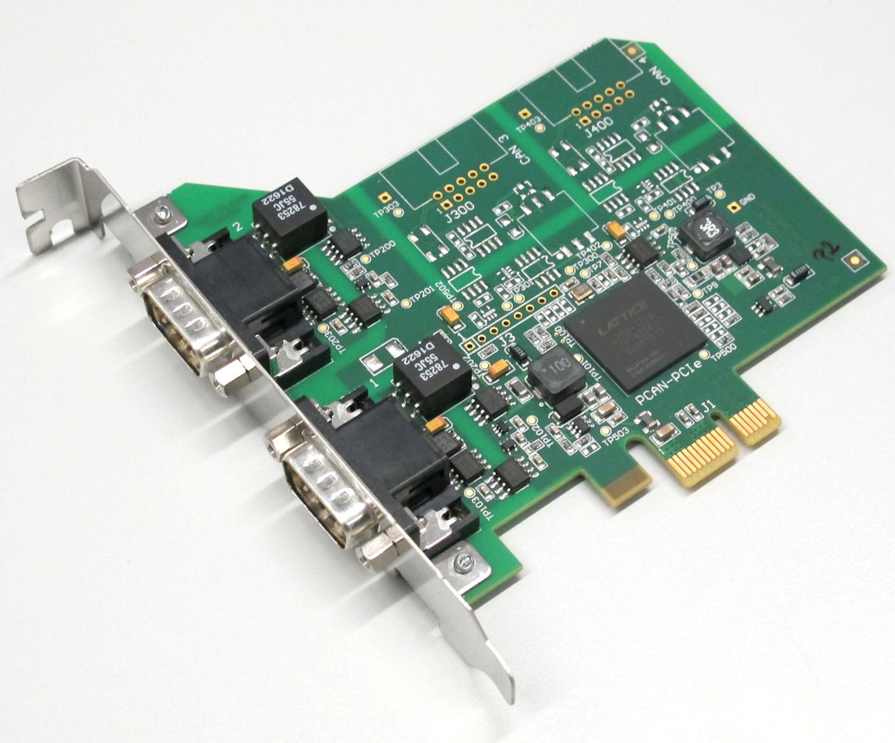  *Dual Channel PCI Express card*

|Description|Details|Ordering Information|Comments|
|---|---|---|---|
|PCAN - PCI Express CAN Card|Dual Channel|PEAK System IPEH-003027|Galvanically isolated|

## CAN Connector
  *9pin D-Sub connector*

|Description|Details|Ordering Information|Comments|
|---|---|---|---|
|9 pin D-Sub Connector||RS 765-9555||

## Heat Shrink Label Maker
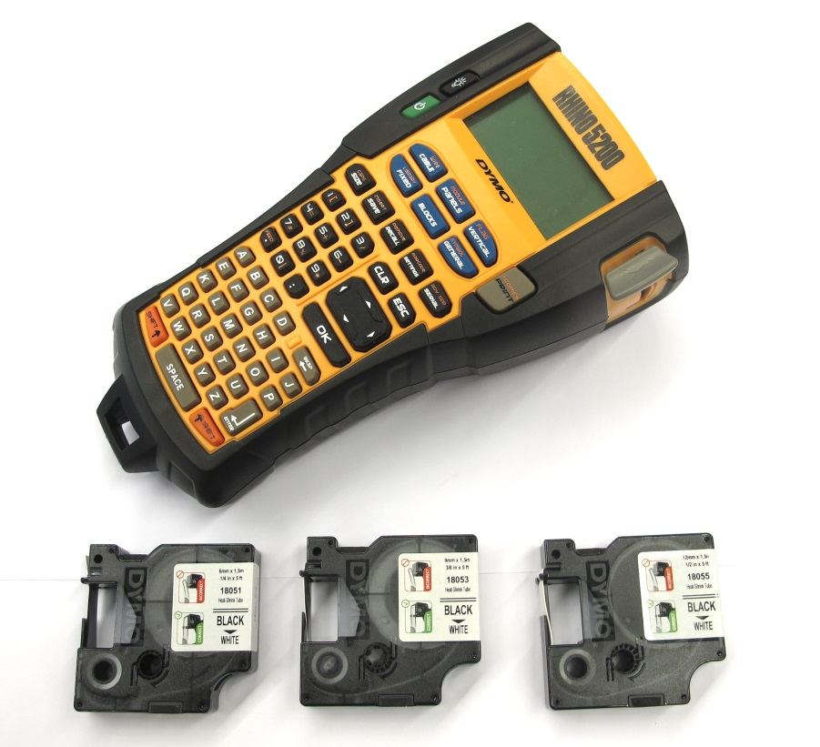  *Rhino Heat Shrink Label Maker*

|Description|Details|Ordering Information|Comments|
|---|---|---|---|
|DYMO Rhino 5200 Heat Shrink Label Maker|DYMO #1755749|RS 686-4702||
|Heat Shrink ø 6mm|DYMO #18051|RS 515-6760|black on white|
|Heat Shrink ø 9mm|DYMO #18053|RS 733-5883|black on white|
|Heat Shrink ø 12mm|DYMO #18055|RS 515-5565|black on white|
|Heat Shrink ø 19mm|DYMO #18057|RS 515-6782|black on white|

## Soldering Iron
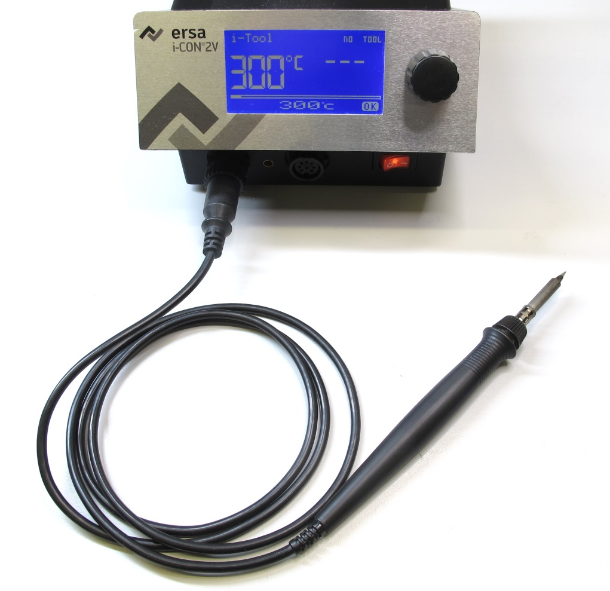  *Soldering iron with temperature control*

|Description|Details|Ordering Information|Comments|
|---|---|---|---|
|Soldering Iron |Ersa i-CON| Conrad 2272879  Farnell 1625358|Temperature Range: 150°C to 450°C|
|Solder|Stannol HS10|RS 518-012|Ø 0.5mm / 250g|

## Heat Gun
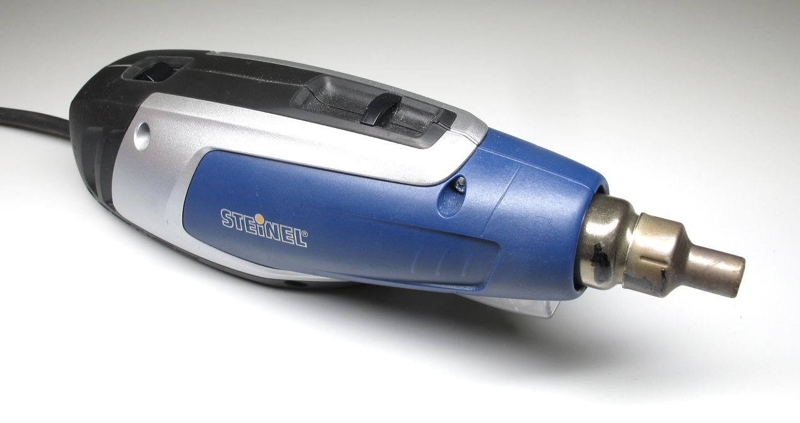  *Heat Gun* 

|Description|Details|Ordering Information|Comments|
|---|---|---|---|
|Steinel Heat Gun|Steinel HL Stick| Conrad 818872 Farnell 2138307|Temperature not adjustable.|

## Multimeter
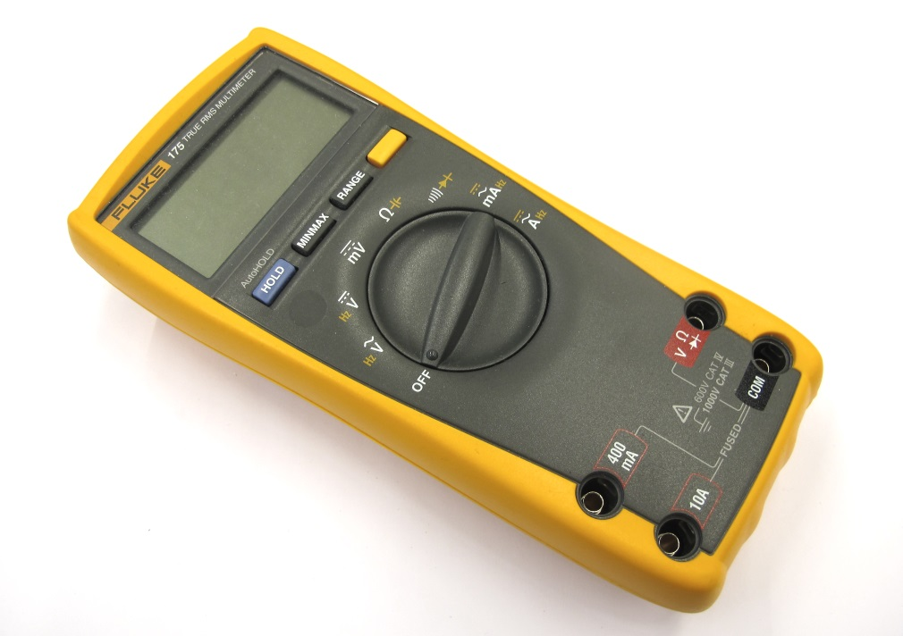  *Multimeter - Fluke 175*

|Description|Details|Ordering Information|Comments|
|---|---|---|---|
|Multimeter|Fluke 175|RS 394-4470 Farnell 3558678||

## Test Probes
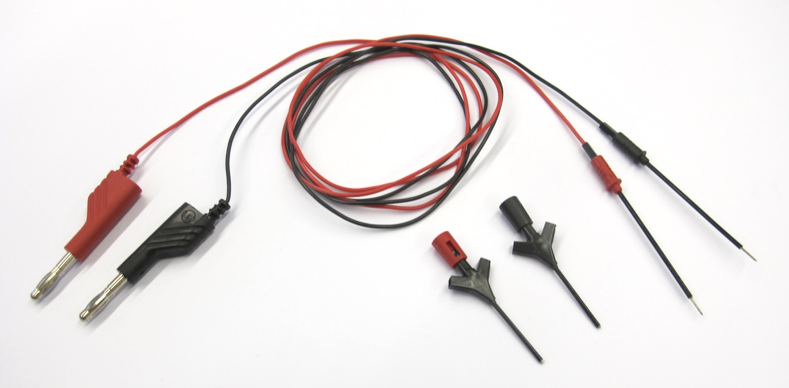  *Miniature Test Probes* 

|Description|Details|Ordering Information|Comments|
|---|---|---|---|
|Miniature Test Probes|Hirschmann 	932959001|RS 775-681 Farnell 1011414||

## Pliers
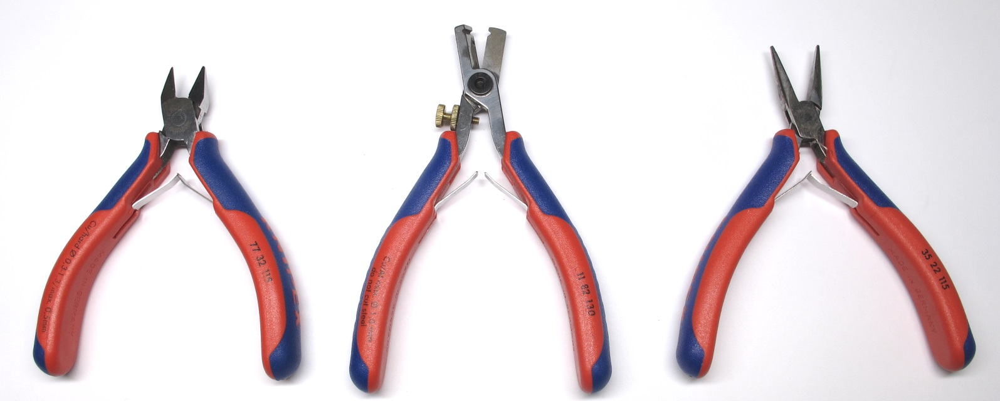  *Wire cutter, pliers and wire stripper*

|Description|Details|Ordering Information|Comments|
|---|---|---|---|
|Wire Cutter|Knipex 7732115|Hahn+Kolb 53106040 Farnell 3330436||
|Pliers|Knipex 3522115|Hahn+Kolb 53104020 Farnell 1715017||
|Wire Stripper|Knipex 1182130|Hahn+Kolb 53110015 Farnell 1779811||

## Tweezers
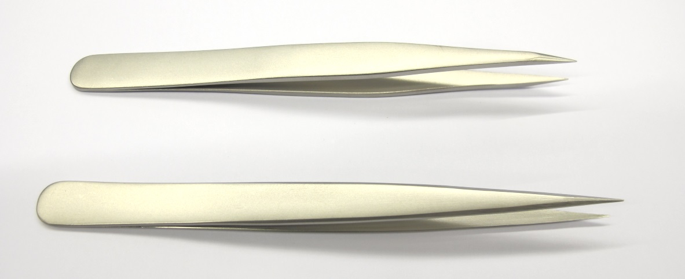  *Tweezers* 

|Description|Details|Ordering Information|Comments|
|---|---|---|---|
|Tweezers|LINDSTRÖM|Hoffmann 727502||

## Third Hand
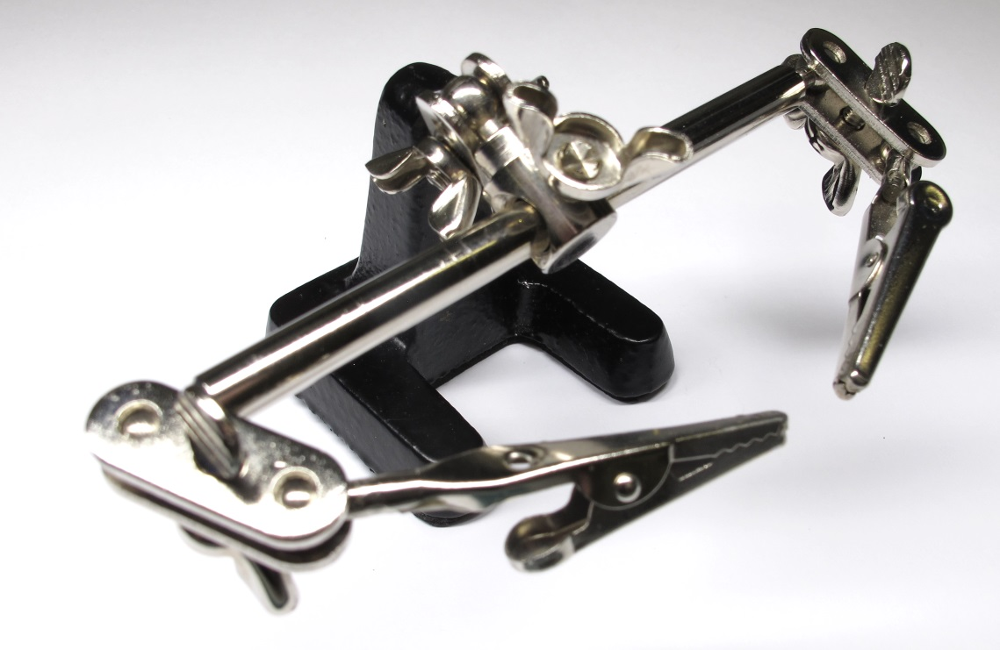  *Third hand* 

|Description|Details|Ordering Information|Comments|
|---|---|---|---|
|Third Hand||RS 221-7531||

## Batteries and Charging Accessories

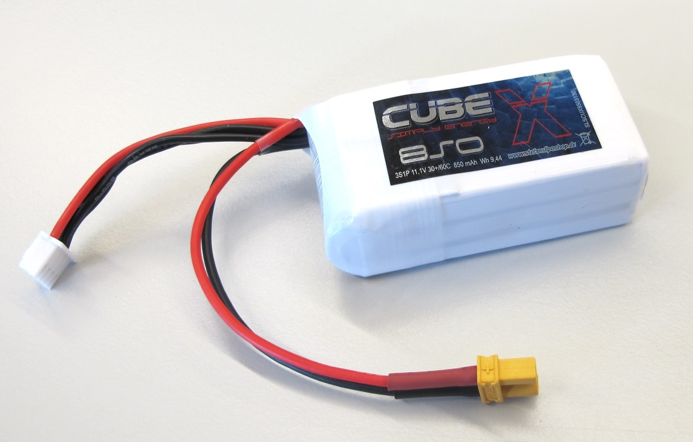  *X-Cube Battery - weight: 68g* 

|Description|Details|Ordering Information|Comments|
|---|---|---|---|
|LiPo Battery SLS X-Cube 850mAh |3S1P 11,1V 30C / 60C  Dimensions: 60mm x 30mm x 21mm|[SLS Product Page](https://www.stefansliposhop.de/en/batteries/sls-x-cube/sls-x-cube-30c/sls-x-cube-850mah-3s1p-11-1v-30c-60c::1534.html) SLSCUX08503130|The batteries haven't been tested yet - don't use without power management board! Power connector: XT 30 Balancer connector: XH|
|ISDT SMART DUO CHARGER D2|200W, 12A, 2X6S LiPo, Integrated Power Supply|[SLS Product Page](https://www.stefansliposhop.de/en/chargers-power-supplys/isdt/isdt-smart-duo-charger-d2-200w-12a-2x6s-lipo-integrated-power-supply::1916.html) ISDT-D2|Power connector: XT 60 Balancer connector: XH|
|BAT-SAFE Safety Case|Inner dimensions: 250 x 165 x 90mm|[SLS Product Page](https://www.stefansliposhop.de/en/lipo-safety-case/bat-safe-safety-case::1841.html) BAT-SAFE||
|Fire Extinguishing Granulate|1L Pillow|[SLS Product Page](https://www.stefansliposhop.de/en/lipo-safety-case/extover-fire-protection-fire-extinguishing-granulate-for-lithium-batteries-pillow-1l::2061.html) EXV-KISS1L||
|Adapter Cable - XT60 to 4mm|Length: 30cm|[SLS Product Page](https://www.stefansliposhop.de/en/chargers-power-supplys/isdt/sls-isdt-adapter-cable-for-charging-cable-with-4mm-banana-plug::1821.html) SLS-ISDT ALK||
|Adapter Cable - XT30 to 4mm|Length: 30cm|[SLS Product Page](https://www.stefansliposhop.de/en/accessories/charge-cable/sls-xt30-charge-cable::1872.html) SLS XT30 Ladekabel||
|XH-XH Balancer Extension Wire|Length: 25cm|[SLS Product Page](https://www.stefansliposhop.de/en/accessories/balancer-cables/sls-sensor-cable-xh-xh-3s-long::1754.html) SLSXHXHL3S| XH female to XH male 3S|

## Switches
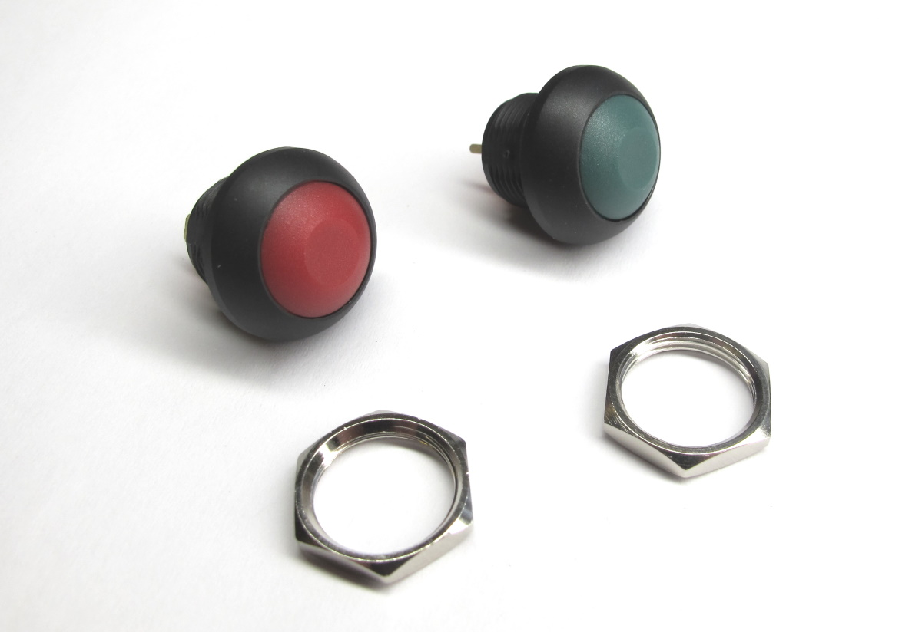  *Push button switches - weight: 3,5g each* 

|Description|Details|Ordering Information|Comments|
|---|---|---|---|
|Push Button Switch Red|ø13,6mm Normally closed - momentarily open while pushed |RS 820-7587|E-stop switch for robots|
|Push Button Switch Green|ø13,6mm Normally open - momentarily closed while pushed |RS 820-7593|On-off switch for robots|

---
## More Information
[Open Dynamic Robot Initiative - Webpage](https://open-dynamic-robot-initiative.github.io)  
[Open Dynamic Robot Initiative - YouTube Channel](https://www.youtube.com/channel/UCx32JW2oIrax47Gjq8zNI-w)   
[Open Dynamic Robot Initiative - Forum](https://odri.discourse.group/categories)  
[Open Dynamic Robot Initiative - Paper](https://arxiv.org/pdf/1910.00093.pdf)  
[Hardware Overview](../../README.md#open-robot-actuator-hardware)  
[Software Overview](https://github.com/open-dynamic-robot-initiative/open-dynamic-robot-initiative.github.io/wiki)  

## Authors
Felix Grimminger

## License
BSD 3-Clause License

## Copyright
Copyright (c) 2019-2021, Max Planck Gesellschaft and New York University
