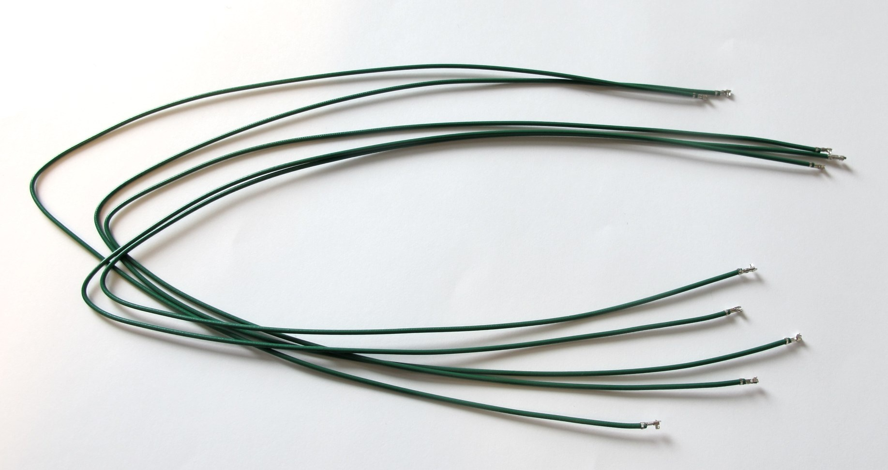
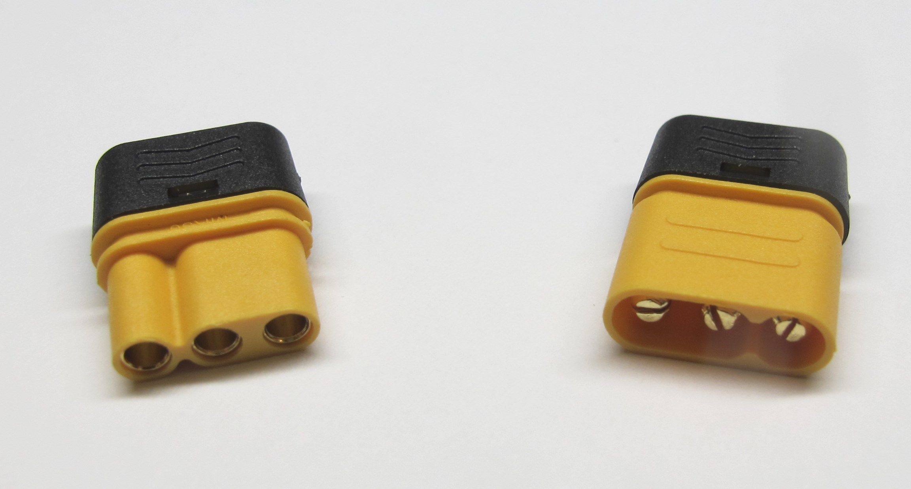

Details Components
=======================

Components and Tools
-------------

Hirose DF13 Connectors
------------------
RS 503-8325  
RS 143-015  
RS 5037912  
RS 143-116  
RS 503-7748  
RS 503-7883  
RS 142-999  

Hirose Crimp Tool
-------------------
Crimp tool: RS 503-8331

30cm precrimped Hirose Wires
-----------------------------

  *Precrimped Wires*

RS 180-6028  
RS 180-6026  
RS 180-6034  
RS 180-6038  
RS 180-6027  
RS 180-6042  

Power Connectors
-----------------
  *MR30 Connectors*

  *XT30 Connectors*

Authors
--------
Felix Grimminger

License
-------
BSD 3-Clause License

Copyright
-----------
Copyright (c) 2019, Max Planck Gesellschaft, New York University

More Information
----------------
[Open Dynamic Robot Initiative - Webpage](https://open-dynamic-robot-initiative.github.io)  
[Open Dynamic Robot Initiative - YouTube Channel](https://www.youtube.com/channel/UCx32JW2oIrax47Gjq8zNI-w)  
[Hardware Overview](../../README.md)  
[Software Overview](https://github.com/open-dynamic-robot-initiative/open-dynamic-robot-initiative.github.io/wiki/Open-Dynamic-Robot-Initiative-Documentation)  
[Back to Electronics](../README.md)  
