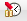
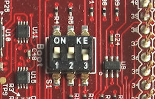
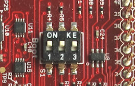

# Details Flashing

This document describes how to flash the firmware on the TI LaunchPad Development Kit.

## Step 1 - Remove jumpers

After unpacking the LaunchPad, 
* Remove the jumpers JP1, JP2, JP4, JP5
* Enable the jumper JP6

## Step 2 - Install software to flash the firmware

**TODO**:
* How to install Code Composer
* How to clone the required code

## Step 3 - For development only: Run the Program via USB using CCS Debugger

This is the default procedure during developement/debugging, as you can directly run updated versions of your code and the debugger allows full access to all global variables during runtime.

From Code Composer:

1. Compile your code, using the "Release" build.
2. Make sure the board is powered and connected via USB to the PC. All three boot switche have to be in the upper position (see below).
3. Start the Debugger by clicking on the bug icon in the tool bar:  
4. Enable Silicon Real-time Mode by clicking the corresponding button in the tool bar: 
5. Run the code by pressing the Resume button: 
6. Now you can use a GUIComposer GUI or modify variables on the board via the Expressions View
7. To quit the debugger, press the Terminate button:   Note: This will only detach the debugger, it will not stop the program on the board!

With this procedure, the program is not permanently stored on the board. That means all steps have to be repeated, everytime the board is restarted.

## Step 4 - Flash the firmware

Make sure the LaunchPad is powerd through motor boaster packs.

### Write Program to Flash

To have the program written to flash rather than RAM, simply switch the build type from "Release" to "Flash". You may have to adjust the Include Options of the project as they are specific to the build type (just set the same folders as for Release).

Now compile and write the program to the board by running the debugger (same procedure like described above, only use "Flash" instead of "Release" build). You can use the debugger to run and monitor the program just like before.

Note that while the program is written to the flash memory now, it is not automatically loaded from there when you reset the board. For this you have to change the boot settings (see next section).

### Boot from Flash

After the program is written to the flash memory with the steps described above, the boot settings have to be changed to tell the board to run the code in the flash rather than using the USB connection.

Change the switches on the board (hidden under the J1 BoosterPack...) to 1: Up, 2: Up, 3: Down.

Now the board should automatically run the program from flash when powered. Note that connection via USB is not possible in this configuration (i.e. to use the debugger or update the program you have to set the switches back to Up/Up/Up again).

| Run program from Flash | Use jTag (debug via USB) |
|------------------------|--------------------------|
|  |  |

