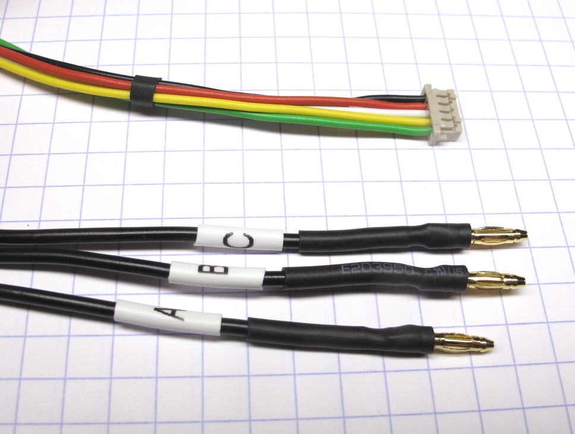
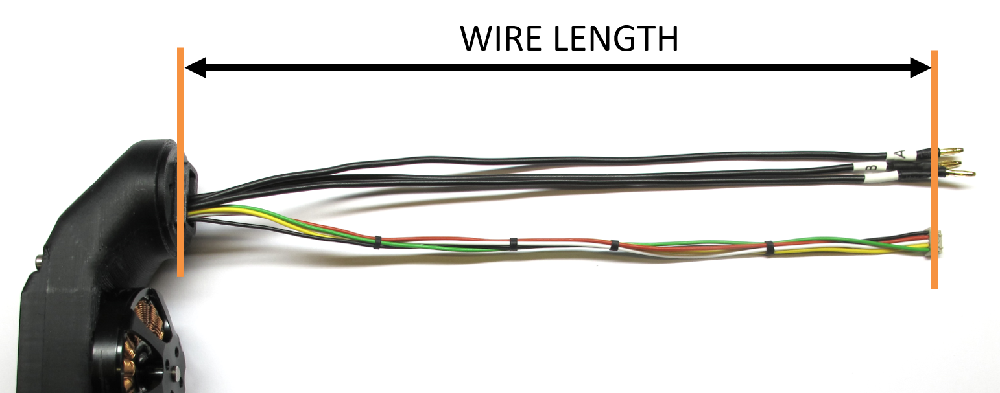
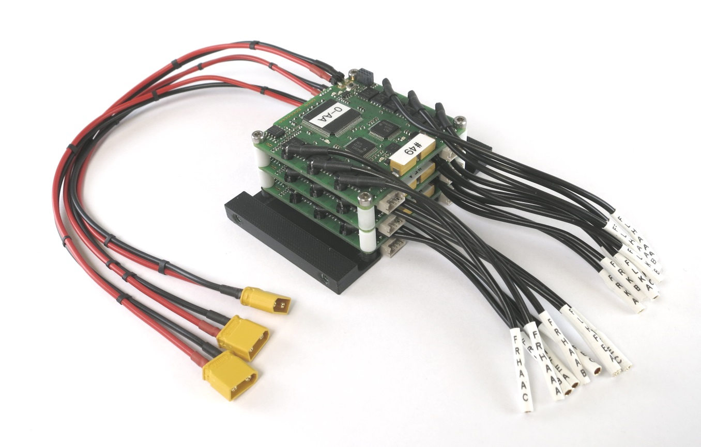
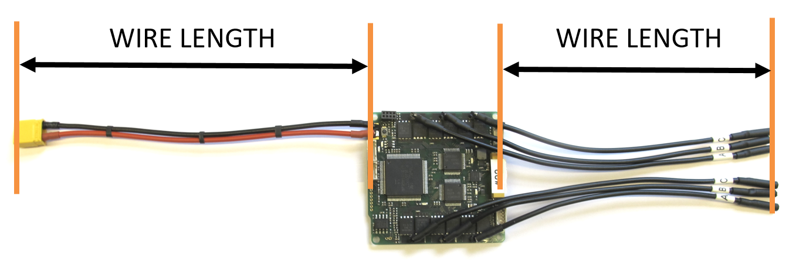
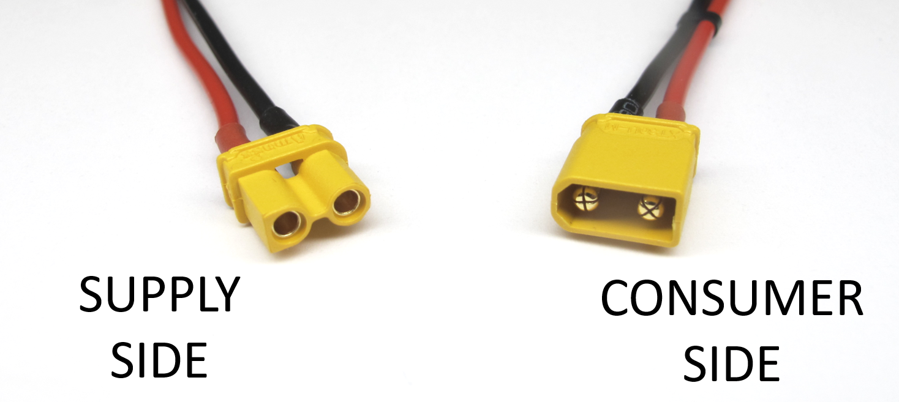
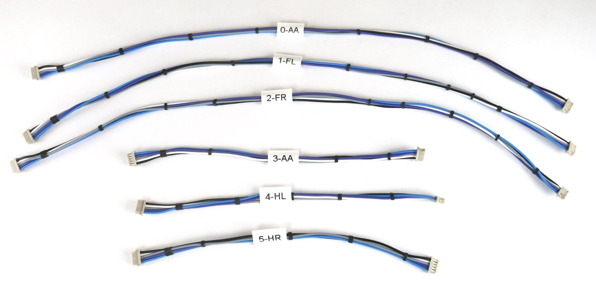
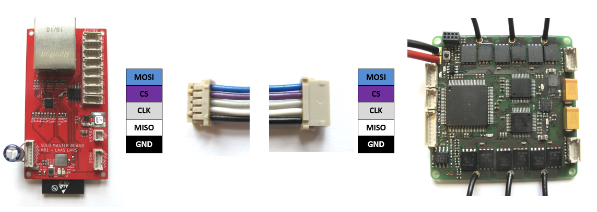
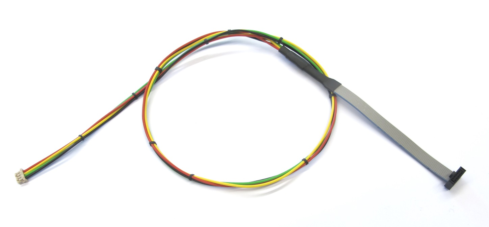
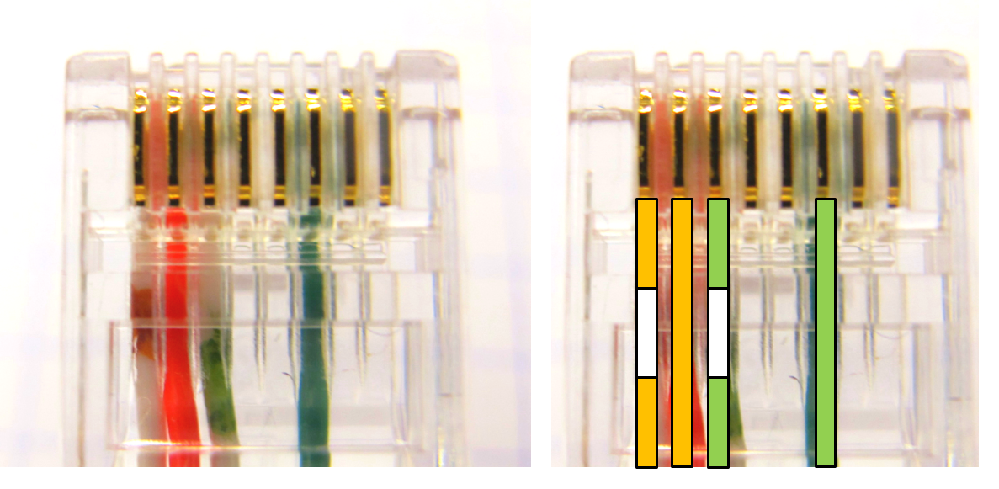
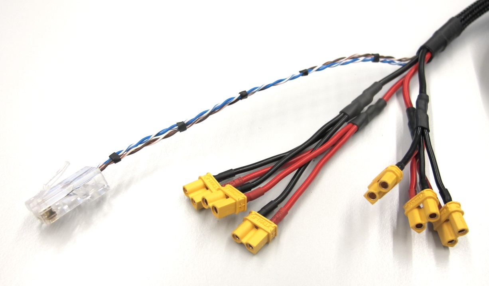

# Details Wiring
## Actuator Module Wiring
  *Electrical connection actuator modules* 

* the electrical interface of the actuator modules consists of a 5 pole encoder wire and 3 motor phase wires
* for the encoder wires we use [0,14 mm² Kabeltronik wires](details_components.md#kabeltronik-encoder-wires) with a [5 pole Hirose DF13 connector](details_components.md#hirose-df13-sockets)
* for crimping the wires you will need the [DF13 crimp terminals](details_components.md#hirose-df13-crimp-terminals) and the [Hirose DF13 crimp tool](details_components.md#hirose-crimp-tool)
* the color code and pin assignment is documented below
* for the motor phase wires we use [0,50 mm² Kabeltronik wires](details_components.md#motor-phase-wires) with [2mm Reely gold connectors](details_components.md#motor-phase-connectors)
* we measure the wire length of the actuator modules from the surface where the wires exit the shell to the connector interface

  *Wire length actuator modules* 

  *Encoder wiring with Kabeltronik wires*

## Micro Driver Board Wiring
  *Fully assembled micro driver stack* 

* we use [right angle pin headers](details_components.md#right-angle-pin-headers) for connecting the motor phase and power wires to the micro driver board
* for the motor phase wires we use [0,50 mm² Kabeltronik wires](details_components.md#motor-phase-wires) with [2mm Reely gold connectors](details_components.md#motor-phase-connectors)
* for the power supply wires wie use [0,50 mm² Kabeltronik wires](details_components.md#motor-phase-wires) with [XT30 power connectors](details_components.md#power-connectors)
* we measure the wire length of the electronics from the edge of the electronis board to the connector interface.

  *Wire length electronics boards* 

 *Convention power connectors* 

---
## SPI Wires
  

* for the SPI connections between the master board and the micro driver boards we use [0,14 mm² Kabeltronik wires](details_components.md#kabeltronik-encoder-wires) with two [5 pole Hirose DF13 connectors](details_components.md#hirose-df13-sockets)
* for crimping the wires you will need the [DF13 crimp terminals](details_components.md#hirose-df13-crimp-terminals) and the [Hirose DF13 crimp tool](details_components.md#hirose-crimp-tool)
* the color code and pin assignment is documented below
* the spi bus operates at high frequencies - keep the wires short

  *SPI bus connection between the master board and the micro driver boards*

---
## IMU Wire
 *Wire for Inertia Measurement Unit* 

* for connecting the inertia measurement unit to the master board we use a [ribbon cable with a 10 pin rectangular connector](details_components.md#imu-cable) and extension wires with a [4 pin Hirose connector](details_components.md#hirose-df13-sockets)
* the pin assignment is documented here: [Master Board Wiring](https://github.com/open-dynamic-robot-initiative/master-board/blob/master/documentation/masterboard_wiring.md#imu)
---
## Robot Interface Wire
 *Robot Interface Wire - Supply Side* 

* for powering the robots we use [1 mm² Kabeltronik wires](details_components.md#power-connectors-and-cable) with [4mm power connectors](details_components.md#power-connectors-and-cable) on the supply side
* to reduce the diameter and stiffness of the wire we use a self-made 4 pole ethernet wire
* the color code and pin assignment is documented below - the ethernet connectors are identical on both sides
* for crimping the [ethernet connectors](details_components.md#ethernet-connector) you will need the corresponding [crimp tool](details_components.md#crimp-tool-ethernet-connector)
* you can use a standard ethernet wire instead

 *Self-made ethernet wire with 4 connections* 

 *Robot Interface Wire - Robot Side* 

* for powering the robots we use [1 mm² Kabeltronik wires](details_components.md#power-connectors-and-cable) with [XT30 power connectors](details_components.md#power-connectors) on the robot side

 *Convention power connectors* 

---
## Wiring Ribbon Cables- Encoder to Micro Driver Electronics
  *Encoder wiring with ribbon cables*

---
## Wiring Ribbon Cables - Encoder to TI Launchpad
  *Encoder wiring with ribbon cables*

---
## Wiring - Foot Sensor
  *Foot sensor wiring*

---
## CAN Connector Wiring
  *CAN connector wiring*

* for communicating with the Texas Instruments Evaluation Boards we use a 2 pole wire with a [9 pin D-sub connector](details_components.md#can-connector)
* on the computer side we use a [PEAK PCI Express CAN card](details_components.md#can-card)

---
## More Information
[Open Dynamic Robot Initiative - Webpage](https://open-dynamic-robot-initiative.github.io)  
[Open Dynamic Robot Initiative - YouTube Channel](https://www.youtube.com/channel/UCx32JW2oIrax47Gjq8zNI-w)   
[Open Dynamic Robot Initiative - Forum](https://odri.discourse.group/categories)  
[Open Dynamic Robot Initiative - Paper](https://arxiv.org/pdf/1910.00093.pdf)  
[Hardware Overview](../../README.md#open-robot-actuator-hardware)  
[Software Overview](https://github.com/open-dynamic-robot-initiative/open-dynamic-robot-initiative.github.io/wiki)  
[Back to Electronics](../README.md)  

## Authors
Felix Grimminger

## License
BSD 3-Clause License

## Copyright
Copyright (c) 2019-2020, Max Planck Gesellschaft and New York University
