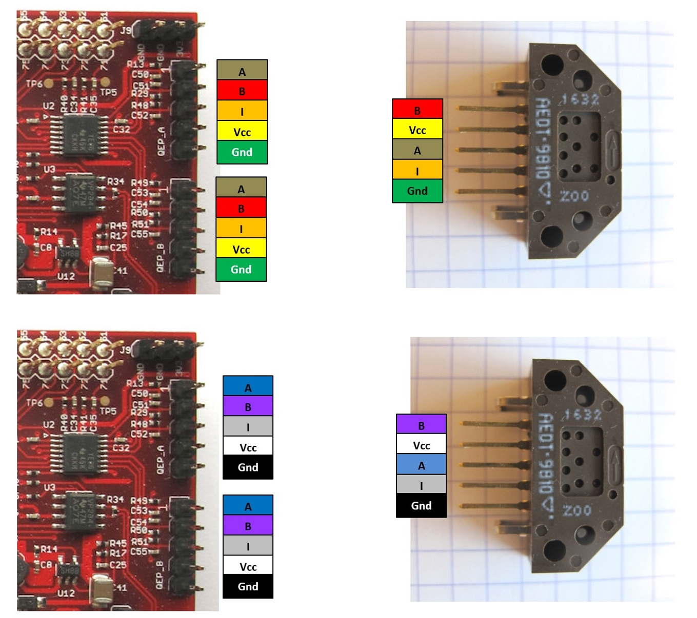
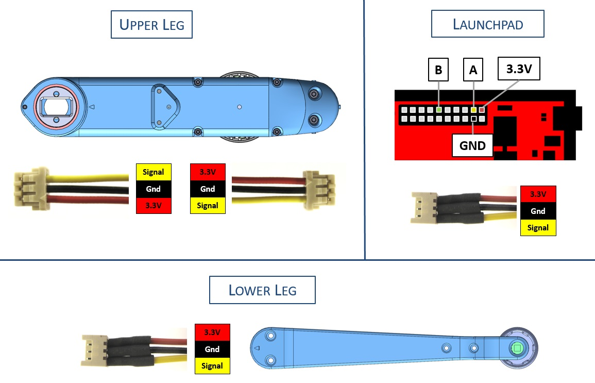
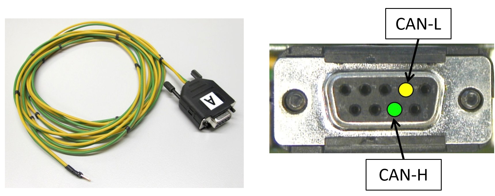
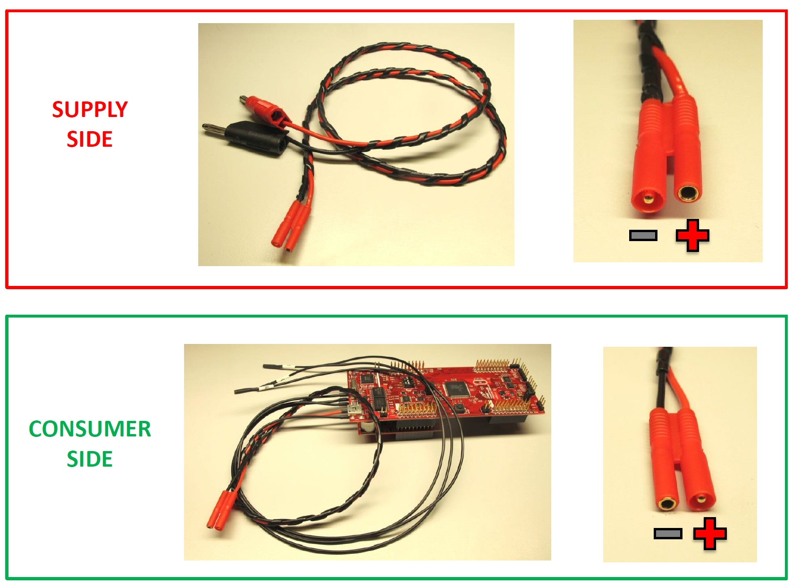

Details Wiring
=======================

Wiring Diagram - Encoder to Micro Driver Electronics
----------------
  *Encoder Wiring for the Micro Driver Electronics*

Wiring Diagram - Encoder to TI Launchpad
----------------
  *Encoder Wiring for the TI Launchpad*

Wiring Diagram - Foot Sensor
----------------
  *Foot Sensor Wiring*

CAN Connector Wiring
--------------
  *CAN connector wiring*

Wiring - Power Connector
----------------
  *Power Connector Wiring Convention*

Authors
--------
Felix Grimminger

License
-------
BSD 3-Clause License

Copyright
-----------
Copyright (c) 2019, Max Planck Gesellschaft, New York University

More Information
----------------
[Open Dynamic Robot Initiative](https://open-dynamic-robot-initiative.github.io)  
[Hardware Overview](../../README.md)  
[Software Overview](https://github.com/open-dynamic-robot-initiative/open-dynamic-robot-initiative.github.io/wiki/Open-Dynamic-Robot-Initiative-Documentation)  
[Back to Electronics](../README.md)  
