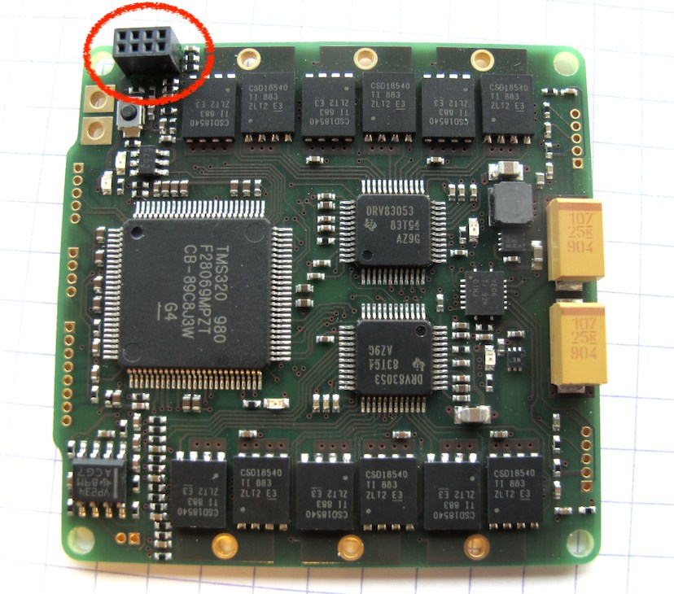
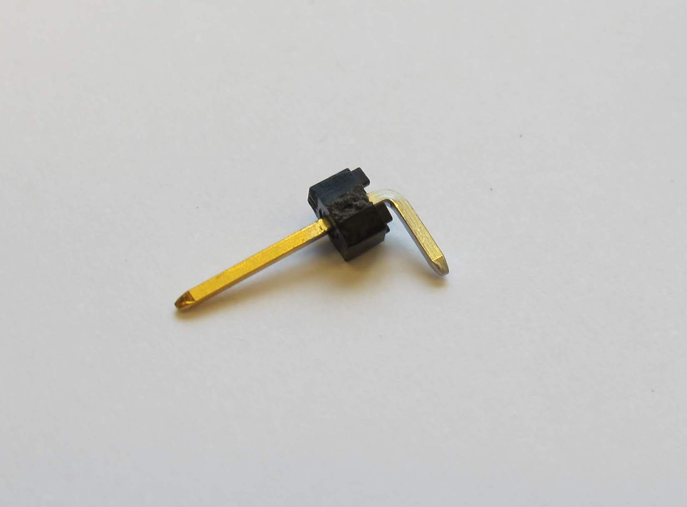
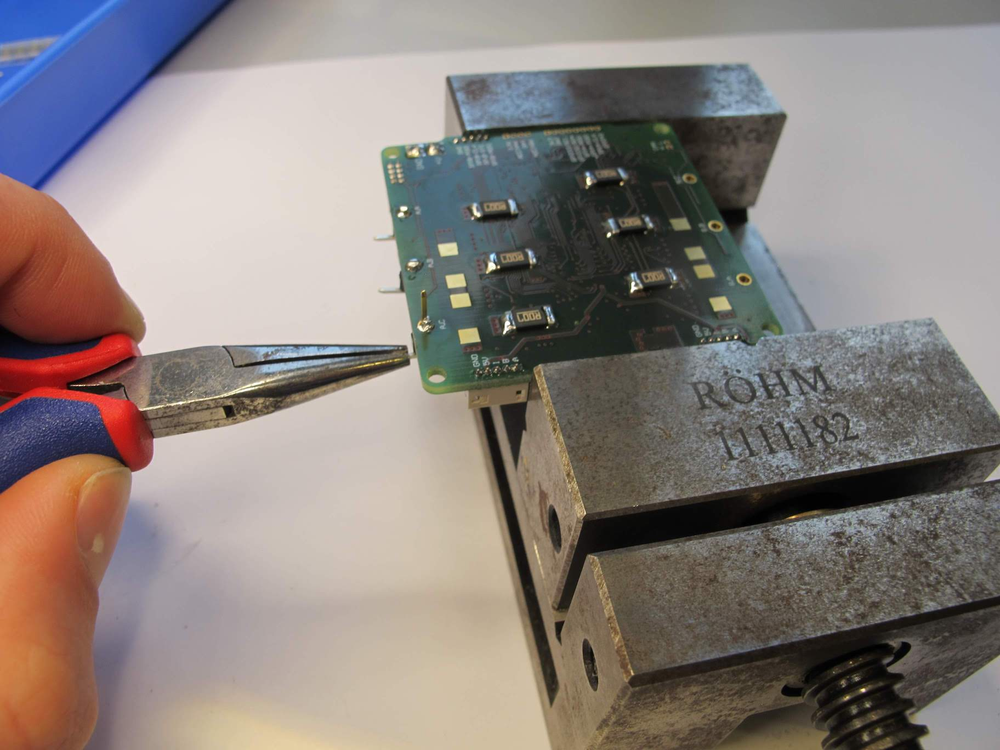
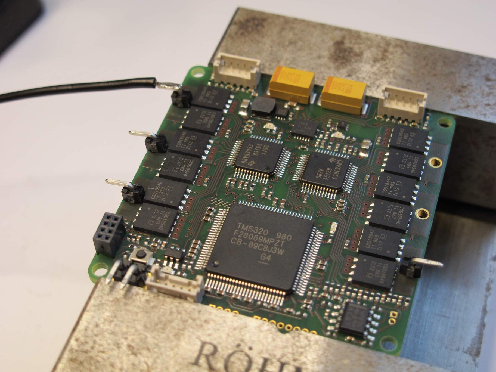

# Micro Driver Electronics

   

* Dimensions: 50mm x 50mm
* Weight: 13g
___
## Motor Driver Electronics Comparison
   

___
## Eagle Design Files
 

* [MicroDriver v2 Eagle Design Files - microDriver_v2.zip](eagle_design_files/microDriver_v2.zip)

    

___
## Production Gerber Set and Assembly Packet
* [MicroDriver v2 Gerber Set - microDriver_v2_gerber.zip](production_files/microDriver_v2_gerber.zip)

* [MicroDriver v2 Assembly Packet - microDriver_v2_assembly.zip](production_files/microDriver_v2_assembly.zip)

    

___
## Flashing

The MicroDriver are flashed using a JTAG emulator connected via USB. The emulator is connected to the MicroDriver using a connector cable.

## Wireing MicroDriver <-> JTAG emulator

Note: A long wire might cause communication problems when attempting to flash the MicroDriver. A cable length of 10 cm worked good for us.

| Connector Emulator | Connector MicroDriver |
|--------------------|-----------------------|
|  |  |

---
# Bill of Material

| Part        | Description | Suppliers   |
|-------------|-------------|------------|
| MicroDriver | v2 | USA: [MacroFab](https://macrofab.com/)   Germany: [BetaLayout](https://us.beta-layout.com/pcb/)|
| JTAG Emulator | Spectrum Digital XDS100V2 | USA: [Mouser](https://www.mouser.com/ProductDetail/Spectrum-Digital/702302?qs=%2Fha2pyFadugCs%252BN3rqeKGQ5rHGsjcLGLHwUgh92e22D%252BaV4SDvb2Vg%3D%3D)   Germany: [Farnell](https://de.farnell.com/spectrum-digital/xds100v2-jtag/emulator-usb-jtag-xds100v2/dp/1831927?ost=1831927&ddkey=https%3Ade-DE%2FElement14_Germany%2Fsearch) |
| Connector wire MicroDriver | Amphenol MiniTek 127 20021111-00008T4LF | Germany: [DigiKey](https://www.digikey.com/products/en?keywords=609-3711-ND) |

---
# Soldering work

The MicroDriver come without any connectors (for power wires, encoders, motor wires, ...). These have to been added. In addition, six resistors have to been soldered on the back of the MicroDriver.

For the encoder connectors, it's possible to use either [Hirose DF13 Straight Pin Headers](../details/details_components.md#hirose-df13-straight-pin-headers) or the [Hirose DF13 Right Angle Pin Headers](../details/details_components.md#hirose-df13-right-angle-pin-headers)

## JTAG connector

**Todo:** Add pictures and instructions.

## Resistor soldering

**Trick:** Use some solder at the tip to initially fix the resistor a bit. Then solder the other side and fix the initial side in the end properly.

 
 

## Hirose connector soldering

 
 

## Motor / power wire soldering

Here, we are using a female header pin to connect the motor wire instead of soldering the motor wire to the MicroDriver directly. After soldering, clip the too long part.

 
 

___

## Authors
* Jonathan Fiene
* Julian Viereck

## License
BSD 3-Clause License

## Copyright
Copyright (c) 2019-2020, Max Planck Gesellschaft and New York University

## More Information
[Open Dynamic Robot Initiative - Webpage](https://open-dynamic-robot-initiative.github.io)
[Open Dynamic Robot Initiative - YouTube Channel](https://www.youtube.com/channel/UCx32JW2oIrax47Gjq8zNI-w)
[Open Dynamic Robot Initiative - Forum](https://odri.discourse.group/categories)
[Open Dynamic Robot Initiative - Paper](https://arxiv.org/pdf/1910.00093.pdf)
[Hardware Overview](../../README.md#open-robot-actuator-hardware)
[Software Overview](https://github.com/open-dynamic-robot-initiative/open-dynamic-robot-initiative.github.io/wiki)
