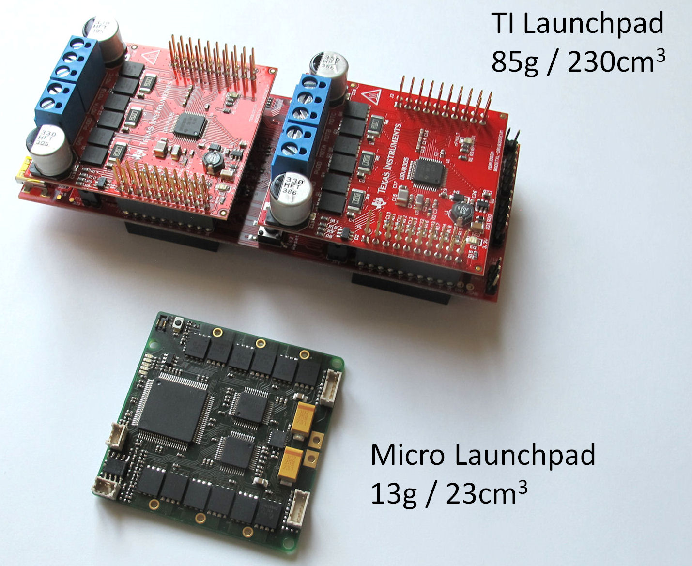

Texas Instruments Evaluation Board Electronics
=======================
    
____
Electronics for Dual Brushless Motor Control
------------
    

Texas Instruments Evaluation Boards:  
* Microcontroller: TI Launchpad F28069M -> [Launchpad Product Page](http://www.ti.com/tool/LAUNCHXL-F28069M)
* 2 x Motor Driver Card: TI Boosterpacks DRV8305  -> [Booster Pack Product Page](http://www.ti.com/tool/BOOSTXL-DRV8305EVM)
___
    
____
BL System Overview
--------------------

FOC - Field Oriented Control
-----------------------------

____
Launchpad Pin Assignment
-------------------------

____

____

More Details
-------------
* [Details Wiring](../details/details_wiring.md)
* [Details Components and Tools](../details/details_components.md)

Authors
--------
Felix Grimminger

License
-------
BSD 3-Clause License

Copyright
-----------
Copyright (c) 2019, Max Planck Gesellschaft, New York University

More Information
----------------
[Open Dynamic Robot Initiative - Webpage](https://open-dynamic-robot-initiative.github.io)  
[Open Dynamic Robot Initiative - YouTube Channel](https://www.youtube.com/channel/UCx32JW2oIrax47Gjq8zNI-w)  
[Hardware Overview](../README.md)  
[Software Overview](https://github.com/open-dynamic-robot-initiative/open-dynamic-robot-initiative.github.io/wiki)  
[Back to Electronics Overview](../README.md)
