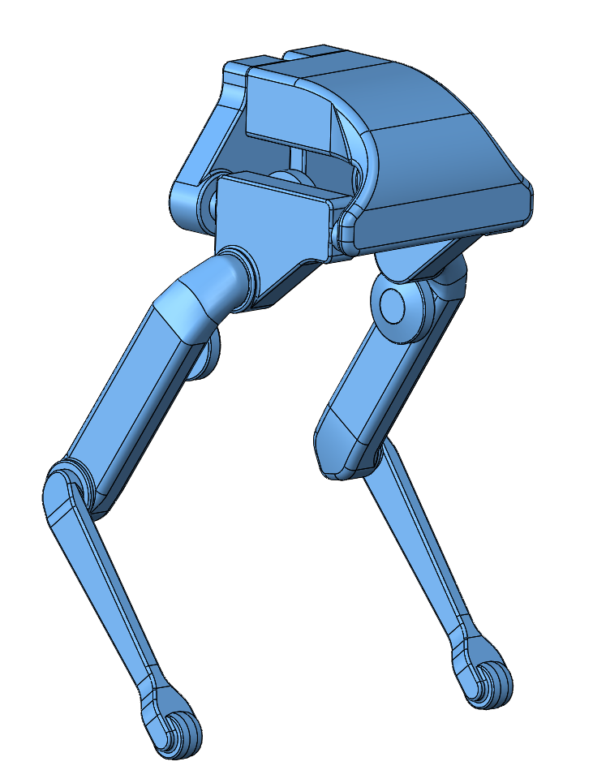
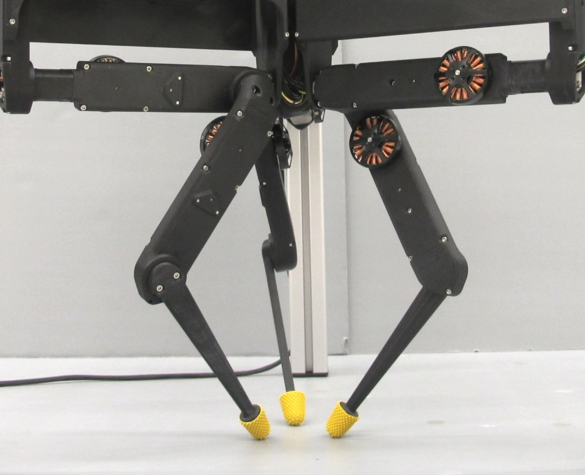
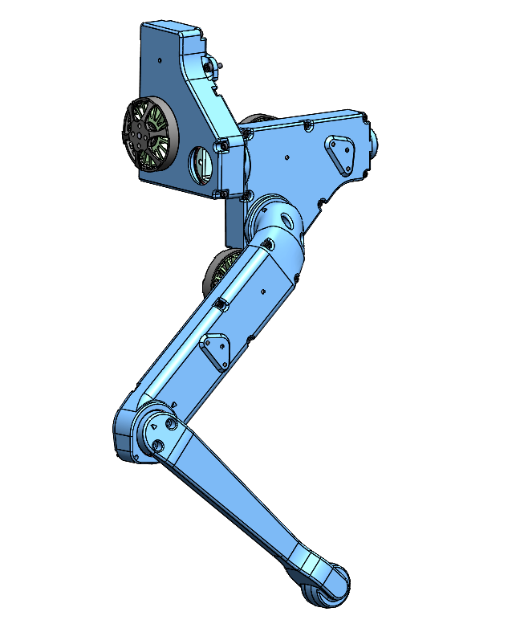
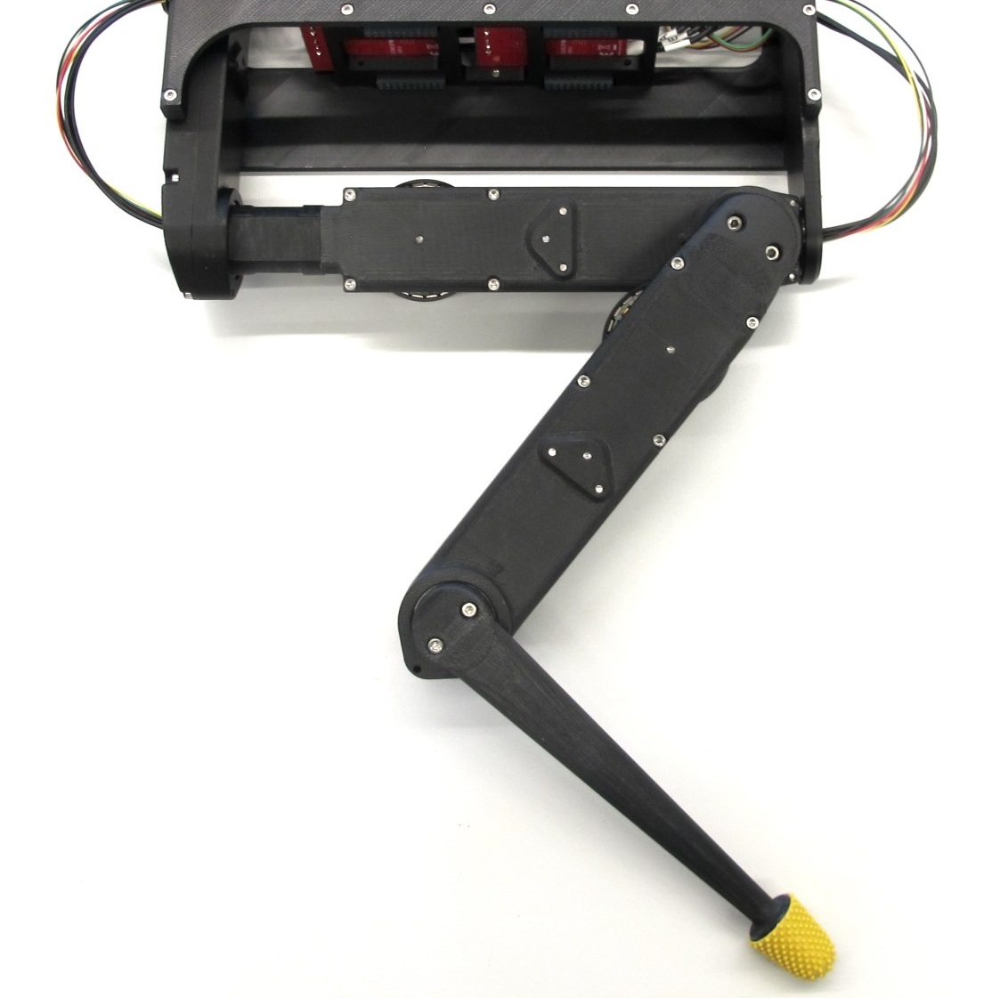

# Open Robot Actuator Mechanics

 **Klick on the pictures below for more information**

| Quadruped 8dof  | Quadruped 12dof | Biped 6dof | TriFingerEdu |
| ---------------  | ------------- |------------- |------------- |
| |   |  |     |

| 2dof Leg  | 3dof Leg | Biped Leg |FingerEdu |
| ------------- | ------------- |------------- |------------- |
| |   |   |  |

| Actuator Module  | Dual Motor Testbed | Leg Test Stand |Foot Contact Switch |
| ---------------  | ------------- |------------- |------------- |
| |   |   |   |

## Authors
Felix Grimminger

## License
BSD 3-Clause License

## Copyright
Copyright (c) 2019-2020, Max Planck Gesellschaft and New York University

## More Information
[Open Dynamic Robot Initiative - Webpage](https://open-dynamic-robot-initiative.github.io)  
[Open Dynamic Robot Initiative - YouTube Channel](https://www.youtube.com/channel/UCx32JW2oIrax47Gjq8zNI-w)   
[Open Dynamic Robot Initiative - Forum](https://odri.discourse.group/categories)  
[Open Dynamic Robot Initiative - Paper](https://arxiv.org/pdf/1910.00093.pdf)  
[Hardware Overview](../README.md#open-robot-actuator-hardware)  
[Software Overview](https://github.com/open-dynamic-robot-initiative/open-dynamic-robot-initiative.github.io/wiki)
