# Open Robot Actuator Mechanics

**Click on the pictures below for more information**

| Quadruped 8dof v2 | Quadruped 12dof | Biped 6dof | TriFingerEdu |
| ---------------  | ------------- |------------- |------------- |
|<a href="quadruped_robot_8dof_v2/README.md#quadruped-robot-8dof-v2">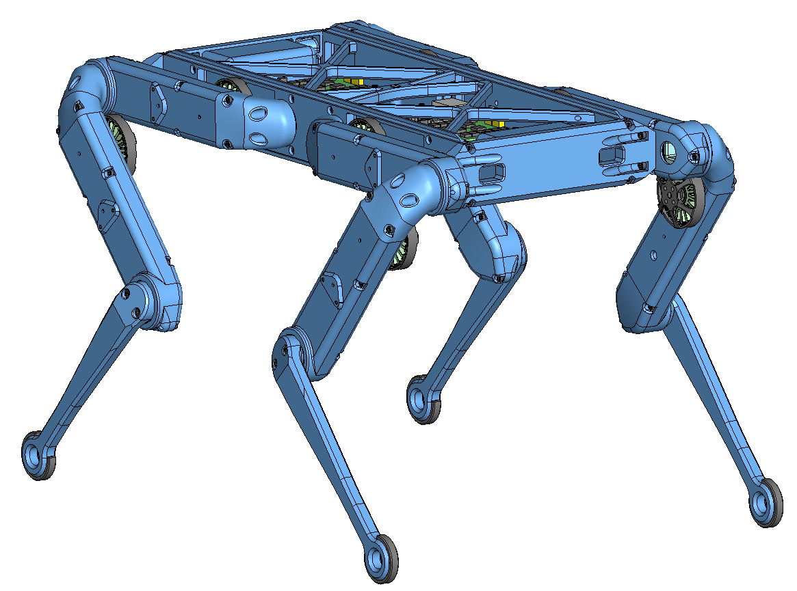</a>|<a href="quadruped_robot_12dof_v1/README.md#quadruped-robot-12dof-v1">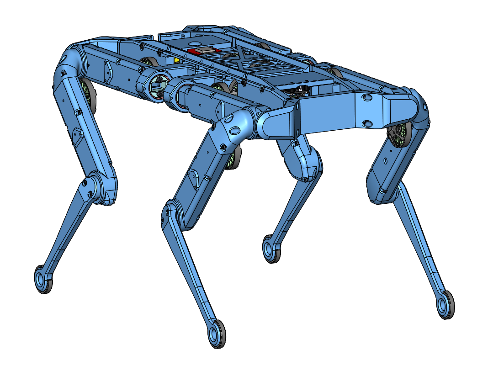</a>|<a href="biped_6dof_v1/README.md#biped-robot-6dof-v1">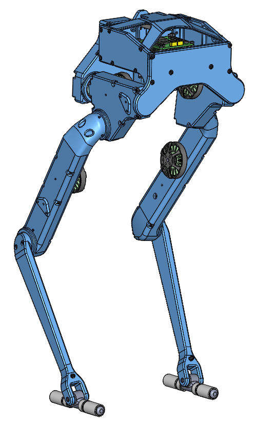</a>|<a href="tri_finger_edu_v1/README.md#trifingeredu-v1">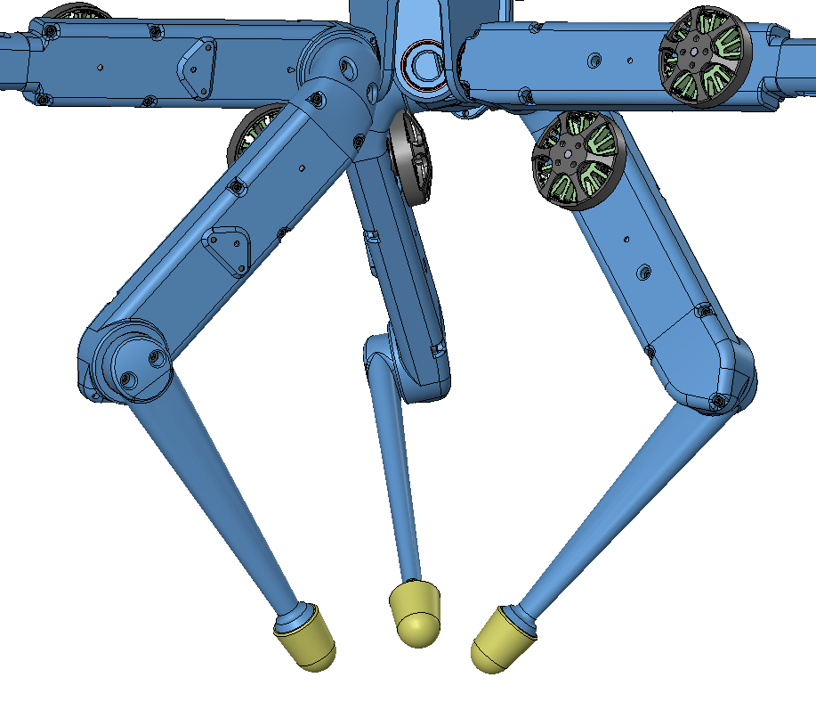</a>|

| 2dof Leg v2  | 3dof Leg | Biped Leg |FingerEdu |
| ------------- | ------------- |------------- |------------- |
| <a href="leg_2dof_v2/README.md#leg-2dof-v2">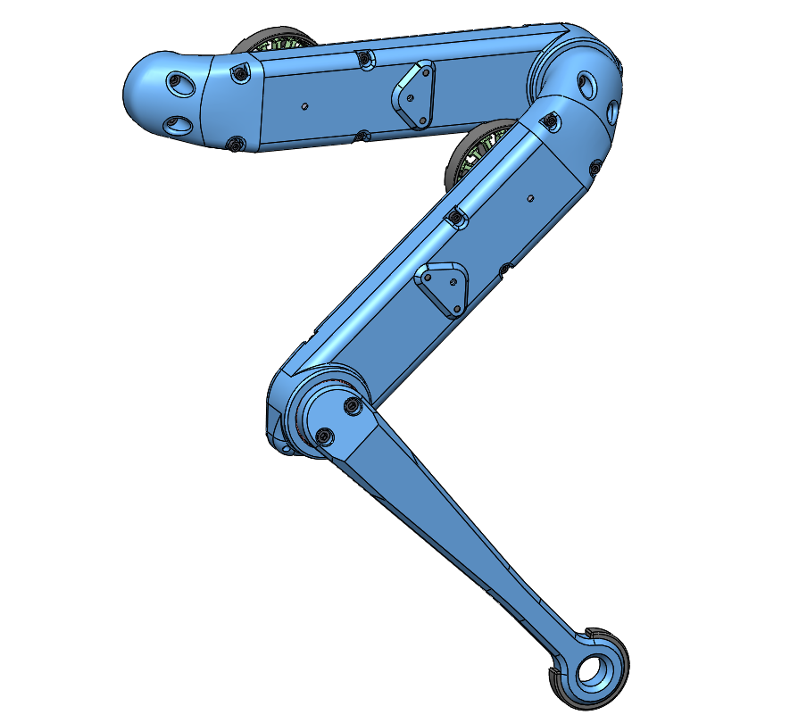</a>  | <a href="leg_3dof_v1/README.md#leg-3dof-v1">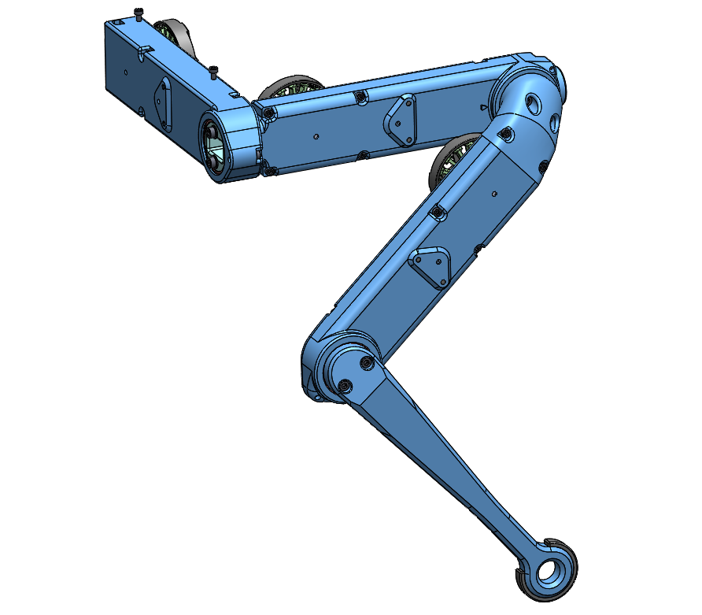</a>  | <a href="biped_leg_3dof_v1/README.md#biped-leg-3dof-v1">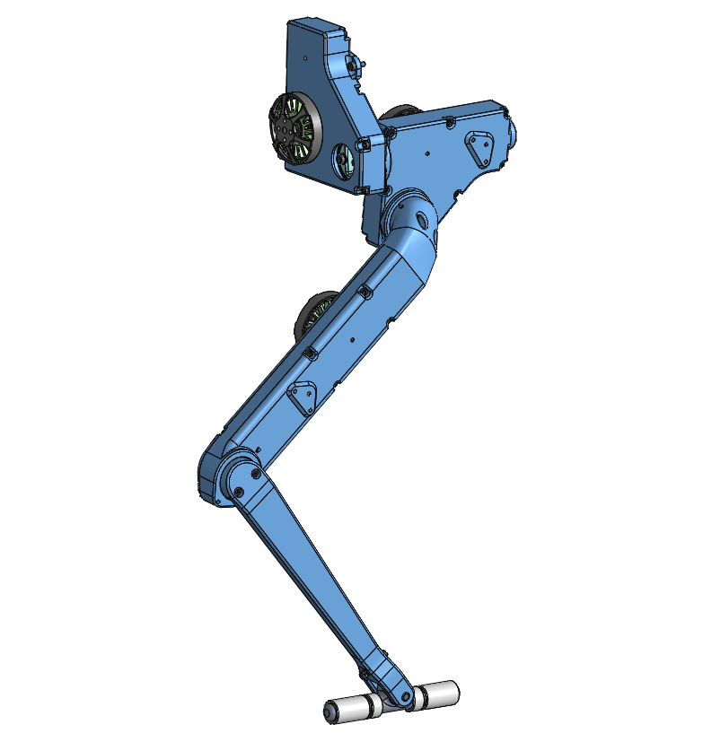</a>  |<a href="finger_edu_v1/README.md#fingeredu-v1">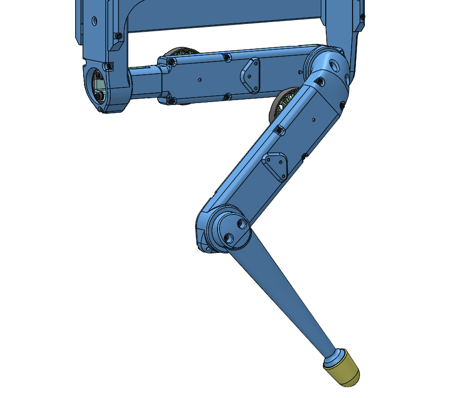</a>  |

| Actuator Module Core| Lower Legs | Details 3d Printed Parts | Details Machined Parts |
| ---------------  | ------------- |------------- |------------- |
| | <a href="general/lower_legs.md#lower-legs">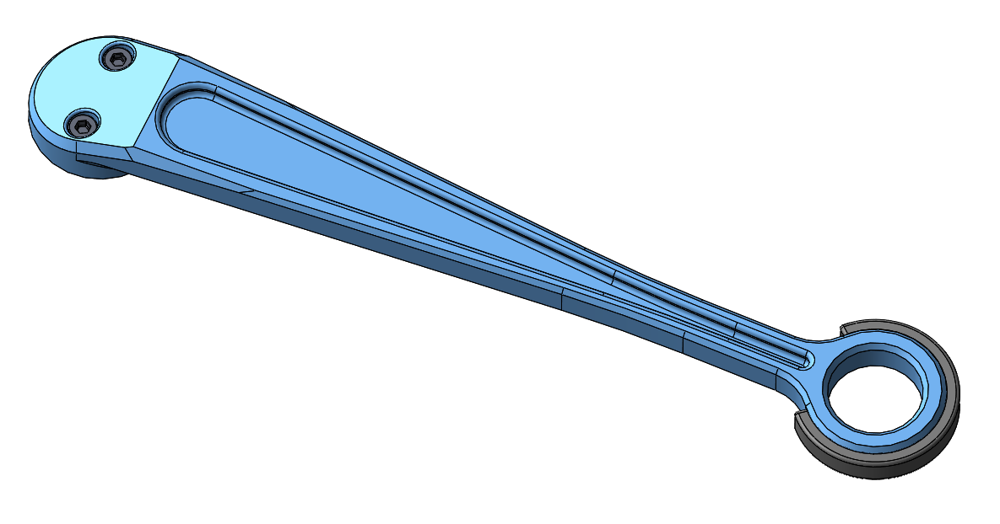</a> | |  |

| Quadruped 12dof v1.1 Autonomy Upgrade | Details Electronics  Quadruped Robot 12dof| Dual Motor Testbed | NYU Finger |
| ---------------  | ------------- |------------- |-----------|
| <a href="quadruped_robot_12dof_v1.1#quadruped-robot-12dof-v11">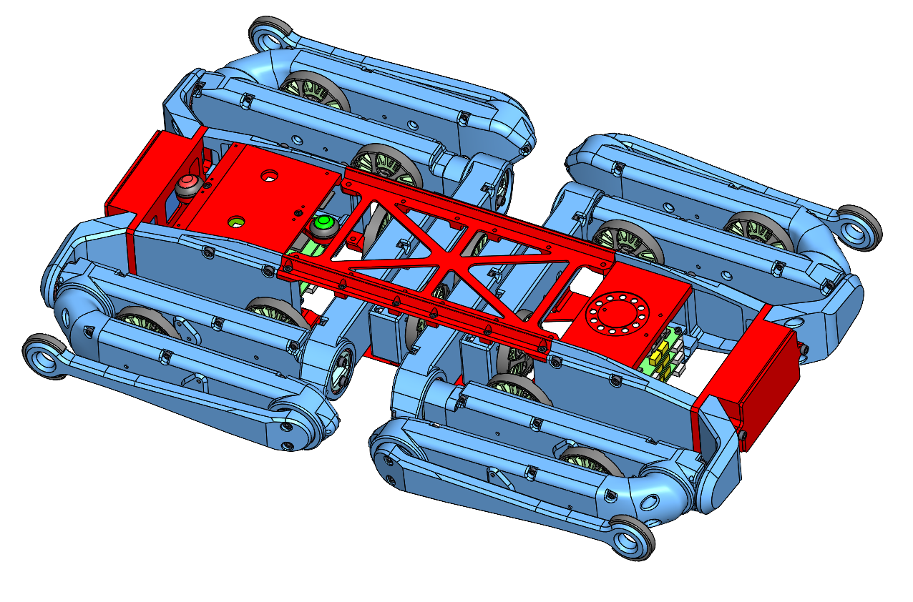</a>||   | <a href="nyu_finger_v1/README.md#nyu-finger-v1">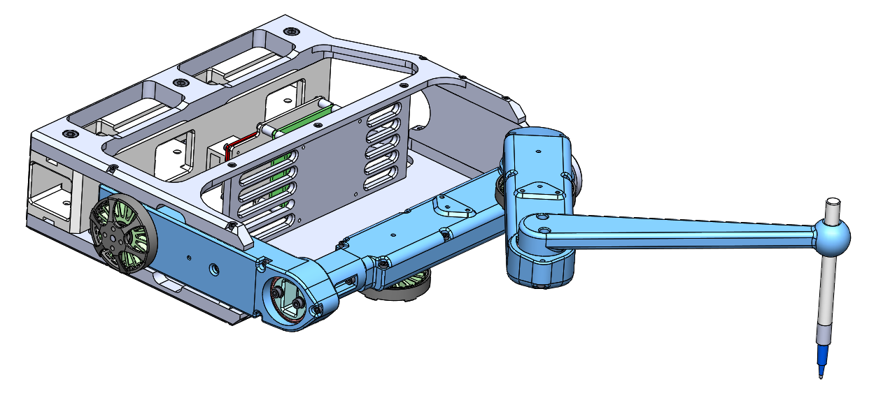</a> |

### Old Versions for Reference
| Quadruped 8dof v1 | 2dof Leg v1 | Leg Test Stand v1| Foot Contact Switch |
| ---------------  | ------------- |------------- |------------- |
| | |||

## Step-by-Step Instructions
| Motor Preparation  | Motor Shaft Preparation | Encoder Preparation |Center Pulley Preparation|
| --- | --- | --- | --- |
| |   |   | |

| Output Pulley Preparation | Shell Preparation | Actuator Module Assembly |Actuator Module Testing|
| --- | --- | --- | --- |
| |   |   | |

## More Details
| Mechanical Tools and Consumables |Electronic Components and Tools| Conventions | Known Issues |
| --- | --- | --- |--- |
||| <a href="general/conventions.md#conventions">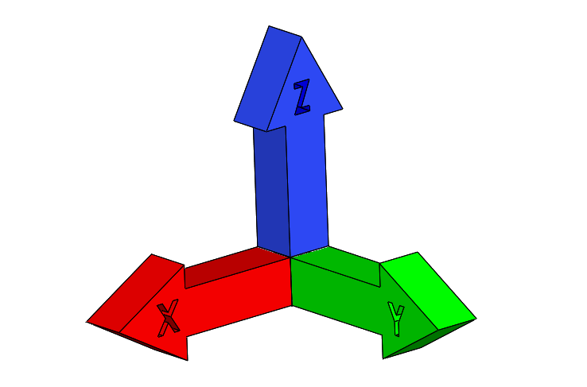</a> | <a href="general/known_issues.md#known-issues">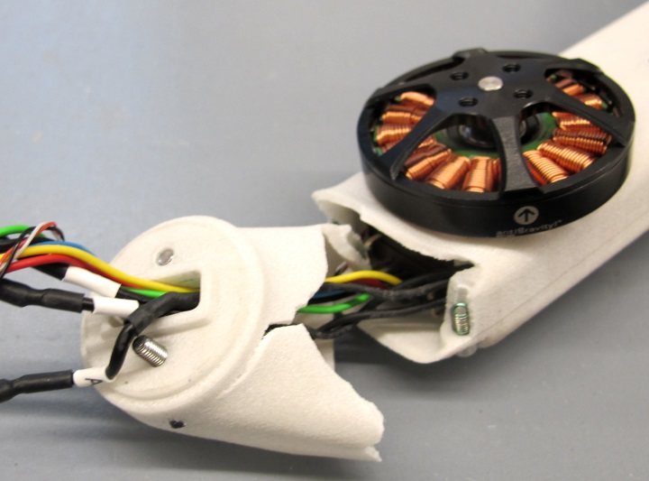</a>|

| Robot Calibration ||||
| --- | --- | --- | --- |
|<a href="general/robot_calibration.md#robot-calibration">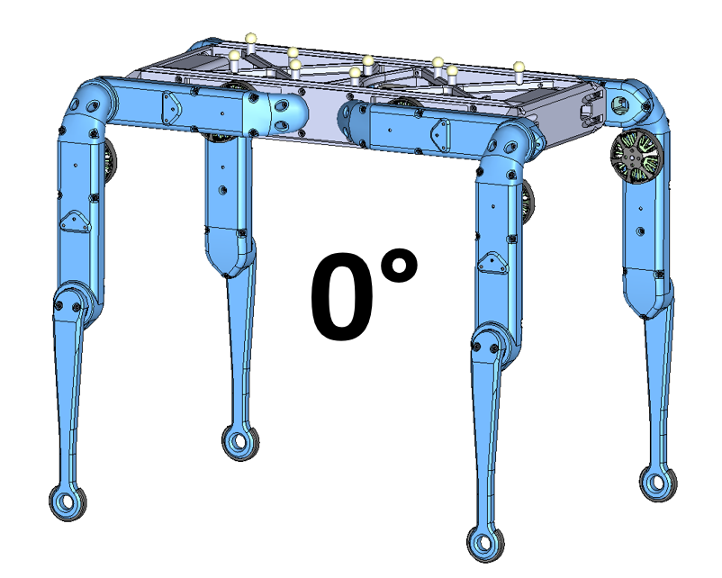</a> ||||

## More Information
[Open Dynamic Robot Initiative - Webpage](https://open-dynamic-robot-initiative.github.io)  
[Open Dynamic Robot Initiative - YouTube Channel](https://www.youtube.com/channel/UCx32JW2oIrax47Gjq8zNI-w)   
[Open Dynamic Robot Initiative - Forum](https://odri.discourse.group/categories)  
[Open Dynamic Robot Initiative - Paper](https://arxiv.org/pdf/1910.00093.pdf)  
[Hardware Overview](../README.md#open-robot-actuator-hardware)  
[Software Overview](https://github.com/open-dynamic-robot-initiative/open-dynamic-robot-initiative.github.io/wiki)  

## Authors
Jonathan Fiene  
Thomas Flayols  
Felix Grimminger  

## License
BSD 3-Clause License

## Copyright
Copyright (c) 2019-2021, Max Planck Gesellschaft and New York University
