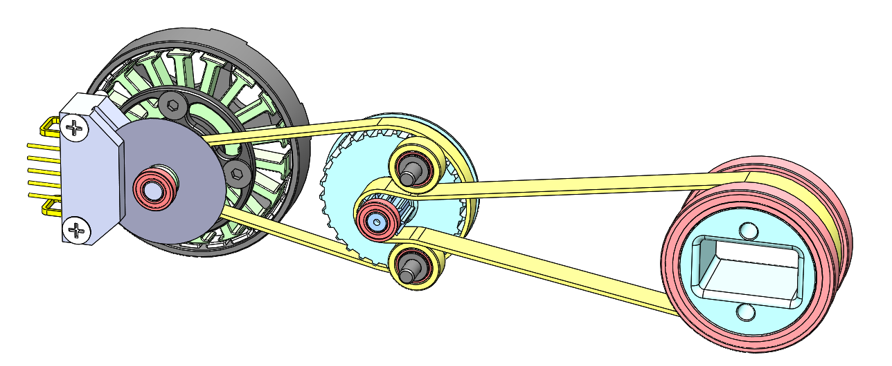
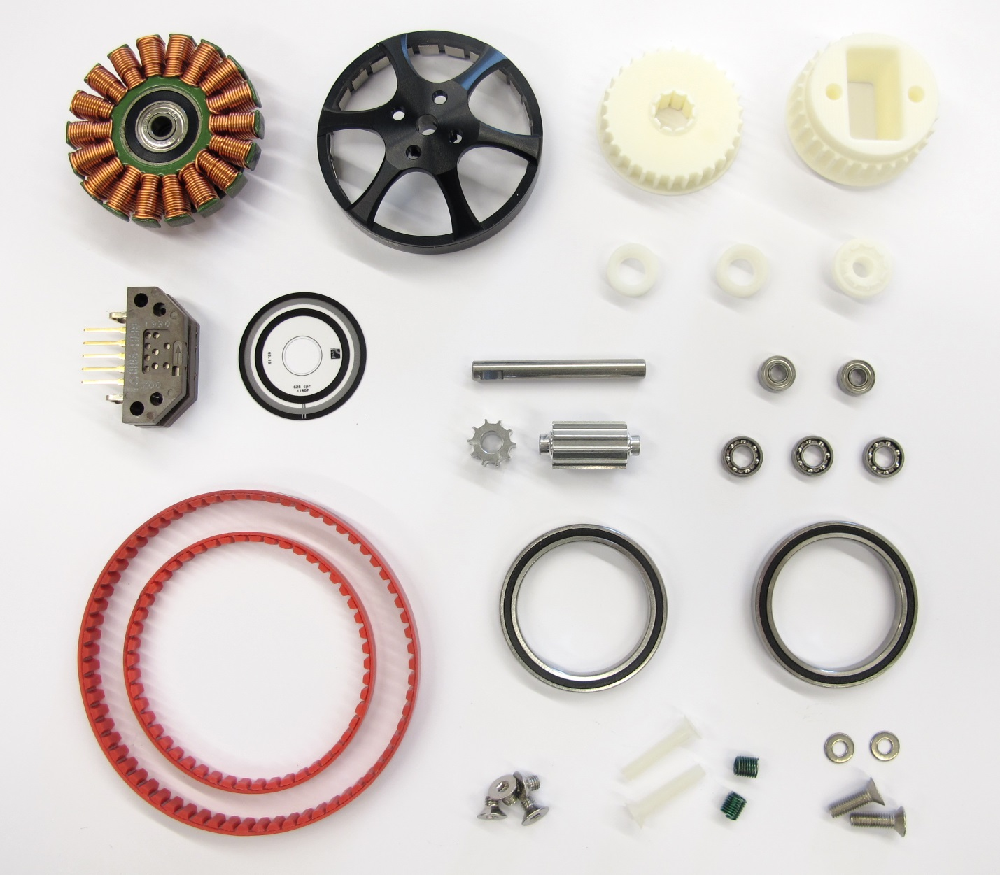
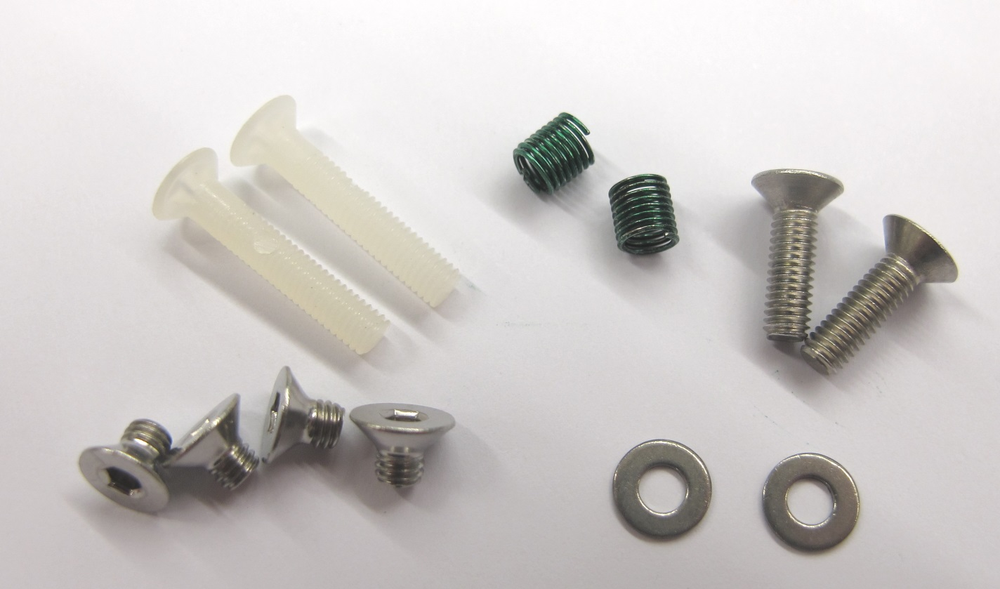
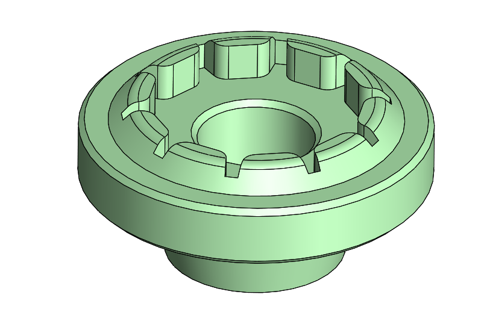
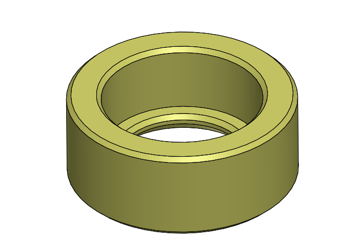
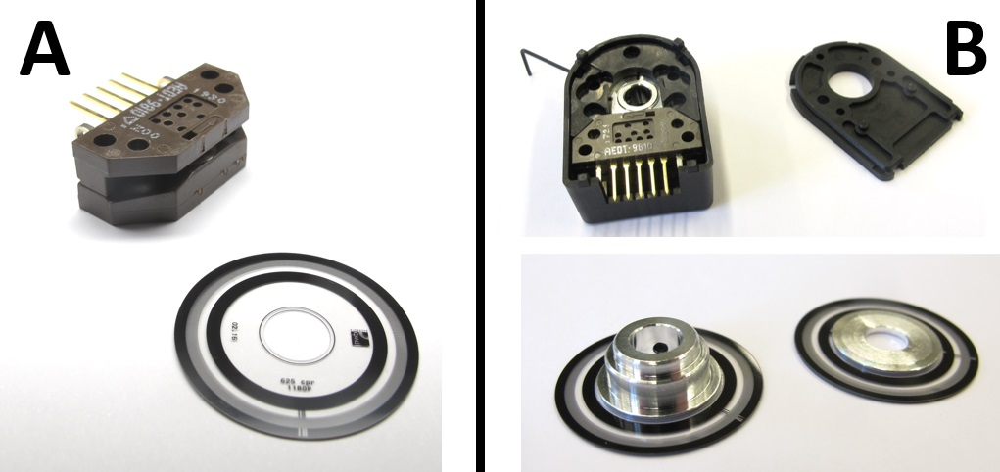
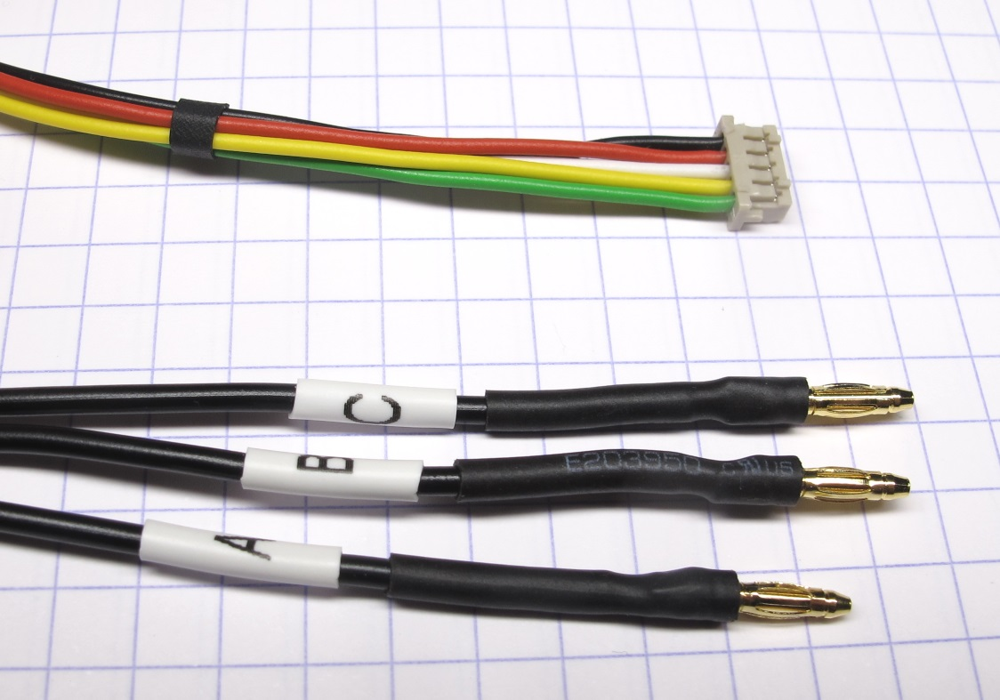

# Brushless Actuator Module v1

## Introduction
We developed a light-weight, low cost, minimal complexity, torque-controlled actuator module for robotic research.  
The actuator module consists of a brushless outrunner motor, a high resolution optical encoder, a dual stage timing belt transmission and mostly 3d printed parts and off-the-shelf components.  
The module has a segment length of 160mm, weighs 150g and outputs 2,5Nm at 12A.

 *Actuator Module Assembly - core components with upper leg shell structure*

---
## Core Components
 
We are using the same core components for all the robots described in this repository.   The only difference between the actuator modules is the surrounding shell structure.

We are using a dual stage timing belt transmission with 3:1 gear reduction on each stage.
The total gear reduction is 9:1.

## Core Component Overview
 *Core components - the weight of all the components in the pictures is 95g*

---
## Off-the-shelf Components

### Brushless DC Motor

  

  * T-Motor Antigravity 4004 300kV
  * 24 magnets / 12 pole pairs / 18 slots
  * 3 phase WYE Configuration / Star Configuration
  * Rotor diameter: 45mm
  * Weight: 53g
  * [Details Motor Preparation](details/details_motor_preparation.md)
  * [Details Motor Shaft Preparation](details/details_motor_shaft_preparation.md)
  * [T-Motor Webpage](http://store-en.tmotor.com/goods.php?id=438) (the motors are sold in sets of 2 pieces)

### Optical Encoder
  
  * Broadcom AEDT-9810-Z00
  * 5000 pulses per revolution per channel
  * 5V two channel quadrature output with index pulse (ABZ)
  * Code wheel diameter: 26mm
  * Weight: 5g
  * [Details Encoder and Codewheel](details/details_encoder.md)
  * [Details Encoder Preparation](details/details_encoder_preparation.md)
  * [Details Motor Shaft and Codewheel Preparation](details/details_motor_shaft_preparation.md)
  * [Broadcom Webpage](https://www.broadcom.com/products/motion-control-encoders/incremental-encoders/transmissive-encoders/aedt-981x)  

### Timing Belts
   *Timing Belts AT3 GEN III with 50 teeth and 67 teeth*
  * Timing Belt: Conti Synchroflex AT3 GEN III - 3mm tooth pitch
  * Heavy duty polyurethane timing belt with steel cord reinforcements
  * First stage: 150mm timing belt - 50 teeth - width 4mm - 1,5g
  * Second stage: 201mm timing belt - 67 teeth - width 6mm - 3g
  * [Contitech Webpage](https://www.contitech.de/en-gl/Solutions/Power-Transmission/Industrial-Applications/Drive-Belts/Synchronous-Belts/Products/Product-range/CONTI-SYNCHROFLEX-GEN3)  

### Bearings
 *Stainless steel roller bearings - weight: 16g*
* Miniature EZO stainless steel roller bearings
* Ouput bearing: 32mm x 25mm x 4mm - 6.9g
* Transmission bearing: 8mm x 4mm x 2mm - 0.4g
* Belt tensioner bearing: 7mm x 3mm x 3mm - 0,4g
* [EZO Webpage](https://www.ezo-usa.com/)

### Fasteners
   *All the fasteners that are part of the actuator core components*

* Fasteners Motor: M3 x 5 Flat Head Screw
* Fasteners Timing Belt Tensioner: M3 x 10 Flat Head Screw
* Washers Timing Belt Tensioner: M2,5 Washer
* Helical Insert Output Shaft: Helicoil M3 x 6
* Fasteners Encoder: M3 x 16 Philipps Flat Head Screw

---
## Machined Parts
 *The3 parts in the picture have to be machined from metal - weight: 5,9g*

  * motor pulley 10 teeth - aluminum - 0.6g -> [PDF drawing](drawings/motor_pulley_at3_t10.PDF)
  * center pulley 10 teeth - aluminum - 2,1g -> [PDF drawing](drawings/center_pulley_at3_t10.PDF)
  * motor shaft - 4mm steel rod - 3,2g -> [PDF drawing](drawings/motor_shaft.PDF)
  * [Details Machined Parts and Technical Drawings](details/details_machined_parts.md)
---
## 3D Printed Parts

   *3d printed parts - weight of the parts in the picture: 11,3g*

The tooth profile of the pulleys has to be pretty precise and concentric.  
We recommend to print all the parts listed below with a stereolithography or multijet printer.

More information: [Details 3D Printed Parts](details/details_3d_printed_parts.md)

  

`The recommended printing direction for all the parts below is the positive z direction of the stl files.`

---
  

* Encoder Codewheel Kit Mount - [STL file](stl_files/encoder_codewheel_kit_mount.STL) (Option A with AEDM-5810-Z12 encoder kit) or Encoder Codewheel PWB Mount - weight 0.3g -> [STL file](stl_files/encoder_codewheel_pwb_mount.STL) (Option B with Broadcom AEDT-9810-Z00 encoder)

  ---
    
* Transmission Pulley AT3 T30 Center - weight 4.2g -> [STL file ](stl_files/transmission_pulley_at3_t30_center.STL)
---
  
* Transmission Pulley AT3 T30 Output - weight 6.7g -> [STL file ](stl_files/transmission_pulley_at3_t30_output.STL)
---
  

* Transmission Belt Tensioner Rollers - weight 0,2g each
* There are STL files with different outer diameters available
* the default diameter that we are using is 10mm
* the different roller diameters allow you to adjust the timing belt tension if required
* 10.0mm Transmission Belt Tensioner Roller -> [STL file](stl_files/transmission_belt_tensioner_roller_10.0mm.STL)
* 10.5mm Transmission Belt Tensioner Roller -> [STL file](stl_files/transmission_belt_tensioner_roller_10.5mm.STL)
* 11.0mm Transmission Belt Tensioner Roller -> [STL file](stl_files/transmission_belt_tensioner_roller_11.0mm.STL)
* 11.5mm Transmission Belt Tensioner Roller -> [STL file](stl_files/transmission_belt_tensioner_roller_11.5mm.STL)
---

## Bill of Materials - Brushless Actuator Module Core

| Part Name | Quantity | Ordering Information | Comments |  
| --- | :---: | --- | --- |   
|T-Motor Antigravity 4004 300kV|1|[T-Motor Store](http://store-en.tmotor.com/goods.php?id=438) [Globeflight # 1974](https://www.globe-flight.de/T-Motor-GF-Antigravity-Set-4004-300KV-2-pcs)|2 motors per set|
|Encoder Broadcom AEDT-9810-Z00|1|[Mouser # 630-AEDT9810Z00](https://www.mouser.com/ProductDetail/Broadcom-Avago/AEDT-9810-Z00?qs=%2Fha2pyFadugH%252BV24sBozOzDoYJ6rlay1%2FjE%2FZBaGp8NtaorhU1uDSg%3D%3D)  [DigiKey # 516-3256-ND](https://www.digikey.com/products/en?keywords=516-3256-ND)|Encoder without codewheel|
|Codewheel for Encoder AEDT-9810-Z00|1|[PWB Encoders GmbH # 104768](https://www.pwb-encoders.com/en/encoder-wheels)|Email Mr. Oberländer and ask for a quote. PWB ships worldwide.   Order number: 104768 / Codewheel with index / 625cpr 3K for AEDT98X / ID 7mm / OD 25,56mm|
|Timing Belt Conti Synchroflex AT3 GEN III  width: 4mm / length: 150mm / 50 teeth Timing belt first stage|1|[Reiff # 60047626](https://www.reiff-tpshop.de/shop/de/antriebstechnik/synchroflex-zahnriemen-gen-iii-at3/gen-iii-at3-laenge-150-bis-1011-mm.html)  [Beltingonline](https://www.beltingonline.com/at3-gen-iii-synchroflex-timing-belts-4593) |  Reiff: The belt with 4mm width is not listed on the Reiff webpage.   Ask for a quote: e-services@reiff-gruppe.de   Reiff ships within Europe.|
|Timing Belt Conti Synchroflex AT3 GEN III  width: 6mm / length: 201mm / 67 teeth  Timing belt second stage|1|[Reiff # 60005258](https://www.reiff-tpshop.de/shop/de/antriebstechnik/synchroflex-zahnriemen-gen-iii-at3/gen-iii-at3-laenge-150-bis-1011-mm.html)   [Beltingonline](https://www.beltingonline.com/at3-gen-iii-synchroflex-timing-belts-4593)|Reiff: Ask for a quote: e-services@reiff-gruppe.de  Reiff ships within Europe.|
|Bearing Output Shaft 32mm x 25mm x 4mm EZO bearing 61705 2RS VA  |2|[Emiliana Cuscinetti](https://www.emilianacuscinetti.com/en/miniature-bearings/) [Doppiaemme](https://www.doppiaemme.it/en/prodotti/) [EZO USA](https://catalog.ezo-usa.com/category/metric-series-bearings) [SBN](https://www.sbn.de/en/) [Online Bearing Store](https://www.onlinebearingstore.com/6705-2rs-6705-zz-ball-bearings.html)|Italy: [Emiliana Cuscinetti](https://www.emilianacuscinetti.com/en/miniature-bearings/) or [Doppiaemme](https://www.doppiaemme.it/en/prodotti/)  USA: [EZO USA](https://catalog.ezo-usa.com/category/metric-series-bearings)  All other countries: Contact [SBN](https://www.sbn.de/en/) (info@sbn.de) and ask for a quote - they ship worldwide.   SBN # C02748  We use stainless steel bearings. Alternative: Chrome steel bearings from the Online Bearing Store|
|Bearing Motor Shaft and Center Shaft    8mm x 4mm x 2mm EZO bearing MR84 VA |3|[Emiliana Cuscinetti](https://www.emilianacuscinetti.com/en/miniature-bearings/) [Doppiaemme](https://www.doppiaemme.it/en/prodotti/) [EZO USA](https://catalog.ezo-usa.com/category/metric-series-bearings) [SBN](https://www.sbn.de/en/) [Online Bearing Store](https://www.onlinebearingstore.com/mr84-miniature-ball-bearing-4x8x2-open.html)|Italy: [Emiliana Cuscinetti](https://www.emilianacuscinetti.com/en/miniature-bearings/) or [Doppiaemme](https://www.doppiaemme.it/en/prodotti/)  USA: [EZO USA](https://catalog.ezo-usa.com/category/metric-series-bearings)  All other countries: Contact [SBN](https://www.sbn.de/en/) (info@sbn.de) and ask for a quote - they ship worldwide.    SBN # N09724  We use stainless steel bearings. Alternative: Chrome steel bearings from the Online Bearing Store|
|Bearing Timing Belt Tensioner 7mm x 3mm x 3mm EZO bearing 683 2Z VA   |2|[Emiliana Cuscinetti](https://www.emilianacuscinetti.com/en/miniature-bearings/) [Doppiaemme](https://www.doppiaemme.it/en/prodotti/) [EZO USA](https://catalog.ezo-usa.com/category/metric-series-bearings) [SBN](https://www.sbn.de/en/) [Online Bearing Store](https://www.onlinebearingstore.com/683-zz-miniature-ball-bearing-id-3-x-od-7x-w-3mm-shielded.html)|Italy: [Emiliana Cuscinetti](https://www.emilianacuscinetti.com/en/miniature-bearings/) or [Doppiaemme](https://www.doppiaemme.it/en/prodotti/)  USA: [EZO USA](https://catalog.ezo-usa.com/category/metric-series-bearings)  All other countries: Contact [SBN](https://www.sbn.de/en/) (info@sbn.de) and ask for a quote  - they ship worldwide.  SBN # N05560   We use stainless steel bearings. Alternative: Chrome steel bearings from the Online Bearing Store|
|Encoder Codewheel PWB Mount|1|[STL file](stl_files/encoder_codewheel_pwb_mount.STL)|3d printed part - use SLA, Polyjet or Multijet printer|
|Transmission Pulley AT3 T30 Center|1|[STL file ](stl_files/transmission_pulley_at3_t30_center.STL)|3d printed part - use SLA, Polyjet or Multijet printer|
|Transmission Pulley AT3 T30 Output|1|[STL file ](stl_files/transmission_pulley_at3_t30_output.STL)|3d printed part - use SLA, Polyjet or Multijet printer|
|Timing Belt Tensioner Roller 10mm|2|[STL file](stl_files/transmission_belt_tensioner_roller_10.0mm.STL) |3d printed part - use SLA, Polyjet or Multijet printer|
|Motor Shaft|1|[PDF drawing](drawings/motor_shaft.PDF)|Machined part|
|Motor Pulley|1|[PDF drawing](drawings/motor_pulley_at3_t10.PDF)|Machined part|
|Center Pulley|1| [PDF drawing](drawings/center_pulley_at3_t10.PDF)|Machined part|
|Fasteners Encoder   M3 x 16 Philipps Flat Head Screw|2|[Conrad # 839967](https://www.conrad.com/p/toolcraft-839967-countersunk-screws-m3-16-mm-phillips-din-965-plastic-polyamide-10-pcs-839967)|Polyamide plastic 10 pieces per set|
|Fasteners Motor M3 x 5 Flat Head Screw |4|[Online Schrauben](https://online-schrauben.de/shop/Schrauben/Innensechskantschrauben/ISO-10642-DIN-7991-Senkschrauben-mit-Innensechskant-aehnl.-DIN-7991/Edelstahl-Rostfrei-A2/M-3-Gewinde-M-metrisches-Gewinde)|Stainless Steel Online Schrauben ships within Europe.|
|Fasteners Timing Belt Tensioner M3 x 10 Flat Head Screw|2|[Online Schrauben](https://online-schrauben.de/shop/Schrauben/Innensechskantschrauben/ISO-10642-DIN-7991-Senkschrauben-mit-Innensechskant-aehnl.-DIN-7991/Edelstahl-Rostfrei-A2/M-3-Gewinde-M-metrisches-Gewinde)|Stainless Steel Online Schrauben ships within Europe.|
|Washers Timing Belt Tensioner M2,5 Washer|2|[Online Schrauben](https://online-schrauben.de/shop/Scheiben-Federringe/ISO-7092-Unterlegscheiben-fuer-Zylinderkopfschrauben-aehnl.-DIN-433/Edelstahl-Rostfrei-A2-200-HV)|Stainless Steel Online Schrauben ships within Europe.|
|Helical Insert Output Shaft  Helicoil M3 x 6|2|[Hoffmann # 082814 M3](https://www.hoffmann-group.com/GB/en/houk/Power-tools-and-workshop-supplies/Soldering-tools-cleaning-devices-thread-repair/Thread-insert-set%2C-10-or-20-pieces-2×D/p/082814-M3?tId=617) [McMaster # 91732A773](https://www.mcmaster.com/91732A773/)|M3 Helicoil tools required|

---
### Encoder and Codewheel - Alternative B
   *Left side: Encoder and codewheel ordered seperately as described above Right side: Alternative B - Encoder Kit - described below*

| Part Name | Quantity | Ordering Information | Comments |  
| --- | :---: | --- | --- |
|Broadcom Encoder Kit AEDM-5810-Z12|1|[Mouser # 630-AEDM5810Z12](https://www.mouser.de/ProductDetail/Broadcom-Avago/AEDM-5810Z12?qs=%2Fha2pyFadujtDdLrUGHWsKyfLkpJxYH2H0SfB7LySxyN5iN50m1syw%3D%3D) [DigiKey # 516-3253-ND](https://www.digikey.com/product-detail/en/broadcom-limited/AEDM-5810-Z12/516-3253-ND/5357134)|Kit consisting of encoder and codewheel [Instructions Encoder Kit Disassembly](details/details_encoder_kit_disassembly.md)|
|Codewheel Mount Encoder Kit|1|[STL file](stl_files/encoder_codewheel_kit_mount.STL)|3d printed part- use SLA, Polyjet or Multijet printer|

---
### Timing Belt Tensioner - Alternative B

   *Left side: 7mm bearings and 3d printed rollers as described above Right side: Alternative B - 10mm bearings - described below*

| Part Name | Quantity | Ordering Information | Comments |  
| --- | :---: | --- | --- |
|Bearing Timing Belt Tensioner SKF # 623-2Z  10mm x 3mm x 4mm|2| [RS Germany # 285-0807](https://de.rs-online.com/web/p/kugellager/2850807/) [Quality Bearings Online](https://www.qualitybearingsonline.com/623-2z-skf-miniature-deep-groove-3x10x4mm/?setCurrencyId=2)|Alternative for 7mm x 3mm x 3mm bearing and timing belt tensioner roller above.|
|Fasteners Timing Belt Tensioner M3 x 10 Flat Head  Screw|2|[Online Schrauben](https://online-schrauben.de/shop/Schrauben/Innensechskantschrauben/ISO-10642-DIN-7991-Senkschrauben-mit-Innensechskant-aehnl.-DIN-7991/Edelstahl-Rostfrei-A2/M-3-Gewinde-M-metrisches-Gewinde)|Stainless Steel Online Schrauben shipps within Europe.|
|Washers Timing Belt Tensioner M3 Washer|2|[Online Schrauben](https://online-schrauben.de/shop/Scheiben-Federringe/ISO-7092-Unterlegscheiben-fuer-Zylinderkopfschrauben-aehnl.-DIN-433/Edelstahl-Rostfrei-A2-200-HV) [McMaster # 90965A130](https://www.mcmaster.com/90965A130/)|Stainless Steel Online Schrauben shipps within Europe.|

---
## Details Wires and Connectors

 *Connectors Actuator Module*

### Wires and Connectors
| Part Name | Quantity | Ordering Information | Comments |  
| --- | :---: | --- | --- |
|Motor Phase Connectors 2mm gold Reely RE-1373188|3|[Conrad # 1373188](https://www.conrad.com/p/reely-1373188-battery-plug-2-mm-gold-plated-2-pair-1373188) [HobbyKing](https://hobbyking.com/en_us/2mm-gold-connectors-10-pairs-20pc.html?___store=en_us)|Conrad: 2 pairs per set HobbyKing 10 pairs per set|
|Motor Phase Wires LiY 0.50 mm² black|3|[Kabeltronik # 1601050](https://www.kabeltronik.de/en/electronics-industry/hook-up-wires-stranded/art/hook-up-wire-stranded-extremely-flexible-lify-3/31) [Conrad # 609337](https://www.conrad.com/p/conrad-components-609337-strand-liy-1-x-050-mm-black-25-m-609337) [McMaster # 8054T14](https://www.mcmaster.com/8054t14-8054T184/)|Kabeltronik ships worldwide. 100m on spool.  The Kabeltronik wires are the most flexible.|
|Encoder Connector Hirose DF13 Socket 5 Pin|1|[RS # 143-015](https://americas.rsdelivers.com/product/hirose/df13-5s-125c/hirose-df13-male-connector-housing-125mm-pitch-5/0143015) [DigiKey # H2182-ND](https://www.digikey.com/products/en?keywords=H2182-ND)|The Hirose DF13 Crimp Tool is required for crimping the wires.  [RS # 503-8331](https://americas.rsdelivers.com/product/hirose/df13-tb2630hc/hirose-plier-crimping-tool-for-df13-crimp/5038331)|
|Encoder Connector Crimp Terminals|5|[RS 503-8325](https://americas.rsdelivers.com/product/hirose/df13-2630scf/hirose-df13-female-crimp-terminal-contact-26awg/5038325)   [Digi-Key H9992CT-ND](https://www.digikey.com/products/en?keywords=H9992CT-ND)|The Hirose DF13 Crimp Tool is required for crimping the wires.  [RS # 503-8331](https://americas.rsdelivers.com/product/hirose/df13-tb2630hc/hirose-plier-crimping-tool-for-df13-crimp/5038331)|
|Encoder Wires LifY 0.14 mm²|5|[Kabeltronik # 1601014](https://www.kabeltronik.de/en/kabeltronik/search/art/hook-up-wire-stranded-extremely-flexible-lify-1/)|Kabeltronik ships worldwide. 100m on spool - different colors available.  For the encoders we use red, yellow, black, white and green wires.|

### Wiring Convention Encoder
 *Wiring Convention Encoder with Kabeltronik Wires*

---
## PDF Drawing
View this pdf file to get a better overview of the actuator module assembly.

 *Actuator Module Overview - Click on picture to view PDF drawing.*

---
## 3D Assembly File
Download and open the eDrawing file below to explore the actuator module assembly.  
To open the file you will need to download and install the free eDrawings viewer [here](https://www.edrawingsviewer.com/download-edrawings).  

 *Actuator Module Overview - Click on picture to download and view the 3d assembly file.*

---
## Step-by-Step Instructions

| Motor Preparation  | Motor Shaft Preparation | Encoder Preparation |Center Pulley Preparation|
| --- | --- | --- | --- |
| |   |   | |

| Output Pulley Preparation | Shell Preparation | Actuator Module Assembly |Actuator Module Testing|
| --- | --- | --- | --- |
| |   |   | |

---
## More Details
| Details 3d Printed Parts | Details Machined Parts | Mechanical Tools and Consumables |Electronic Components and Tools|
| --- | --- | --- | --- |
|||||

---
## More Information
[Open Dynamic Robot Initiative - Webpage](https://open-dynamic-robot-initiative.github.io)  
[Open Dynamic Robot Initiative - YouTube Channel](https://www.youtube.com/channel/UCx32JW2oIrax47Gjq8zNI-w)   
[Open Dynamic Robot Initiative - Forum](https://odri.discourse.group/categories)  
[Open Dynamic Robot Initiative - Paper](https://arxiv.org/pdf/1910.00093.pdf)  
[Hardware Overview](../../README.md#open-robot-actuator-hardware)  
[Software Overview](https://github.com/open-dynamic-robot-initiative/open-dynamic-robot-initiative.github.io/wiki)  
[Back to Top of Page](#brushless-actuator-module-v1)

---
## Authors
Felix Grimminger

## License
BSD 3-Clause License

## Copyright
Copyright (c) 2019-2020, Max Planck Gesellschaft and New York University
