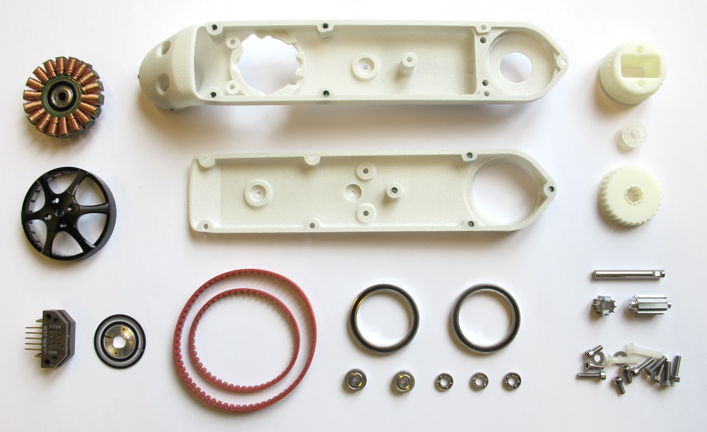
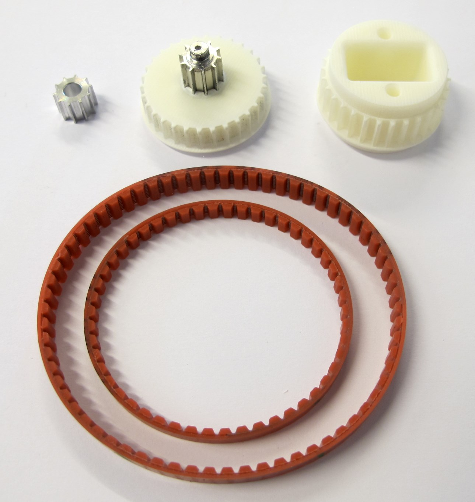
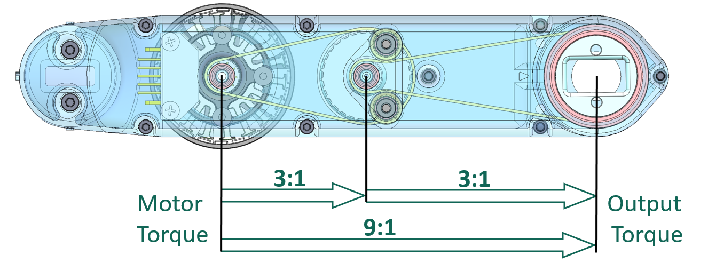
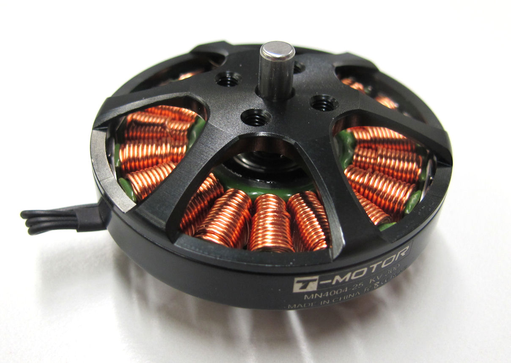
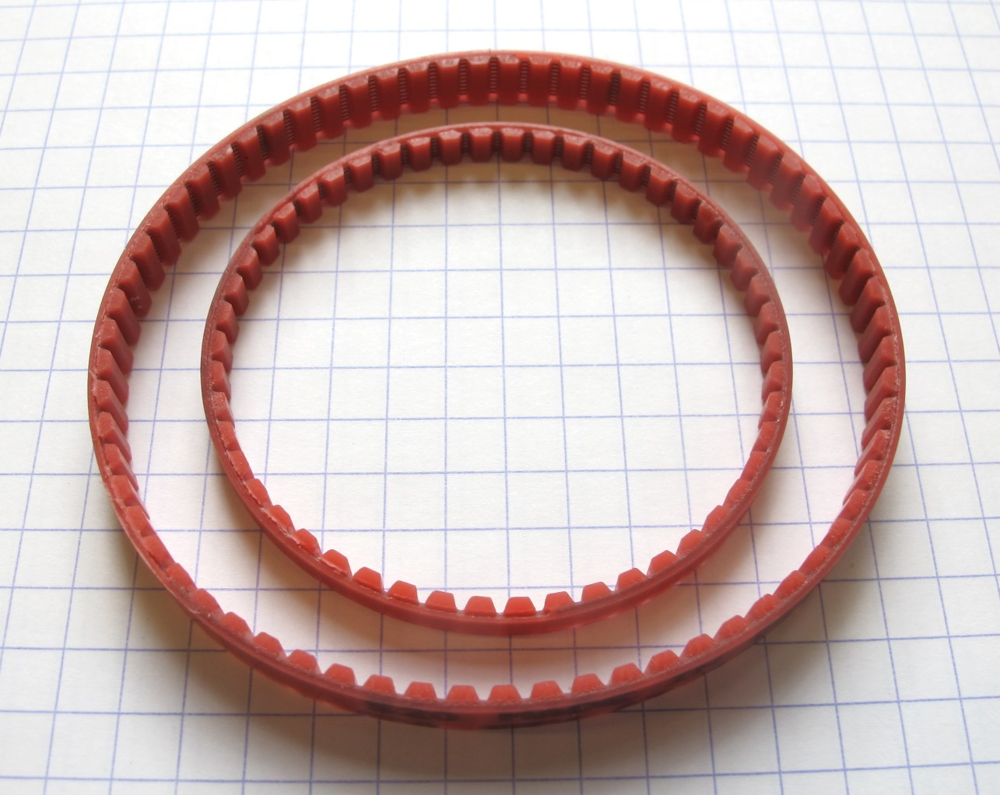
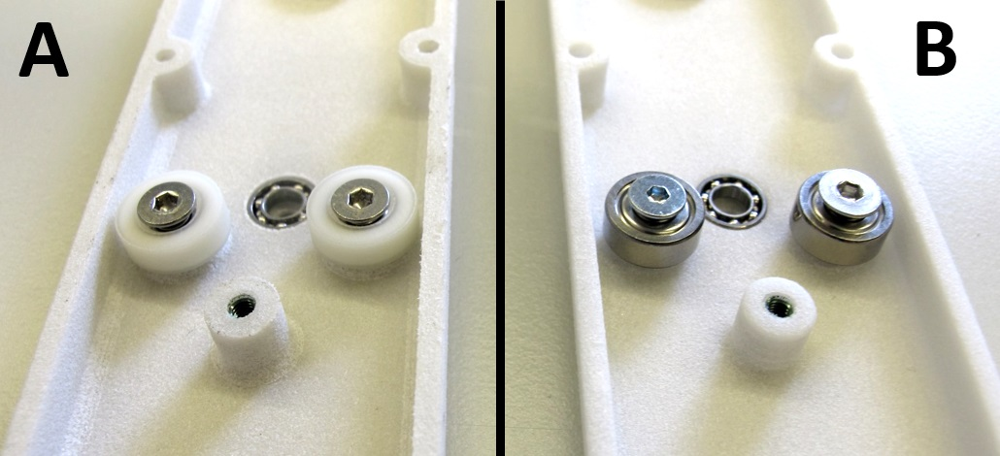
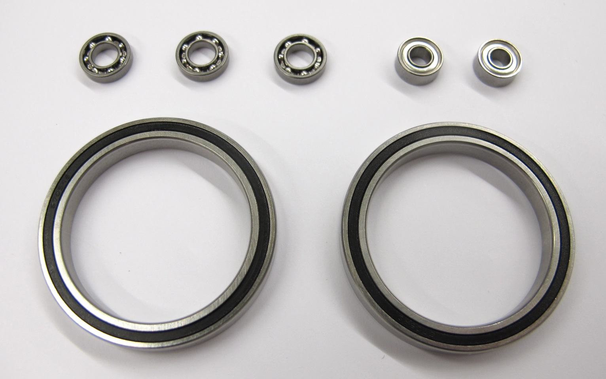
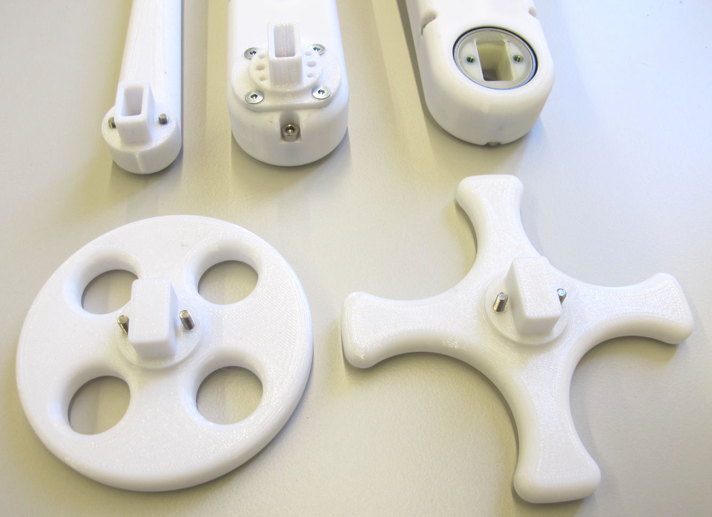
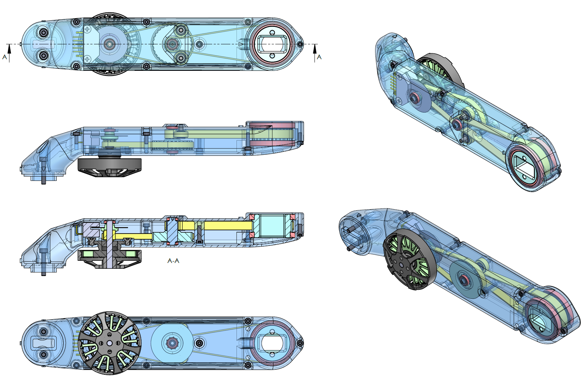
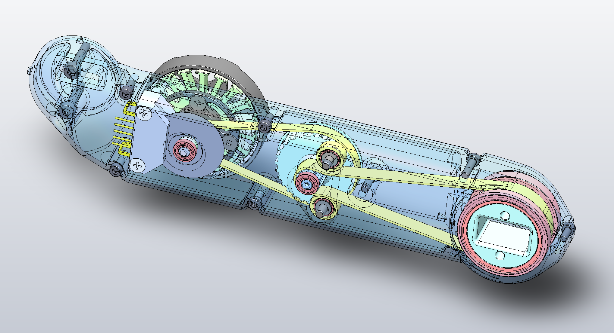

Brushless Actuator Module v1
=======================

Introduction
------------
We developed a light-weight, low cost, minimal complexity, torque-controlled actuator module for robotic research.  
The actuator module consists of a brushless outrunner motor, a high resolution optical encoder, a dual stage timing belt transmission and mostly 3d printed parts and off-the-shelf components.  
The module has a segment length of 160mm, weighs 150g and outputs 2,5Nm at 12A.

Component Overview
-------------------

Actuator Module Assembly
--------

Dual Stage Timing Belt Transmission
-----------------------------------------

   *Weight of the components in the picture: 18g*

  * The small pulleys have 10 teeth - the large pulleys have 30 teeth

Transmission Dimensions
--------------------------

* Dual stage timing belt transmission with 3:1 gear reduction on each stage
* Total gear reduction 9:1

Off-the-shelf Components
--------------------------
### Brushless DC Motor

  

  * T-Motor Antigravity 4004 300kV
  * 24 magnets / 12 pole pairs / 18 slots
  * 3 phase WYE Configuration / Star Configuration
  * Rotor diameter: 45mm
  * Weight: 53g
  * [Details Motor Preparation](details/details_motor_preparation.md)
  * [T-Motor Webpage](http://store-en.tmotor.com/goods.php?id=438)

#### Motor Parameters for Antigravity 4004 300kV - determined with the Motorware Motor ID Software

* Rr = 0
* Rs = 0.23255 Ω
* Ls_d = 1.4e-4
* Ls_q = 1.4e-4
* Rated Flux = 0.00954
* Inertia = 0.12954
* Friction = 0.10053
___
### Optical Encoder
  
  * Broadcom AEDT-9810-Z00
  * 5000 pulses per revolution per channel
  * 5V two channel quadrature output with index pulse (ABZ)
  * Code wheel diameter: 26mm
  * Weight: 5g
  * [Details Encoder and Codewheel](details/details_encoder.md)
  * [Broadcom Webpage](https://www.broadcom.com/products/motion-control-encoders/incremental-encoders/transmissive-encoders/aedt-981x)  

### Timing Belts

   *Timing Belts AT3 GEN III with 50 teeth and 67 teeth*

  * Timing Belt: Synchroflex AT3 GEN III
  * Heavy duty polyurethane timing belt with steel cord reinforcements
  * 3mm tooth pitch
  * First stage: 150mm timing belt - width 4mm - 1,5g
  * Second stage: 201mm timing belt - width 6mm - 3g
  * [Contitech Webpage](https://www.contitech.de/en-gl/Solutions/Power-Transmission/Industrial-Applications/Drive-Belts/Synchronous-Belts/Products/Product-range/CONTI-SYNCHROFLEX-GEN3)  

### Timing Belt Tensioner Rollers
   *Left side - 10mm bearings / Right side - 7mm bearings and 3d printed rollers*

### Bearings
 
* Miniature stainless steel roller bearings
* Ouput bearing: 32mm x 25mm x 4mm - 6.9g
* Transmission bearing: 8mm x 4mm x 2mm - 0.4g

### Machined Parts
    
There are 3 parts in the assembly that have to be machined from metal.
  * motor pulley 10 teeth - aluminum - 0.6g -> [PDF drawing](drawings/motor_pulley_at3_t10.PDF)
  * center pulley 10 teeth - aluminum - 2,1g -> [PDF drawing](drawings/center_pulley_at3_t10.PDF)
  * motor shaft - 4mm steel rod - 3,2g -> [PDF drawing](drawings/motor_shaft.PDF)
  * [Details Machined Parts and Technical Drawings](details/details_machined_parts.md)

3D Printed Parts
-----------------
### Shell structure
        
The shell of the actuator module consists of two parts that are connected by eight M2,5 screws.  
The shell structure supports the motor, encoder and the bearings for the transmission and the output joint.  
We recommend to print the shells on a SLS 3D printer. (selective laser sintering printer)  
We use Helicoil threaded inserts for increased stability.  

  * Actuator Module Shell Base - 28g -> [STL file](stl_files/actuator_module_shell_base.STL)
  * Actuator Module Shell Cover - 16g -> [STL file ](stl_files/actuator_module_shell_cover.STL)
  * [Details 3D Printed Parts](details/details_3d_printed_parts.md)

### Pulleys
   *Parts shown in the picture: codewheel mount, center pulley and output pulley.*

The tooth profil of the pulleys has to be pretty precise and concentric.  
We recommend to print the pulleys using a stereolithography or multijet printer.  

  * Encoder Codewheel PWB Mount - 0.2g -> [STL file](stl_files/encoder_codewheel_pwb_mount.STL)
  * Transmission Pulley AT3 T30 Center - 4.2g -> [STL file ](stl_files/transmission_pulley_at3_t30_center.STL)
  * Transmission Pulley AT3 T30 Output - 6.7g -> [STL file ](stl_files/transmission_pulley_at3_t30_output.STL)
  * [Details 3D Printed Parts](details/details_3d_printed_parts.md)

Mechanical Interface
-----------------------
   *The same mechanical interface is used for the hip, upper leg, lower leg and test adapters*

More Details
--------
* [Details 3D Printed Parts](details/details_3d_printed_parts.md)  
* [Details Machined Parts and Technical Drawings](details/details_machined_parts.md)
* [Details Encoder and Codewheel](details/details_encoder.md)  
* [Details Encoder Preparation](details/details_encoder_preparation.md)  
* [Details Encoder Kit Disassembly](details/details_encoder_kit_disassembly.md)
* [Details Shell Preparation](details/details_shell_preparation.md)
* [Details Motor Preparation](details/details_motor_preparation.md)
* [Details Motor Shaft Preparation](details/details_motor_shaft_preparation.md)
* [Details Center Pulley Preparation](details/details_center_pulley_preparation.md)
* [Details Output Pulley Preparation](details/details_output_pulley_preparation.md)
* [Details Actuator Module Assembly](details/details_assembly.md)

PDF Drawing
------------
View this pdf file to get a better overview of the actuator module assembly.

 *Actuator Module Overview - Click on picture to view PDF drawing.*

3D Assembly File
-------------------
Download and open the eDrawing file below to explore the actuator module assembly.  
To open the file you will need to download and install the free eDrawings viewer [here](https://www.edrawingsviewer.com/download-edrawings).  

 *Actuator Module Overview - Click on picture to download and view the 3d assembly file.*

Authors
--------
Felix Grimminger

License
-------
BSD 3-Clause License

## Copyright
Copyright (c) 2019-2020, Max Planck Gesellschaft and New York University

## More Information
[Open Dynamic Robot Initiative - Webpage](https://open-dynamic-robot-initiative.github.io)  
[Open Dynamic Robot Initiative - YouTube Channel](https://www.youtube.com/channel/UCx32JW2oIrax47Gjq8zNI-w)   
[Open Dynamic Robot Initiative - Forum](https://odri.discourse.group/categories)  
[Open Dynamic Robot Initiative - Paper](https://arxiv.org/pdf/1910.00093.pdf)  
[Hardware Overview](../../README.md#open-robot-actuator-hardware)  
[Software Overview](https://github.com/open-dynamic-robot-initiative/open-dynamic-robot-initiative.github.io/wiki)
