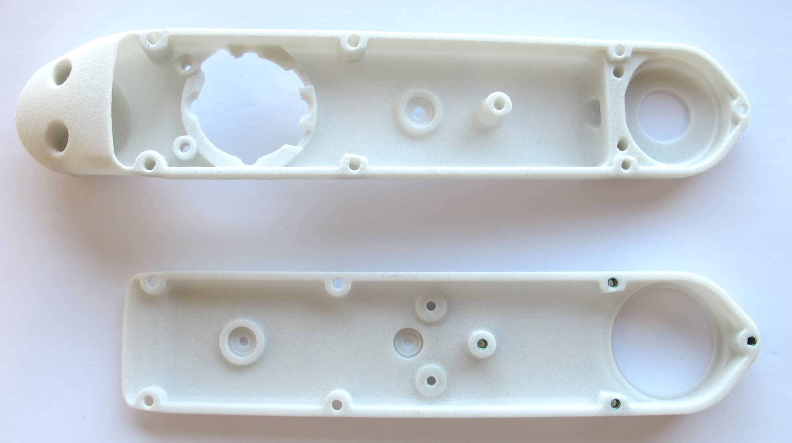
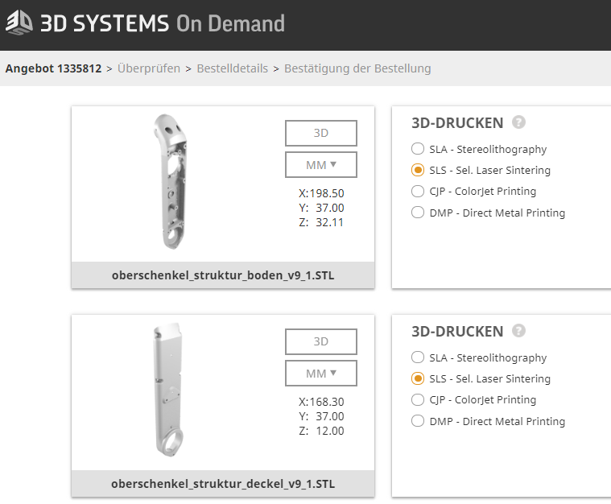
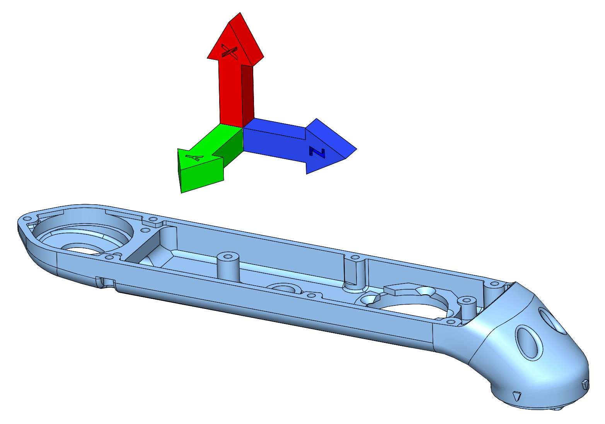
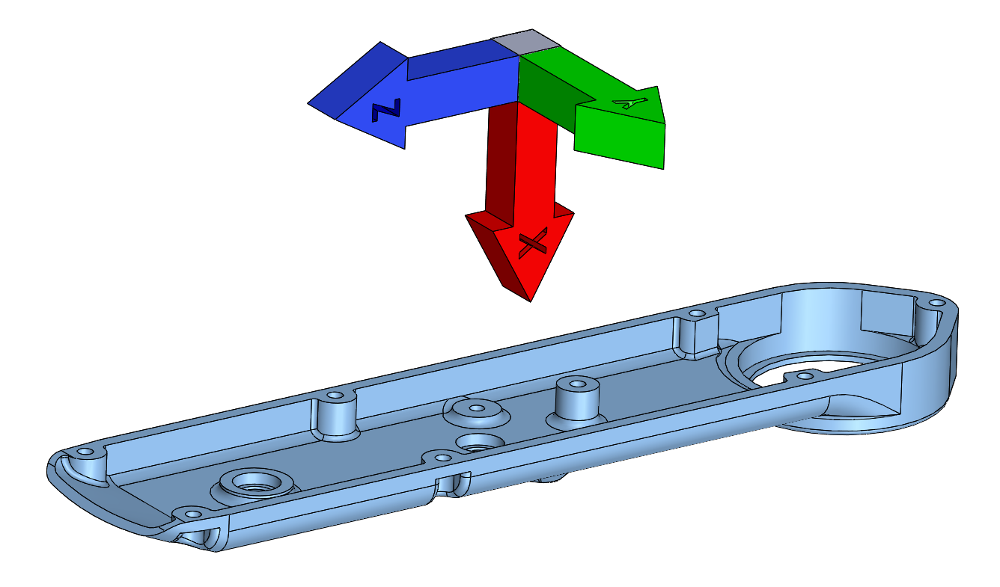
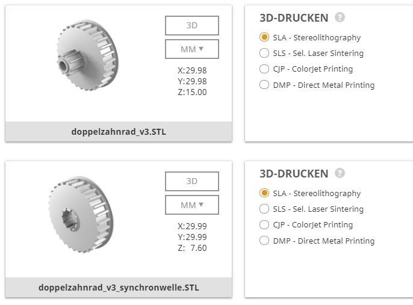
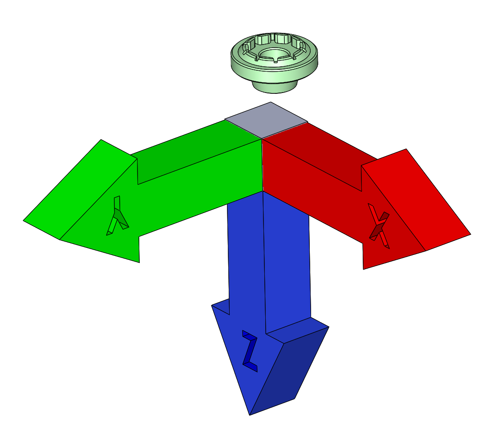
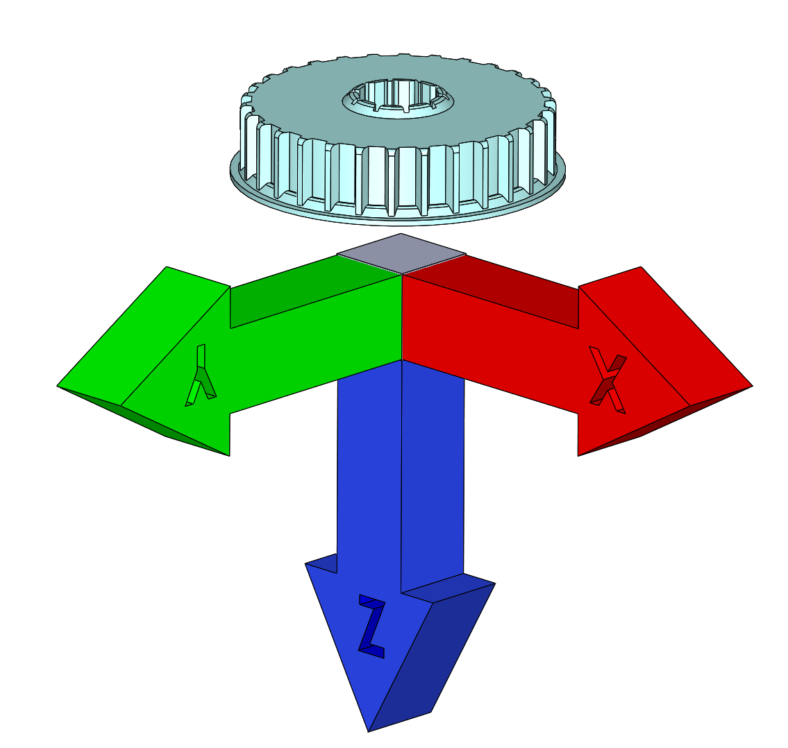
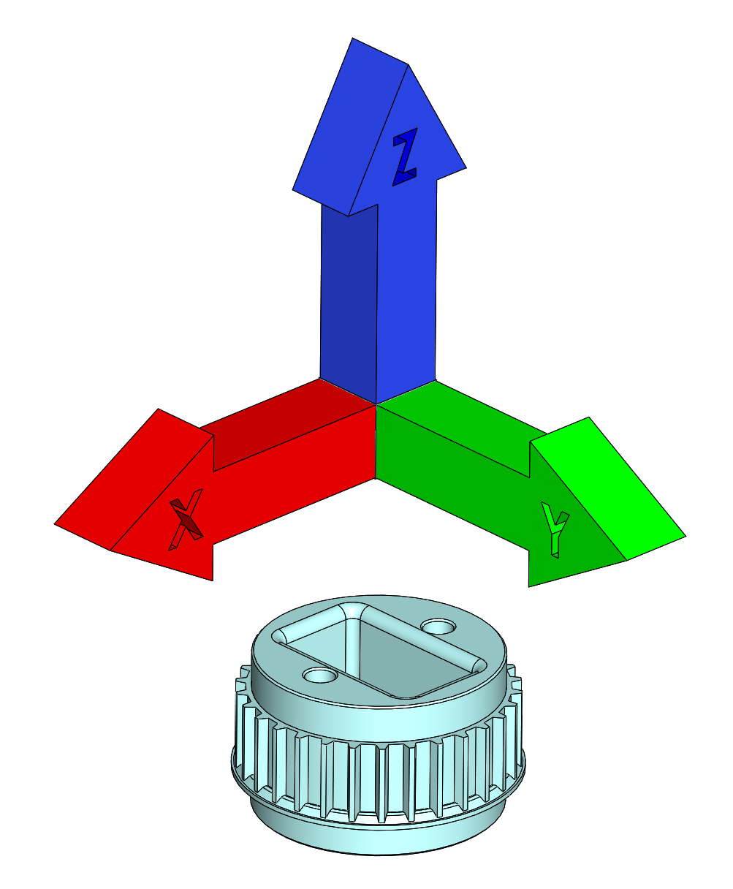

Details 3D Printed Parts
=======================

Shells
------------
    

The shells should be printed on a selective laser sintering printer using high strength material.  
The shells we are using were purchased from the ["3D Systems Part on Demand Service".](https://www.3dsystems.com/on-demand-manufacturing)

       

### Instructions:
* go to the website and login (or create a user account if you don't have one yet)
* upload the stl files (actuator_shell_base and actuator_shell_cover)
* choose the printing technology: SLS - Selective Laser Sintering
* choose the material: Duraform HST
* choose number of copies
* save the order and write down the order number (don't order online)
* send an email to the 3D Systems engineering support with the order number and ask for a quote for printing the parts in the orientation defined in this [pdf file](20190910_actuator_module_3d_printing_orientation.pdf).
* You can find the email contact for Germany, France and the US below.

**Important:**   
The print orientation of the parts for the actuator module is critical.  
If you order the parts directly from the online system they will be automatically placed in the print volume by an algorithm.  
If the algorithm places the parts under some random angle they might be not usable.  
In order to control the print orientation and therefore the quality of the parts you have to go through the 3D Systems engineering support.   
Write an email (contact information below) with the order number from the web interface and ask them to give you a quote for printing the parts in the orientation defined in this [pdf file](20190910_actuator_module_3d_printing_orientation.pdf).

#### Actuator Shell Base: y and z axis in horizontal plane -> x axis pointing upwards  

  
___
#### Actuator Shell Cover: y and z axis in horizontal plane -> x axis pointing downwards
  

_____

Pulleys and Code Wheel Mount
----------
The pulleys and the code wheel mount should be printed on a high-detail stereolithography or multijet printer.   
We print these parts on our Projet 3500 HD max multijet printer using the M3X material.  

You can also order these parts from ["3D Systems Part on Demand Service".](https://www.3dsystems.com/on-demand-manufacturing)  
Therefore you should choose the SLA Steroelithography printer and the Accura Extreme Grey Material.

* go to the website and login (or create a user account if you don't have one yet)
* upload the stl files (encoder_codewheel_pwb_mount, transmission_pulley_at3_t30_center and transmission_pulley_at3_t30_output)
* choose the printing technology: SLA - Stereolithography
* choose the material: Accura Extreme Grey
* choose number of copies
* save the order and write down the order number (don't order online)
* send an email to the 3D Systems engineering support with the order number and ask for a quote for printing the parts in the orientation defined in this [pdf file](20190910_actuator_module_3d_printing_orientation.pdf).  
* You can find the email contact for Germany, France and the US below.

  
___
#### Code Wheel Mount: x and y axis in horizontal plane -> z axis pointing downwards
  
___
#### Center Pulley: x and y axis in horizontal plane -> z axis pointing downwards
  
___
#### Output Pulley: x and y axis in horizontal plane -> z axis pointing upwards
  
___
### 3D Systems Engineering Support:
Germany: anfrage@3dsystems.com    / Phone: 06105-3248-456  
France: lydie.caze@3dsystems.com  
US: chris.lewis@3dsystems.com  
Webpage: [3D Systems Part on Demand Service](https://www.3dsystems.com/on-demand-manufacturing)  

Authors
--------
Felix Grimminger

License
-------
BSD 3-Clause License

Copyright
-----------
Copyright (c) 2019, Max Planck Gesellschaft, New York University

More Information
----------------
[Open Dynamic Robot Initiative](https://open-dynamic-robot-initiative.github.io)  
[Hardware Overview](../../README.md)  
[Software Overview](https://github.com/open-dynamic-robot-initiative/open-dynamic-robot-initiative.github.io/wiki/Open-Dynamic-Robot-Initiative-Documentation)  
[Back to Actuator Module](../README.md)
