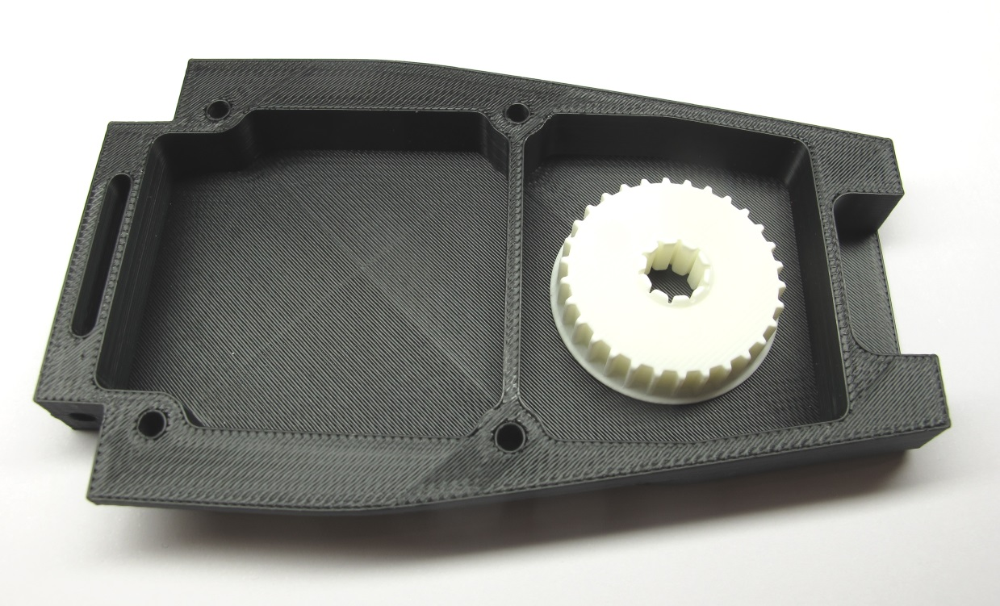
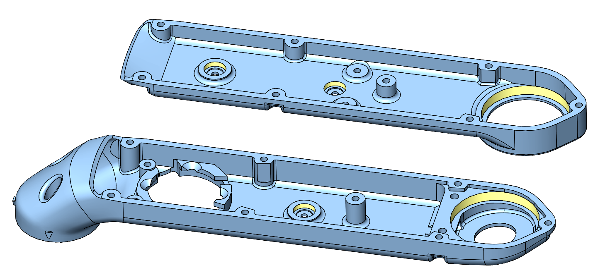
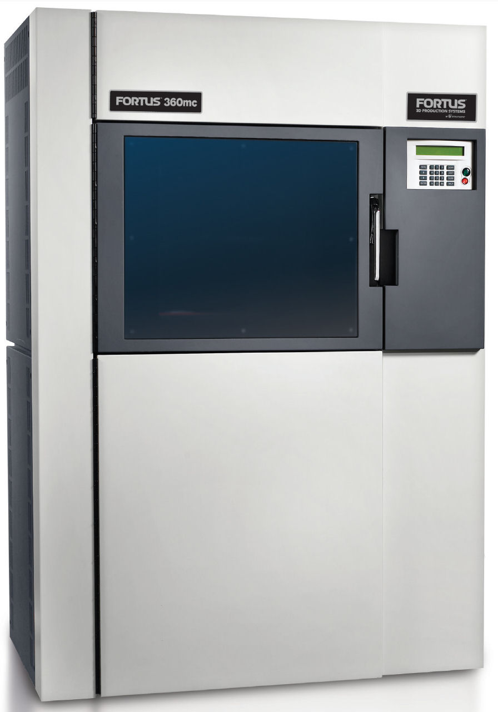
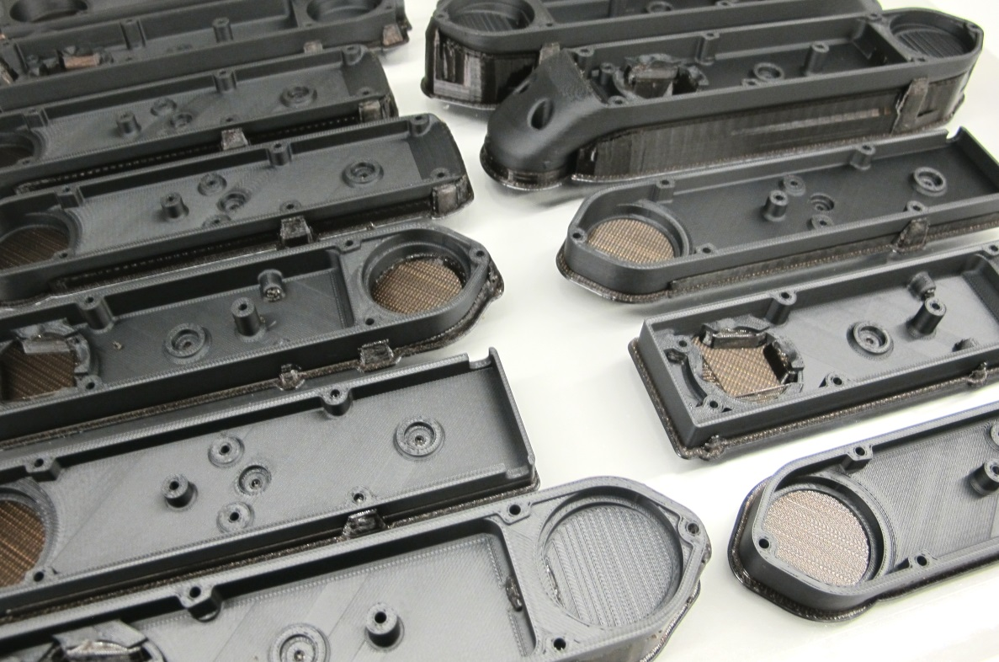
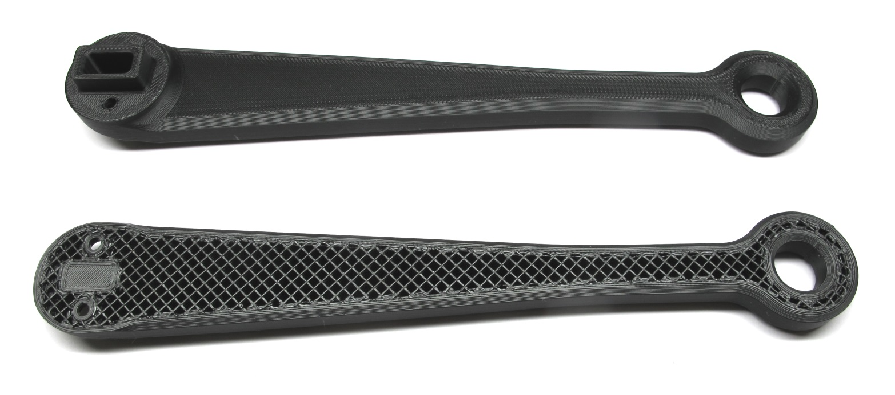
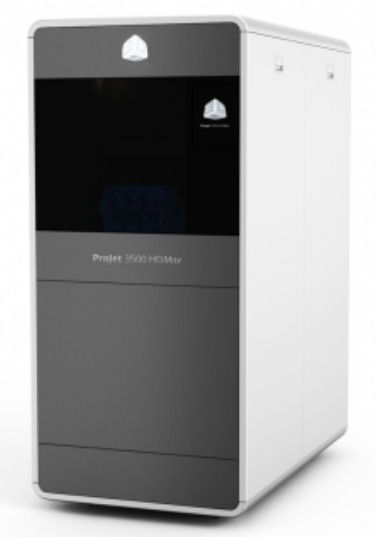
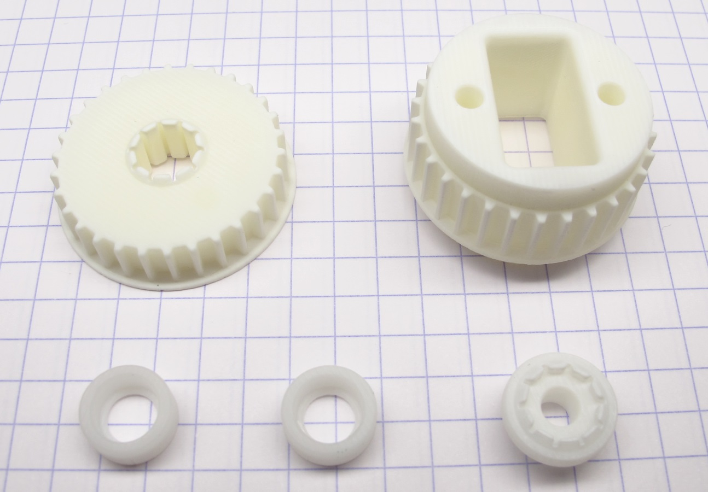
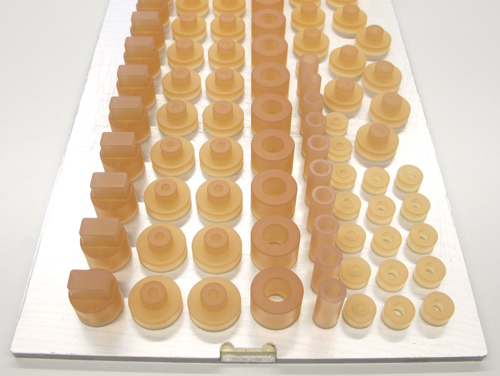

# Details 3D Printed Parts

## Description
* there are two categories of parts for which we use the following different printing technologies for best results.
* for **large structural parts** like the shells and the body structures of the robots we use a **FDM** (Fused Deposition Modeling) printer  or a **SLS** (Selective Laser Sintering) printer.
* for the **small parts** that require **high precision** like the pulleys for the timing belt transmission we use a **Multijet** or **SLA** (Stereolithography) printer.

 *Comparison 3d printed parts: Body structure from FDM printer and pulley from Multijet printer.*  

---
## Printing Tolerances

 *Shell base and shell cover - the critical surfaces are colored yellow*  

* the printing tolerances vary significantly depending on the supplier, the printing technology and even between orders from the same supplier
* the critical surfaces for the shells are the bearing seats (colored yellow in the screenshot above)
* if the bearing seat diameters are too tight you can use a end mill to adjust the diameter
* if the bearing seat diameters are much too large the bearings will not be held securely and the parts might not be usable
* ideally you can produce the 3d printed parts on your own 3d printer
* that allows you to do test prints and adjust the printer settings or the STL files if necessary
* at MPI in Tübingen we use the following two 3d printers to produce and evaluate the parts for our robots
---
## Printers at MPI Tübingen

### Fortus FDM Printer
 *Fortus 360mc FDM Printer. Picture source: Stratasys*

We use the following material and settings:
* Model material: PC-ABS material black
* Support material: SR20
* T12 nozzle for material and support - slice height 0,178mm
* Mechanical removal or alkaline bath removal of the support material
* Standard solid interior printer setting for all the shell and body parts
* Sparse double dense printer setting for the lower legs

 *3d printed shell parts on the build sheet - the brown material is the support.*

 *Lower leg printed with sparse double dense setting. For the bottom part the printer was stopped half way to reveal the internal structure.*  

### Projet Multijet Printer
 *Projet 3500 HD Max Multijet Printer. Picture source: 3D Systems*  

* Model material: VisiJet M3X
* Support material: S300 Wax
* Oven for removing the wax support material
* Ultrasonic bath with baby oil for removing remaining wax
* Ultrasonic bath with soap water for cleaning the parts
* Quenching in ice water

 *All the parts that require high precision and detail are printed on our Projet 3d printer.*

 *Projet parts on build plate.*

---
## Ordering Shells from 3D Systems
    

The shells should be printed on a selective laser sintering printer using high strength material.  
The shells we are using were purchased from the ["3D Systems Part on Demand Service".](https://www.3dsystems.com/on-demand-manufacturing)

       

### Instructions:
* go to the website and login (or create a user account if you don't have one yet)
* upload the stl files (actuator_shell_base and actuator_shell_cover)
* choose the printing technology: SLS - Selective Laser Sintering
* choose the material: Duraform HST
* choose number of copies
* save the order and write down the order number (don't order online)
* send an email to the 3D Systems engineering support with the order number and ask for a quote for printing the parts with the printing direction in the positive z axis direction of the STL files as shown below
* You can find the email contact for Germany, France and the US below.

     

**Important:**   
The print orientation of the parts for the actuator module is critical.  
If you order the parts directly from the online system they will be automatically placed in the print volume by an algorithm.  
If the algorithm places the parts under some random angle they might be not usable.  
In order to control the print orientation and therefore the quality of the parts you have to go through the 3D Systems engineering support.   
Write an email (contact information below) with the order number from the web interface and ask them to give you a quote for printing the parts with the printing direction in the positive z-axis direction of the STL files as shown above.

---
## Pulleys and Code Wheel Mount
The pulleys and the code wheel mount should be printed on a high-detail stereolithography or multijet printer.   
We print these parts on our Projet 3500 HD max multijet printer using the M3X material.  

You can also order these parts from ["3D Systems Part on Demand Service".](https://www.3dsystems.com/on-demand-manufacturing)  
Therefore you should choose the SLA Steroelithography printer and the Accura Extreme Grey Material.

* go to the website and login (or create a user account if you don't have one yet)
* upload the stl files (encoder_codewheel_pwb_mount, transmission_pulley_at3_t30_center and transmission_pulley_at3_t30_output)
* choose the printing technology: SLA - Stereolithography
* choose the material: Accura Extreme Grey
* choose number of copies
* save the order and write down the order number (don't order online)
* send an email to the 3D Systems engineering support with the order number and ask for a quote for printing the parts with the printing direction in the positive z-axis direction of the STL files as shown above.
* You can find the email contact for Germany, France and the US below.

  

---
### 3D Systems Engineering Support:
Germany: anfrage@3dsystems.com    / Phone: 06105-3248-456  
France: lydie.caze@3dsystems.com  
US: chris.lewis@3dsystems.com  
Webpage: [3D Systems Part on Demand Service](https://www.3dsystems.com/on-demand-manufacturing)  

---
## Step-by-Step Instructions

| Motor Preparation  | Motor Shaft Preparation | Encoder Preparation |Center Pulley Preparation|
| --- | --- | --- | --- |
| |   |   | |

| Output Pulley Preparation | Shell Preparation | Actuator Module Assembly |Actuator Module Testing|
| --- | --- | --- | --- |
| |   |   | |

---
## More Details
| Details 3d Printed Parts | Details Machined Parts | Mechanical Tools and Consumables |Electronic Components and Tools|
| --- | --- | --- | --- |
|||||

---
## More Information
[Open Dynamic Robot Initiative - Webpage](https://open-dynamic-robot-initiative.github.io)  
[Open Dynamic Robot Initiative - YouTube Channel](https://www.youtube.com/channel/UCx32JW2oIrax47Gjq8zNI-w)   
[Open Dynamic Robot Initiative - Forum](https://odri.discourse.group/categories)  
[Open Dynamic Robot Initiative - Paper](https://arxiv.org/pdf/1910.00093.pdf)  
[Hardware Overview](../../../README.md#open-robot-actuator-hardware)  
[Software Overview](https://github.com/open-dynamic-robot-initiative/open-dynamic-robot-initiative.github.io/wiki)  
[Back to Actuator Module](../README.md)  
[Back to Top of Page](#details-3d-printed-parts)

---
## Authors
Felix Grimminger

## License
BSD 3-Clause License

## Copyright
Copyright (c) 2019-2020, Max Planck Gesellschaft and New York University
