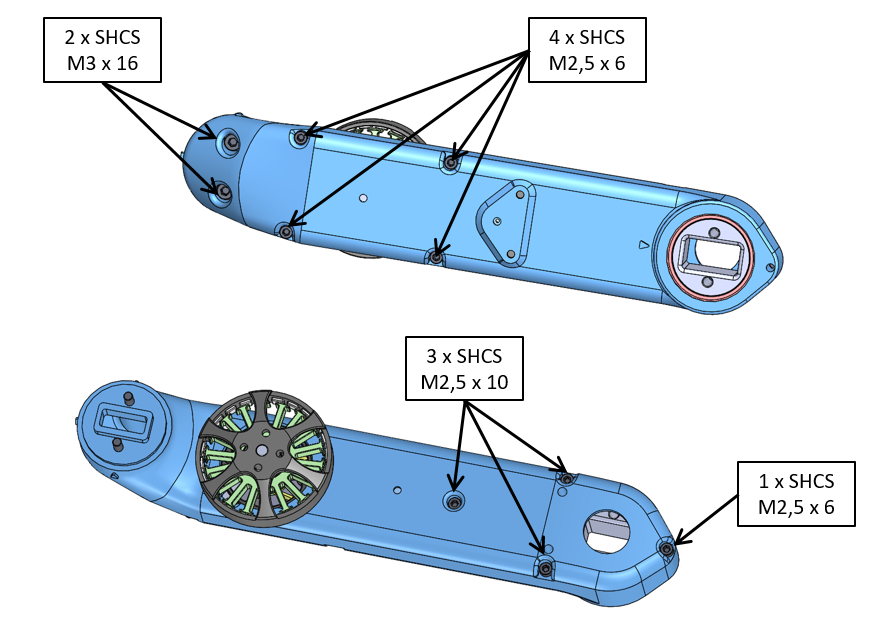
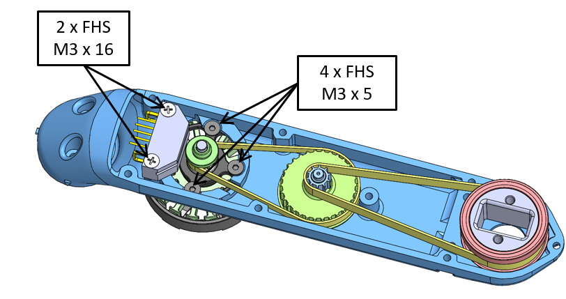

Details Actuator Module Assembly
=======================

  *Fasteners for Actuator Module Assembly - SHCS = Socket Head Cap Screw / FHS = Flat Head Screw*  
_____
  *Fasteners for Actuator Module Assembly - SHCS = Socket Head Cap Screw / FHS = Flat Head Screw*

______
Description
------------

Authors
--------
Felix Grimminger

License
-------
BSD 3-Clause License

Copyright
-----------
Copyright (c) 2019, Max Planck Gesellschaft, New York University

More Information
----------------
[Open Dynamic Robot Initiative](https://open-dynamic-robot-initiative.github.io)  
[Hardware Overview](../../README.md)  
[Software Overview](https://github.com/open-dynamic-robot-initiative/open-dynamic-robot-initiative.github.io/wiki/Open-Dynamic-Robot-Initiative-Documentation)  
[Back to Actuator Module](../README.md)  
