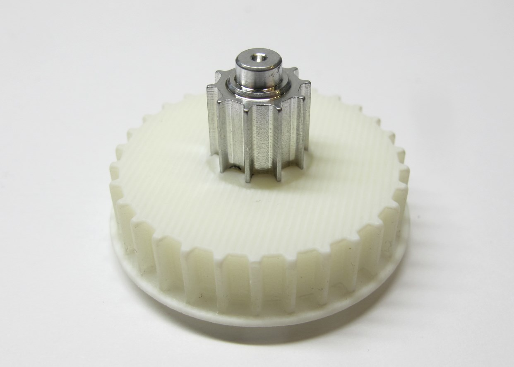
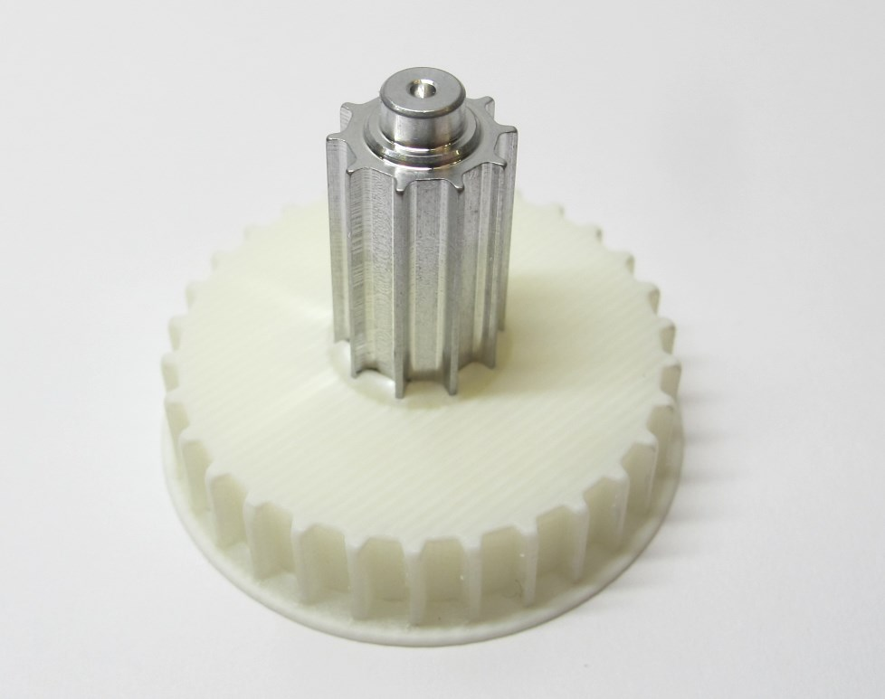
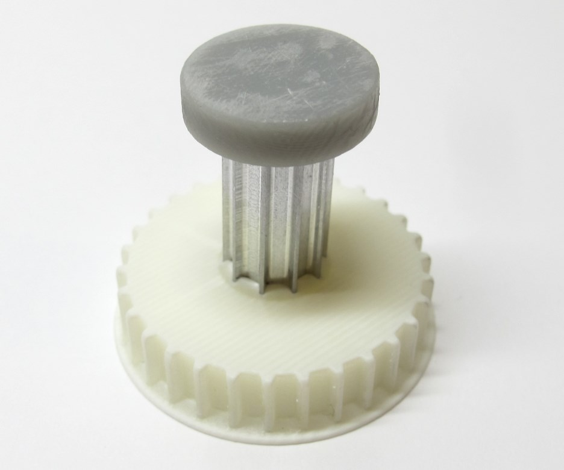
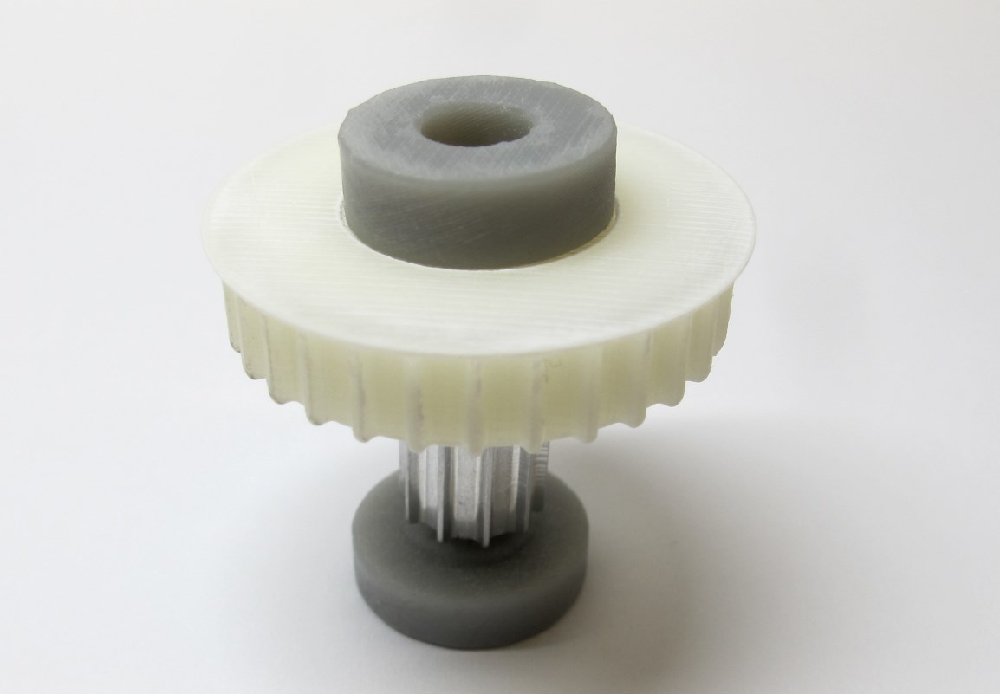
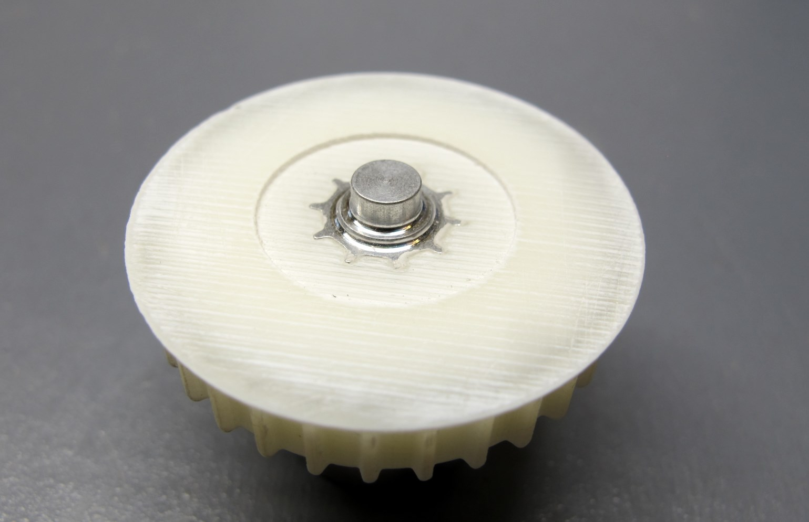

Details Center Pulley Preparation
=======================
  *Center Pulley Assembled*  

Description
------------
  *Center Pulley AT3 T30, Center Pulley AT3 T10 and Assembly Tools*  

* The center pulley is assembled from the 10 tooth aluminium pulley and the 30 tooth 3d printed pulley.  
* The parts are press-fit using an arbor press and 3d printed tools.  
* More information on the 3d printing: [Details 3d Printed Parts](details_3d_printed_parts.md)  
* More information on the machined part: [Details Machined Parts](details_machined_parts.md)

* [PDF File - Pulley AT3 T10 Center](../drawings/center_pulley_at3_t10.PDF)
* [STL File - Pulley AT3 T30 Center](../stl_files/transmission_pulley_at3_t30_center.STL)
* [STL File - Tool Center Pulley Protection](../stl_files/tool_center_pulley_protection.STL)
* [STL File - Tool Center Pulley Assembly](../stl_files/tool_center_pulley_assembly.STL)

Assembly
---------

  *Place the aluminum pulley on the 3d printed pulley.   Make sure it's vertical and matches the tooth pattern.   Push it in a bit by hand - the centering hole should be facing upwards.*  

  *Place the protection part on the aluminum pulley.*

  *Turn your assembly around.  Place and center the assembly tool on the bottom side.*

  *We use an arbor press to join the parts. Alternatively you can use a vice.*

  *Place your stack of parts on the arbor press.  Push all the way down using moderate force.*

  *The parts should be flush on the bottom side.  Remove scraped-off material with a tooth brush.*

  *The center pulley is now ready for installation.*

Authors
--------
Felix Grimminger

License
-------
BSD 3-Clause License

Copyright
-----------
Copyright (c) 2019, Max Planck Gesellschaft, New York University

More Information
----------------
[Open Dynamic Robot Initiative](https://open-dynamic-robot-initiative.github.io)  
[Hardware Overview](../../README.md)  
[Software Overview](https://github.com/open-dynamic-robot-initiative/open-dynamic-robot-initiative.github.io/wiki/Open-Dynamic-Robot-Initiative-Documentation)  
[Back to Actuator Module](../README.md)  
