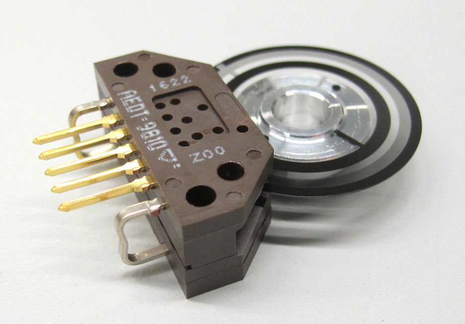
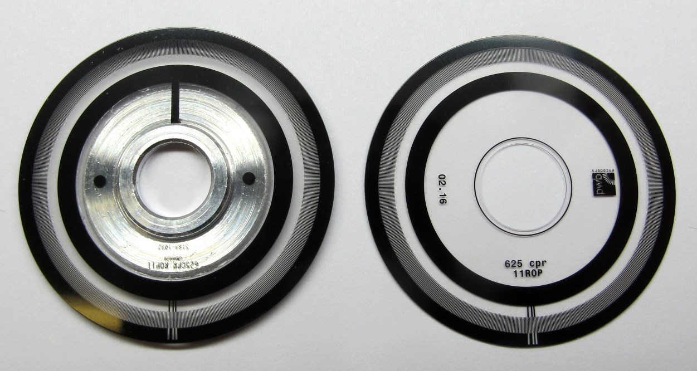
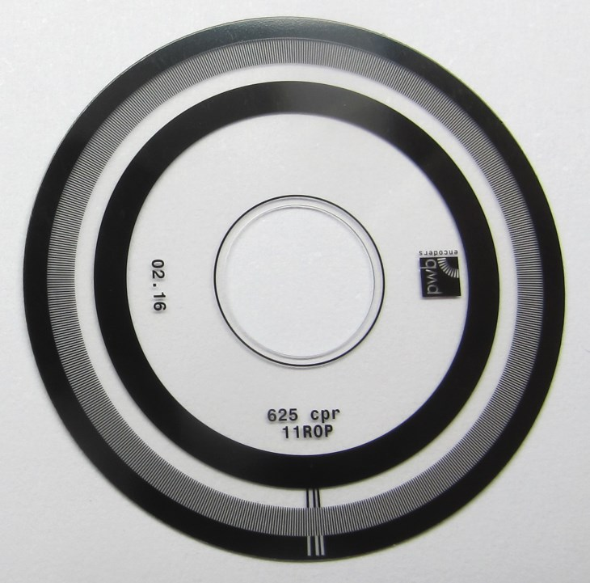

Details Encoder and Codewheel
=======================

  *Encoder and Codewheel from Encoder Kit AEDM-5810-Z12*  

Description
------------
The highest resolution codewheels with 5000cpr are only available in the Encoder Kit or from codewheel manufacturers.

So there are two options:
* You can either order the AEDM-5810-Z12 encoder kit that consists of the encoder and the 5000cpr codewheel attached to a aluminum mount. (Option A - below)  
* Or you can order the Broadcom AEDT-9810-Z00 encoder without the codewheel and have the codewheel manufactured. (Option B - below)

  *Codewheel comparison: Left side - Modified codewheel from encoder kit / Right side - Codewheel ordered from PWB*

### Option A - Encoder Kit

  *Left side: Original codewheel from encoder kit / Right side: Modified codewheel*

#### Instructions:
* Find and order the AEDM-5810-Z12 encoder kit
* Disassemble the encoder kit and extract the encoder and the codewheel.
* Dissasembly instructions can be found [here](details_encoder_kit_disassembly.md).
* Modify the aluminium flange according to [this drawing](../drawings/codewheel_modification.PDF)
* Use the correct stl to print encoder mount (the encoder mounts for the two options are different)

### Option B - Codewheel Fabrication
  *Codewheel fabricated by PWB*  

We have ordered the codewheels from PWB in Germany. [PWB Website](https://www.pwb-encoders.com)  
Broadcom has codewheel manufacturer lists for different countries.  
We cannot share the list here but you can ask the Broadcom support for a list of code wheel suppliers in your region.

### Instructions:

* Find and order the AEDT-9810-Z00 encoder
* Find a codewheel manufacturer in your region (ask the Broadcom Support for suppliers)
* Ask them for a quote for producing a 5000cpr codewheel with index for the AEDT9810 encoder
* Details: 625 lines / optical radius:11mm / disc diameter: 25,56mm / Inner bore diameter: 7mm

Authors
--------
Felix Grimminger

License
-------
BSD 3-Clause License

Copyright
-----------
Copyright (c) 2019, Max Planck Gesellschaft, New York University

More Information
----------------
[Open Dynamic Robot Initiative](https://open-dynamic-robot-initiative.github.io)  
[Hardware Overview](../../README.md)  
[Software Overview](https://github.com/open-dynamic-robot-initiative/open-dynamic-robot-initiative.github.io/wiki/Open-Dynamic-Robot-Initiative-Documentation)  
[Back to Actuator Module](../README.md)
