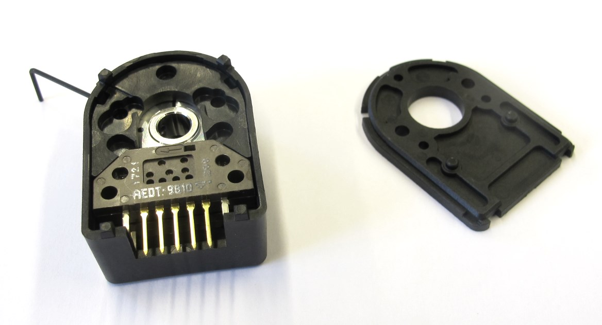
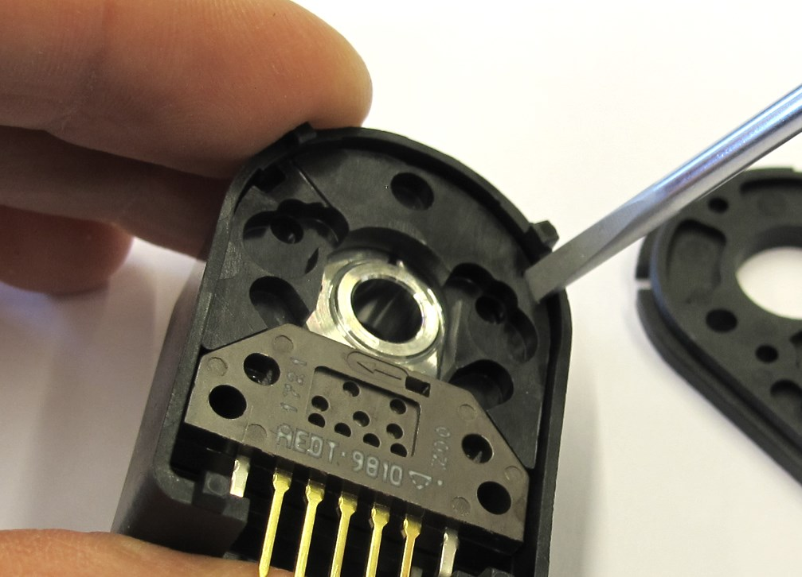
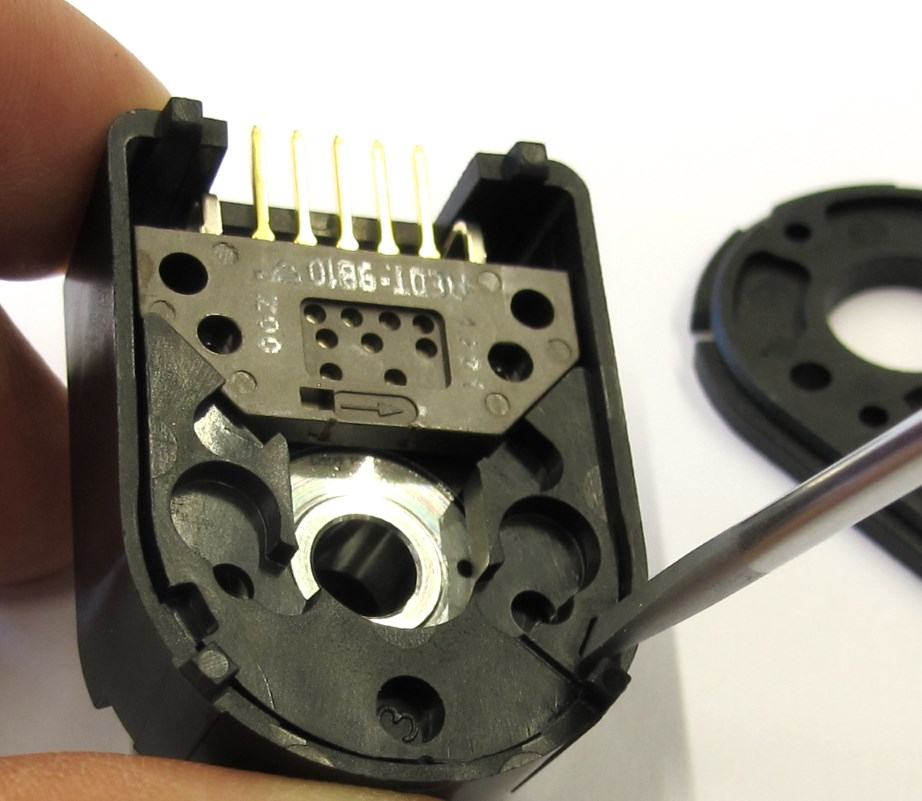
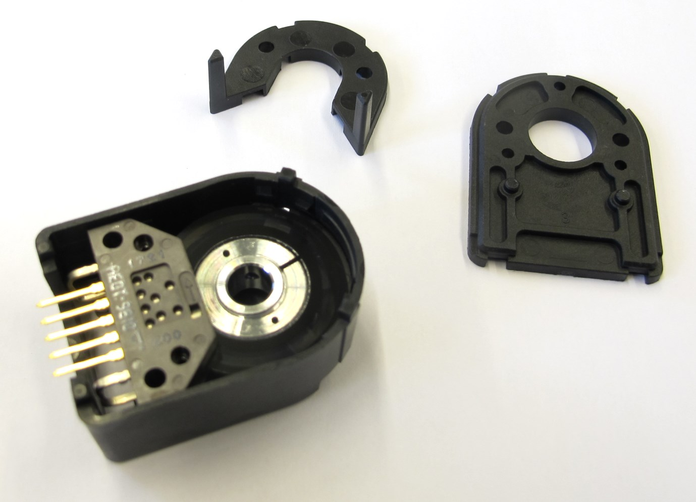
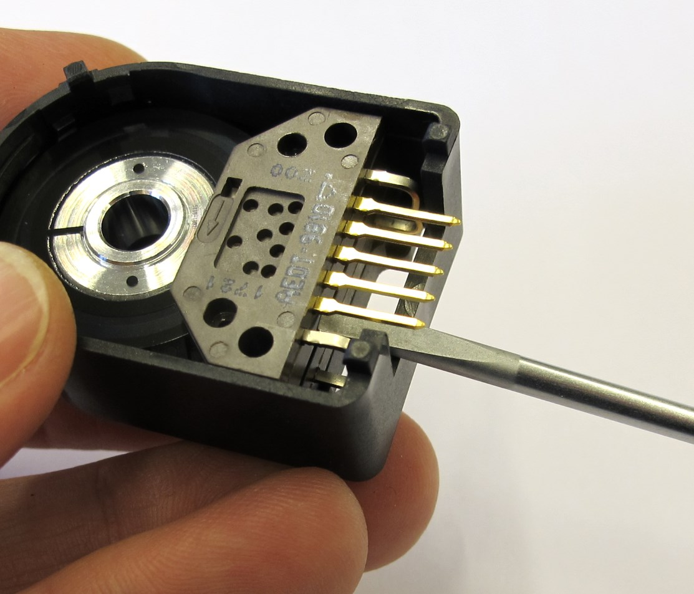
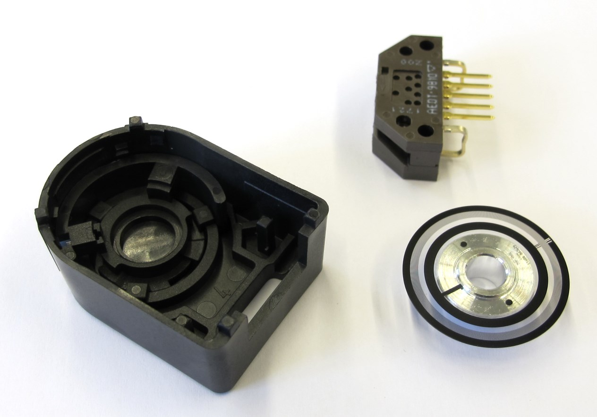
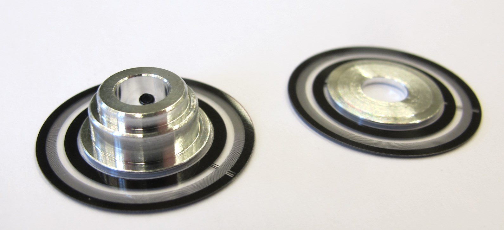

Details Encoder Kit Disassembly
=======================

  *Encoder Kit with AEDT 9810 encoder and 5000cpr codewheel.*  

Description
------------

  *Use a thin screwdriver to undo the snap fit connection between the casing and the cover.*  

  *Same thing on the other side.   
Once both sides are released the cover can be pulled of or pried out.   Be careful not to scratch the encoder disc.*

  *Open encoder case.*

  *Remove the encoder carefully using the screwdriver as a lever.  The encoder is connected by a light press fit.  There is a notch at the bottom of the encoder that can be used.*

  *Carefully take the encoder and code wheel out of the casing.*

  *The aluminum collar on the code wheel has to be removed on a lathe.  Cover the optical disc with tape to protect from scratching.*

Modify the aluminium flange according to [this drawing](../drawings/codewheel_modification.PDF)

Authors
--------
Felix Grimminger

License
-------
BSD 3-Clause License

Copyright
-----------
Copyright (c) 2019, Max Planck Gesellschaft, New York University

More Information
----------------
[Open Dynamic Robot Initiative](https://open-dynamic-robot-initiative.github.io)  
[Hardware Overview](../../README.md)  
[Software Overview](https://github.com/open-dynamic-robot-initiative/open-dynamic-robot-initiative.github.io/wiki/Open-Dynamic-Robot-Initiative-Documentation)  
[Back to Actuator Module](../README.md)  
[Back to Details Encoder](details_encoder.md)
