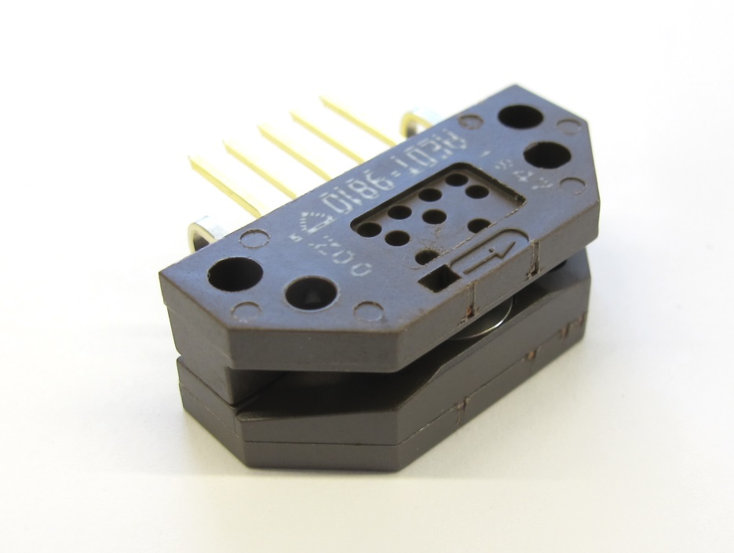
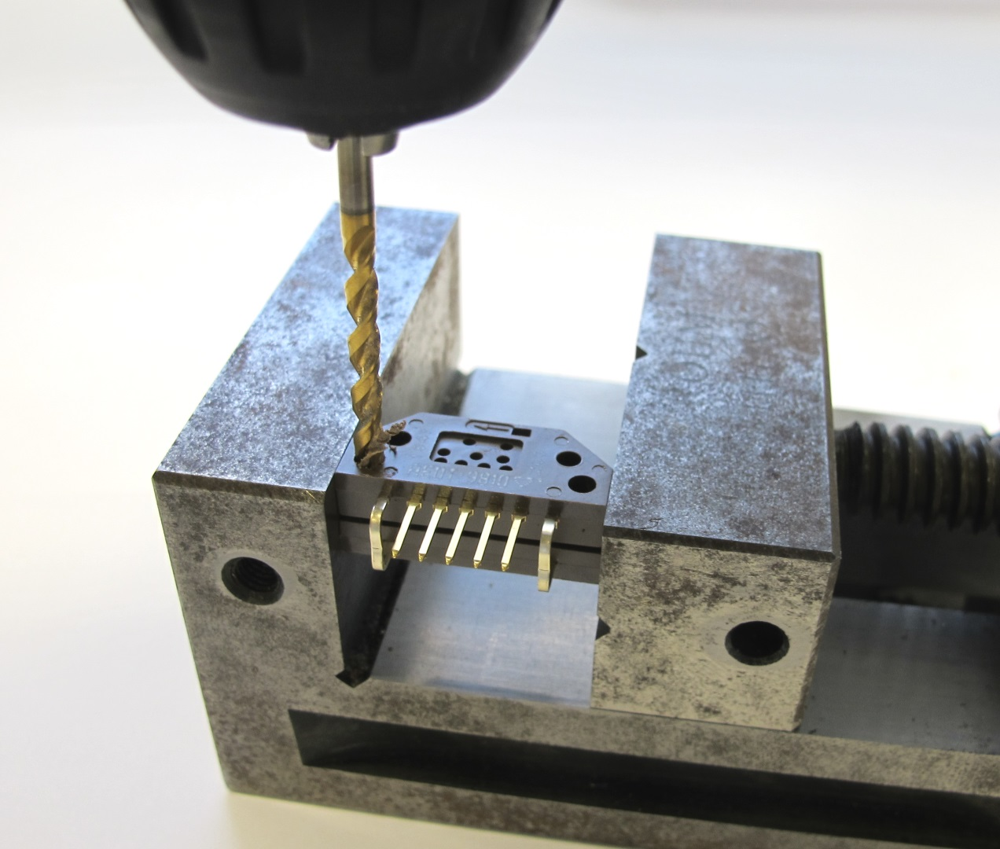
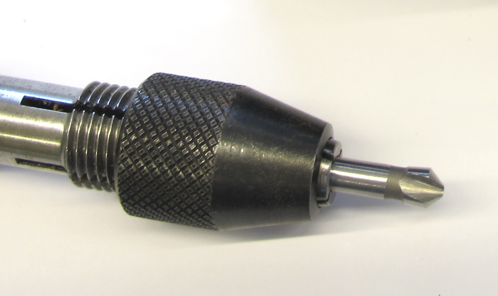
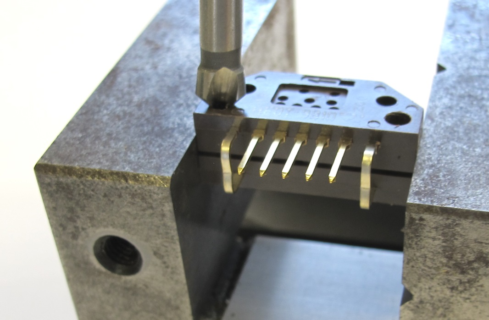
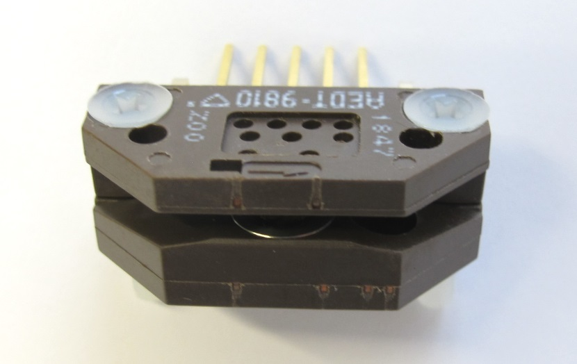
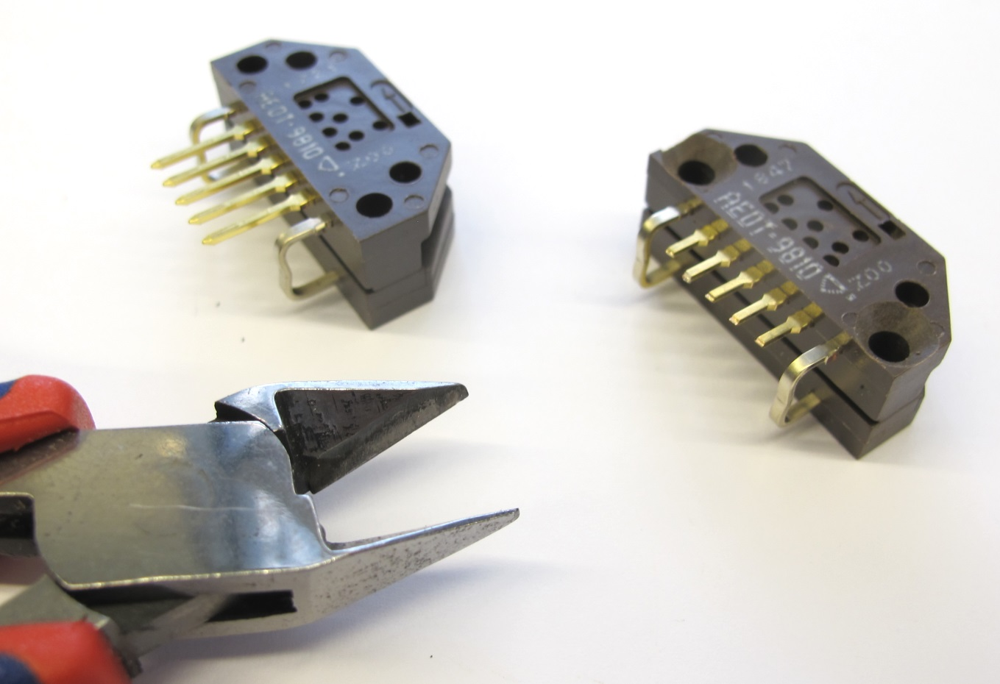
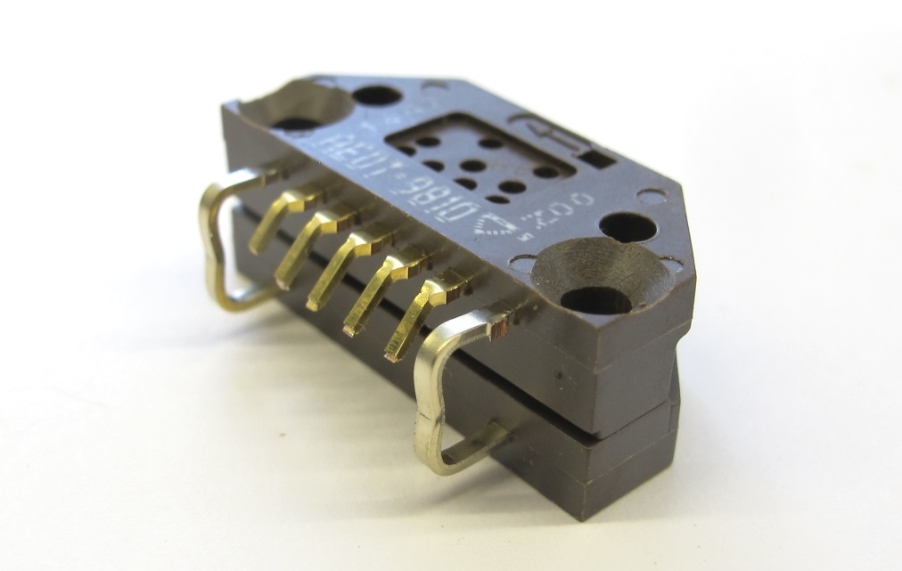

Details Encoder Preparation
=======================

Description
------------
  *Broadcom AEDT 9810 Encoder*

  *Use a 3mm drill bit to increase the diameter of the mounting holes.*  

  *45 degree chamfer tool*

  *Chamfer the mounting holes.*  

  *The M3 flat head screws should be flush with the surface of the encoder.*  

  *Shorten the pins*  

  *Use flat pliers to bend the pins 45 degrees downwards.*  

  *Solder and heat shrink the encoder wires.*  

Wiring Diagram - Encoder to Micro Driver Electronics
----------------
  *Encoder Wiring for the Micro Driver Electronics*

Wiring Diagram - Encoder to TI Launchpad
----------------
  *Encoder Wiring for the TI Launchpad*

Authors
--------
Felix Grimminger

License
-------
BSD 3-Clause License

Copyright
-----------
Copyright (c) 2019, Max Planck Gesellschaft, New York University

More Information
----------------
[Open Dynamic Robot Initiative](https://open-dynamic-robot-initiative.github.io)  
[Hardware Overview](../../README.md)  
[Software Overview](https://github.com/open-dynamic-robot-initiative/open-dynamic-robot-initiative.github.io/wiki/Open-Dynamic-Robot-Initiative-Documentation)  
[Back to Actuator Module](../README.md)  
[Back to Details Encoder](details_encoder.md)
