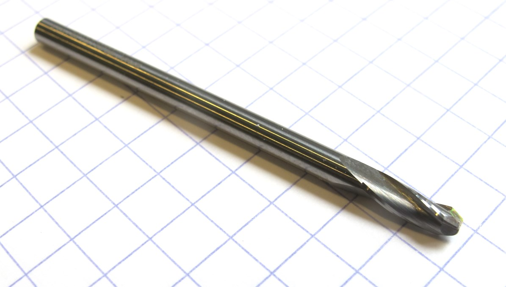
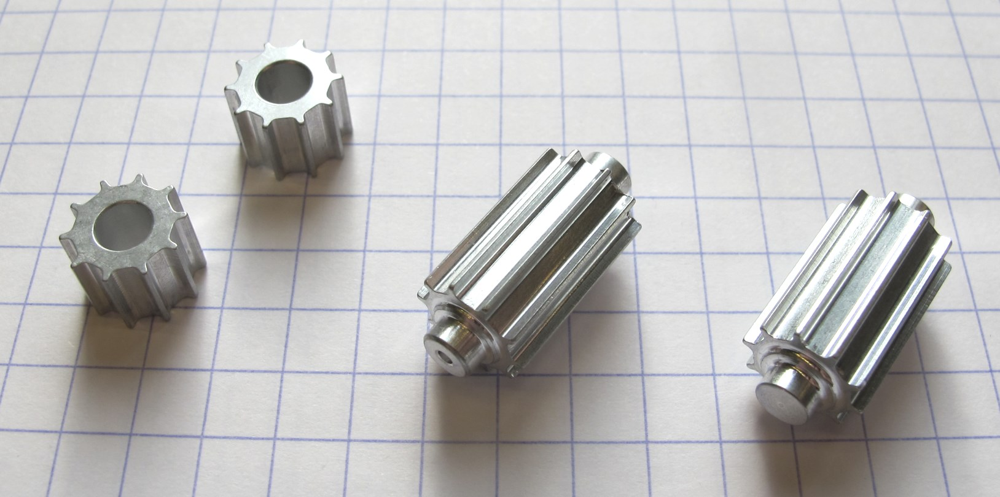
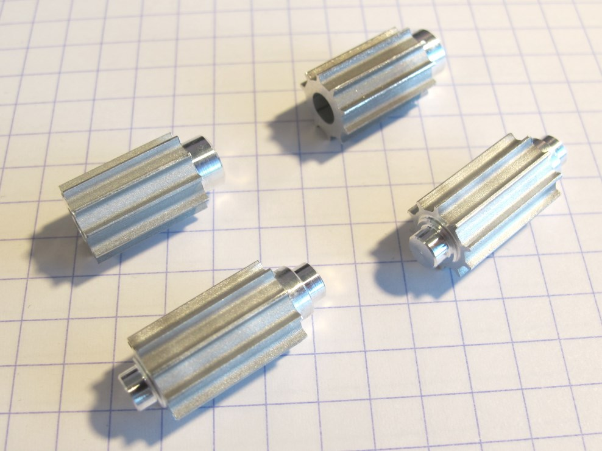
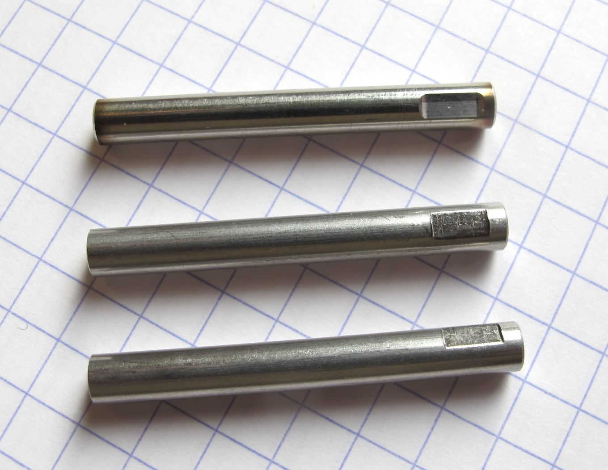

Details Machined Parts
=======================

Timing Belt Pulleys
-----------
### Description:

For best performance the tooth profile of the pulleys has to be very precise.  
You can order a custom form cutter with the right cutting profile geometry and machine the parts on a milling machine.  
(Option A below)  
Alternatively you can use Wire EDM (Wire Electrical Discharge) machining to generate the 2d tooth profile.  
(Option B below)  
The remaining machining steps can be done on a lathe.   

**Caution: Don't use standard AT3 timing belt pulley dimensions or tools.  
We modified the original AT3 tooth profile in order to reduce backlash.**

### Option A - Form Cutter

  *Custom Form Cutter with AT3 tooth profile*

  *Aluminum AT3 pulleys machined with Custom Form Cutter*

#### Instructions
* Find a company that offers custom tooling and that can produce custom form cutters.  
* Send them this [PDF Drawing](../drawings/pulley_at3_t10_form_cutter.PDF) and ask them to quote a custom form cutter that will create the specified profile.
* You should mention that the tool will be used to machine 7075 aluminum.
* We use a 3mm shaft form cutter with 3 teeth at a helix angle of 20 degrees.
* When you have received your custom form cutter send the tool and the drawings below to a machine shop of your choice and have the parts machined.  

* [Drawing Motor Pulley](../drawings/motor_pulley_at3_t10.PDF)  
* [Drawing Center Pulley](../drawings/center_pulley_at3_t10.PDF)
___
### Option B - Wire EDM Cutting

  

#### Instructions
...will follow...

* [PDF Drawing Wire EDM Geometry](../drawings/pulley_at3_t10_wire_edm.PDF)  
* [DXF File Wire EDM Geometry](../drawings/pulley_at3_t10_wire_edm.DXF)

____

Motor Shafts
-----------

  

[PDF Drawing Motor Shaft](../drawings/motor_shaft.PDF)

Authors
--------
Felix Grimminger

License
-------
BSD 3-Clause License

Copyright
-----------
Copyright (c) 2019, Max Planck Gesellschaft, New York University

More Information
----------------
[Open Dynamic Robot Initiative](https://open-dynamic-robot-initiative.github.io)  
[Hardware Overview](../../README.md)  
[Software Overview](https://github.com/open-dynamic-robot-initiative/open-dynamic-robot-initiative.github.io/wiki/Open-Dynamic-Robot-Initiative-Documentation)  
[Back to Actuator Module](../README.md)
