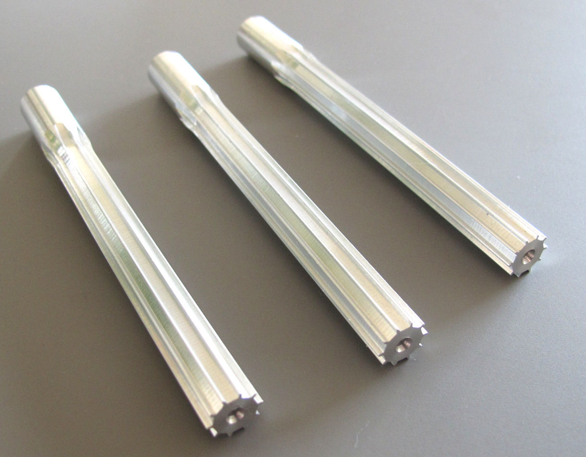
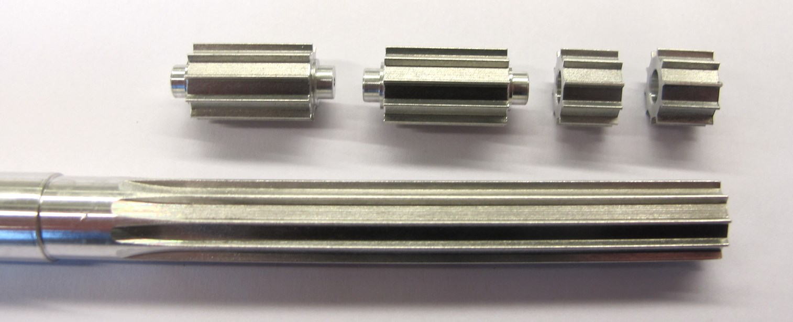

Details Machined Parts
=======================

Timing Belt Pulleys
-----------

* Stock Material
* Form Cutter
* Wire EDM

### Option A - Stock Material

    

    

The shells should be printed on a selective laser sintering printer using high strength material.  
The shells we are using were purchased from the ["3D Systems Part on Demand Service".](https://www.3dsystems.com/on-demand-manufacturing)

### Option B - Form Cutter

    

    

### Instructions:
* go to the website and login (or create a user account if you don't have one yet)
* upload the stl files (actuator_shell_base and actuator_shell_cover)
* choose the printing technology: SLS - Selective Laser Sintering
* choose the material: Duraform HST
* choose number of copies
* save the order and write down the order number (don't order online)
* send an email to the 3D Systems engineering support with the order number and ask for a quote for printing the parts in the orientation defined in this [pdf file](20190910_actuator_module_3d_printing_orientation.pdf).
* You can find the email contact for Germany, France and the US below.

### Option C - Wire EDM Cutting

  
____

Motor Shafts
-----------

  

Authors
--------
Felix Grimminger

License
-------
BSD 3-Clause License

Copyright
-----------
Copyright (c) 2019, Max Planck Gesellschaft, New York University

More Information
----------------
[Open Dynamic Robot Initiative](https://open-dynamic-robot-initiative.github.io)  
[Hardware Overview](../../README.md)  
[Software Overview](https://github.com/open-dynamic-robot-initiative/open-dynamic-robot-initiative.github.io/wiki/Open-Dynamic-Robot-Initiative-Documentation)  
[Back to Actuator Module](../README.md)
