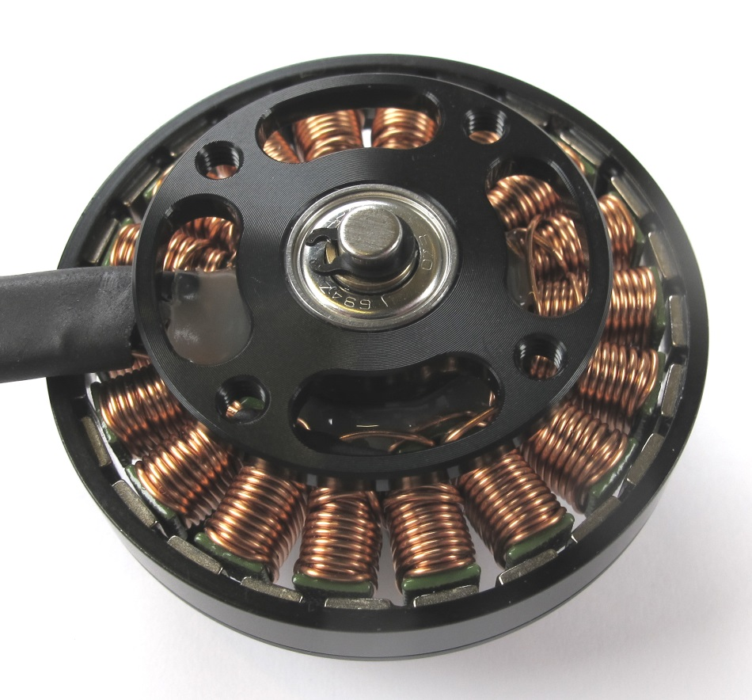
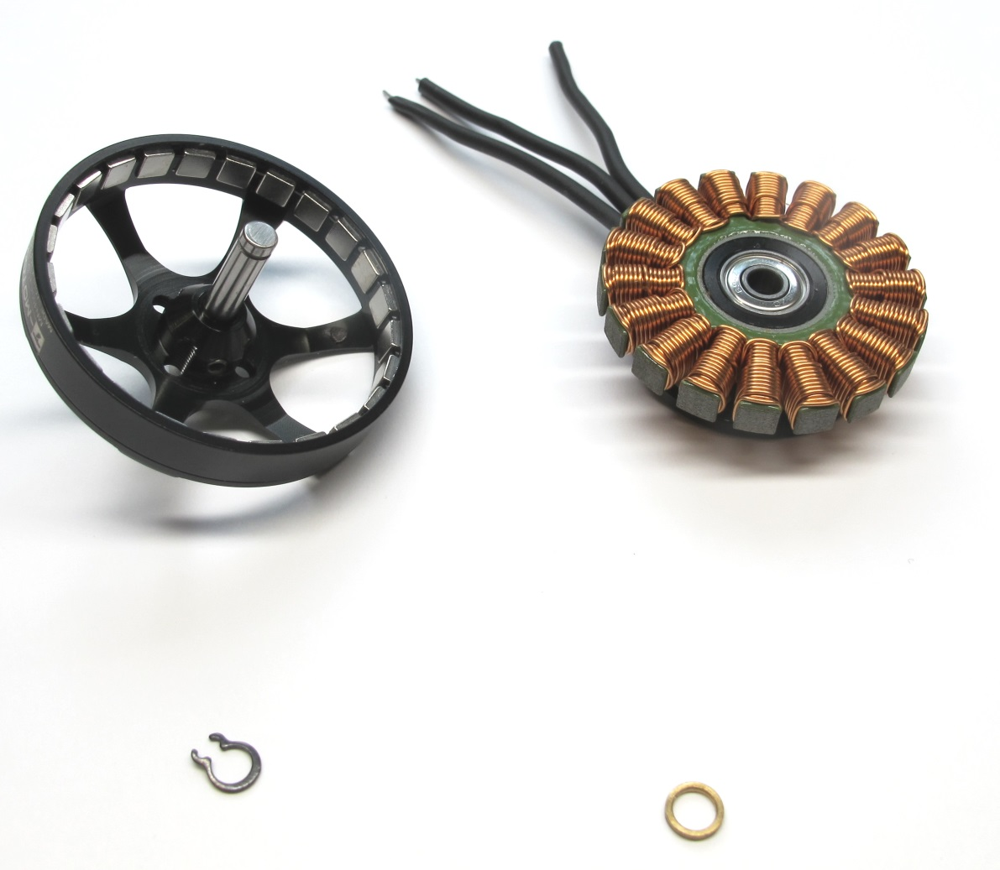
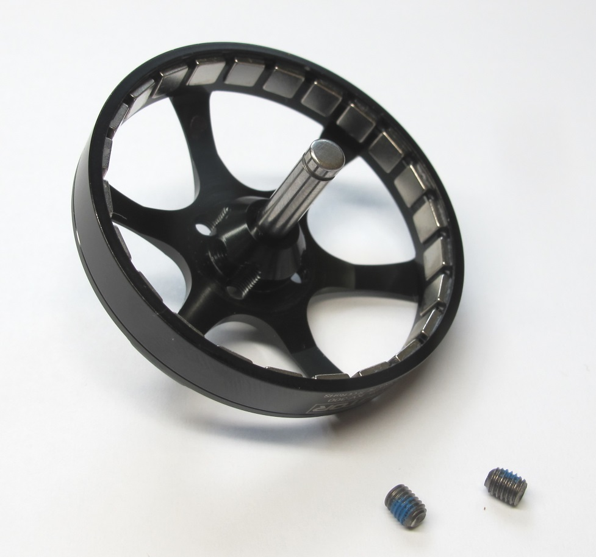
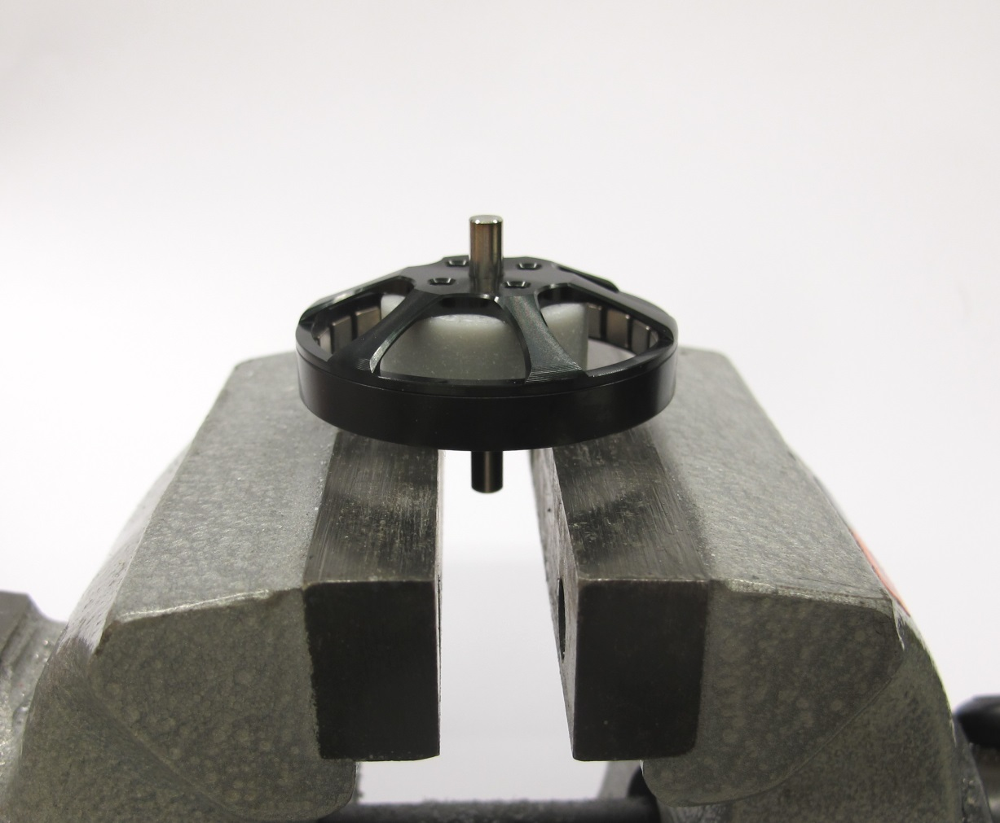
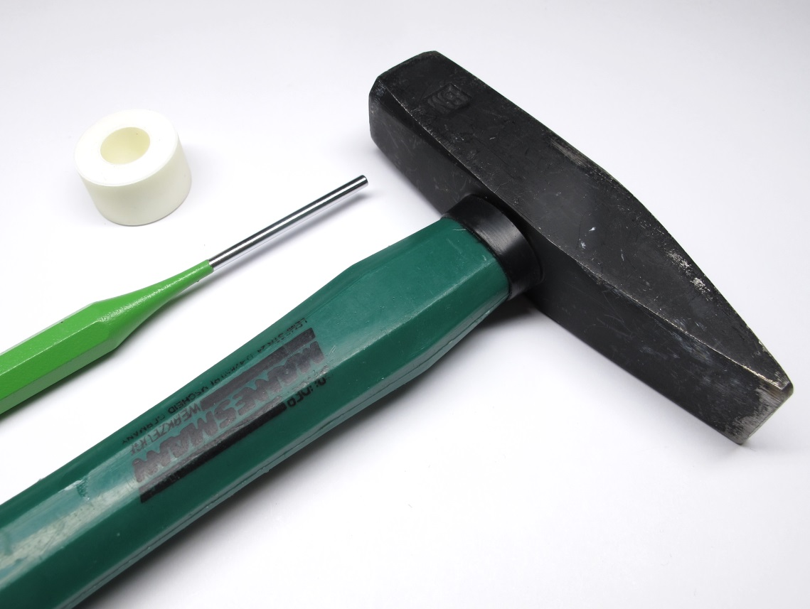
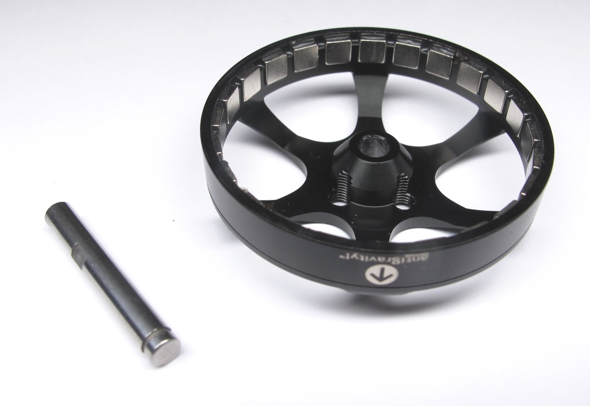
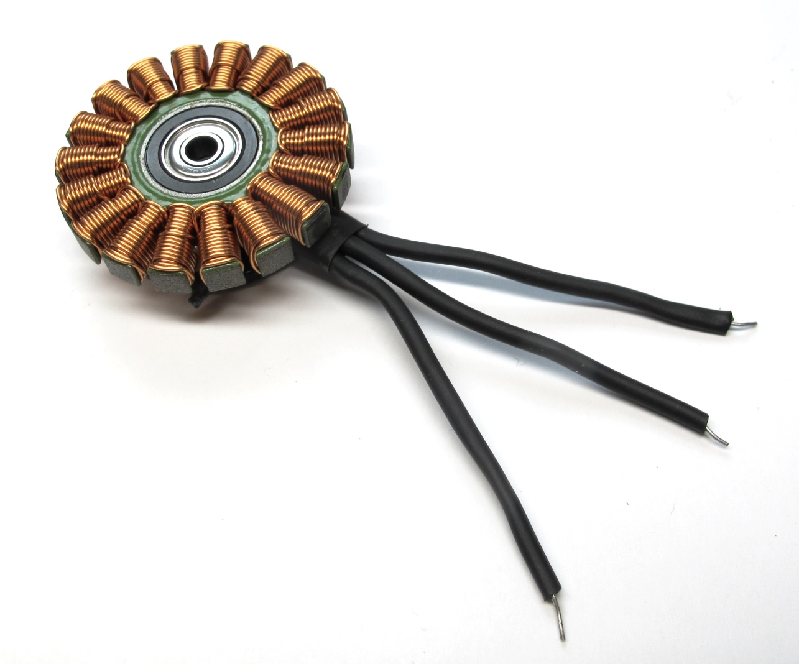
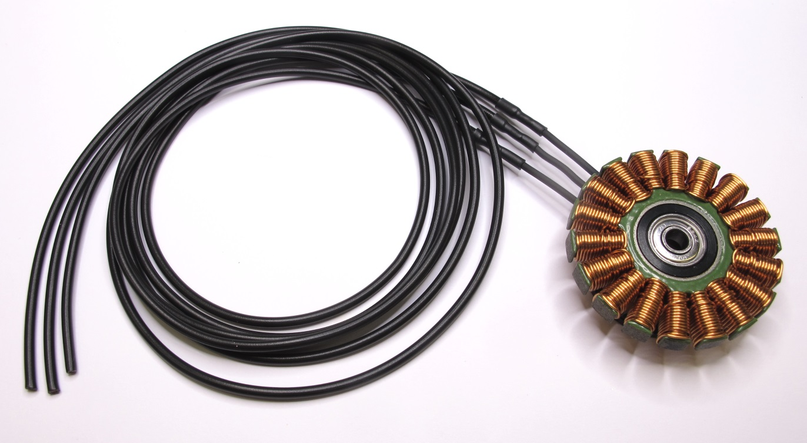

Details Motor Preparation
=======================

Description
------------
  *Antigravity 4004 300kV from T-Motor*

  *Remove the retaining ring on the motor shaft. 
Don't worry about damaging the retaining ring - it's no longer needed*  

  *Separate the rotor from the stator. Make sure to keep the brass washer.  Store the rotor on a clean surface. Metal particles will stick to the magnets and can cause problems later.*

  *Remove the two M3 set screws on the rotor.*  

  *Place the rotor on the 3d printed "shaft extraction tool".*  

  *Use a hammer and a pin driver to remove the motor shaft.*  
  *Store the rotor on a clean surface.  Metal particles will stick to the magnets and can cause problems later.*  

  *T-Motor has changed the insulation on the phase wires. 
Now the insulation is too thick to pass through the structure.*  

  *Carefully remove the heat shrink from the phase wires.*  

  *Solder extension wires to the phase wires. 
We use LiY wire with a cross section of 0,5mm2.  Insulate the phase wires with thin heat shrink.*  

Next
* Solder gold connectors
* Determine the motor phases
* Label the motor phases

Authors
--------
Felix Grimminger

License
-------
BSD 3-Clause License

Copyright
-----------
Copyright (c) 2019, Max Planck Gesellschaft, New York University

More Information
----------------
[Open Dynamic Robot Initiative](https://open-dynamic-robot-initiative.github.io)  
[Hardware Overview](../../README.md)  
[Software Overview](https://github.com/open-dynamic-robot-initiative/open-dynamic-robot-initiative.github.io/wiki/Open-Dynamic-Robot-Initiative-Documentation)  
[Back to Actuator Module](../README.md)  
