# Details Motor Preparation

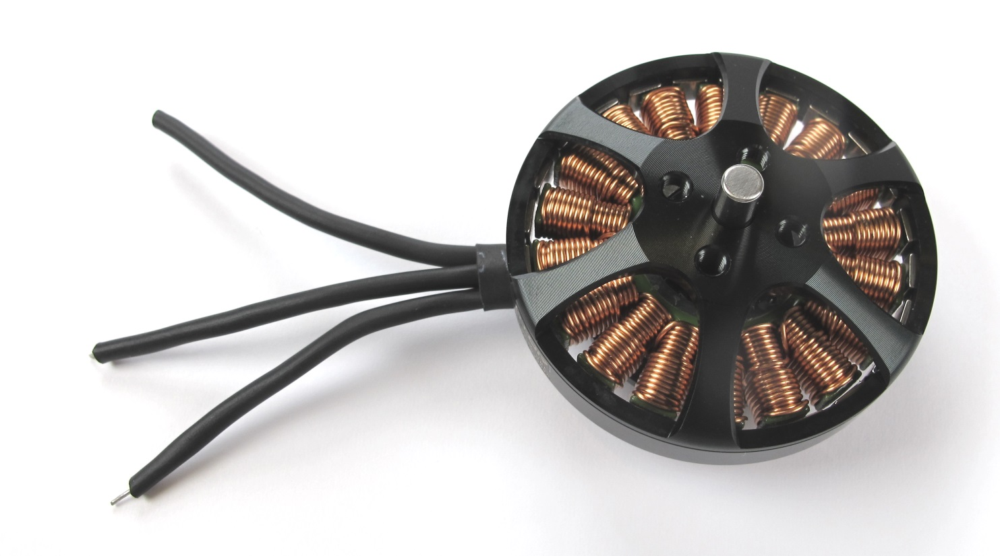  *Antigravity 4004 300kV from T-Motor*

  *Stator and rotor separated and prepared for installation*

## Separating Rotor and Stator
  *Bottom view: the retaining ring holds the motor shaft in place*  

  *Remove the retaining ring from the motor shaft. 
Don't worry about damaging the retaining ring - it's no longer needed*  

  *Separate the rotor from the stator by pulling gently to overcome the magnetic forces..  Make sure to keep the brass washer. Store the rotor on a clean surface.  Metal particles will stick to the magnets and can cause problems later.*

## Rotor Preparation
  *Remove the two M3 set screws on the rotor using a 1,5mm hex driver. Keep the set screws for reassembly.*  

  *Place the rotor on the 3d printed "motor shaft extraction tool". [STL file Motor Shaft Extraction Tool](../stl_files/tool_motor_shaft_extraction.STL)*  

  *Use a hammer and a pin driver to remove the motor shaft.*  
  *Rotor with motor shaft removed.*  

  *You will now need different reamer sizes to increase the bore diameter of the rotor. We use 3 different reamers with 3.98mm, 3.99mm and 4.00mm diameter.*

  *Use a tool holder to manually increase the bore diameter.*  

  *Start with the smallest reamer - 3.98mm. Put some oil on the reamer.  Carefully insert and turn the reamer a couple of times.*

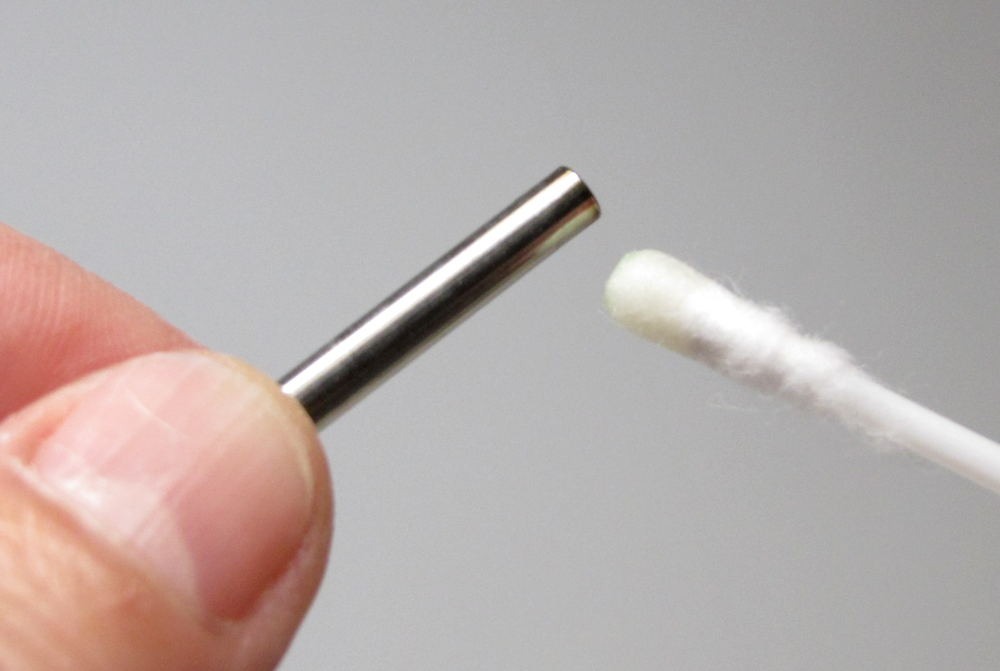  *Put a bit of oil on the custom motor shaft.[ -> PDF drawing](../drawings/motor_shaft.PDF)*

  *Try to insert the custom motor shaft.   If the reamed hole is too tight repeat the last two steps with the same reamer size.  If the bore is still too tight use the next larger reamer size.   Continue until the shaft can be installed and removed with moderate force.*

**Important:** Be careful not to increase the bore diameter too much.  
If the fit is too loose the rotor will wobble when spinning.

  *The rotor is now ready for assembly.*

# Stator Preparation
  *T-Motor has changed the insulation on the phase wires. 
Now the insulation is too thick to pass through the structure and has to be removed.*  

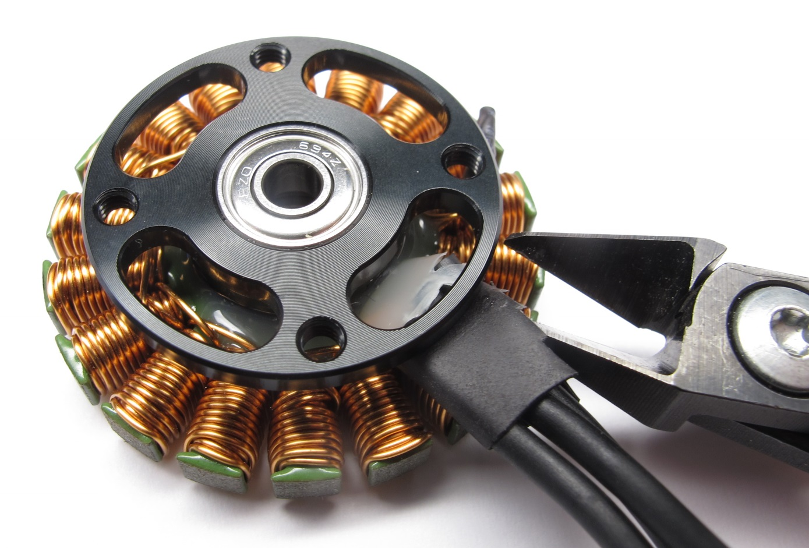  *Carefully cut and remove the large heat shrink at the base.*  

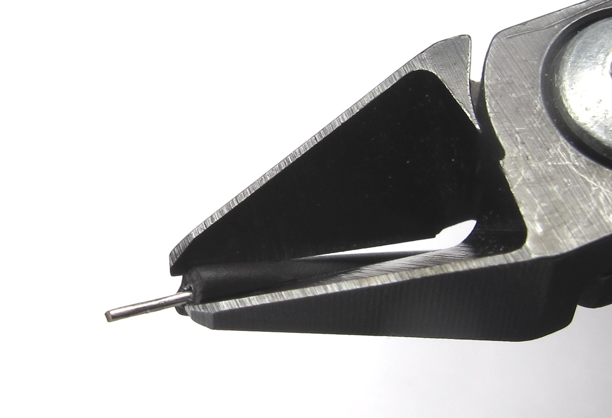  *Cut off a piece of the phase wire heat shrink under an angle.*

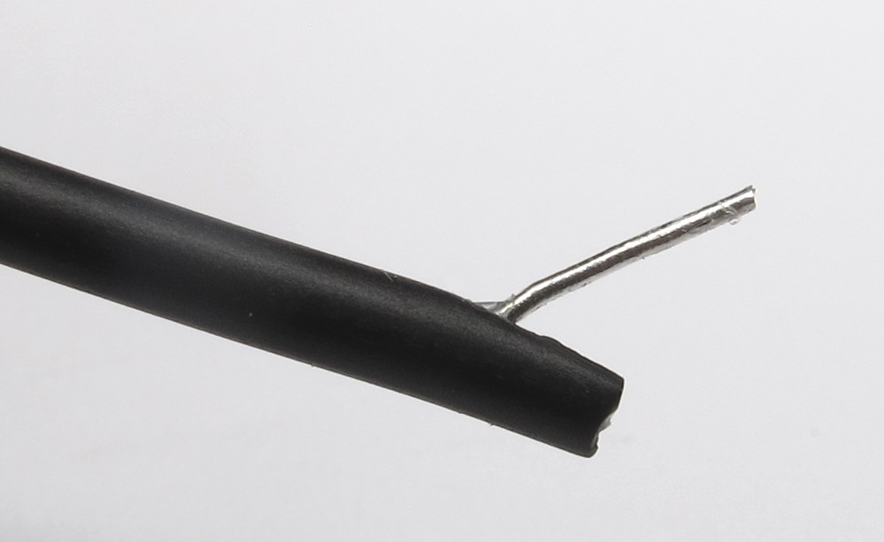  *Hold the phase wire with pliers and grab the heat shrink with your fingers.*

  *Slowly pull on the wire while holding the heat shrink. The wire will cut through the heat shrink.  Continue until the insulation is removed half way.*

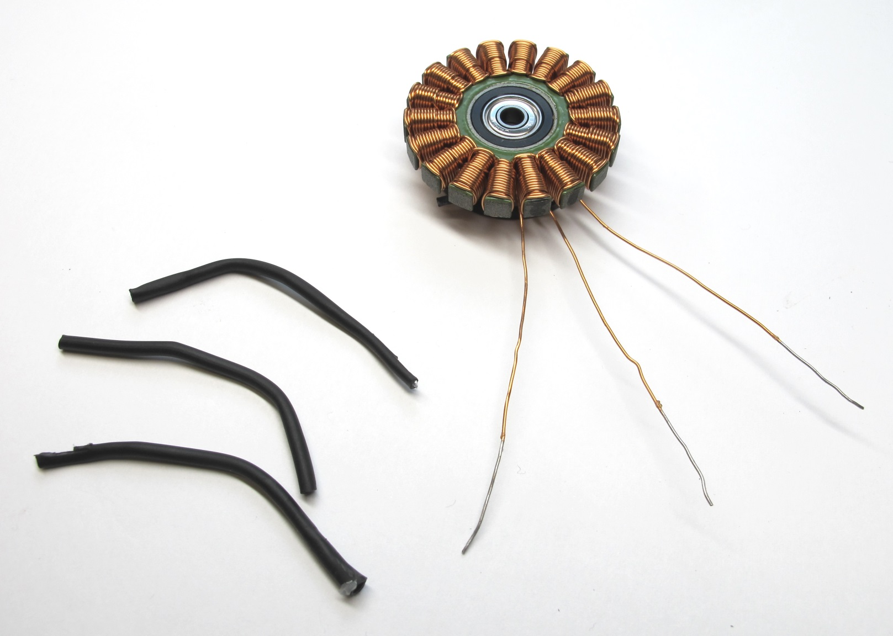  *You should now be able to carefully pull off the heat shrink from the phase wires.*  

  *We shorten the motor phase wires to about 2,5cm measured from the base of the stator. This helps to keep the solder connection inside of the shell structure.*  

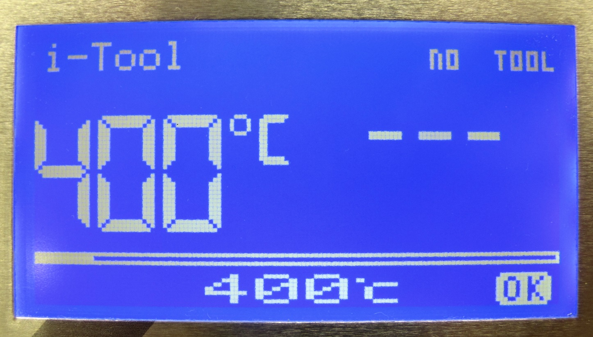  *We use a temperature controlled soldering iron to burn off the orange insulation. Set your soldering iron to a temperature of abour 400 degrees celcius.*  

  *Put solder on the tip and heat up the ends of the phase wires. Wait until the insulation disappears and you can see 5mm of silver wire exposed.*  

  *The insulation is removed from the ends of the phase wires. You can now solder the extension wires.*

  *Reduce the soldering temperature to about 300 degrees celcius. Solder extension wires to the phase wires. We use LiY wire with a cross section of 0,5mm 2.*

  *Prepare the heat shrink for insulating the wires. Try to keep the heat shrink short.*

  *Use a heat gun to apply the heat shrink.*

  *If you are unsure about the correct wire length you can stop here. Follow all the other preparation steps and fully assemble the actuator module. You can then determine the correct wire length and solder the connectors later.*  

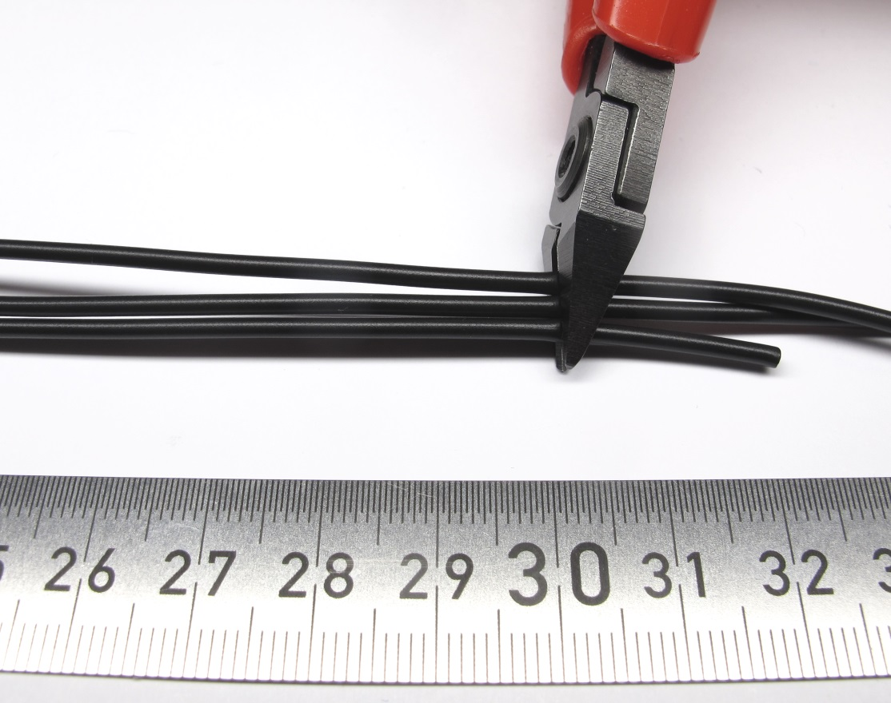  *If you know the required wire length cut the wires accordingly. Remove a bit of the insulation, twist the strands and apply solder.*

  *Prepare the male motor phase connectors.  We are using the 2mm gold connectors from REELY*

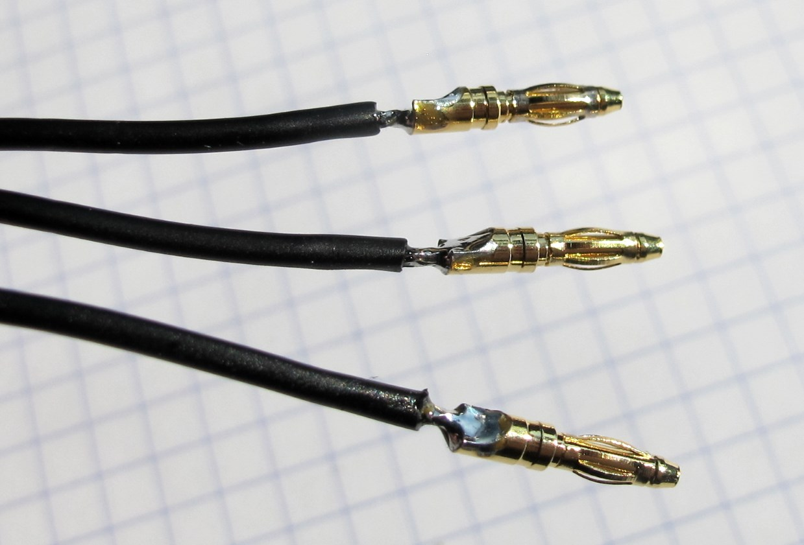  *Solder the connectors onto the phase wires.*

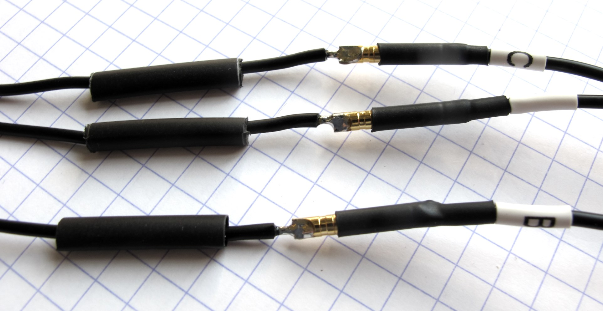  *Use heat shring to insulate the wires.  It makes it easier to align the heat shrink if you install the mating connector.*

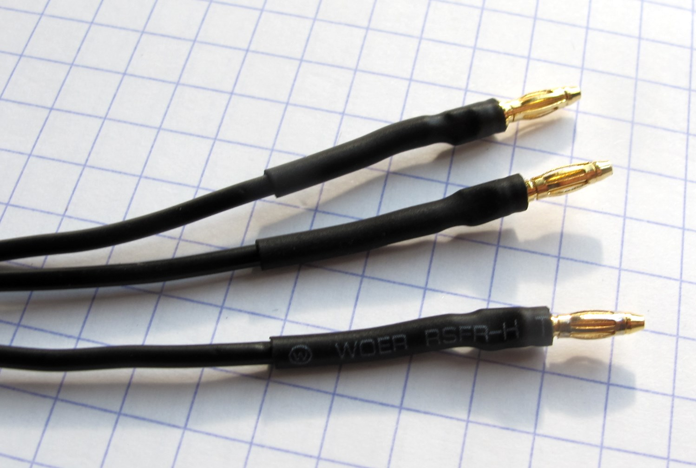  *Finished motor phase connnectors.*

  *The stator is now ready for assembly.*

## Authors
Felix Grimminger

## License
BSD 3-Clause License

## Copyright
Copyright (c) 2019-2020, Max Planck Gesellschaft and New York University

## More Information
[Open Dynamic Robot Initiative - Webpage](https://open-dynamic-robot-initiative.github.io)  
[Open Dynamic Robot Initiative - YouTube Channel](https://www.youtube.com/channel/UCx32JW2oIrax47Gjq8zNI-w)   
[Open Dynamic Robot Initiative - Forum](https://odri.discourse.group/categories)  
[Open Dynamic Robot Initiative - Paper](https://arxiv.org/pdf/1910.00093.pdf)  
[Hardware Overview](../../README.md#open-robot-actuator-hardware)  
[Software Overview](https://github.com/open-dynamic-robot-initiative/open-dynamic-robot-initiative.github.io/wiki)  
[Back to Actuator Module](../README.md)  
