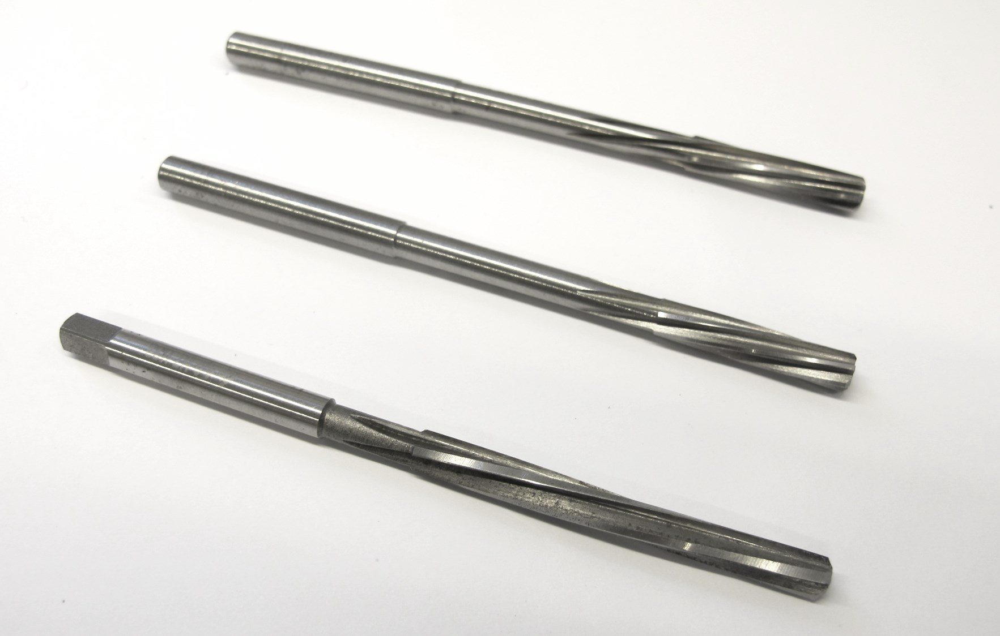
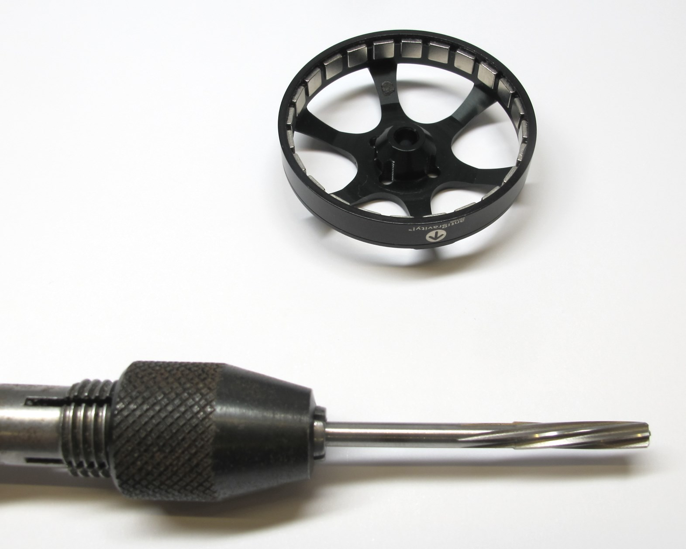
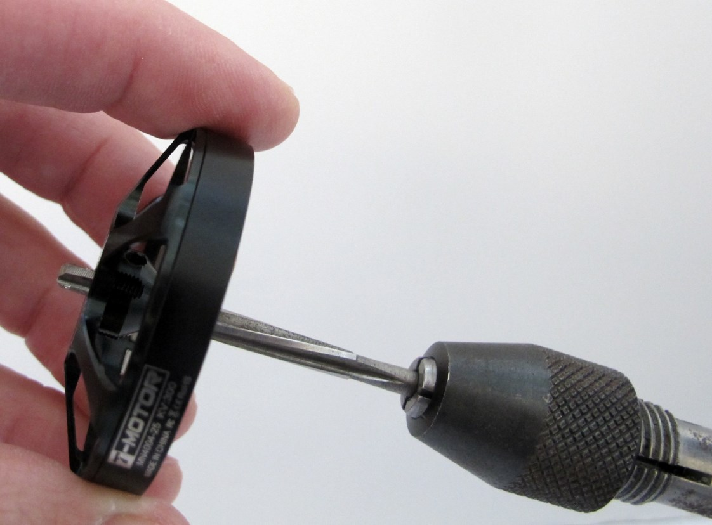
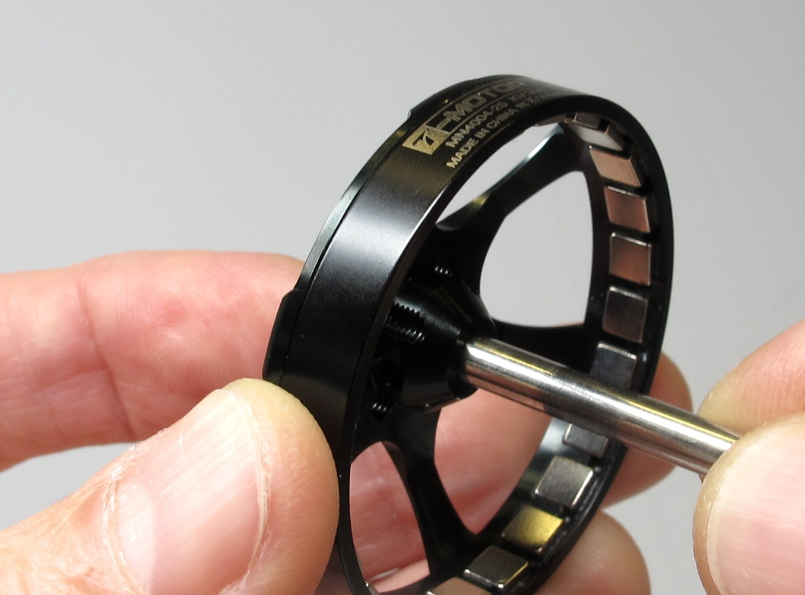
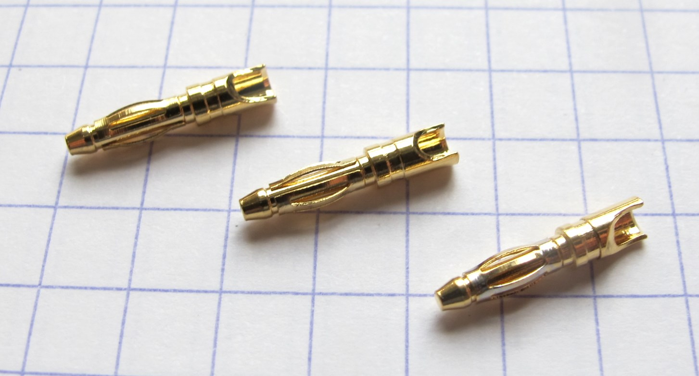
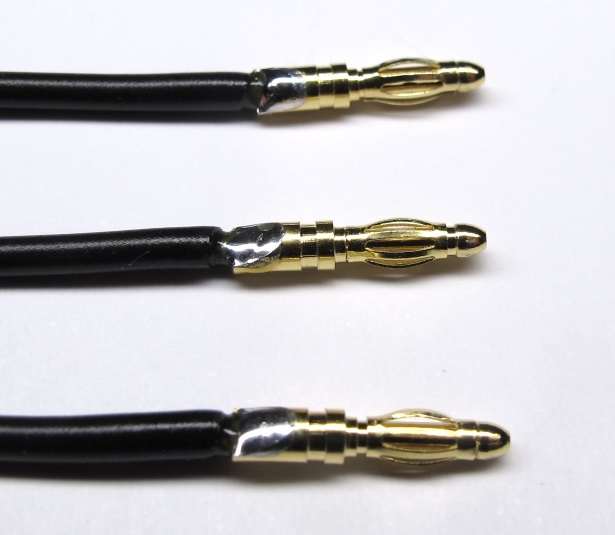
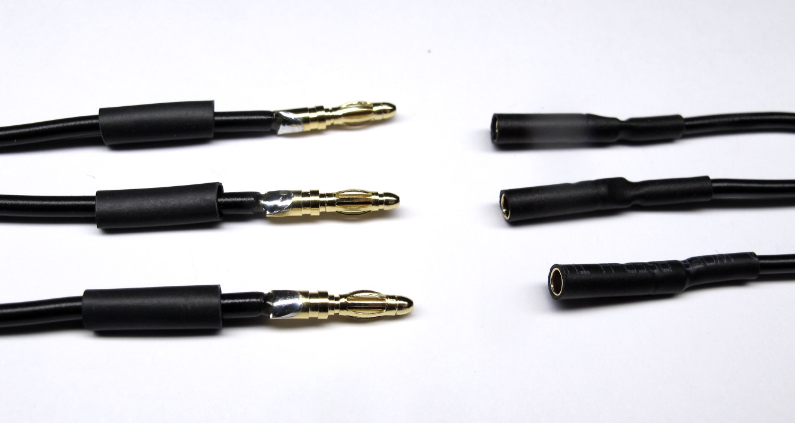
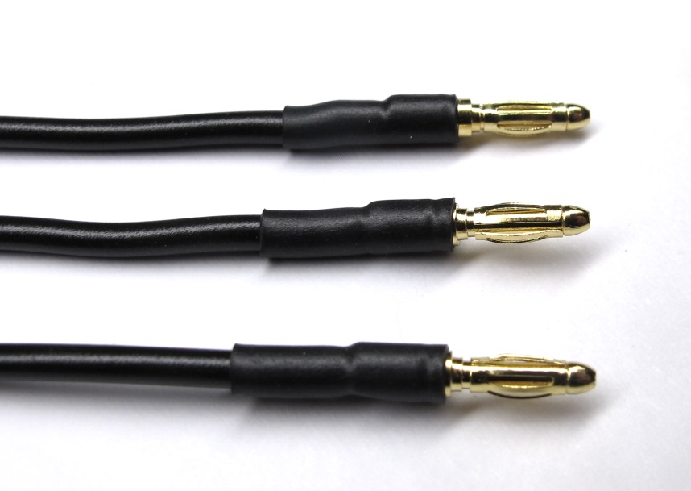

Details Motor Preparation
=======================

Description
------------
  *Antigravity 4004 300kV from T-Motor*

Separating Rotor and Stator
------------------
  *Remove the retaining ring on the motor shaft. 
Don't worry about damaging the retaining ring - it's no longer needed*  

  *Separate the rotor from the stator. Make sure to keep the brass washer.  Store the rotor on a clean surface. Metal particles will stick to the magnets and can cause problems later.*

Rotor Preparation
-------------------

  *Remove the two M3 set screws on the rotor.  Keep the set screws for reassembly.*  

  *Place the rotor on the 3d printed "shaft extraction tool".*  

  *Use a hammer and a pin driver to remove the motor shaft.*  
  *Rotor with motor shaft removed.*  

  *In the next step you will need different size reamers to increase the bore diameter of the rotor. We use 3 different reamers with 3.98mm, 3.99mm and 4.00mm diameter.*

  *Use a tool holder to manually increase the bore diameter.*  

  *Start with the smallest reamer.  Carefully insert and turn the reamer a couple of times.*

  *Put a bit oil on the motor shaft.*

  *Try to insert the motor shaft.   If the reamed hole is too tight repeat the last two steps with the same reamer size.  If the bore is still too tight use the next reamer size.   Continue until the shaft can be installed and removed with moderate force.*

**Important:** Be careful not to increase the bore diameter too much.  
If the fit is too loose the rotor will wobble when spinning.

Stator Preparation
--------------------

  *T-Motor has changed the insulation on the phase wires. 
Now the insulation is too thick to pass through the structure.*  

  *Carefully remove the heat shrink from the phase wires.*  

  *Solder extension wires to the phase wires. 
We use LiY wire with a cross section of 0,5mm2.  Insulate the phase wires with thin heat shrink.*  

  *Prepare the male motor phase connectors.  We are using the 2mm gold connectors from REELY*

  *Solder the connectors onto the phase wires.*

  *Use heat shring to insulate the wires.  It makes it easier to align the heat shrink if you install the mating connector.*

  *Finished motor phase connnectors.*

Authors
--------
Felix Grimminger

License
-------
BSD 3-Clause License

Copyright
-----------
Copyright (c) 2019, Max Planck Gesellschaft, New York University

More Information
----------------
[Open Dynamic Robot Initiative](https://open-dynamic-robot-initiative.github.io)  
[Hardware Overview](../../README.md)  
[Software Overview](https://github.com/open-dynamic-robot-initiative/open-dynamic-robot-initiative.github.io/wiki/Open-Dynamic-Robot-Initiative-Documentation)  
[Back to Actuator Module](../README.md)  
