Details Output Pulley Preparation
=======================

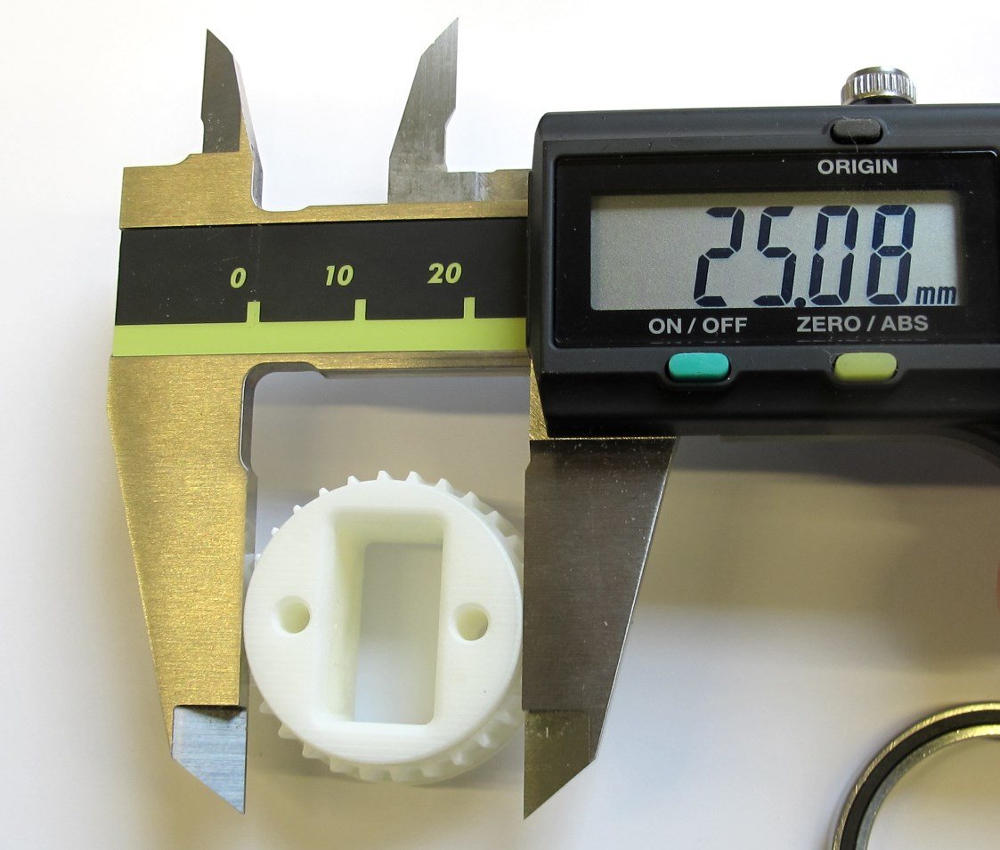  *Output pulley - oversized diameter.*

Description
-----------

The dimensions of 3d printed parts can vary quite a bit depending on the machine, printing technology and material.  
That's why we print the diameter that has to fit the bearings a bit oversize and machine the part to the right diameter on a lathe.

Instructions
-------------

  *A 25mm collet helps with clamping the output pulley.*  

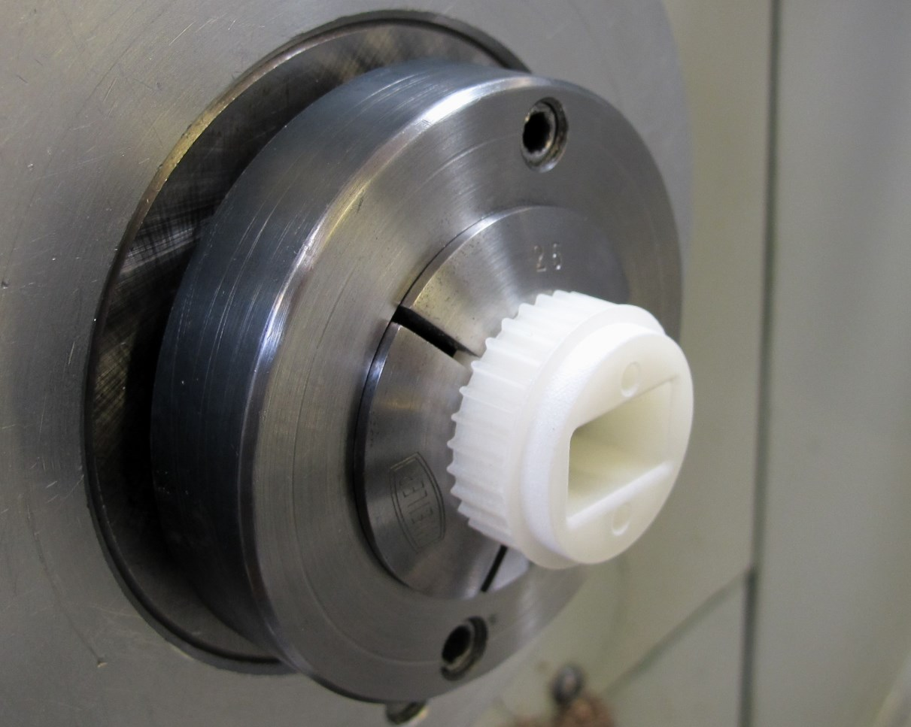  *Place the pulley on the lathe and clamp gently on on of the flanges.*  

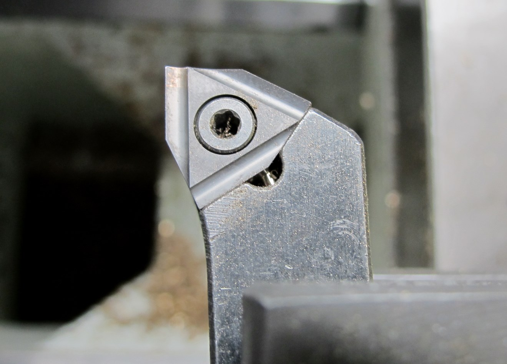  *Use a cutting tool with a sharp edge - no radius.*

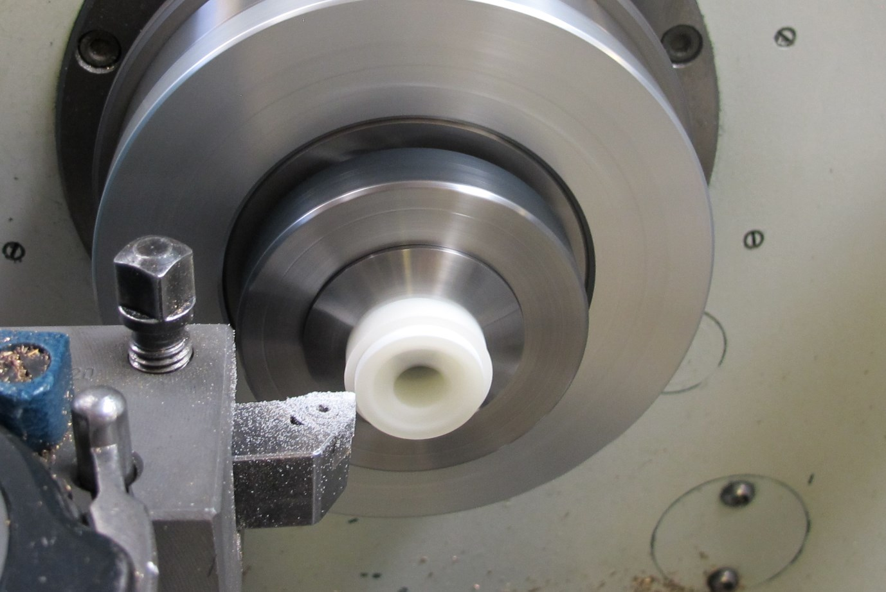  *Reduce the flange diameter in small steps and check the fit with the output bearing.*  

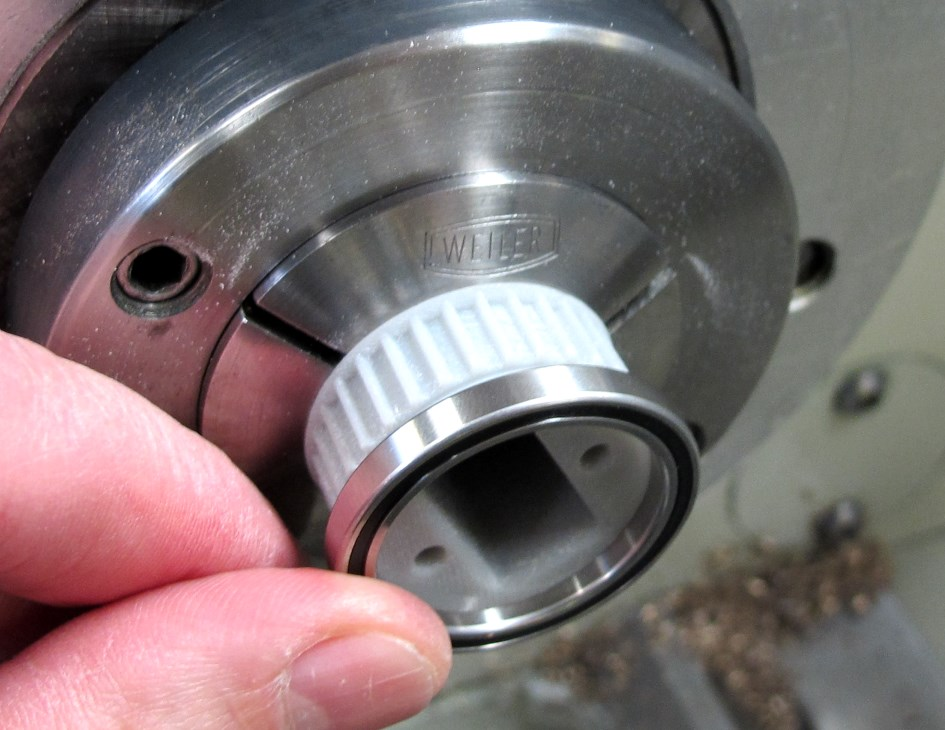  *There should be a light press-fit between the bearing and the pulley.  You should be able to install and remove the bearing by hand with moderate force.  When the diameter is correct - turn the pulley around and repeat the same steps for the opposite side.*  

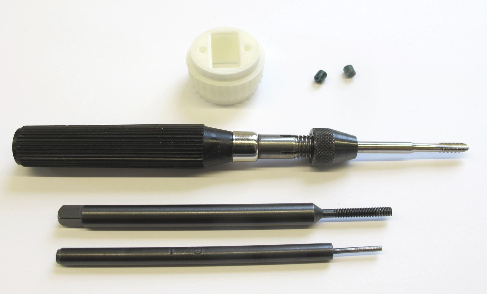  *Output Pulley and Helicoil Tools*  

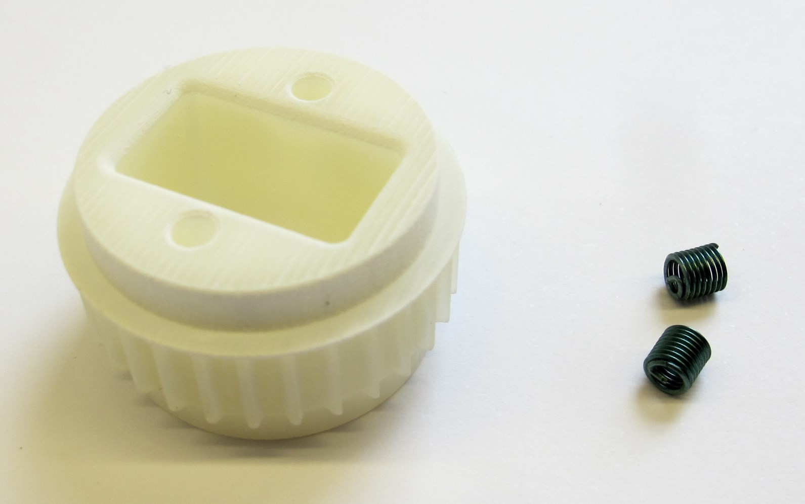  *Output Pulley AT3 T30 and M3 Helicoil inserts*  

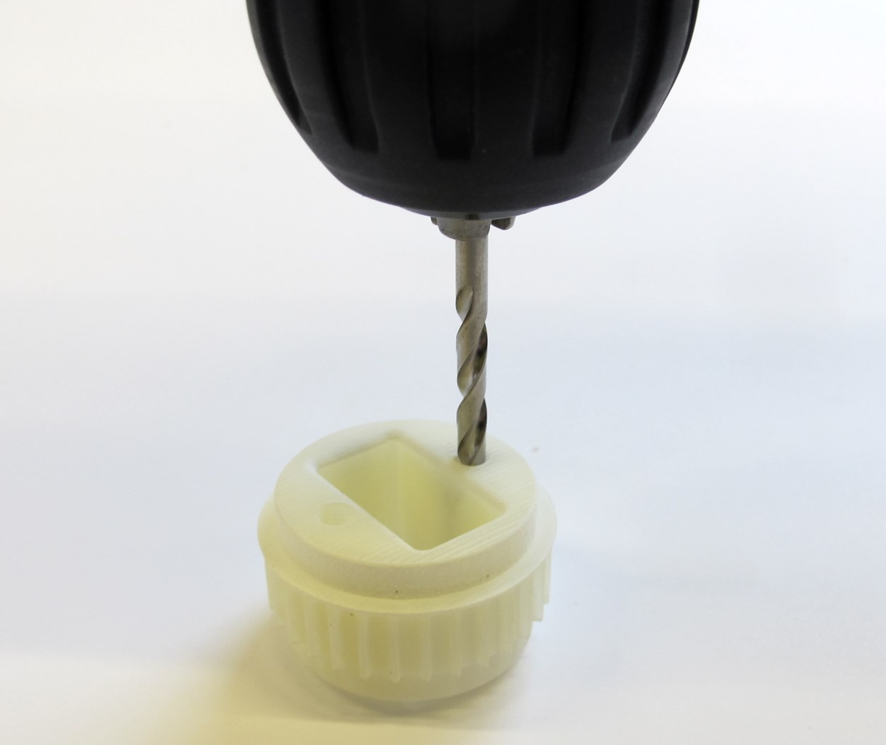  *Text.*

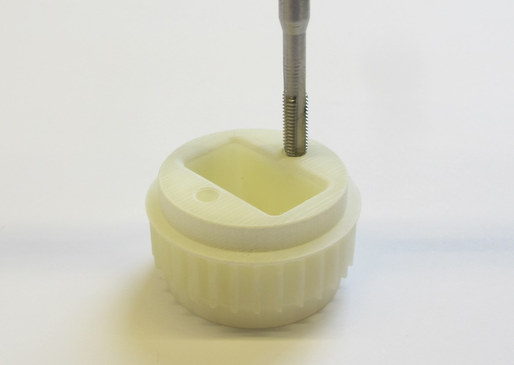  *Text.*

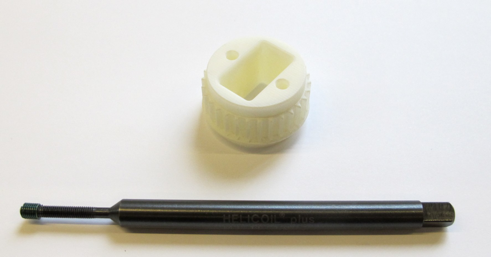  *Text.*

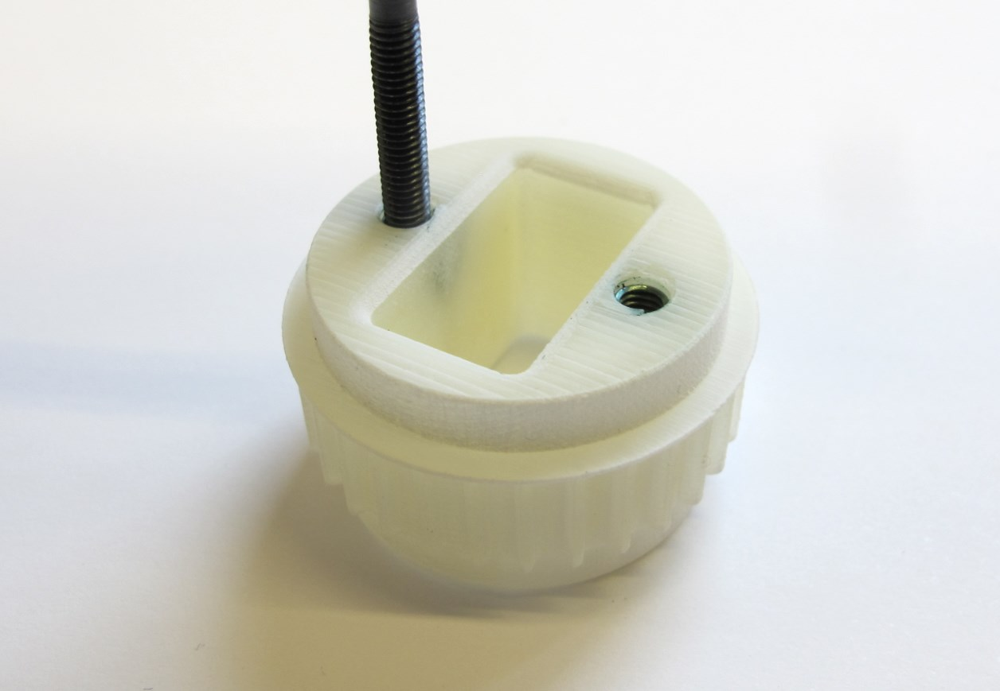  *Text.*

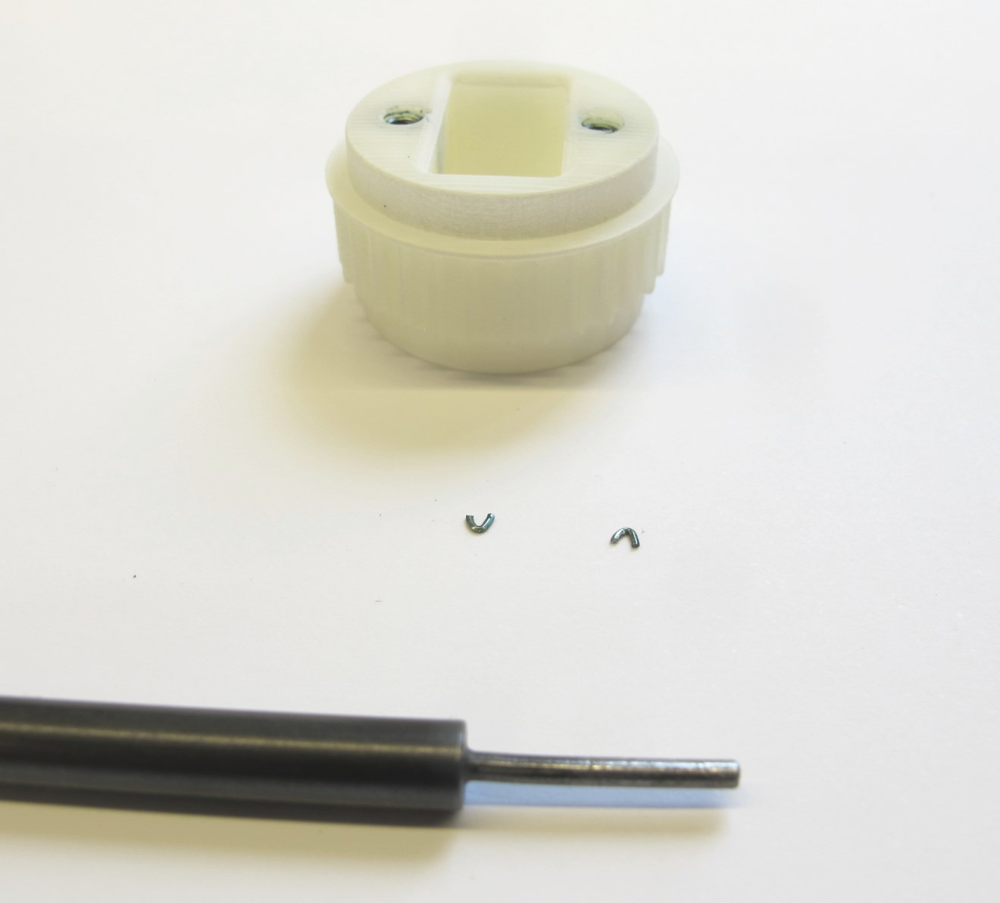  *Text.*

  *The output pulley is now ready for installation.*

Authors
--------
Felix Grimminger

License
-------
BSD 3-Clause License

Copyright
-----------
Copyright (c) 2019, Max Planck Gesellschaft, New York University

More Information
----------------
[Open Dynamic Robot Initiative](https://open-dynamic-robot-initiative.github.io)  
[Hardware Overview](../../README.md)  
[Software Overview](https://github.com/open-dynamic-robot-initiative/open-dynamic-robot-initiative.github.io/wiki/Open-Dynamic-Robot-Initiative-Documentation)  
[Back to Actuator Module](../README.md)  
