# Details Output Pulley Preparation

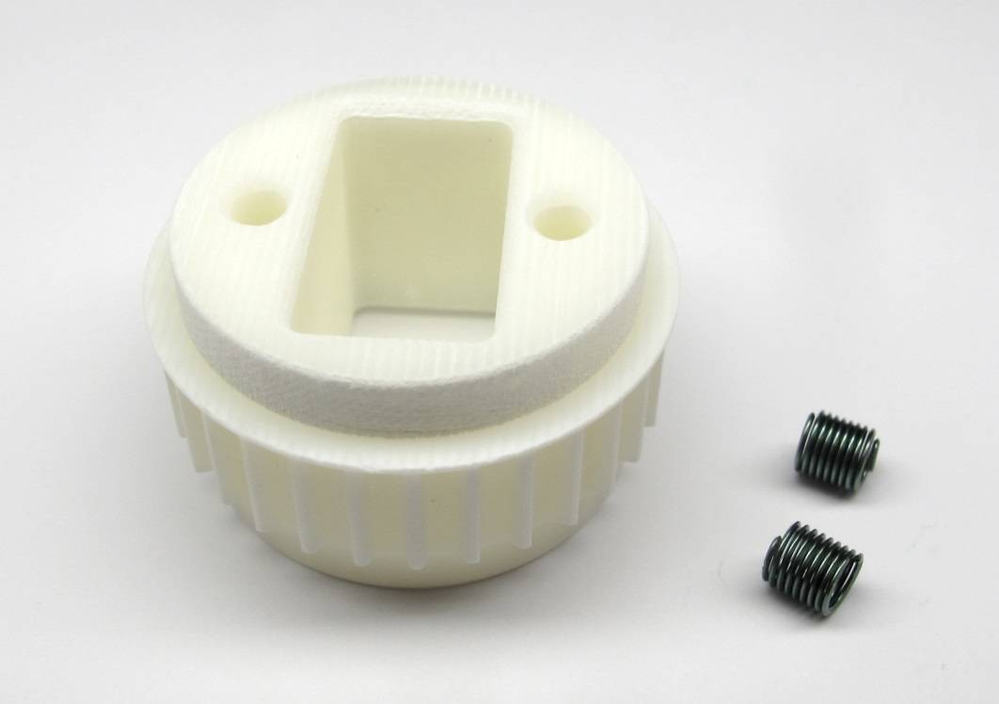  *Starting Point: Output pulley and M3 Helicoil Inserts.*

  *End Result: Output pulley prepared for installation.*

## Description

* this page describes how to prepare the output pulley for the brushless actuator modules
* the shaft diameters of the output pulley are adjusted to fit the bearings   [-> Adjusting the Output Shaft Diameters](#adjusting-the-output-shaft-diameters)
* two Helicoil thread inserts are installed in the mounting holes of the output pulley   [-> Installing Helicoil Thread Inserts](#installing-helicoil-thread-inserts)
* **Exeception:** If you are preparing an output pulley for a Hip AA actuator module the helicoils shouldn't be installed  [-> Pulley for Hip AA Actuator Module](#pulley-for-hip-aa-actuator-module)

### More Information
* More information 3d printing: [Details 3d Printed Parts](details_3d_printed_parts.md#details-3d-printed-parts)  
* [STL File - Output Pulley](../stl_files/transmission_pulley_at3_t30_output.STL)

## Adjusting the Output Shaft Diameters

The dimensions of 3d printed parts can vary quite a bit depending on the printer, the printing technology and the material.  
That's why we print the diameters that has to fit the bearings a bit oversize and machine the part to the right diameter on a lathe.

  *Output pulley - oversized diameter.*

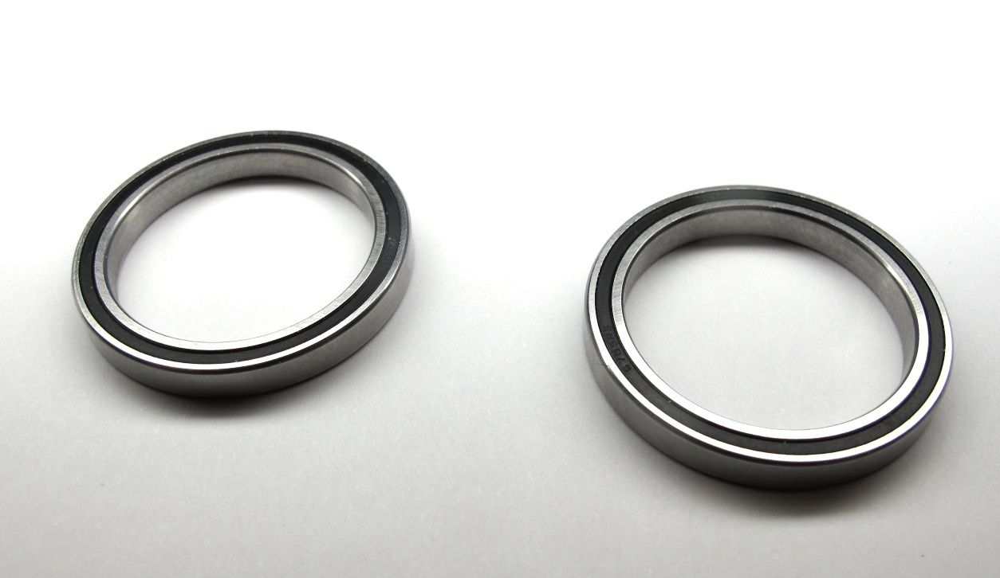  *Output bearings - dimensions: 32mm x 25mm x 4mm.*

  *A 25mm collet helps with clamping the output pulley.*  

  *Place the pulley on the lathe and clamp gently on one of the output shafts.*  

  *Use a cutting tool with a sharp edge.*

  *Reduce the shaft diameter in small steps and check the fit with the output bearing.*  

  *There should be a light press-fit between the bearing and the pulley.  You should be able to install and remove the bearing by hand with moderate force.  When the diameter is correct - turn the pulley around and repeat the same steps for the opposite side.*  

---
## Pulley for Hip AA Actuator Module

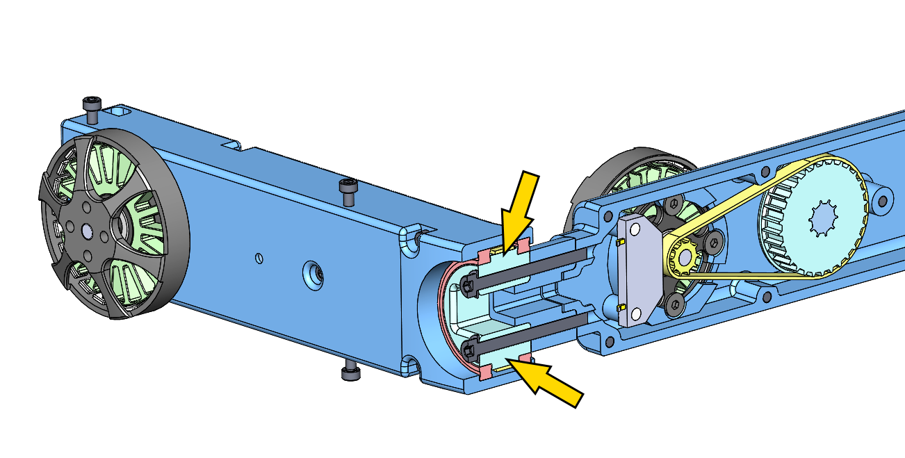  *Exception: Hip AA Output Pulley - the fasteners go through the pulley.*

* the pulley for the Hip AA actuator modules is an exception
* since the fasteners go through the pulley the helicoils mustn't be installed
* increase the hole diameters to 3mm and don't install the Helicoil thread inserts

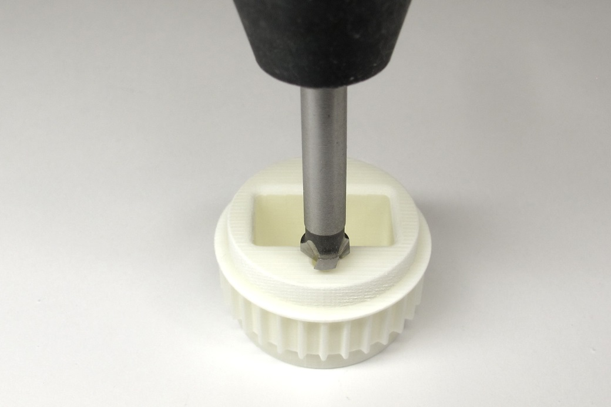  *Put a small chamfer on the mounting holes.*

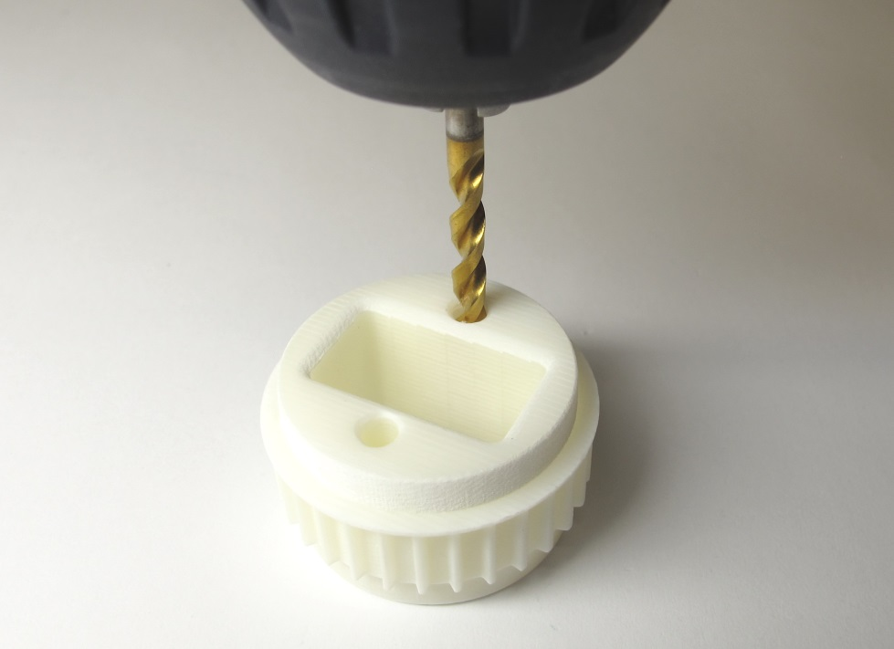  *Increase the diameter of the mounting holes using a 3mm drill bit.*

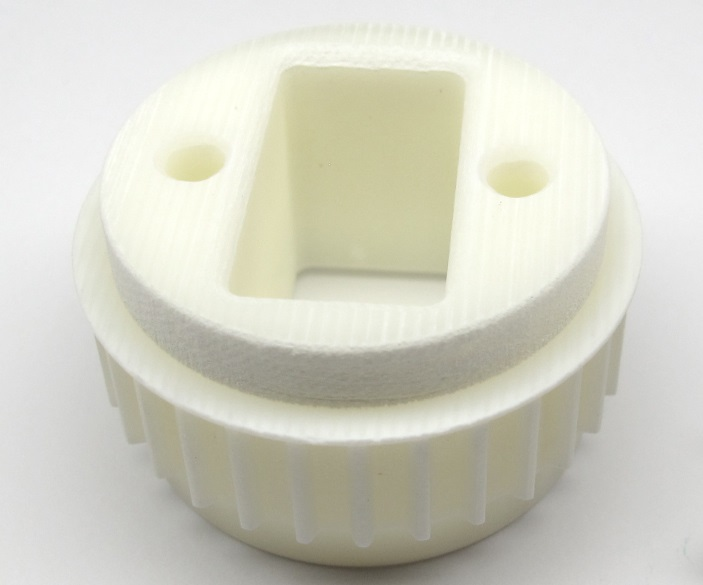  *The Hip AA Output Pulley is now ready for installation.*

**If you are preparing a Hip AA output pulley you should stop here and ignore all the following steps.**

---
## Installing Helicoil Thread Inserts

  *Output Pulley, M3 Helicoils and Helicoil Tools.*  

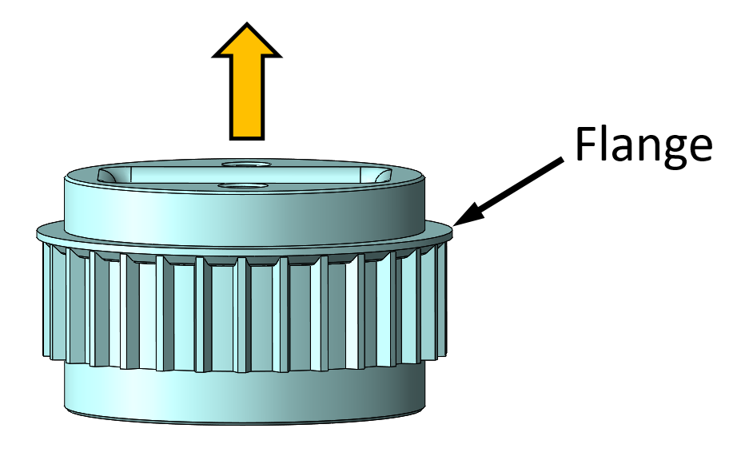  *Make sure that the flange on the pulley faces upwards for all of the following steps.*

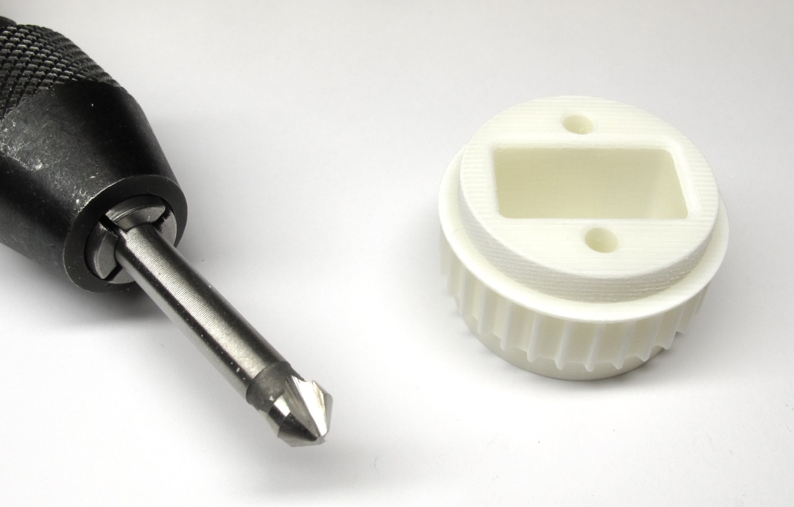  *45 degree chamfer tool and output pulley.*

  *Put a small chamfer on the mounting holes.*

  *The holes should have a diameter of about 2,9mm. Drill through with a 3mm drill bit. Drill with
increasing drill diameters in steps of 0,1mm. Increase the diameter of the holes until you reach a diameter of 3.3mm.*

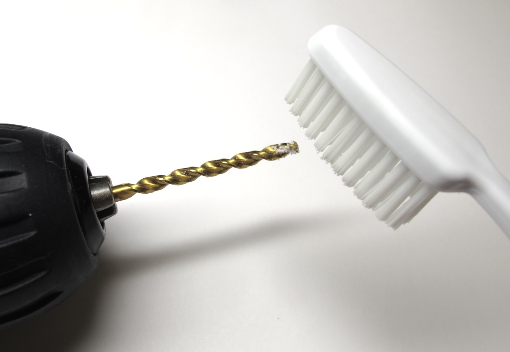  *Clean the drill with a tooth brush if required.*

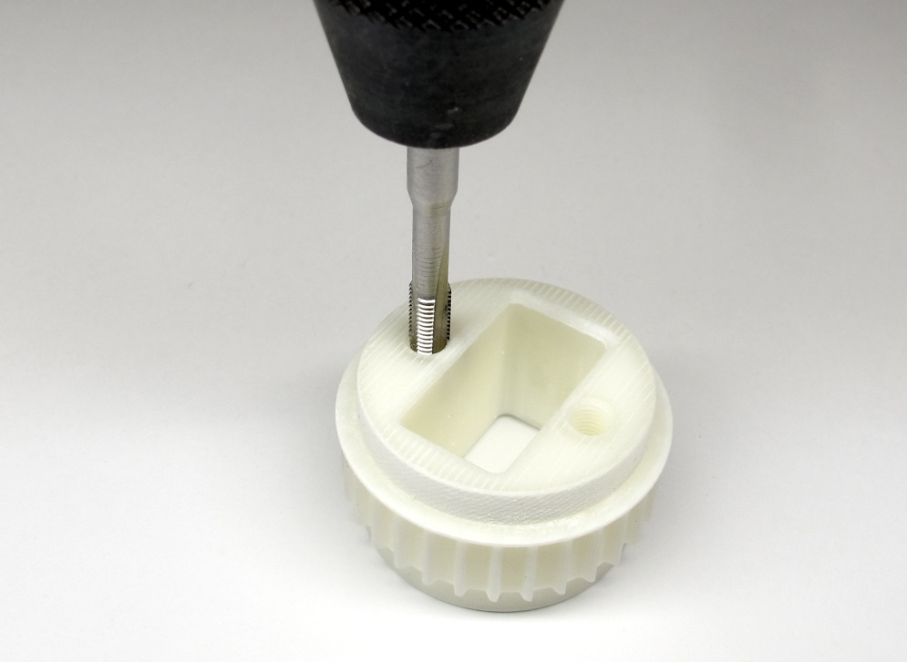  *Tap both holes using the Helicoil M3 tap. The flange on the pulley has to point upwards as shown in the picture.*

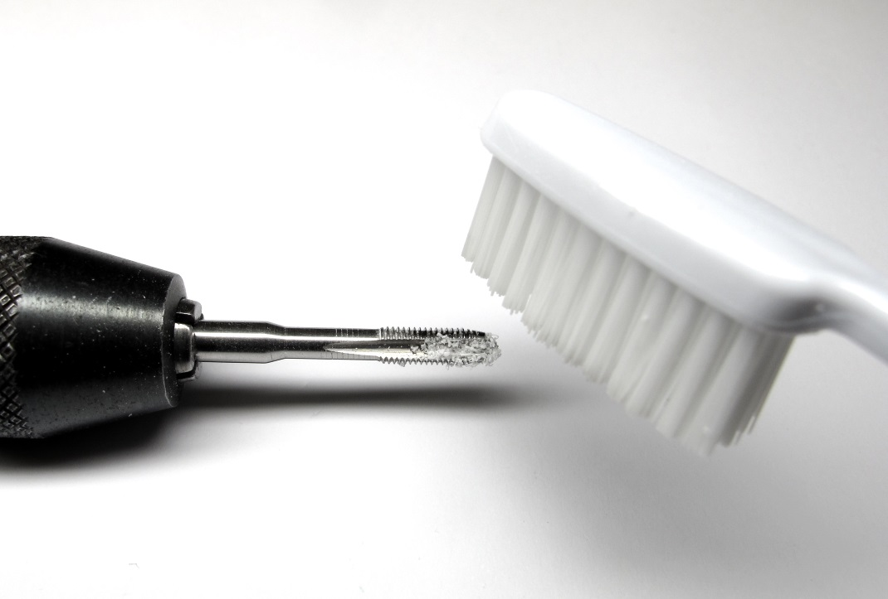  *If the resistance increases carefully back out the tap and clean it with a tooth brush.  Continue until the Helicoil thread is fully cut.*

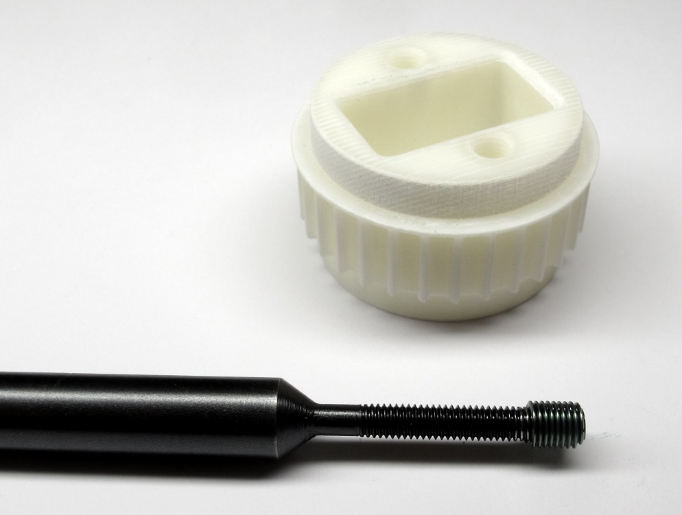  *Place a M3 Helicoil with a length of 6mm on the insertion tool.*

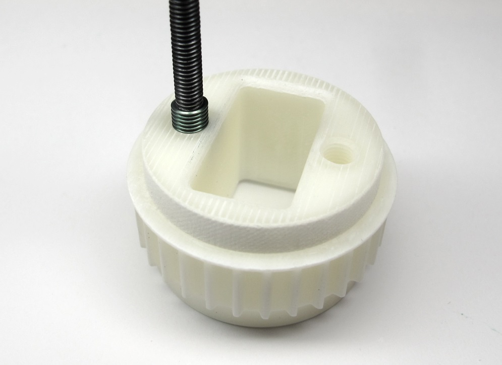  *Insert both Helicoils with the insertion tool.  Make sure that the end of the insert is about half a turn below the outer surface*

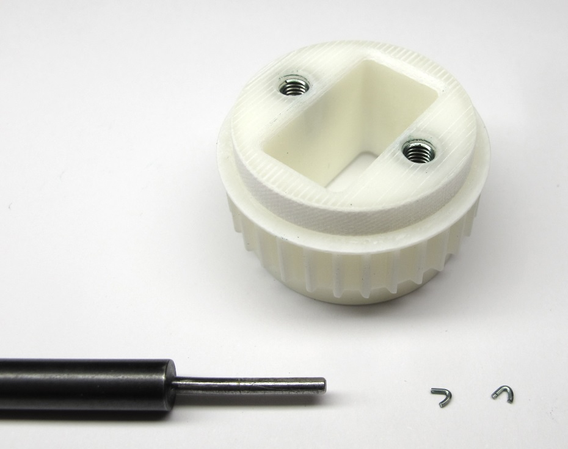  *Remove both tangs using the tang break-off tool.  Make sure that the tangs don't stay inside of the part.*

  *The output pulley is now ready for installation.*

---
## Step-by-Step Instructions

| Motor Preparation  | Motor Shaft Preparation | Encoder Preparation |Center Pulley Preparation|
| --- | --- | --- | --- |
| |   |   | |

| Output Pulley Preparation | Shell Preparation | Actuator Module Assembly |Actuator Module Testing|
| --- | --- | --- | --- |
| |   |   | |

---
## More Details
| Details 3d Printed Parts | Details Machined Parts | Mechanical Tools and Consumables |Electronic Components and Tools|
| --- | --- | --- | --- |
|||||

---
## More Information
[Open Dynamic Robot Initiative - Webpage](https://open-dynamic-robot-initiative.github.io)  
[Open Dynamic Robot Initiative - YouTube Channel](https://www.youtube.com/channel/UCx32JW2oIrax47Gjq8zNI-w)   
[Open Dynamic Robot Initiative - Forum](https://odri.discourse.group/categories)  
[Open Dynamic Robot Initiative - Paper](https://arxiv.org/pdf/1910.00093.pdf)  
[Hardware Overview](../../../README.md#open-robot-actuator-hardware)  
[Software Overview](https://github.com/open-dynamic-robot-initiative/open-dynamic-robot-initiative.github.io/wiki)  
[Back to Actuator Module](../README.md)  
[Back to Top of Page](#details-output-pulley-preparation)

---
## Authors
Felix Grimminger

## License
BSD 3-Clause License

## Copyright
Copyright (c) 2019-2020, Max Planck Gesellschaft and New York University
