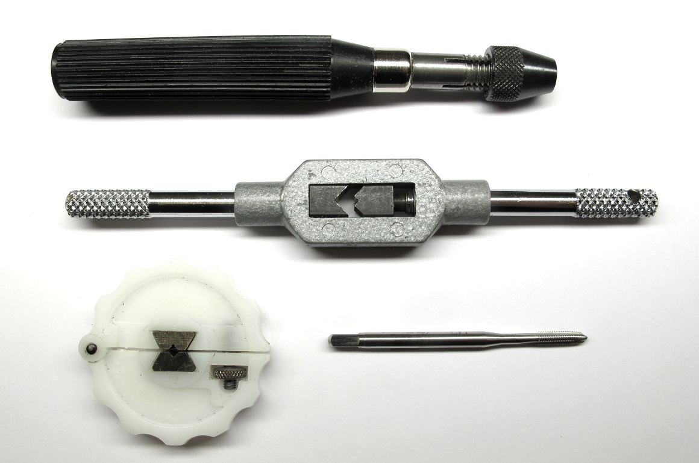
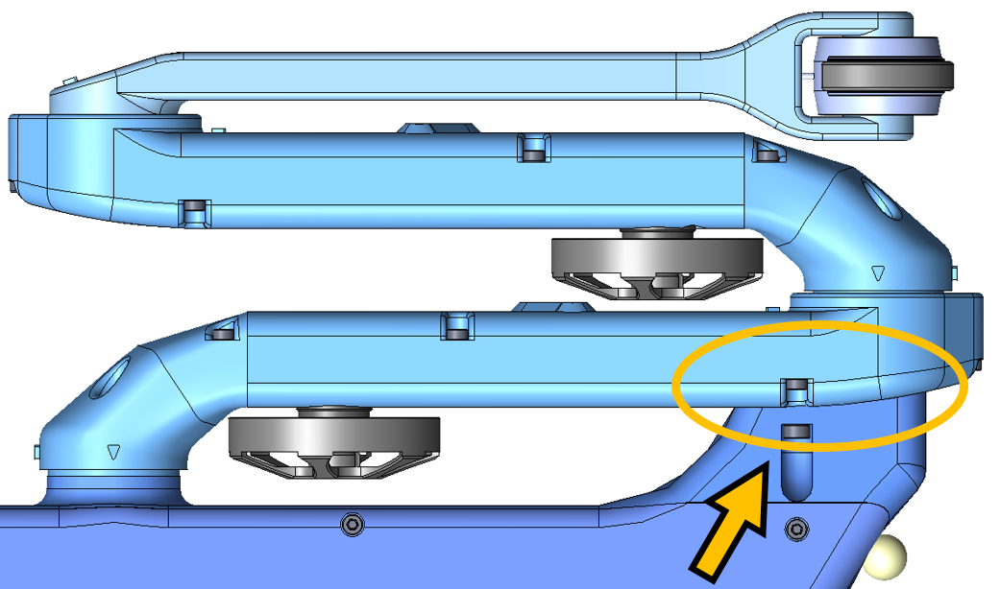
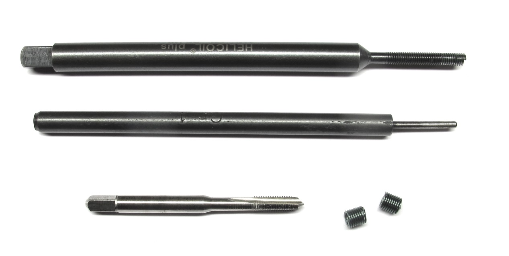
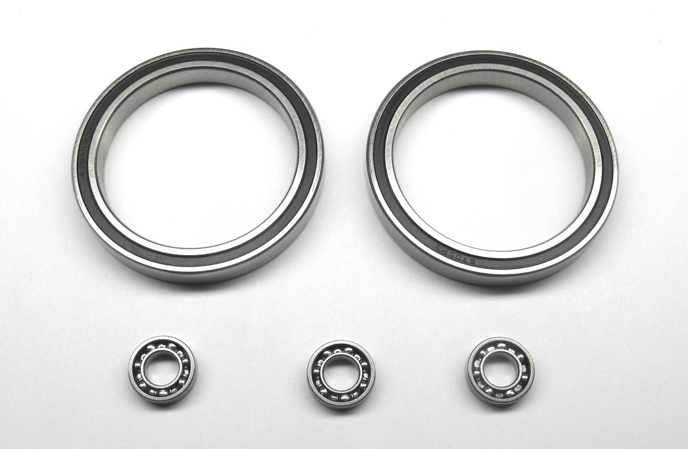
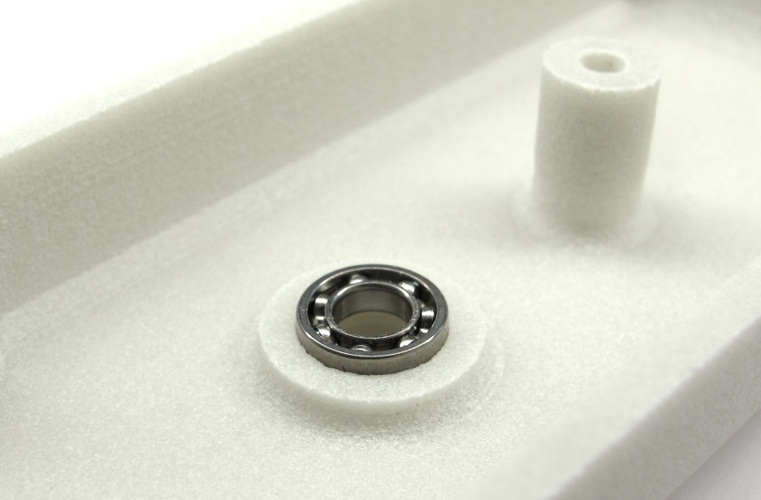
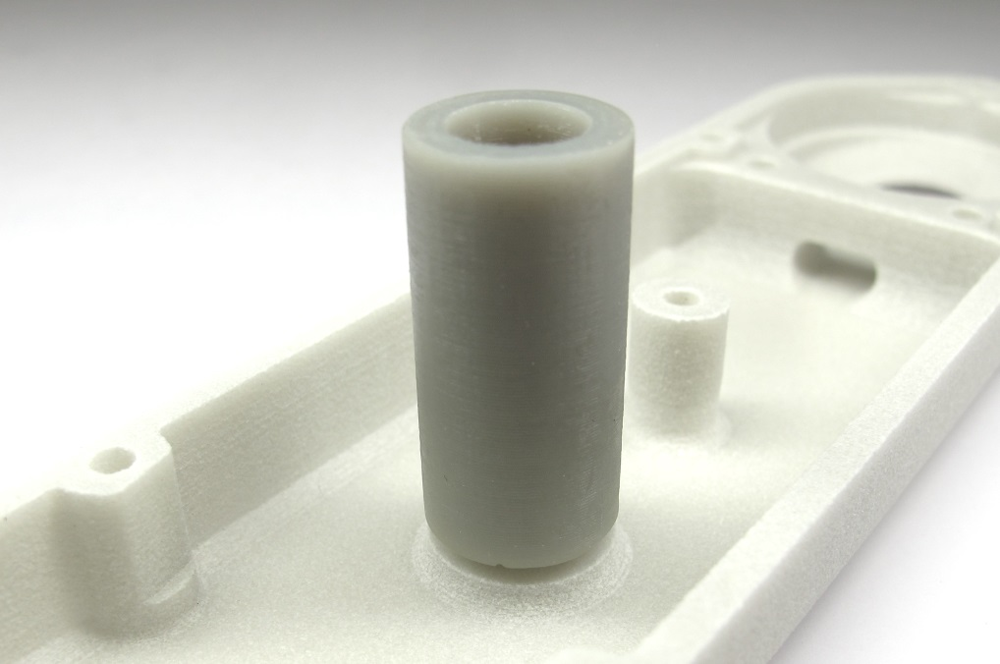
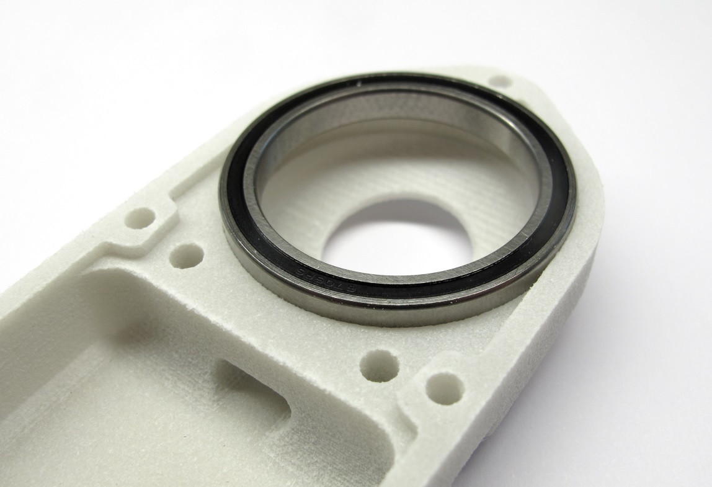
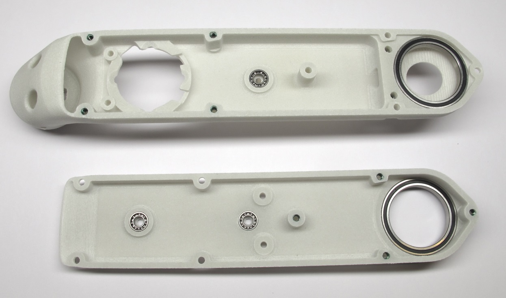
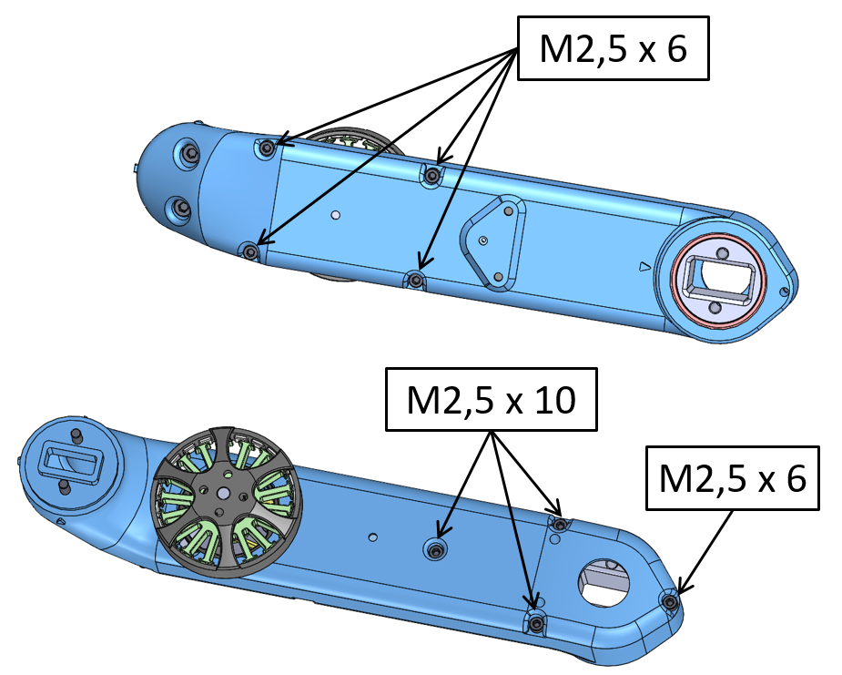

# Details Shell Preparation

  *Starting Point: Shell base, shell cover, bearings and helicoil inserts*

  *End Result: Shell base and shell cover prepared for assembly*

## Description
*  this page describes how to prepare the shells for the brushless actuator modules
* the flatness of the 3d printed parts and the diameters of the through holes is verified  [-> Checking the 3D Printed Shells](#checking-the-3d-printed-shells)
* the metric threads are cut with a M3 tap [-> Cutting the Metric Threads](#cutting-the-metric-threads)
* the threaded inserts are installed [-> Installing the Helicoil Inserts](#installing-the-helicoil-inserts)
* the bearing seats are checked and adjusted if required [-> Adjusting the Bearing Seats](#adjusting-the-bearing-seats)
* the roller bearings for the output shaft and the transmission shafts are installed [-> Installing the Bearings](#installing-the-bearings)
* the shell base and shell cover are assembled with eight M2,5 screws [-> Test-Mounting the Shells](#test-mounting-the-shells)

## More Information
* More information on the 3d printing: [Details 3d Printed Parts](details_3d_printed_parts.md#details-3d-printed-parts)  

## Checking the 3D Printed Shells

  *Place the shell cover on a flat surface and visually check the flatness of the part.*

  *Place the planar area of the shell base on a flat surface and visually check the flatness of the part. If the parts are warped they might not be usable.*

  *There are two 3mm and eight 2,5mm through holes in the shell parts. Check the diameter of the through holes with a caliper or by inserting a M3 and M2,5 screw. If the hole diameters are too small and the screws don't pass through easily increase the hole diameter with a drill.*

## Cutting the Metric Threads

  *Use a M3 tap to manually cut the threads in the locations shown below. The picture shows different tool holders that can be used.*

  *Use a M3 tap to cut the threads for the encoder mount and the belt tensioners. Try to hold the tap as vertical as possible. 
Cut the threads all the way through the shell*

  *Use the M3 tap to cut the two threads for the encoder attachment.*

  *Use the M3 tap to cut the two threads for the timing belt tensioners.*

## Installing the Helicoil Inserts
  *Helicoil Tools M2,5 - Tap, tang-break-off tool and insertion tool*

* we use Helicoil threaded inserts for increased stability
* you need the 3 special Helicoil tools shown in the picture above for each size
* for the actuator modules we use threaded inserts with the sizes M2,5 and M3
* try to hold the tap drill as vertical as possible
* stop tapping when you reach the bottom of the hole and the resistance increases  (the threads in the 3d printed parts can strip easily)

  *In the next step the M2,5 Helicoils are installed in the locations shown above.*

  *Shell Base: Tap the 4 holes with the M2,5 Helicoil tap.*

  *Shell Base: Install four M2,5 x 3,75mm Helicoils using the installation tool. Remove the tangs using the tang break-off tool. Make sure that the tangs don't stay inside of the part.*

---
  *Shell Cover: Tap the 4 holes with the M2,5 Helicoil tap.*

  *Shell Cover: Install four M2,5 x 3,75mm Helicoils using the installation tool. Remove the tangs using the tang break-off tool. Make sure that the tangs don't stay inside of the part.*

  *Shell base and shell cover with the M2,5 Helicoils installed.*

## 2dof Leg - Hip FE Module

* the Hip FE actuator module for the 2dof legs is an **exception**
* for all the other actuator modules ignore this step and continue below  [-> Adjusting the Bearing Seats](#adjusting-the-bearing-seats)
* the Hip FE actuator modules for the 2dof leg require two extra M3 helicoil inserts for the second anchor point
* the 2dof leg is used for the [8dof Quadruped Robot](../../quadruped_robot_8dof_v1#quadruped-robot-8dof-v1) and the [Leg Test Stand](../../leg_test_stand_v1#leg-test-stand-v1)

  *Top View 8dof Quadruped: Second Anchor Point*

  *Helicoil Tools M3 - Tap drill, tang-break-off tool and insertion tool*

  *M3 Helicoil positions for second anchor point.*

  *Tap the two holes with the M3 Helicoil tap.*

  *Install two M3 x 6mm Helicoils using the installation tool. Remove the tangs using the tang break-off tool. Make sure that the tangs don't stay inside of the part.*

  *Shell base with the M3 Helicoils installed.*

## Adjusting the Bearing Seats

  *The bearing seats are marked yellow in this screenshot.*

* The tolerances of the 3d printed parts can vary quite a bit depending on the printing technology, the printer settings and the material.
* There should be a light press-fit between the bearing seats and the bearings.
* You should be able to install and remove the bearings manually with moderate force.
* If the bearing seats are too tight they have to be adjusted to the right size.
* For that we use end mills with a sharp 90 degree edge
* We don't recommend to use reamers, because they are typically chamfered and won't produce a sharp corner.
* You should dull the blades on the bottom with a file - such that the end mills remove material on the sides only.

  *8mm and 32mm end mills*

## Installing the Bearings

  *Stainless steel roller bearings.  Two output bearings: 32mm x 25mm x 4mm Three transmission bearings: 8mm x 4mm x 2mm*

  *Bearing locations for the shell base and shell cover.*

  *Place the transmission bearings on the shell and push them in with your fingers. Try to keep the bearing horizontal while installing it.*

  *You can also use the 3d printed tool for bonding the code wheels. [ -> Tool Code Wheel Bonding](../stl_files/tool_code_wheel_bonding.STL)*

 *Place the output bearing on the shell. Push the bearing into the bearing seat with your fingers. Try to keep the bearing horizontal while installing it.*

  *Shell base and shell cover with bearings installed.*

## Test-Mounting the Shells

  *The shell parts are connected by eight screws.*

  *Stainless steel socket head cap screws for connecting the shells.  Five M2,5x6 and three M2,5x10 screws are required.*

  *Install the four M2,5x6 socket head cap screws on the cover. You will need a 2mm hex driver. Turn the shell around.*

  *Install three M2,5x10 screws and one M2,5x6 screw on the base shell.*

  *The shell is now fully prepared and ready for assembly.*

---
## Step-by-Step Instructions

| Motor Preparation  | Motor Shaft Preparation | Encoder Preparation |Center Pulley Preparation|
| --- | --- | --- | --- |
| |   |   | |

| Output Pulley Preparation | Shell Preparation | Actuator Module Assembly |Actuator Module Testing|
| --- | --- | --- | --- |
| |   |   | |

---
## More Details
| Details 3d Printed Parts | Details Machined Parts | Mechanical Tools and Consumables |Electronic Components and Tools|
| --- | --- | --- | --- |
|||||

---
## More Information
[Open Dynamic Robot Initiative - Webpage](https://open-dynamic-robot-initiative.github.io)  
[Open Dynamic Robot Initiative - YouTube Channel](https://www.youtube.com/channel/UCx32JW2oIrax47Gjq8zNI-w)   
[Open Dynamic Robot Initiative - Forum](https://odri.discourse.group/categories)  
[Open Dynamic Robot Initiative - Paper](https://arxiv.org/pdf/1910.00093.pdf)  
[Hardware Overview](../../../README.md#open-robot-actuator-hardware)  
[Software Overview](https://github.com/open-dynamic-robot-initiative/open-dynamic-robot-initiative.github.io/wiki)  
[Back to Actuator Module](../README.md)  
[Back to Top of Page](#details-shell-preparation)

---
## Authors
Felix Grimminger

## License
BSD 3-Clause License

## Copyright
Copyright (c) 2019-2020, Max Planck Gesellschaft and New York University
