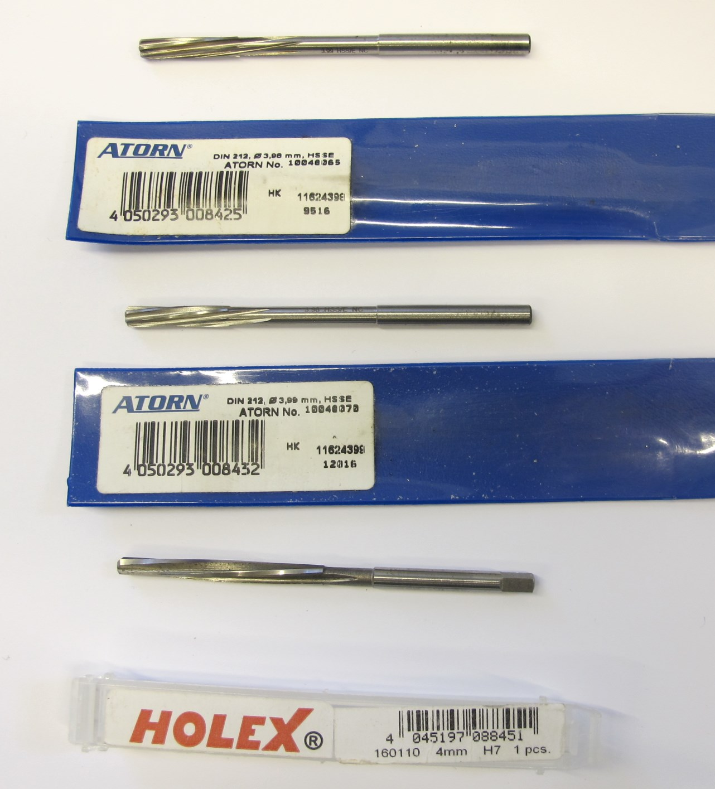
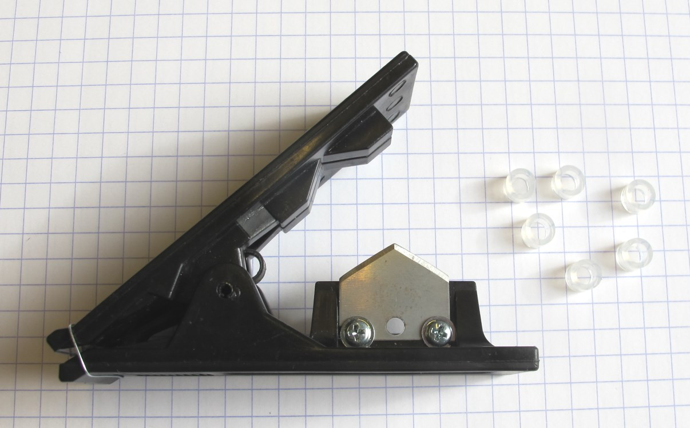
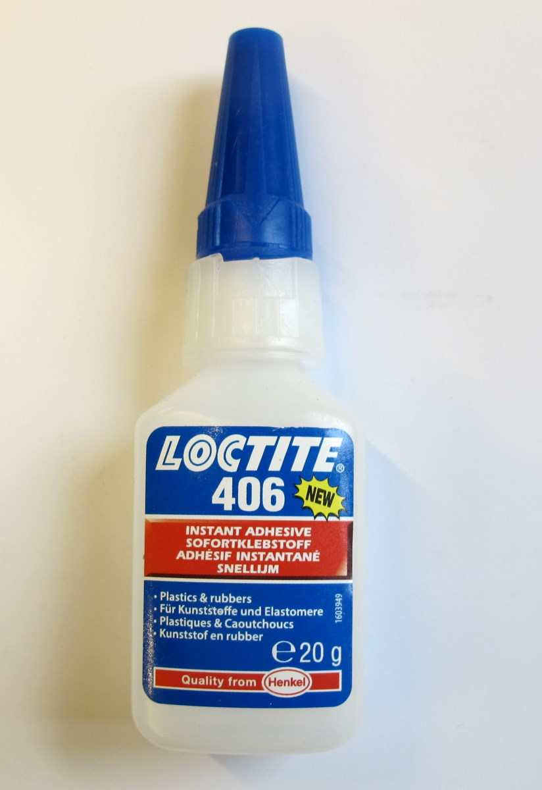
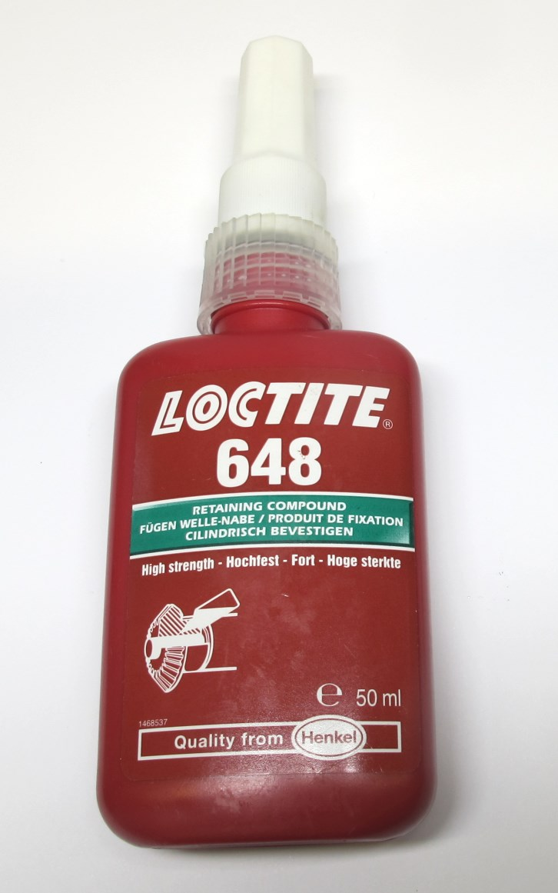
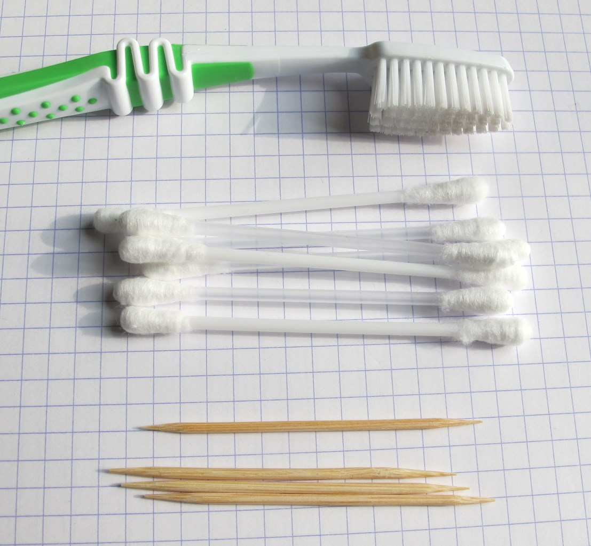
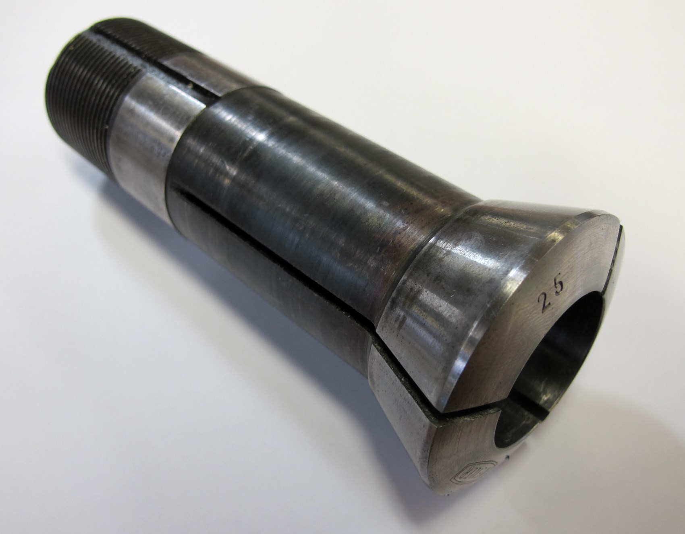

Details Tools
=======================

Description
------------

  *M3 Tap*

  *Reamers*

  *Reamers*

  *Chamfer Tool*

  *Helicoil Tools*

  *End Mills*

  *Tube Cutter*

  *Superglue - Loctite 406*

  *Retaining Compound - Loctite 648*

  *Miscellanious tools - tooth brush, q-tipps and tooth picks*

  *25mm collet to hold the output pulley on a lathe*

Authors
--------
Felix Grimminger

License
-------
BSD 3-Clause License

Copyright
-----------
Copyright (c) 2019, Max Planck Gesellschaft, New York University

More Information
----------------
[Open Dynamic Robot Initiative - Webpage](https://open-dynamic-robot-initiative.github.io)  
[Open Dynamic Robot Initiative - YouTube Channel](https://www.youtube.com/channel/UCx32JW2oIrax47Gjq8zNI-w)  
[Hardware Overview](../../README.md)  
[Software Overview](https://github.com/open-dynamic-robot-initiative/open-dynamic-robot-initiative.github.io/wiki)  
[Back to Actuator Module](../README.md)  
