# Details Mechanical Tools and Consumables

## Hex Drivers
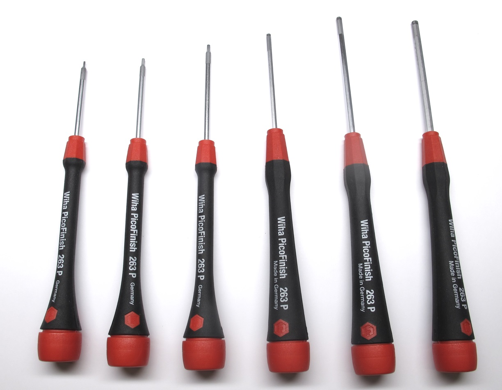  *Wiha Hex Driver Set*

|Description|Details|Ordering Information|Comments|
|---|---|---|---|
|Wiha PicoFinish 42992|Set with 6 hex drivers|Hoffmann 42992 Amazon|[Rotor Preparation](details_motor_preparation.md#rotor-preparation) [Actuator Module Assembly](details_actuator_module_assembly.md#mounting-the-stator)|

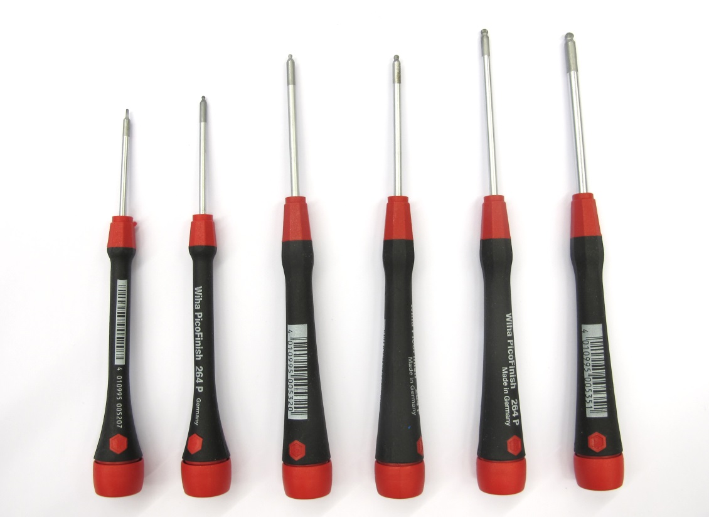  *Wiha Ball Head Hex Driver Set*

|Description|Details|Ordering Information|Comments|
|---|---|---|---|
|Wiha PicoFinish 42993|Set with 6 ball head hex drivers|Conrad  2126966 Amazon||

## Screw Drivers
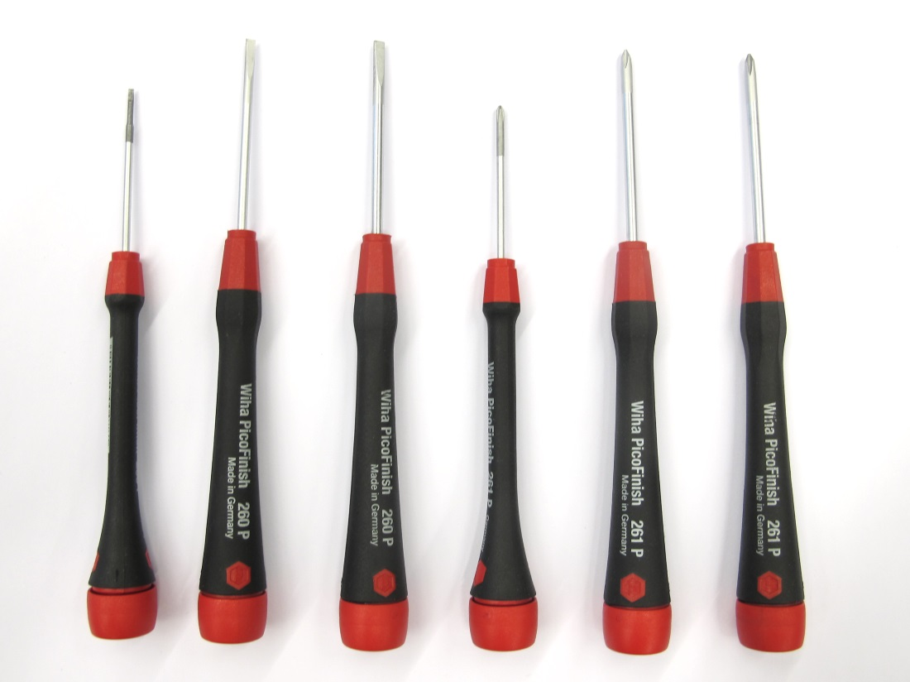  *Wiha Slotted and Phillips Screw Driver Set*

|Description|Details|Ordering Information|Comments|
|---|---|---|---|
|Wiha PicoFinish 42991|Set with 7 Slotted and Phillips Screwdrivers|Conrad 2126940 Amazon|[Encoder Mounting](details_actuator_module_assembly.md#installing-the-encoder) [Closing the Shell](details_actuator_module_assembly.md#closing-the-shell)|

## Power Drill
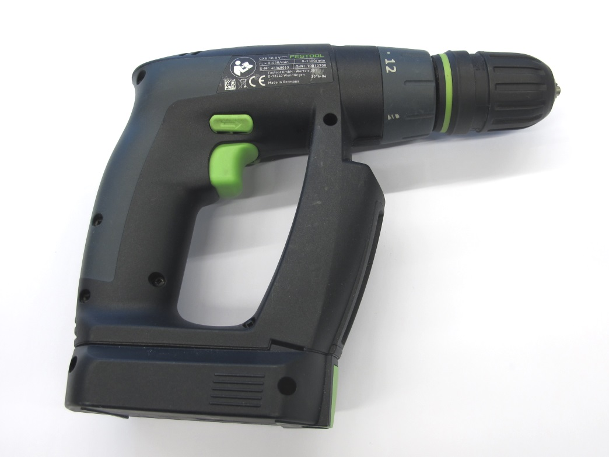  *Power Drill*

## Drill Bit Set
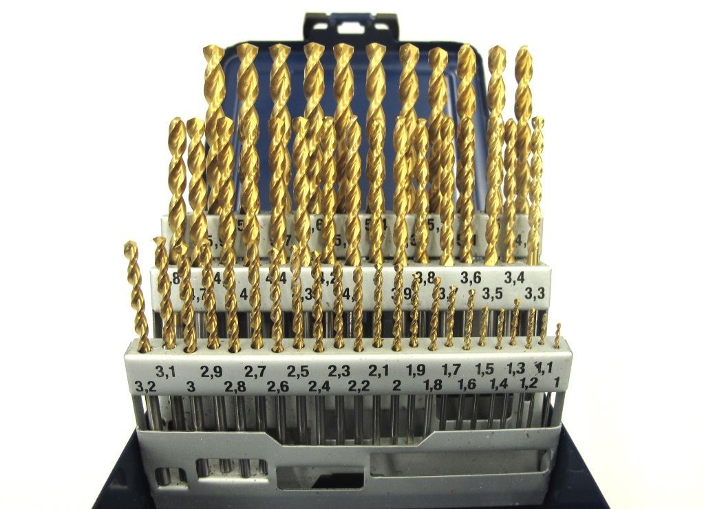  *Metric Drill Bit Set*

|Description|Details|Ordering Information|Comments|
|---|---|---|---|
|Drill Bit Set|0,1mm increments|Hahn+Kolb 11049011|1mm - 5,9mm|

* a drill bit set with 0,1mm diameter increments is really useful for adjusting the 3d printed parts
* the diameters of the holes in 3d printed parts have to be increased in small steps
* increasing the hole diameters in large steps can cause the 3d printed parts to crack

## Tool Holders
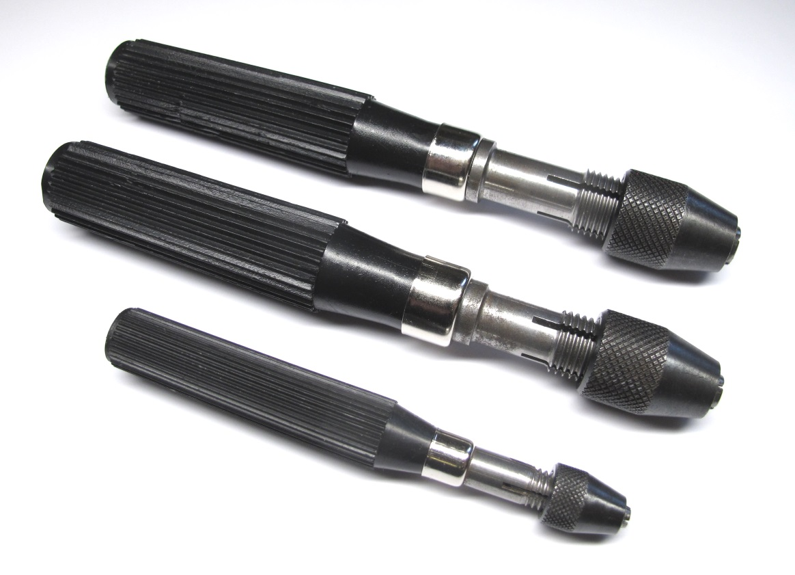  *Tool Holders*

|Description|Details|Ordering Information|Comments|
|---|---|---|---|
|Tool Holder 2mm-3mm||Hahn+Kolb 51003200|[Shell Preparation](details_shell_preparation.md#cutting-the-metric-threads)|
|Tool Holder 3mm-4,5mm||Hahn+Kolb 51003205|[Rotor Preparation](details_motor_preparation.md#increasing-the-rotor-bore-diameter)|
|Tool Holder 4mm-6mm||Hahn+Kolb 51003210|[Encoder Preparation](details_encoder_preparation.md#mechanical-modification-encoder)|

## Metric Taps
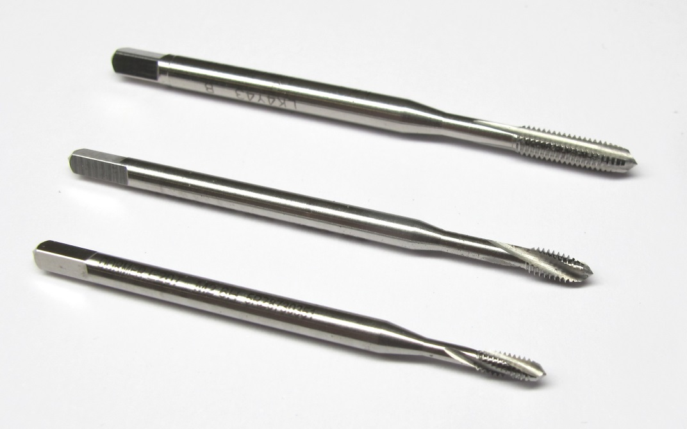  *M2, M2,5 and M3 Taps*

|Description|Details|Ordering Information|Comments|
|---|---|---|---|
|M2,5 Tap||Hoffmann 131300 M2,5|[Micro Driver and IMU Support](../../quadruped_robot_12dof_v1/README.md#preparing-the-3d-printed-parts)|
|M3 Tap||Hoffmann 131300 M3|[Shell Preparation](details_shell_preparation.md#cutting-the-metric-threads)|
|M4 Tap||Hoffmann 131300 M4|[Vicon Marker Support](../../quadruped_robot_12dof_v1/README.md#preparing-the-3d-printed-parts)|

## Reamers
  *Reamers*

|Description|Details|Ordering Information|Comments|
|---|---|---|---|
|Reamer 3,98mm||Hahn+Kolb 11624398|[Rotor Modification](details_motor_preparation.md#increasing-the-rotor-bore-diameter)|
|Reamer 3,99mm||Hahn+Kolb 11624399|[Rotor Modification](details_motor_preparation.md#increasing-the-rotor-bore-diameter)|
|Reamer 4,00mm||Hahn+Kolb 11624400 Hoffmann 1601504|[Encoder Mount Adjustment](details_motor_shaft_preparation.md#bonding-the-codewheel)|

## Countersink Tool
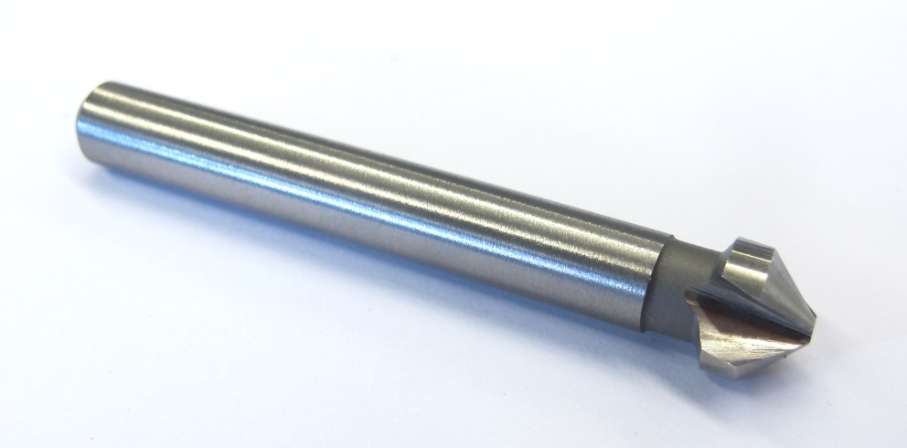  *Countersink Tool*

|Description|Details|Ordering Information|Comments|
|---|---|---|---|
|Countersink Tool 90° 8mm||Hahn+Kolb 11500041|[Encoder Modification](details_encoder_preparation.md#mechanical-modification-encoder)|

## Helicoil Tools
  *Helicoil Tools*

|Description|Details|Ordering Information|Comments|
|---|---|---|---|
|M2,5 Helicoil Tool Set|Helicoil Tap, Insertion Tool, Tang Breakoff Tool|Hoffmann 082800 M2,5|[Shell Preparation](details_shell_preparation.md#installing-the-helicoil-inserts)|
|M3 Helicoil Tool Set|Helicoil Tap, Insertion Tool, Tang Breakoff Tool|Hoffmann 082800 M3|[Output Pulley Preparation](details_output_pulley_preparation.md#installing-helicoil-thread-inserts)|

## Helicoils
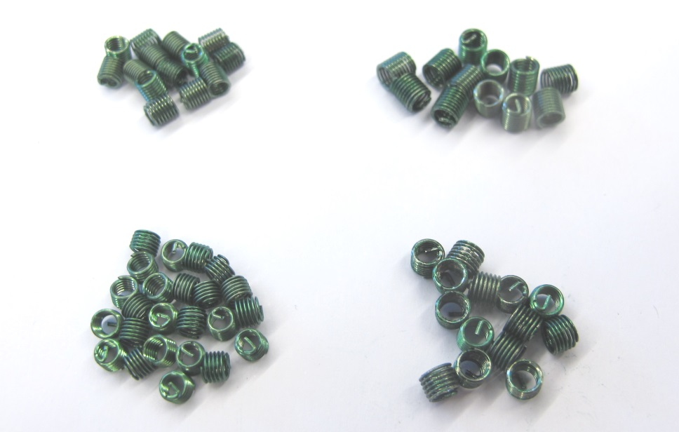  *Helicoil Threaded Inserts*

|Description|Details|Ordering Information|Comments|
|---|---|---|---|
|M2,5x3,75 Helicoil Threaded Inserts|1,5xD|Hoffmann 082812 M2,5||
|M2,5x5 Helicoil Threaded Inserts|2xD|Hoffmann 082814 M2,5||
|M3x4,5 Helicoil Threaded Inserts|1,5xD|Hoffmann  082812 M3||
|M3x6 Helicoil Threaded Inserts|2xD|Hoffmann 082814 M3||

## End Mills
  *End Mills*

|Description|Details|Ordering Information|Comments|
|---|---|---|---|
|End Mill 8mm||Hoffmann 2033208|[Shell Preparation](details_shell_preparation.md#adjusting-the-bearing-seats)|
|End Mill 25mm ||Hoffmann 156730 1/25 |[12dof Quadruped Hip AA Support Adjustment](../../quadruped_robot_12dof_v1#3d-printed-parts)|
|End Mill 32mm ||Hoffmann 156730 2/32 |[Shell Preparation](details_shell_preparation.md#adjusting-the-bearing-seats)|

## Files
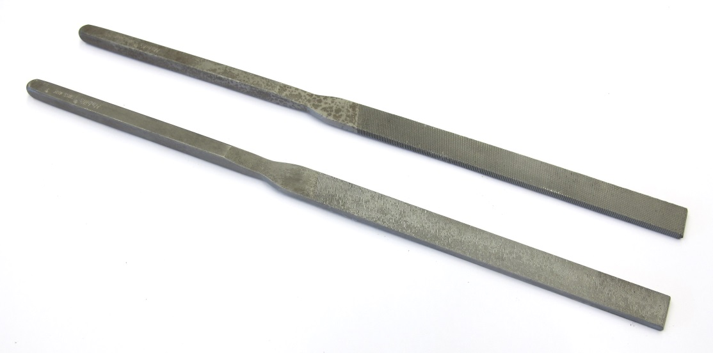  *Flat Files*

|Description|Details|Ordering Information|Comments|
|---|---|---|---|
|Flat File Rough |Vallorbe Habilis|Hoffmann 527060|Length 215mm|
|Flat File Smooth |Vallorbe Habilis|Hoffmann 527070|Length 215mm|

## Pin Punches
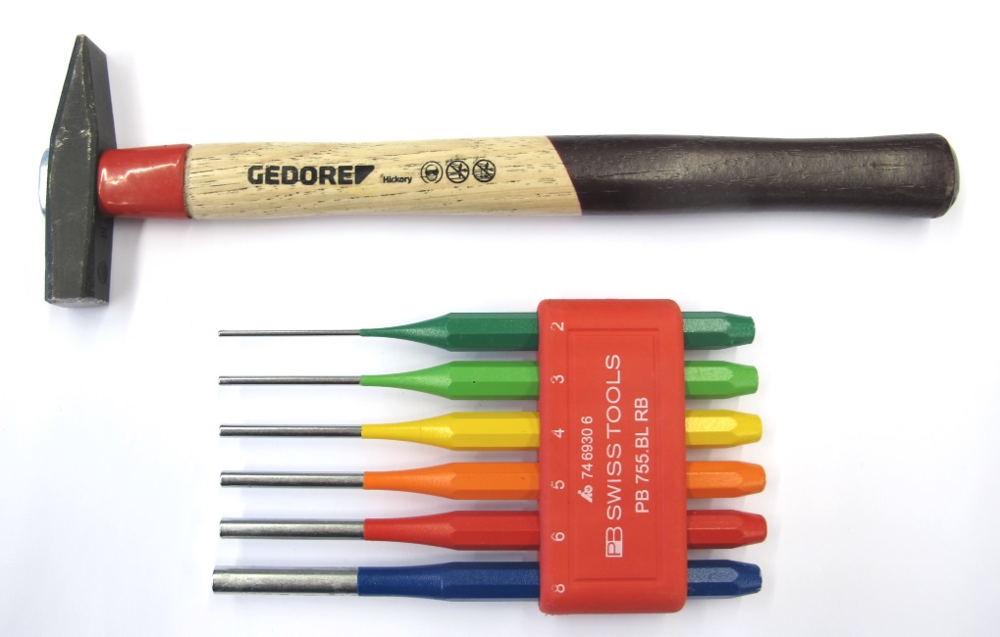  *Hammer and pin punch set*

|Description|Details|Ordering Information|Comments|
|---|---|---|---|
|Pin Punch Set|PB Swiss Tools PB 755.BL RB|Hoffmann 7469306|Only 3mm pin punch required. [Rotor Preparation](details_motor_preparation.md#rotor-preparation)|
|Pin Punch 3mm|PB Swiss Tools|Hoffmann 7469203|[Rotor Preparation](details_motor_preparation.md#rotor-preparation)|
|Hammer|Gedore|Hahn+Kolb 51184410|[Rotor Preparation](details_motor_preparation.md#rotor-preparation)|

## Vise
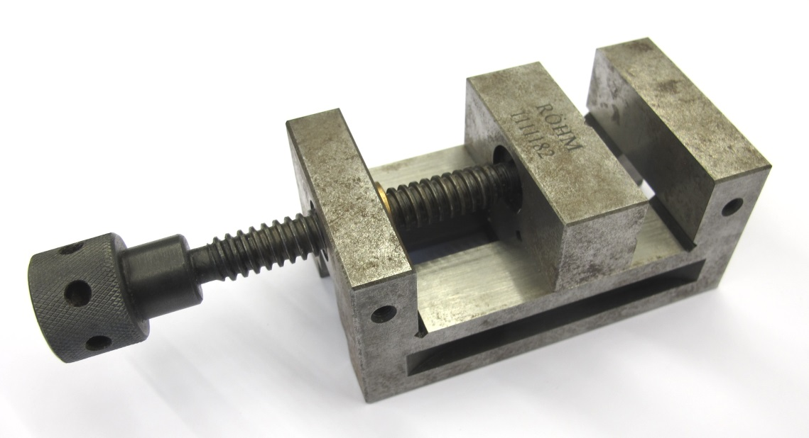  *Precision Vise*

|Description|Details|Ordering Information|Comments|
|---|---|---|---|
|Precision Vise|Röhm 60mm PL-G|Hahn+Kolb 28604060|Jaw width 60mm|

## Digital Calipers
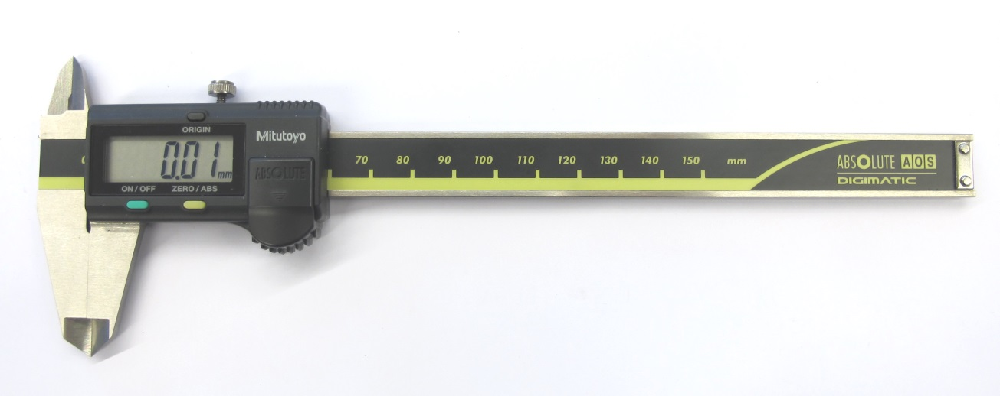  *Digital Calipers*

|Description|Details|Ordering Information|Comments|
|---|---|---|---|
|Digital Calipers|Mitutoyo|Hoffmann 412632|Battery SR44|
|Coin battery|SR44|RS 593-423||

## Label Maker and Tape
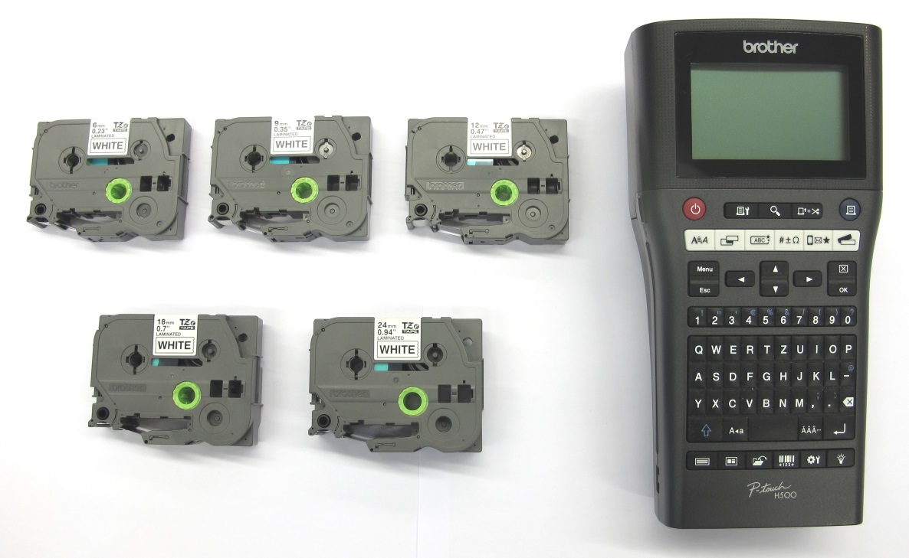  *Label maker and different tape sizes*

|Description|Details|Ordering Information|Comments|
|---|---|---|---|
|Label Maker|Brother P-touch  PT H500|Conrad 1094473||
|Label Tape 6mm|TZe-211|Conrad 775819|black on white|
|Label Tape 9mm|TZe-221|Conrad 770248|black on white|
|Label Tape 12mm|TZe-231|Conrad 775843|black on white|
|Label Tape 18mm|TZe-241|Conrad 770230|black on white|
|Label Tape 24mm|TZe-251|Conrad 770299|black on white|

## Loctite
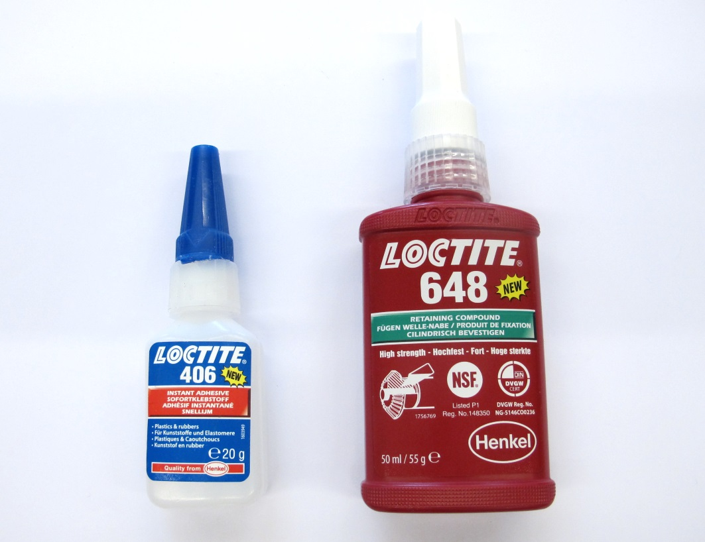  *Loctite superglue and retaining compound*

|Description|Details|Ordering Information|Comments|
|---|---|---|---|
|Loctite 406 Superglue|20g bottle|RS 517-7458|[Code Wheel Bonding](details_motor_shaft_preparation.md#bonding-the-codewheel)|
|Loctite 648 Retaining Compound|10ml bottle 50ml bottle|RS 258-5991 RS 373-1498|[Motor Pulley Bonding](details_motor_shaft_preparation.md#bonding-the-pulley-to-the-motor-shaft)|

## Collet
  *25mm collet to hold the output pulley on a lathe*

|Description|Details|Ordering Information|Comments|
|---|---|---|---|
|Collet 25mm|| Hahn+Kolb 23356450|[Output Pulley Adjustment](details_output_pulley_preparation.md#adjusting-the-output-shaft-diameters)|

## Allen Keys
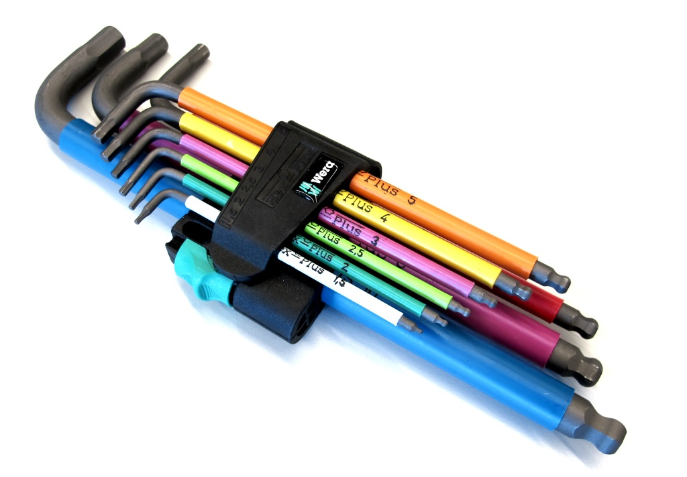  *Allen Key Set from Wera*

|Description|Details|Ordering Information|Comments|
|---|---|---|---|
|Allen Key Set |Wera 05022210001|RS 136-7121 Amazon|Set with 9 allen keys|

## Nitril Gloves
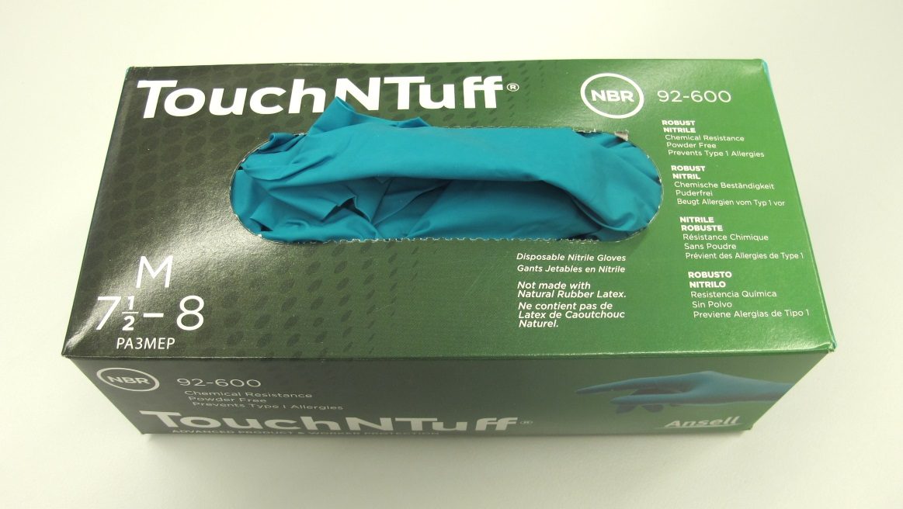  *Nitril Gloves*

|Description|Details|Ordering Information|Comments|
|---|---|---|---|
|Disposable Gloves |Ansell 92-600/075|RS 261-6736|Nitril|

## Miscellaneous Tools
  *Miscellanious tools - tooth brush, q-tipps and tooth picks*

---
## Step-by-Step Instructions

| Motor Preparation  | Motor Shaft Preparation | Encoder Preparation |Center Pulley Preparation|
| --- | --- | --- | --- |
| |   |   | |

| Output Pulley Preparation | Shell Preparation | Actuator Module Assembly |Actuator Module Testing|
| --- | --- | --- | --- |
| |   |   | |

---
## More Details
| Details 3d Printed Parts | Details Machined Parts | Mechanical Tools and Consumables |Electronic Components and Tools|
| --- | --- | --- | --- |
|||||

---
## More Information
[Open Dynamic Robot Initiative - Webpage](https://open-dynamic-robot-initiative.github.io)  
[Open Dynamic Robot Initiative - YouTube Channel](https://www.youtube.com/channel/UCx32JW2oIrax47Gjq8zNI-w)   
[Open Dynamic Robot Initiative - Forum](https://odri.discourse.group/categories)  
[Open Dynamic Robot Initiative - Paper](https://arxiv.org/pdf/1910.00093.pdf)  
[Hardware Overview](../../../README.md#open-robot-actuator-hardware)  
[Software Overview](https://github.com/open-dynamic-robot-initiative/open-dynamic-robot-initiative.github.io/wiki)  
[Back to Actuator Module](../README.md)  
[Back to Top of Page](#details-mechanical-tools-and-consumables)

---
## Authors
Felix Grimminger

## License
BSD 3-Clause License

## Copyright
Copyright (c) 2019-2020, Max Planck Gesellschaft and New York University
