# Biped Robot 6dof v1

  *Biped Robot 6dof  - weight: 1,34kg  For this picture the robot was held by a string.*  

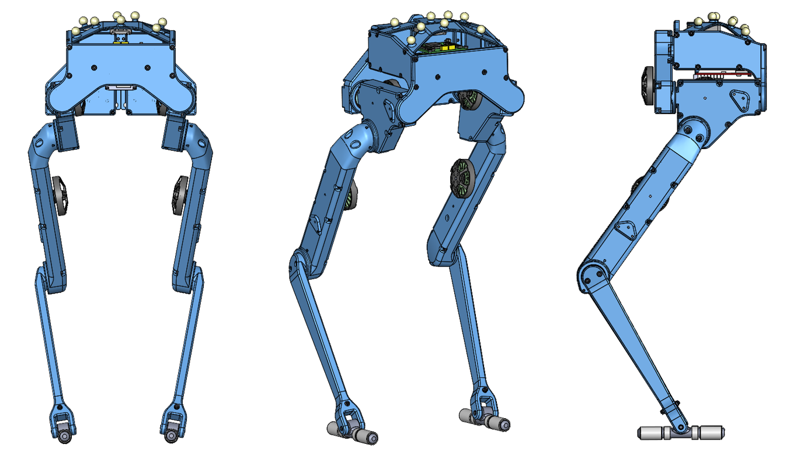  *Biped Robot CAD model* 

## Description

* this page describes all the components that are required to build the Biped Robot
* each leg has 3 active degrees of freedom and a passive ankle joint
* the legs of the Biped Robot are described here: [Biped Leg 3dof v1 Documentation](../biped_leg_3dof_v1/README.md#biped-leg-3dof-v1)
* compared to the quadruped robots the upper and lower leg length  was increased by 25% - from 160mm to 200mm
* since the biped has no leg rotation degree of freedom the yaw angle of the robot cannot be controlled
* the line contact of the feet help to stabilize the yaw orientation of the robot
* the onboard IMU and the Vicon Markers on the body are used for base estimation
* the interface wire provides power and ethernet communication

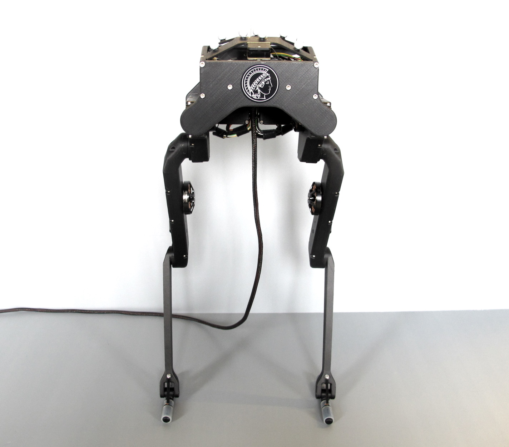  *Biped Robot 6dof - front view For this picture the robot was held by a string.* 

  *Biped Robot 6dof - back view For this picture the robot was held by a string.* 

 *Biped Robot 6dof - sitting posture* 

## Dimensions

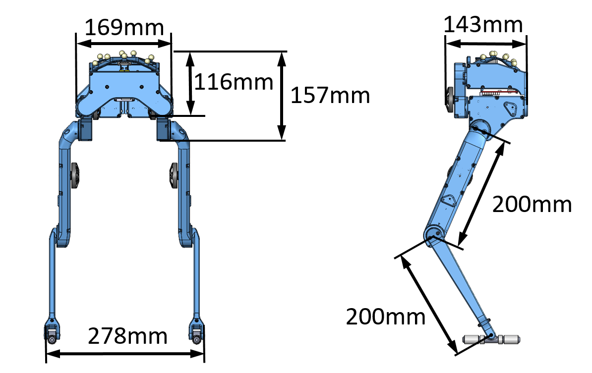 *Biped Robot Dimensons* 

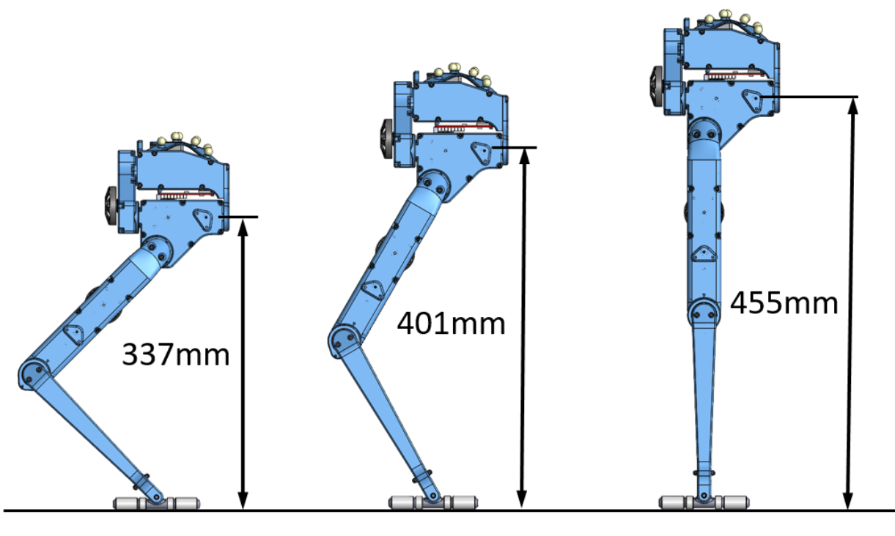 *Biped Robot Hip Height - at 45°, 60° and 90° lower leg angle* 

## Leg Modules
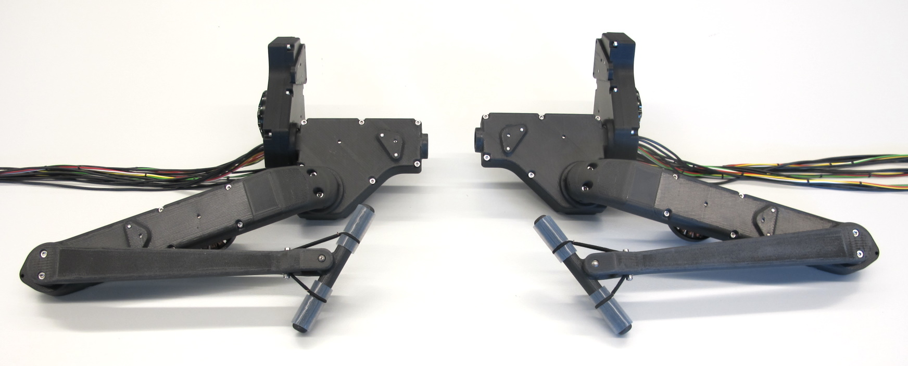 *Biped Leg Modules - right side and left side - 540g each* 

* the legs of the Biped Robot are described here: [Biped Leg 3dof v1 Documentation](../biped_leg_3dof_v1/README.md#biped-leg-3dof-v1)
* all the internal components of the actuator modules are identical
* the internal components of the actuator modules are described here:
  * [Actuator Module Core v1](../actuator_module_v1/README.md#brushless-actuator-module-core-v1)
  * [Actuator Module Core v1.1](../actuator_module_v1/actuator_module_v1.1.md#brushless-actuator-module-core-v11)
* the preparation of the actuator modules is described here: 
  * [Step by Step Instructions](../#step-by-step-instructions)

## Body Module
 *Biped Body Structure Assembled - weight: 99g* 

* the [3d printed parts](#3d-printed-parts) of the body module are listed below
* the [preparation of the 3d printed parts](#preparing-the-3d-printed-parts) is described below

## Electronics

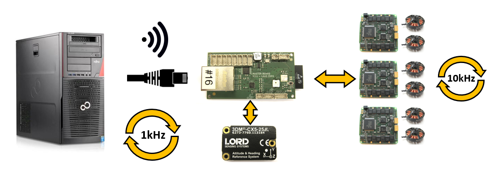    *Electronic Component Overview* 

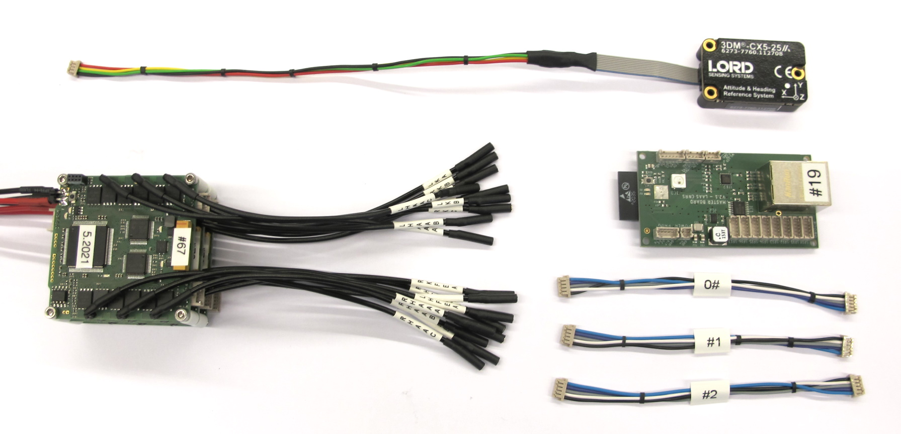   *Electronic Components Biped Robot* 

### Master Board
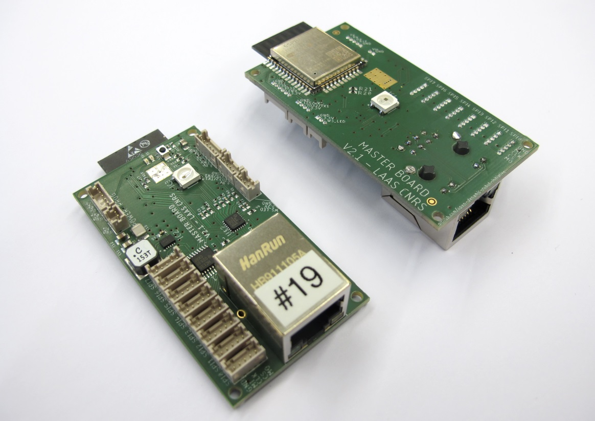   *Master Board v2 - weight: 19g each* 
* Custom electronics board: [Master Board Documentation](https://github.com/open-dynamic-robot-initiative/master-board#master-board)

### Micro Driver Boards
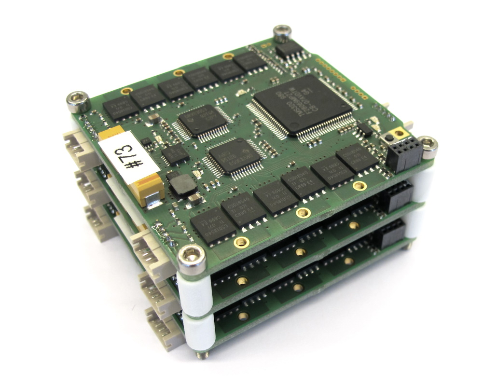   *Micro Driver Boards v2 - stack with 3 cards - weight: 47g* 

* Custom electronics board: [Micro Driver Board Documentation](../../electronics/micro_driver_electronics/README.md#micro-driver-electronics)

### Inertia Measurement Unit
 

* Lord Microstrain 3DM-CX5-25
* Weight: 13g
* [Lord Microstrain webpage](https://www.microstrain.com/inertial/3dm-cx5-25)
* ordering information [below](#bill-of-materials---biped-robot-6dof)

## 3D Printed Parts

 *Parts Body Structure - weight: 87g*

  

`The recommended printing direction for all the parts below is the positive z direction of the stl files.`

All the STL files for 3d printing the body structure can be found here: [STL Files Biped Body Structure](stl_files).  

The preparation of the 3d printed parts is described below: [Preparing the 3D Printed Parts](#preparing-the-3d-printed-parts)

More information about 3d printing can be found here: [Details 3D Printed Parts](../actuator_module_v1/details/details_3d_printed_parts.md#details-3d-printed-parts)

---
  
* [Body Structure Front - STL file](stl_files/body_structure_biped_front.STL) 
* weight: 19g
---
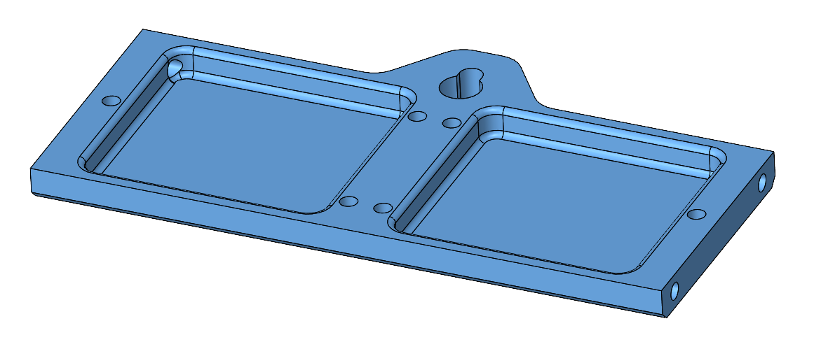  
* [Body Structure Back Rev A- STL file](stl_files/body_structure_biped_back_rev_a.STL) 
* weight: 14g
---
  
* [Body Structure Right Side - STL file](stl_files/body_structure_biped_right_side.STL) 
* weight: 9g
---
  
* [Body Structure Left Side - STL file](stl_files/body_structure_biped_left_side.STL) 
* weight: 9g
---
  
* [Body Structure Bottom - STL file](stl_files/body_structure_biped_bottom.STL) 
* weight: 17g
---
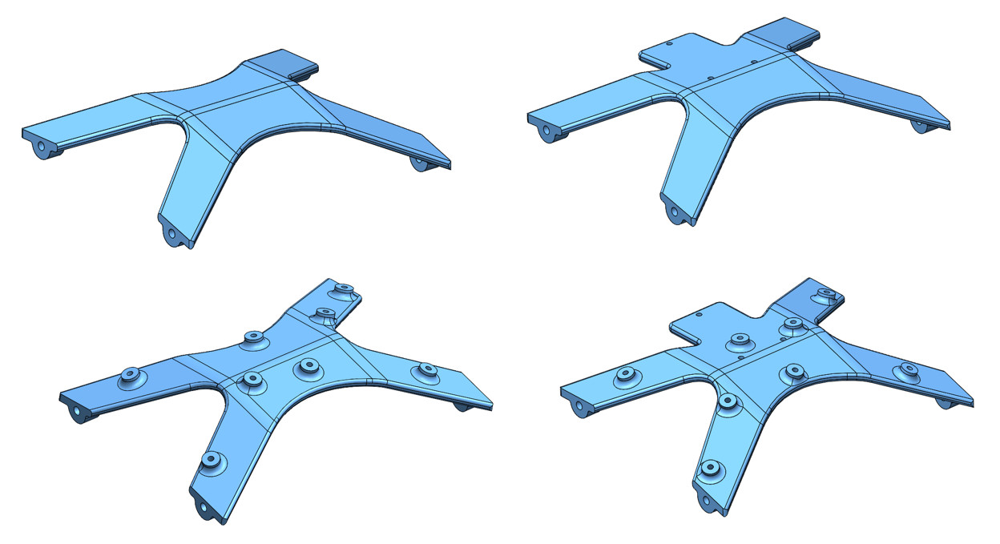 
* there are 4 different versions of the Body Structure Top element available
* minimal version, with IMU, with Vicon markers and with IMU and Vicon markers

---
  
* [Body Structure Top - STL file](stl_files/body_structure_biped_top.STL) 
* weight: 14g
---
  
* [Body Structure Top Vicon - STL file](stl_files/body_structure_biped_top_vicon.STL) 
* weight: 15g
---
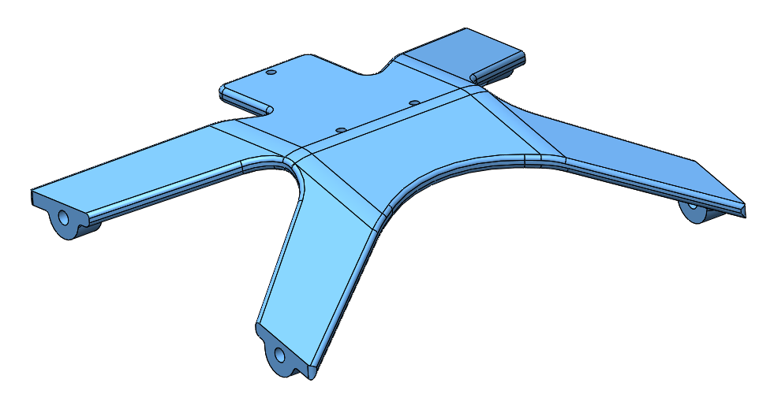  
* [Body Structure Top IMU - STL file](stl_files/body_structure_biped_top_imu.STL) 
* added IMU attachment to the top structure
* weight: 15g
---
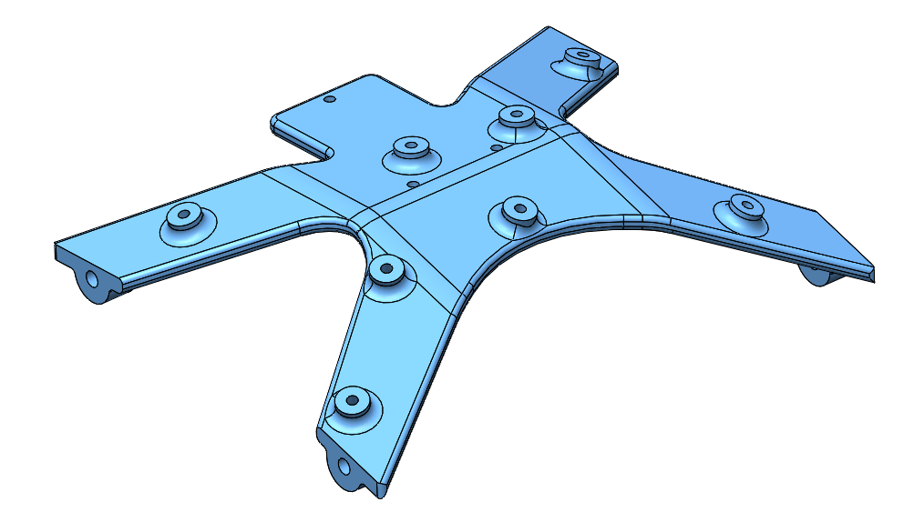  
* [Body Structure Top IMU Vicon - STL file](stl_files/body_structure_biped_top_imu_vicon.STL) 
* added IMU attachment to the top structure
* weight: 16g
---
  
* [Micro Driver Stack Spacer - STL file](stl_files/micro_driver_stack_spacer.STL) 
* weight: 0,2g
---
  
* [Stand Attachment - STL file](stl_files/stand_attachment.STL) 
* weight: 23g
---
  
* [Master Board Protection - STL file](stl_files/body_structure_master_board_protection.STL) 
---

## Off-the-shelf Components
### Hip AA Bearing
  

* Dimensions: 25mm x 20mm x 4mm
* Stainless steel
* Weight: 3,4g each
* Ordering information [below](#bill-of-materials---biped-robot-6dof)

### Fasteners
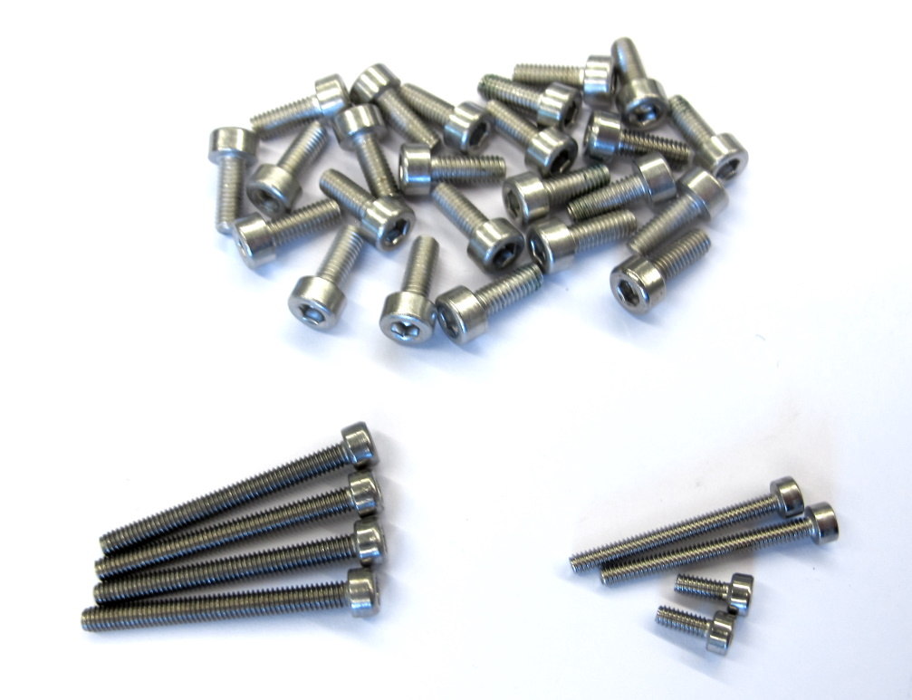 
* M2, M2,5 and M3 fasteners for the biped robot
* we use stainless steel fasteners
* Ordering information [below](#bill-of-materials---biped-robot-6dof)

 
* fasteners for the IMU
* M2,5x16 Slotted Screw - Polyamide Plastic
* Weight: 0,1g each
* Ordering information [below](#bill-of-materials---biped-robot-6dof)

### Helicoil Thread Inserts
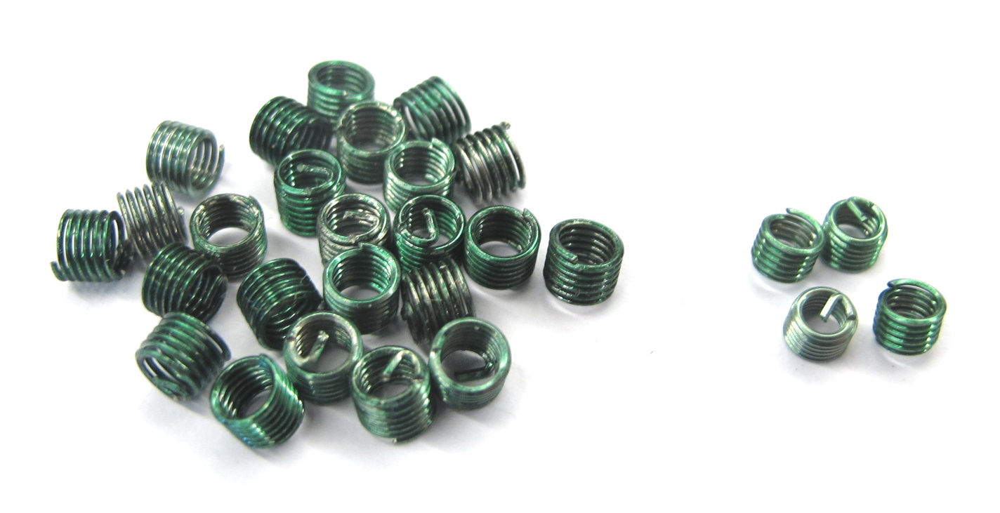 
* we use Helicoil inserts to reinforce the threads of the 3d printed parts
* you need the [Helicoil Tools](../actuator_module_v1/details/details_tools.md#helicoil-tools) to install the threaded inserts
* Helicoil ordering information [below](#bill-of-materials---biped-robot-6dof)

### Vicon Markers
  *Reflective markers for motion capture system - weight: 1g each* 

* 9.5mm Vicon Markers on the base
* M4 x 10 set screws for a attachment
* Weight: 1g each
* Optional - only required for motion capture system
* Ordering information [below](#bill-of-materials---biped-robot-6dof)

## Bill of Materials - Biped Robot 6dof
 

| Description | Quantity | Ordering Information | Comments |  
| --- | --- | --- | --- |   
|Biped Leg 3DOF Right Side|1|[Biped Leg 3DOF Documentation](../biped_leg_3dof_v1/README.md#biped-leg-3dof-v1)|Custom assembly|
|Biped Leg 3DOF Left Side|1|[Biped Leg 3DOF Documentation](../biped_leg_3dof_v1/README.md#biped-leg-3dof-v1)|Custom assembly|
| Master Board v2 | 1 | [Master Board Documentation](https://github.com/open-dynamic-robot-initiative/master-board#master-board) | Custom electronics |
| Micro Driver Board v2 | 3 | [Micro Driver Documentation](../../electronics/micro_driver_electronics/README.md#micro-driver-electronics)  | Custom electronics |
|Inertia Measurement Unit| 1 |[Lord Microstrain 3DM-CX5-25](https://www.microstrain.com/inertial/3dm-cx5-25)   [Distributors](https://www.microstrain.com/support/distributors)| Extended measurement range:  Gyro Rate: +/- 900 deg/sec. Accelerometer range: +/- 20G|
|Body Structure Front |1|[STL file](stl_files/body_structure_biped_front.STL)|[3d printed part](../actuator_module_v1/details/details_3d_printed_parts.md#details-3d-printed-parts)|
|Body Structure Back Rev A|1|[STL file](stl_files/body_structure_biped_back_rev_a.STL)|[3d printed part](../actuator_module_v1/details/details_3d_printed_parts.md#details-3d-printed-parts)|
|Body Structure Right Side |1|[STL file](stl_files/body_structure_biped_right_side.STL)|[3d printed part](../actuator_module_v1/details/details_3d_printed_parts.md#details-3d-printed-parts)|
|Body Structure Left Side |1|[STL file](stl_files/body_structure_biped_left_side.STL)|[3d printed part](../actuator_module_v1/details/details_3d_printed_parts.md#details-3d-printed-parts)|
|Body Structure Bottom |1|[STL file](stl_files/body_structure_biped_bottom.STL)|[3d printed part](../actuator_module_v1/details/details_3d_printed_parts.md#details-3d-printed-parts)|
|Body Structure Top |1|[STL file](stl_files/body_structure_biped_top.STL)|[3d printed part](../actuator_module_v1/details/details_3d_printed_parts.md#details-3d-printed-parts) Alternatives below|
|Body Structure Top Vicon |1|[STL file](stl_files/body_structure_biped_top_vicon.STL)|[3d printed part](../actuator_module_v1/details/details_3d_printed_parts.md#details-3d-printed-parts) With Vicon marker attachments|
|Body Structure Top IMU |1|[STL file](stl_files/body_structure_biped_top_imu.STL)|[3d printed part](../actuator_module_v1/details/details_3d_printed_parts.md#details-3d-printed-parts) With IMU attachment|
|Body Structure Top IMU Vicon|1|[STL file](stl_files/body_structure_biped_top_imu_vicon.STL)|[3d printed part](../actuator_module_v1/details/details_3d_printed_parts.md#details-3d-printed-parts) With IMU and Vicon marker attachment|
|Master Board Protection|1|[STL file](stl_files/body_structure_master_board_protection.STL)|[3d printed part](../actuator_module_v1/details/details_3d_printed_parts.md#details-3d-printed-parts)|
|Micro Driver Stack Spacer |8|[STL file](stl_files/micro_driver_stack_spacer.STL)|[3d printed part](../actuator_module_v1/details/details_3d_printed_parts.md#details-3d-printed-parts)|
|Hip AA Bearing 25mm x 20mm x 4mm   ET2520 2Z VA| 2 | [Emiliana Cuscinetti](https://www.emilianacuscinetti.com/en/miniature-bearings/) [Doppiaemme](https://www.doppiaemme.it/en/prodotti/) [EZO USA](https://catalog.ezo-usa.com/category/metric-series-bearings) [SBN](https://www.sbn.de/en/)|Italy: [Emiliana Cuscinetti](https://www.emilianacuscinetti.com/en/miniature-bearings/) or [Doppiaemme](https://www.doppiaemme.it/en/prodotti/)  USA: [EZO USA](https://catalog.ezo-usa.com/category/metric-series-bearings)  All other countries: Send an email to info@sbn.de and ask for a quote - they ship worldwide.   SBN # C07024  We use stainless steel bearings.|
|Vicon Markers Ø 9,5mm | 8 |[Vicon Distributors](https://www.vicon.com/contact/)|Reflective Vicon Marker, solid, on plastic foot, Ø 9,5mm|
|Fasteners Vicon Markers M4x10 Set Screw | 8 |[Online Schrauben](https://online-schrauben.de/shop/Schrauben/Innensechskantschrauben/DIN-913-Gewindestifte-mit-Innensechskant-und-Kegelkuppe-aehnl.-ISO-4026/Edelstahl-Rostfrei-A2/M-4-Gewinde-M-metrisches-Gewinde)|Stainless steel. Online Schrauben ships within Europe.|
|Fasteners Body Structure M3x8 Socket Head Cap Screw|18|[Online Schrauben](https://online-schrauben.de/shop/Schrauben/Innensechskantschrauben/ISO-4762-DIN-912-Zylinderkopfschrauben-mit-Innensechskant-aehnl.-DIN-912/Edelstahl-Rostfrei-A2/M-3-Gewinde-M-metrisches-Regelgewinde)|Stainless steel. Online Schrauben ships within Europe.|
|Fasteners Hip AA Modules M3x8 Socket Head Cap Screw|6|[Online Schrauben](https://online-schrauben.de/shop/Schrauben/Innensechskantschrauben/ISO-4762-DIN-912-Zylinderkopfschrauben-mit-Innensechskant-aehnl.-DIN-912/Edelstahl-Rostfrei-A2/M-3-Gewinde-M-metrisches-Regelgewinde)|Stainless steel. Online Schrauben ships within Europe.|
|Fasteners Micro Driver Stack M2,5x25 Socket Head Cap Screw|4|[Online Schrauben](https://online-schrauben.de/shop/Schrauben/Innensechskantschrauben/ISO-4762-DIN-912-Zylinderkopfschrauben-mit-Innensechskant-aehnl.-DIN-912/Edelstahl-Rostfrei-A2/M-2,5-Gewinde-M-metrisches-Regelgewinde)|Stainless steel. Online Schrauben ships within Europe.|
|Fasteners Master Board M2x5 Socket Head Cap Screw|2|[Online Schrauben](https://online-schrauben.de/shop/Schrauben/Innensechskantschrauben/ISO-4762-DIN-912-Zylinderkopfschrauben-mit-Innensechskant-aehnl.-DIN-912/Edelstahl-Rostfrei-A2/M-2-Gewinde-M-metrisches-Regelgewinde)|Stainless steel. Online Schrauben ships within Europe.|
|Fasteners Master Board M2x20 Socket Head Cap Screw|2|[Online Schrauben](https://online-schrauben.de/shop/Schrauben/Innensechskantschrauben/ISO-4762-DIN-912-Zylinderkopfschrauben-mit-Innensechskant-aehnl.-DIN-912/Edelstahl-Rostfrei-A2/M-2-Gewinde-M-metrisches-Regelgewinde)|Stainless steel. Online Schrauben ships within Europe.|
|Fasteners IMU M2,5x16 Slotted Screw|3|[Conrad 839940-62](https://www.conrad.com/p/toolcraft-839940-allen-screws-m25-16-mm-slot-din-84-iso-1207-plastic-polyamide-10-pcs-839940)|Polyamide Plastic Shorten to 13mm|
|Helicoil M3 x 4,5mm|24|[RS 470-838](https://de.rs-online.com/web/p/reparatur-einsatzgewinde/0470838/) [Hoffmann 082812 M3](https://www.hoffmann-group.com/GB/en/houk/Power-tools-and-workshop-supplies/Soldering-tools-cleaning-devices-thread-repair/Thread-insert-set%2C-10-or-20-pieces-1-5×D/p/082812-M3?tId=438)|1,5xD Böllhoff 41890030045|
|Helicoil M2,5 x 3,75mm|4|[RS 470-856](https://de.rs-online.com/web/p/reparatur-einsatzgewinde/0470856/) [Hoffmann 082812 M2,5](https://www.hoffmann-group.com/GB/en/houk/Power-tools-and-workshop-supplies/Soldering-tools-cleaning-devices-thread-repair/Thread-insert-set%2C-10-or-20-pieces-1-5×D/p/082812-M2%2C5?tId=362)|1,5xD Böllhoff 41890250375|

## Preparing the 3D Printed Parts

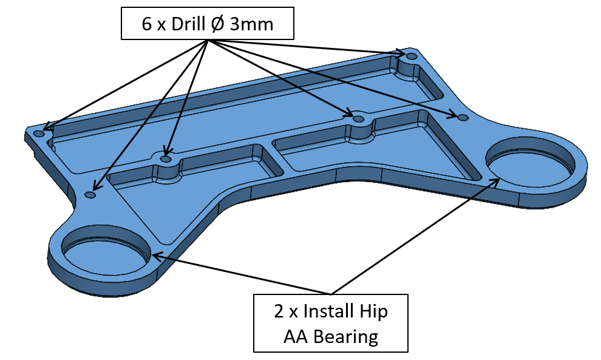 

---
 

---
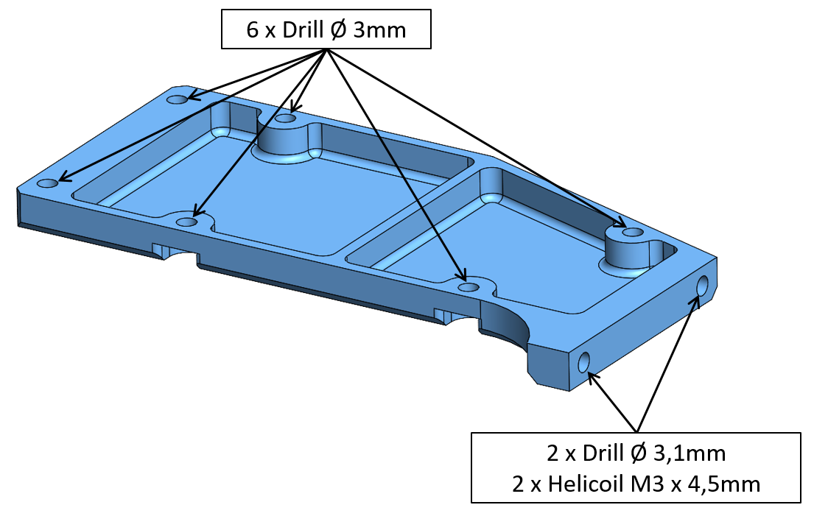 

---
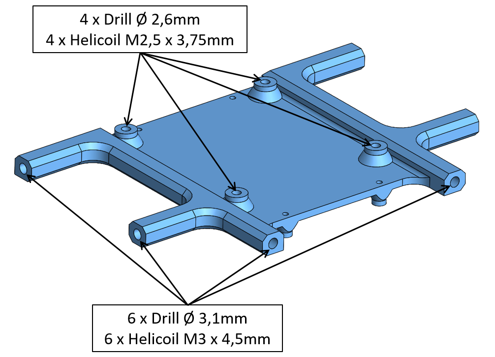 

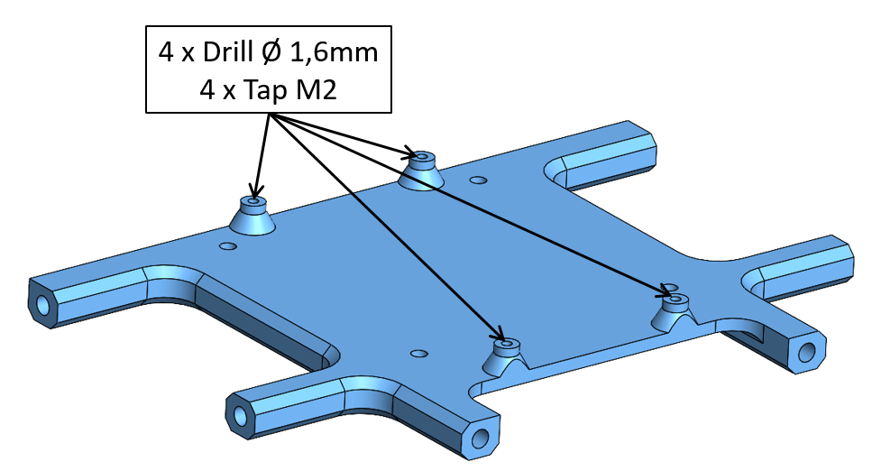 

---
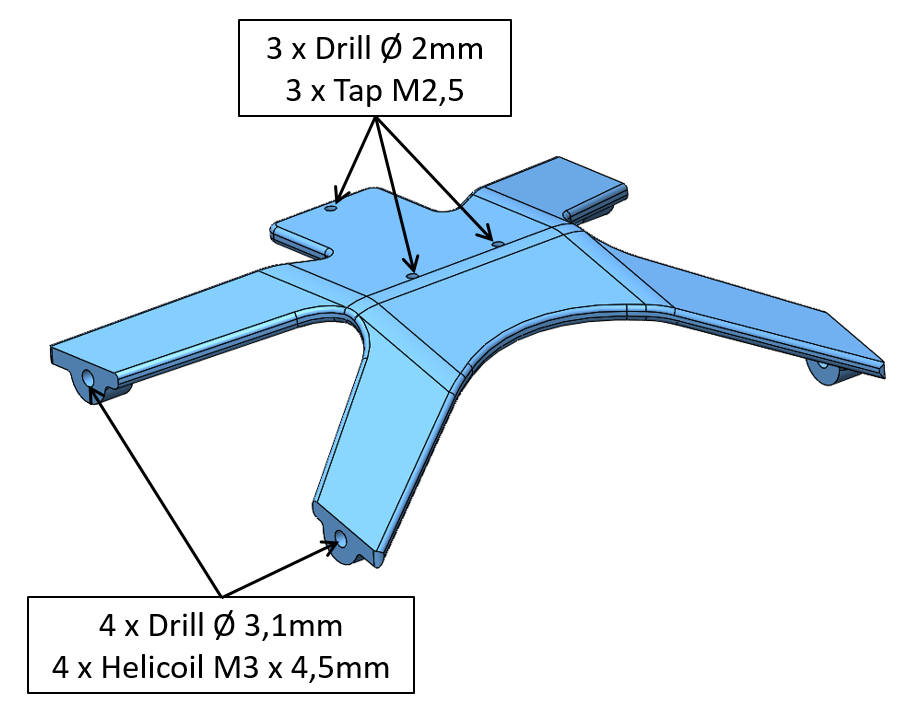 

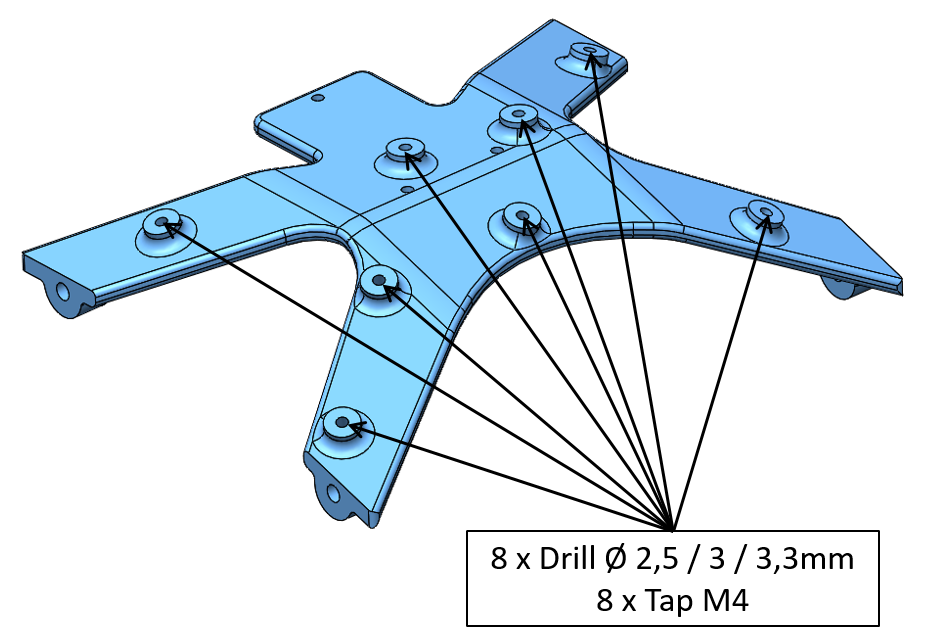 

## Biped Wiring

### Actuator Module Wiring

 *Biped Wiring* 

| Description | Wire Length | Comments |  
| --- | --- | --- |
|Hip AA Motor Phases |20cm|RHAA and LHAA |
|Hip AA Encoder Wire |28cm|RHAA and LHAA|
|Hip FE Motor Phases |27cm|RHFE and LHFE |
|Hip FE Encoder Wire |33cm|RHFE and LHFE|
|Knee Motor Phases |35cm|RK and LK |
|Knee Encoder Wire |42cm|RK and LK|

More wiring information: [Details Wiring](../../electronics/details/details_wiring.md#details-wiring)

### Robot Interface Wire
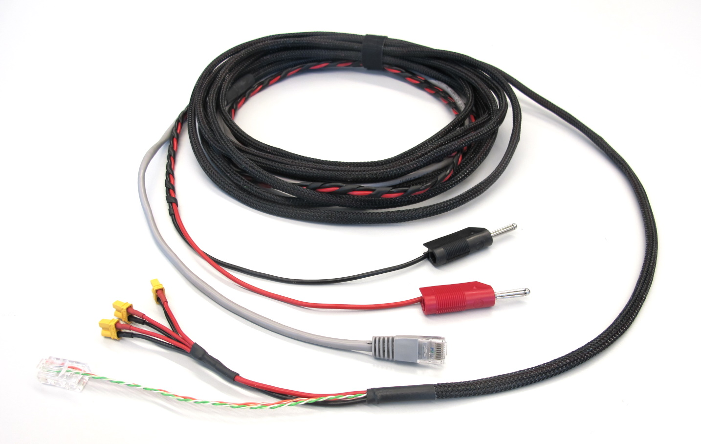 

| Description | Quantity | Wire Length | Comments |  
| --- | --- | --- | --- |   
|Ethernet Wire |1|6m|4 conductors [Details Wiring](../../electronics/details/details_wiring.md#details-wiring)|
|Power Wires |2|6m|24V and ground [Details Wiring](../../electronics/details/details_wiring.md#details-wiring)|

### SPI Wires
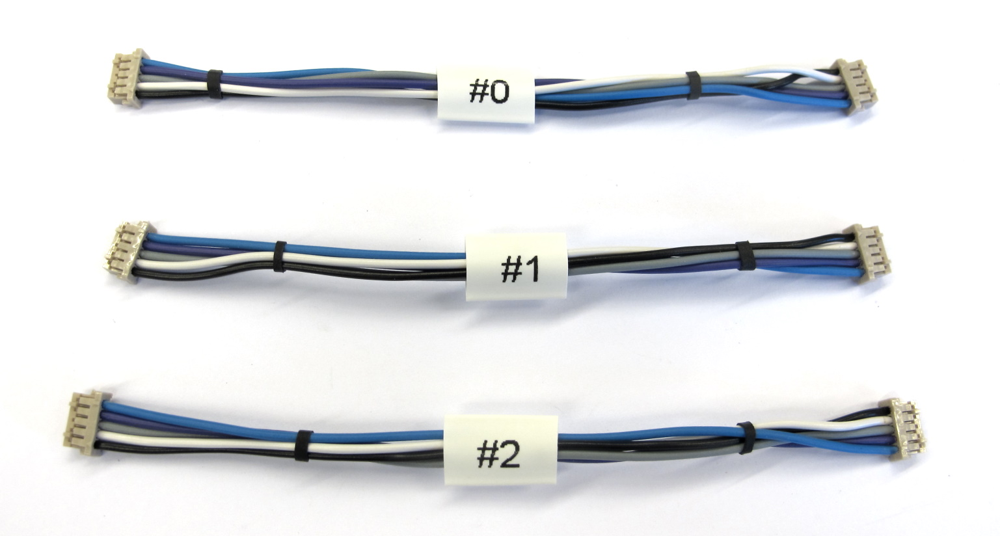 

| Description | Quantity | Wire Length | Comments |  
| --- | --- | --- | --- |   
|SPI Wires |3|10cm|5 conductors [Details Wiring](../../electronics/details/details_wiring.md#details-wiring)|

### IMU Wire
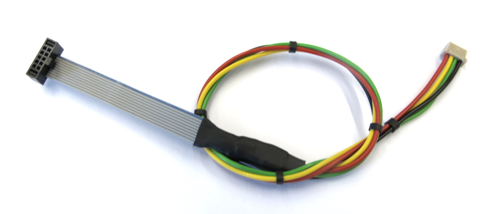 

| Description | Quantity | Wire Length | Comments |  
| --- | --- | --- | --- |   
|IMU Wire |1|25cm|4 conductors [Details Wiring](../../electronics/details/details_wiring.md#details-wiring)|

### Micro Driver Stack
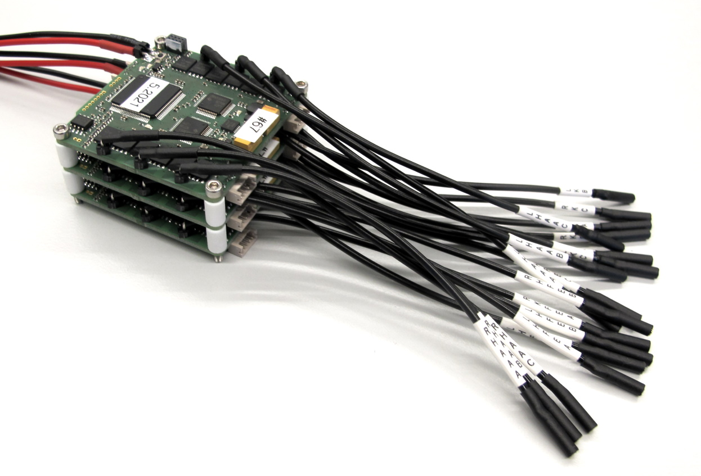 

| Description | Quantity | Wire Length | Comments |  
| --- | --- | --- | --- |   
|Motor Phase Wires |18|11cm|[Details Wiring](../../electronics/details/details_wiring.md#details-wiring)|

### Micro Driver Stack Motor Assignment
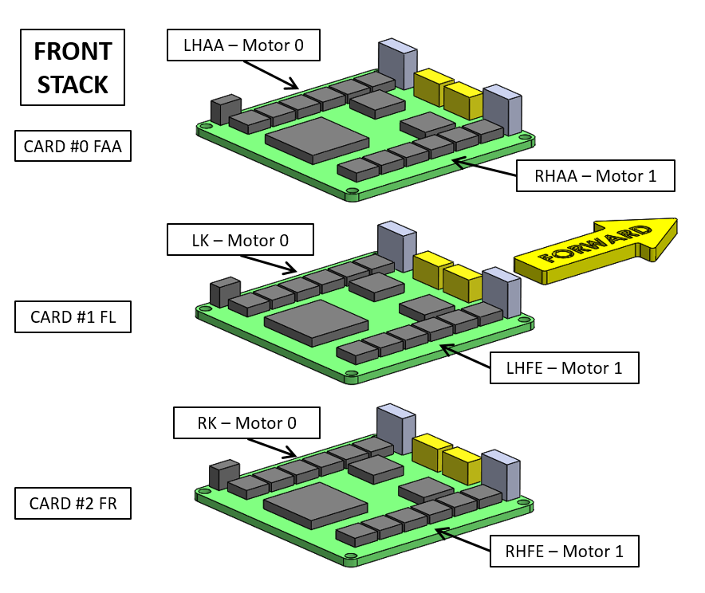 

## Vicon Object
  *Body Structure Top element with Vicon markers - weigth: 23g* 

  *Biped body structure with Vicon markers - weight: 106g*

 *Vicon marker positions - Click on picture above to view the PDF drawing* 

* You can download the Vicon object here: [Biped Vicon Object](details/biped_vicon_object.zip)

## Robot Coordinate System Origin
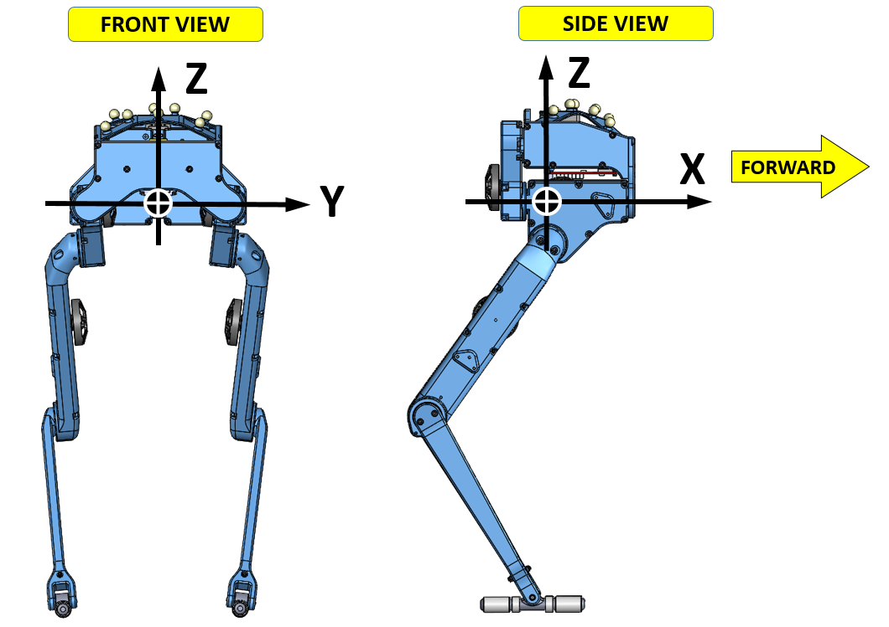  

* more information about the conventions that we use for our robots: [Conventions](../general/conventions.md#conventions)

## Inertial Sensor Origin Position
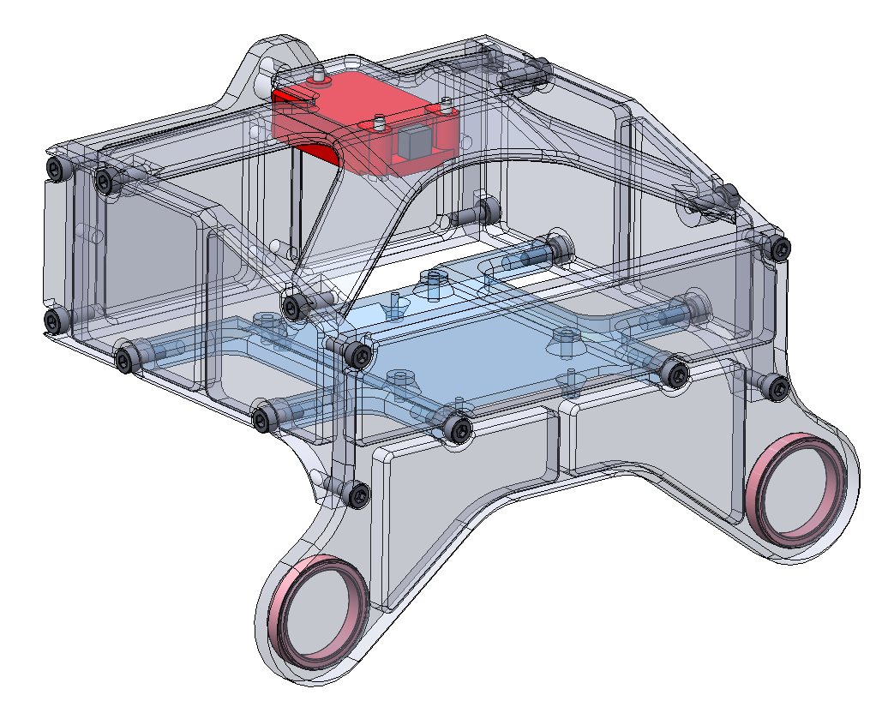  *IMU position - the IMU is colored red in the screenshot above*

* the IMU is mounted to the top element of the body structure
* the label on the IMU is pointing downwards (see picture below)
* the coordinate systems of the IMU and the Biped Robot have the same orientation - more information here: [Coordinate System Conventions](../general/conventions.md#conventions)
* the offset between the coordinate systems is documented below
* the IMU origin is **not** in the geometrical center of the IMU
* [IMU Technical Drawing - see Page 2](https://s3.amazonaws.com/download.microstrain.com/Drawings/3065-0291-ICD.pdf)

|IMU Origin Position in the Robot Coordinate System| X | Y | Z |  
| --- | --- | --- | --- |
||-0,13mm|-6,35mm|77,40mm|

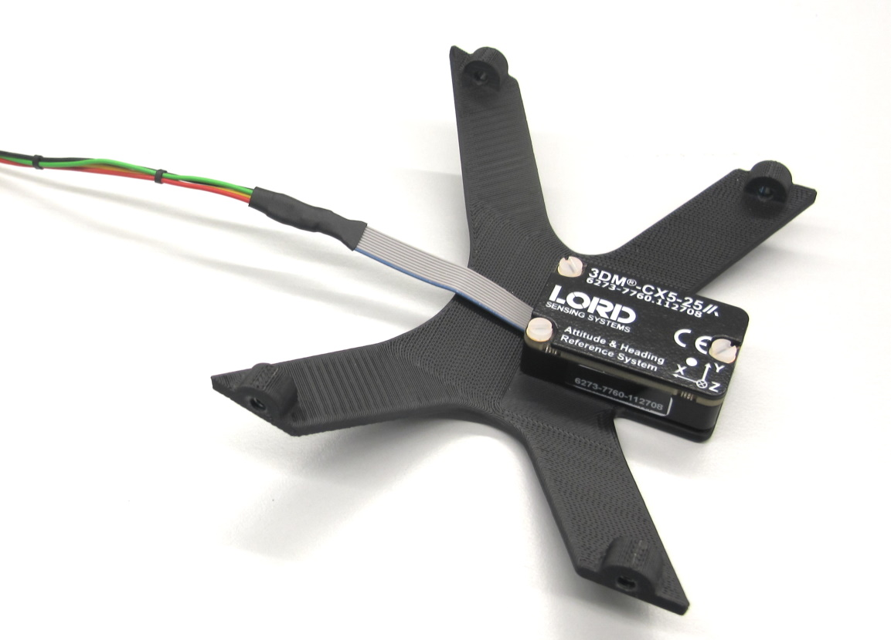  

## Simplified 3D Model

 *Click on picture above to view the PDF drawing.* 

* The simplified STL files for visualization and simulation can be found here: [STL Files Visualization](stl_files_for_visualization)

## Biped Inertia Parameters for Simulation
 *Biped Inertia Parameters - Click on picture to view PDF document.* 

## Robot Stand
  *Biped Robot 6dof - on stand* 

| Description | Quantity | Ordering Information | Comments |  
| --- | --- | --- | --- |   
|Stand Attachment|1|[STL file](stl_files/stand_attachment.STL)|[3d printed part](../actuator_module_v1/details/details_3d_printed_parts.md#details-3d-printed-parts)|
|Aluminum Profile Back|1|[Item 7.0.000.09](https://product.item24.de/en/products/product-catalogue/productdetails/products/line-8-construction-profiles-1001042794/profile-8-40x40-e-natural-7000009/)|Size 8 - 40mm x 40mm Length: 70cm|
|Aluminum Profile Top|1|[Item 7.0.000.09](https://product.item24.de/en/products/product-catalogue/productdetails/products/line-8-construction-profiles-1001042794/profile-8-40x40-e-natural-7000009/)|Size 8 - 40mm x 40mm Length: 25cm Tap M8x1,25|
|Aluminum Profile Bottom|1|[Item 7.0.000.09](https://product.item24.de/en/products/product-catalogue/productdetails/products/line-8-construction-profiles-1001042794/profile-8-40x40-e-natural-7000009/)|Size 8 - 40mm x 40mm Length: 30cm|
|Aluminum Profile Side|1|[Item 7.0.000.09](https://product.item24.de/en/products/product-catalogue/productdetails/products/line-8-construction-profiles-1001042794/profile-8-40x40-e-natural-7000009/)|Size 8 - 40mm x 40mm Length: 45cm|
|Angle Bracket|4|[Item 0.0.411.15](https://product.item24.de/en/products/product-catalogue/productdetails/products/angle-brackets-zn-1001046547/angle-bracket-set-8-40x40-41115/)|90 degree angle bracket 40mm|
|End Caps|4|[Item 0.0.026.01](https://product.item24.de/en/products/product-catalogue/productdetails/products/caps-for-profiles-in-modular-dimensions-1001042804/cap-8-40x40-black-2601/)|Size 8|
|Rubber Feet|3|[RS 173-5948](https://de.rs-online.com/web/p/dampfungspads/1735948/)|20,6mm x 20,6mm x 7,6mm	|
|Helicoil M4 x 6mm|1|[RS 471-005](https://de.rs-online.com/web/p/reparatur-einsatzgewinde/0471005/)|1,5xD  Böllhoff 41890040006 M4 Helicoil Tools required.|
|Fastener Stand Attachment M8x25 Flat Head Screw|1|[Online Schrauben](https://online-schrauben.de/shop/Schrauben/Innensechskantschrauben/ISO-10642-DIN-7991-Senkschrauben-mit-Innensechskant-aehnl.-DIN-7991/Edelstahl-Rostfrei-A2/M-8-Gewinde-M-metrisches-Gewinde)|Stainless steel. Online Schrauben ships within Europe.|
|Fastener Stand Interface M4x40 Socket Head Cap Screw|1|[Online Schrauben](https://online-schrauben.de/shop/Schrauben/Innensechskantschrauben/ISO-4762-DIN-912-Zylinderkopfschrauben-mit-Innensechskant-aehnl.-DIN-912/Edelstahl-Rostfrei-A2/M-4-Gewinde-M-metrisches-Regelgewinde)|Stainless steel. Online Schrauben ships within Europe.|
|Fastener Stand Interface M4 Locknut|1|[Online Schrauben](https://online-schrauben.de/shop/Muttern/Sicherungsmuttern/ISO-10511-Sechskantmuttern-selbstsichernd-mit-Polyamid-Klemmteil-Temperaturbereich-50-bis-120-,-gemaess-neuer-ISO-Norm-aehnl.-DIN-985/Edelstahl-Rostfrei-A2)|Stainless steel. Online Schrauben ships within Europe.|

## Robot Stand Preparation
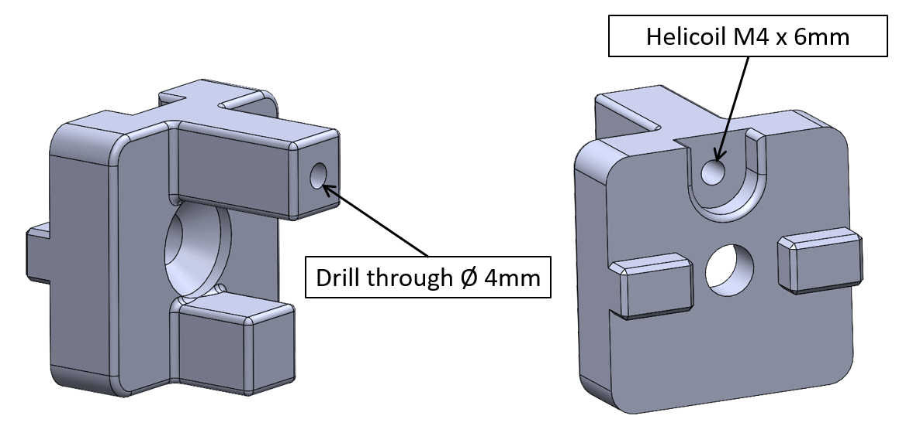 

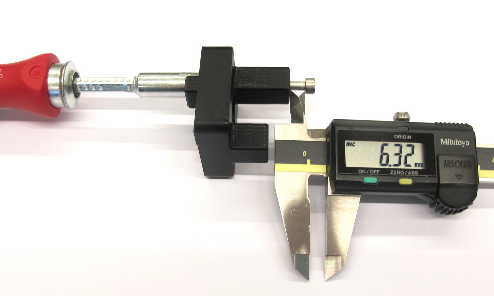 *Adjust the distance between the screw head and the 3d printed part to about 6,3mm and tighten the lock nut.* 

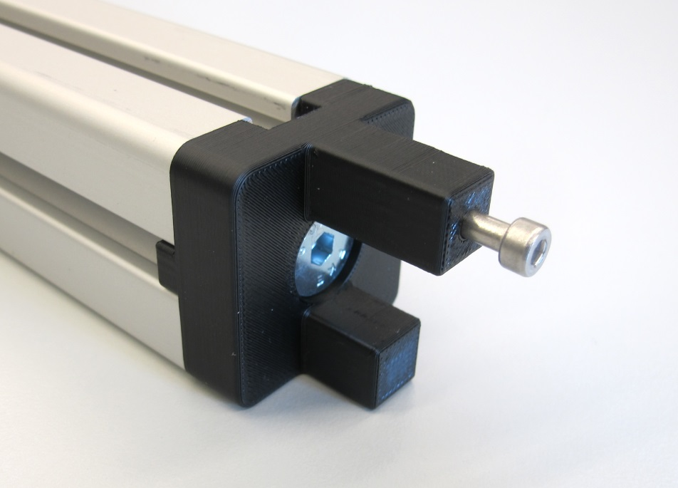 *Tap a M8x1,25 thread into the center hole of the top profile. Install the Stand Attachment with a M8x25 Flat Head Screw.* 

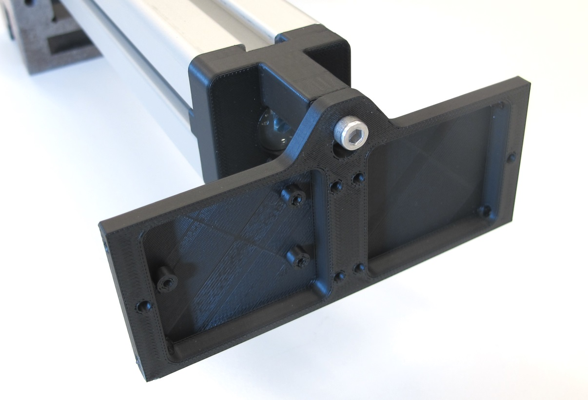 *Body Structure Back on Stand Attachment.* 

## Robot Calibration

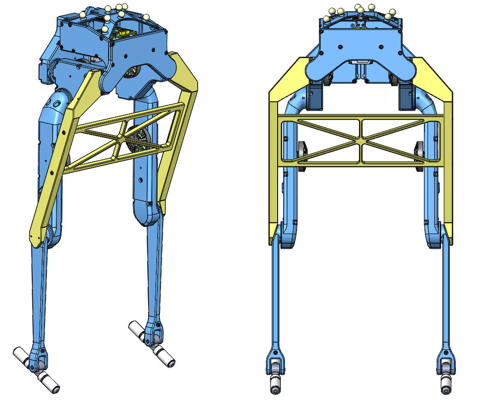 

* [Details Biped Calibration Tool](../general/robot_calibration.md#calibration-tool-biped-6dof)

## View the biped cad model in your web browser
 

<a href="https://open-dynamic-robot-initiative.github.io/cad_files/biped">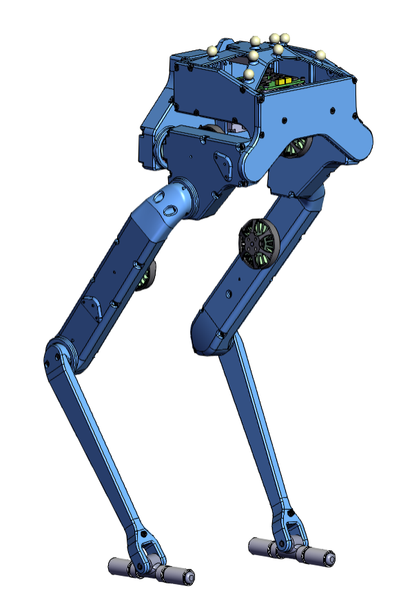</a>  *Biped Robot 6dof - Click on the picture to view the biped cad model in your browser* 

## CAD Files

The Solidworks CAD files are available here: [Biped 6dof v1 Solidworks CAD files](cad_files/Solidworks/biped_6dof_v1.zip)

## Authors
Felix Grimminger

## License
BSD 3-Clause License

## Copyright
Copyright (c) 2019-2021, Max Planck Gesellschaft and New York University

## More Information
[Open Dynamic Robot Initiative - Webpage](https://open-dynamic-robot-initiative.github.io)  
[Open Dynamic Robot Initiative - YouTube Channel](https://www.youtube.com/channel/UCx32JW2oIrax47Gjq8zNI-w)   
[Open Dynamic Robot Initiative - Forum](https://odri.discourse.group/categories)  
[Open Dynamic Robot Initiative - Paper](https://arxiv.org/pdf/1910.00093.pdf)  
[Hardware Overview](../../README.md#open-robot-actuator-hardware)  
[Software Overview](https://github.com/open-dynamic-robot-initiative/open-dynamic-robot-initiative.github.io/wiki)
