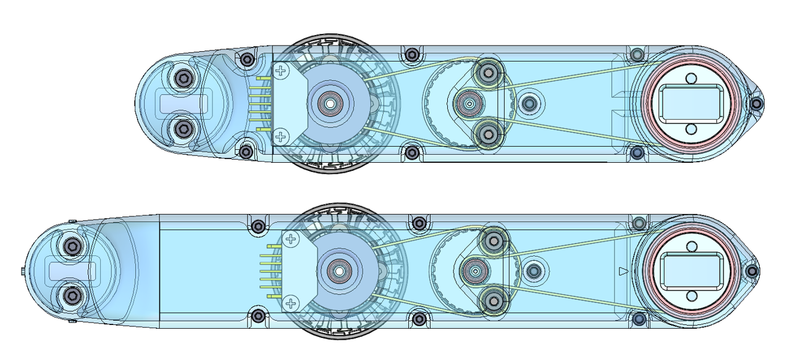
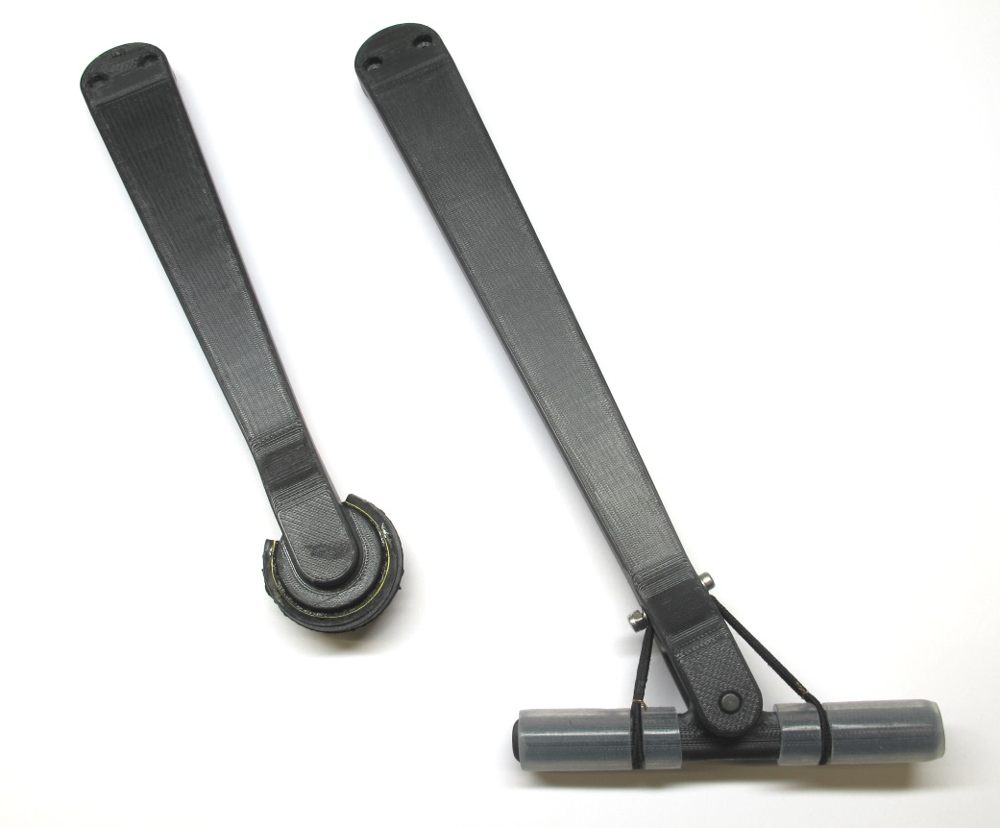

# Biped Leg 3dof v1
 *Biped Leg Cad Model*

 *Biped Leg 3dof - weight: 500g*

---
## Hip FE Actuator Module
* the timing belt of the second stage was rotated by 145 degrees
* this makes the module shorter and more suitable for the biped robot
* all the internal parts are identical to the original actuator module

 *Biped Hip FE Actuator Module - weight: 155g*  

    

---
## Hip AA Actuator Module
 *Biped Hip AA Actuator Module - weight: 153g*  

    

---
## Upper Leg Module

  *Extended upper leg module for biped robot*  

* initially we were using the standard upper leg module with a segment length of 160mm for the biped
* we are now using an extended upper leg structure with 200mm segment length
* the lower leg length was also increased to 200mm
* the longer legs help to decrease the natural frequency of the system
* the interfaces of both versions are compatible and all the internal parts are identical

  *Comparison Upper Leg Versions - Top: Upper Leg 160mm / Bottom: Upper Leg 200mm*  

---
## Lower Leg with Passive Ankle Joint

  *Foot with passive ankle joint*  

* the length of the lower leg was increased to 200mm and a foot with passive ankle joint was added
* the line contact of the new foot helps to stabilize yaw angle of the robot

  *Comparison Lower Leg Versions: Lower Leg with point contact and lower leg with passive ankle joint*  

## Off-the-shelf-components
  

* Steel pin - 5mm diameter / length 28mm
* Silicone tube - O.D. 12mm / I.D. 8mm / RS 163-9362
* Cut 4 silicone tube pieces - 2 x 25mm length and 2 x 8mm length
* M2,5 x 20mm socket head cap screw with washers and locknut
* Rubber band

## 3D Printed Parts
`The recommended printing direction for all the parts below is the positive z direction of the stl file.`

All the STL files for 3d printing the biped legs can be found here: [STL Files Biped Leg 3dof](stl_files).  

  
* [Hip AA Structure Right Side Base - STL file](stl_files/hip_aa_structure_right_side_base.STL) 
* weight: 22g
---
  
* [Hip AA Structure Right Side Cover - STL file](stl_files/hip_aa_structure_right_side_cover.STL) 
* weight: 17g
---
  
* [Hip AA Structure Left Side Base - STL file](stl_files/hip_aa_structure_left_side_base.STL) 
* weight: 22g
---
  
* [Hip AA Structure Left Side Cover - STL file](stl_files/hip_aa_structure_left_side_cover.STL) 
* weight: 17g
---
  
* [Hip FE Structure Right Side Base - STL file](stl_files/hip_fe_structure_right_side_base.STL) 
* weight: 24g
---
  
* [Hip FE Structure Right Side Cover - STL file](stl_files/hip_fe_structure_right_side_cover.STL) 
* weight: 16g
---
  
* [Hip FE Structure Left Side Base - STL file](stl_files/hip_fe_structure_left_side_base.STL) 
* weight: 24g
---
  
* [Hip FE Structure Left Side Cover - STL file](stl_files/hip_fe_structure_left_side_cover.STL) 
* weight: 16g
---
  
* [Upper Leg Structure Base 200mm - STL file](stl_files/upper_leg_structure_base_200mm.STL) 
* weight: 35g
---
  
* [Upper Leg Structure Cover 200mm - STL file](stl_files/upper_leg_structure_cover_200mm.STL) 
* weight: 15g
---
  
* [Lower Leg Structure 200mm - STL file](stl_files/lower_leg_structure_200mm.STL) 
* printed with sparse double dense printer setting
* weight: 28g
---
  
* [Foot Structure - STL file](stl_files/foot_structure.STL) 
* weight: 12g
---

## Authors
Felix Grimminger

## License
BSD 3-Clause License

## Copyright
Copyright (c) 2019-2020, Max Planck Gesellschaft and New York University

## More Information
[Open Dynamic Robot Initiative - Webpage](https://open-dynamic-robot-initiative.github.io)  
[Open Dynamic Robot Initiative - YouTube Channel](https://www.youtube.com/channel/UCx32JW2oIrax47Gjq8zNI-w)   
[Open Dynamic Robot Initiative - Forum](https://odri.discourse.group/categories)  
[Open Dynamic Robot Initiative - Paper](https://arxiv.org/pdf/1910.00093.pdf)  
[Hardware Overview](../../README.md#open-robot-actuator-hardware)  
[Software Overview](https://github.com/open-dynamic-robot-initiative/open-dynamic-robot-initiative.github.io/wiki)
