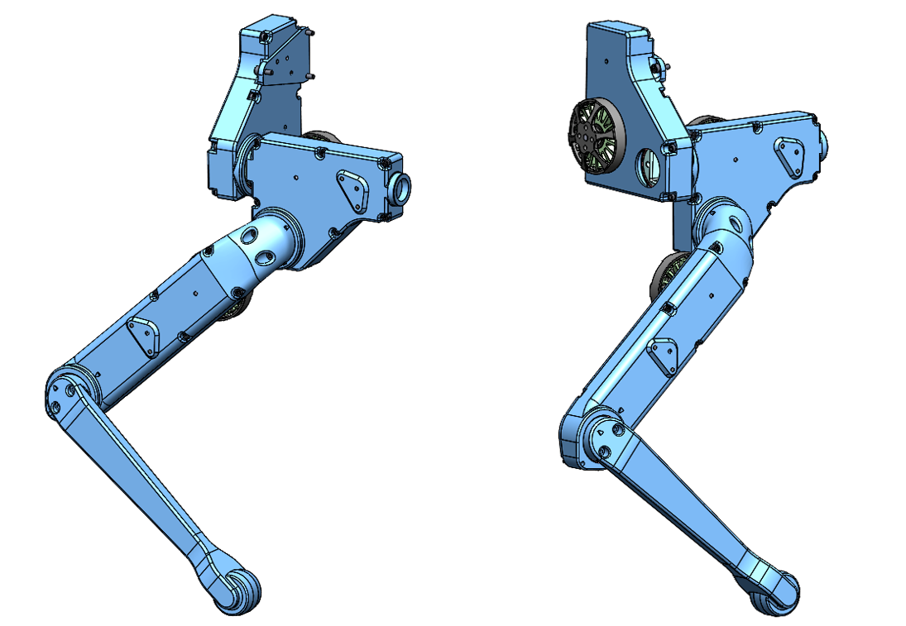
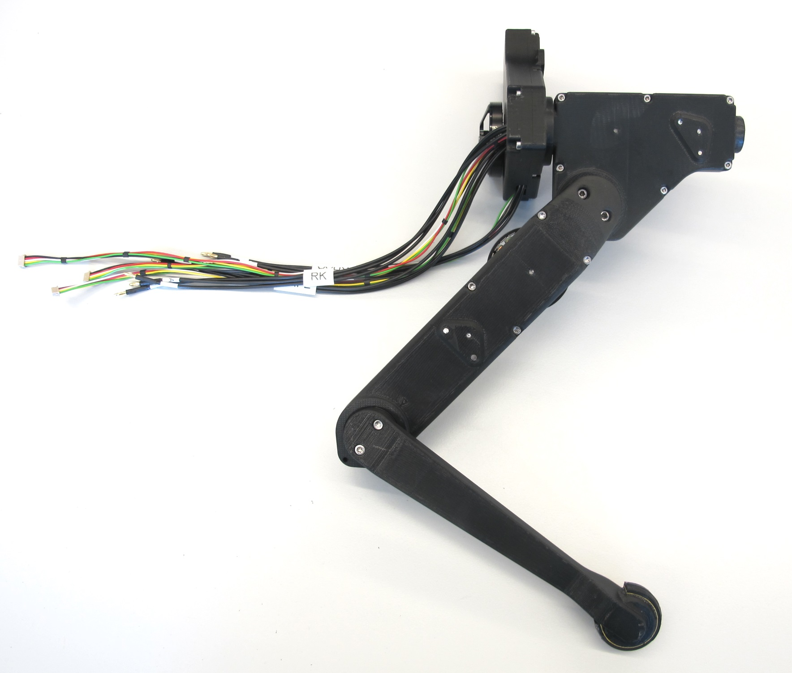
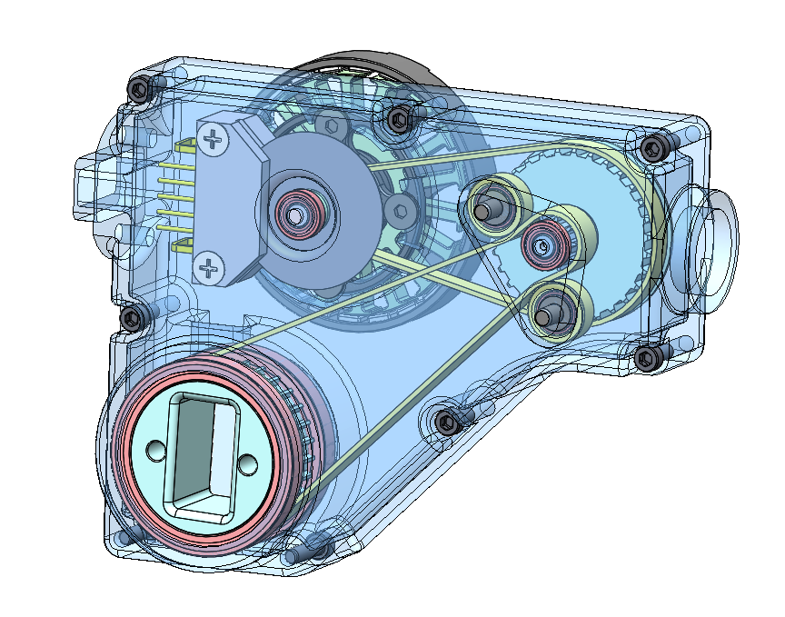
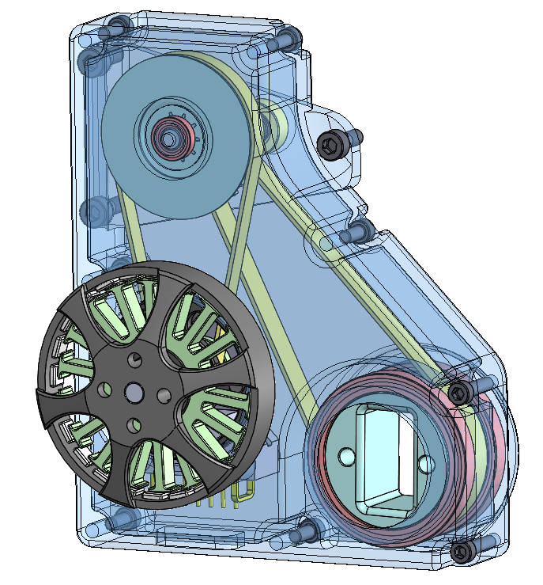

# Biped Leg 3dof v1
 *Biped Leg Cad Model*

 *Biped Leg 3dof - weight: 500g*

---
## Hip FE Actuator Module
* the timing belt of the second stage was rotated by 145 degrees
* this makes the module shorter and more suitable for the biped robot
* all the internal parts are identical to the original actuator module

 *Biped Hip FE Actuator Module - weight: 155g*  

    

---
## Hip AA Actuator Module
 *Biped Hip AA Actuator Module - weight: 153g*  

    

## 3D Printed Parts
`The recommended printing direction for all the parts below is the positive z direction of the stl file.`

All the STL files for 3d printing the biped legs can be found here: [STL Files Biped Leg 3dof](stl_files).  

  
* [Hip AA Structure Right Side Base - STL file](stl_files/hip_aa_structure_right_side_base.STL) 
* weight: 22g
---
  
* [Hip AA Structure Right Side Cover - STL file](stl_files/hip_aa_structure_right_side_cover.STL) 
* weight: 17g
---
  
* [Hip AA Structure Left Side Base - STL file](stl_files/hip_aa_structure_left_side_base.STL) 
* weight: 22g
---
  
* [Hip AA Structure Left Side Cover - STL file](stl_files/hip_aa_structure_left_side_cover.STL) 
* weight: 17g
---
  
* [Hip FE Structure Right Side Base - STL file](stl_files/hip_fe_structure_right_side_base.STL) 
* weight: 24g
---
  
* [Hip FE Structure Right Side Cover - STL file](stl_files/hip_fe_structure_right_side_cover.STL) 
* weight: 16g
---
  
* [Hip FE Structure Left Side Base - STL file](stl_files/hip_fe_structure_left_side_base.STL) 
* weight: 24g
---
  
* [Hip FE Structure Left Side Cover - STL file](stl_files/hip_fe_structure_left_side_cover.STL) 
* weight: 16g
---
## Authors
Felix Grimminger

## License
BSD 3-Clause License

## Copyright
Copyright (c) 2019-2020, Max Planck Gesellschaft and New York University

## More Information
[Open Dynamic Robot Initiative - Webpage](https://open-dynamic-robot-initiative.github.io)  
[Open Dynamic Robot Initiative - YouTube Channel](https://www.youtube.com/channel/UCx32JW2oIrax47Gjq8zNI-w)   
[Hardware Overview](../../README.md)  
[Software Overview](https://github.com/open-dynamic-robot-initiative/open-dynamic-robot-initiative.github.io/wiki)
