# Dual Motor Testbed v1

  *Dual Motor Testbed consisting of two motors, two encoders and 3d printed parts*

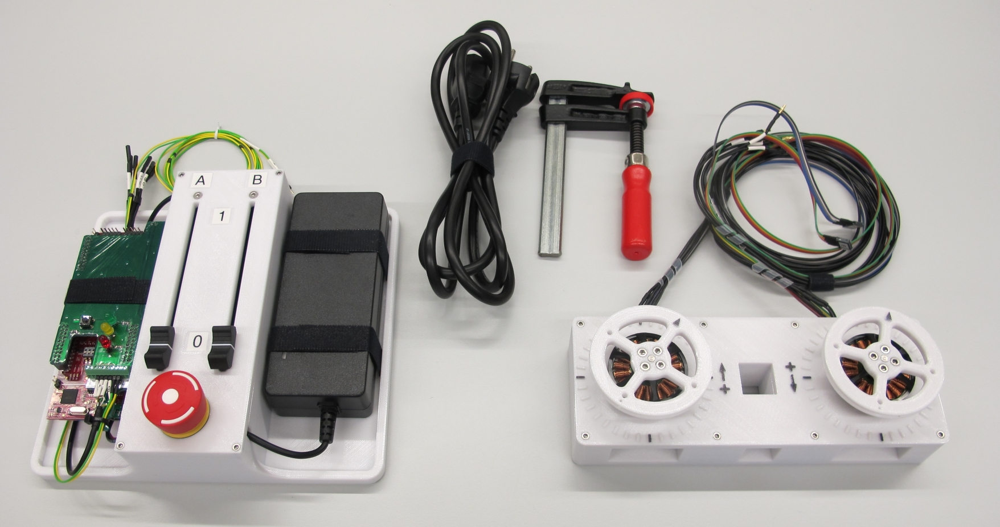  *Dual Motor Testbed with Dual Motor Electronics Box*

  *The testbed can be clamped to the table for experiments*

## Description
* this is the simplest mechanical setup to get started with brushless motor torque control
* the testbench consists of two brushless motors and two high resolution encoders mounted directly onto the motor shaft
* the encoders are required for the precise commutation of the motors using field oriented control
* in contrast to "sensorless" control (which the Texas Instruments boards also support) the torque control also works at slow speeds and when the motor is stalled

## Off-the-shelf Components

### Brushless DC Motor

  

  * T-Motor Antigravity 4004 300kV
  * 24 magnets / 12 pole pairs / 18 slots
  * 3 phase WYE Configuration / Star Configuration
  * Rotor diameter: 45mm
  * Weight: 53g
  * the Antigravity motors are sold in sets of two pieces
  * [T-Motor Webpage](http://store-en.tmotor.com/goods.php?id=438)

### Optical Encoder
  
  * Broadcom Encoder Kit AEDM-5810-Z12 consisting of the AEDT-9810-Z00 encoder and the high resolution code wheel with index
  * 5000 pulses per revolution per channel
  * 5V two channel quadrature output with index pulse (ABZ)
  * Code wheel diameter: 26mm
  * Weight: 5g  
  * Instructions on how to extract the encoder and the code wheel from the kit can be found here: [Instructions Encoder Kit Disassembly](../actuator_module_v1/details/details_encoder_kit_disassembly.md)
  * [Broadcom Encoder AEDT-9810-Z00 Webpage](https://www.broadcom.com/products/motion-control-encoders/incremental-encoders/transmissive-encoders/aedt-981x)  

## Machined Parts

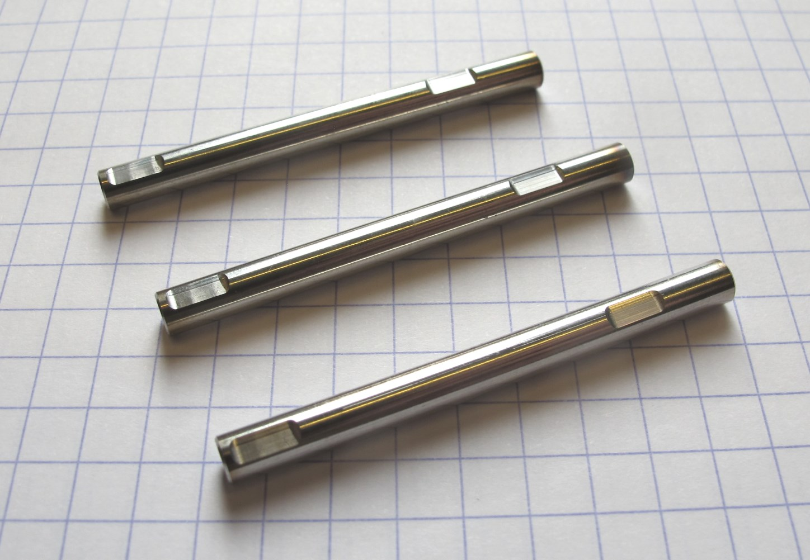  *Custom motor shaft made from stainless steel*    
* for attaching the codewheel the original motor shaft has to be replaced by this custom motor shaft
* Instructions on how to replace the original motor shaft can be found here: [Instructions Motor Preparation](../actuator_module_v1/details/details_motor_preparation.md)

<a href="details/motor_antigravity_4004_custom_shaft.PDF">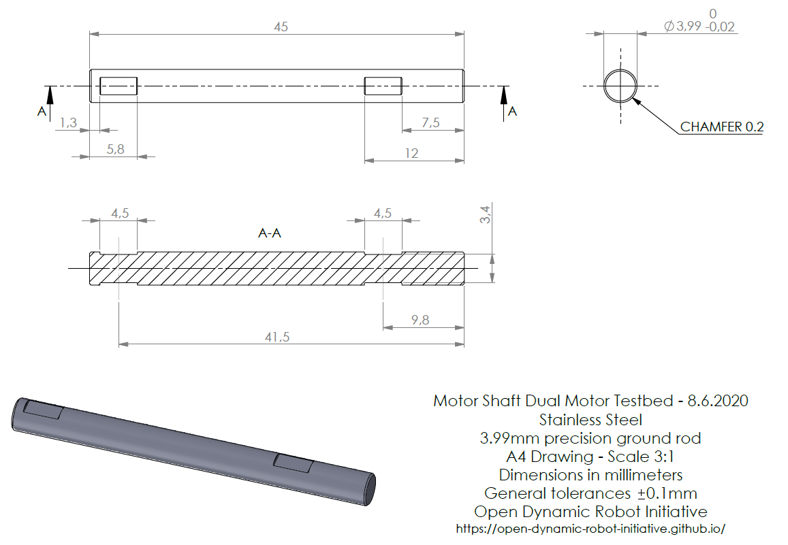</a> *Click on picture above to view the PDF drawing*

## 3D Printed Parts

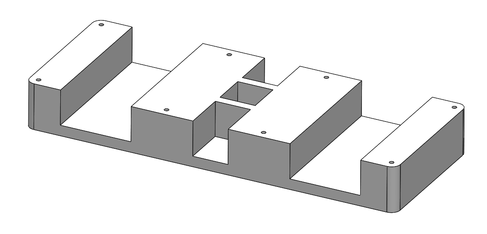  
* [Dual Motor Testbed Base - STL file](stl_files/dual_motor_testbed_base.STL) 
* we print this part with the "sparse double dense" printer setting
* that saves material and print time
* the recommended printing direction is the positive z direction of the stl file
---
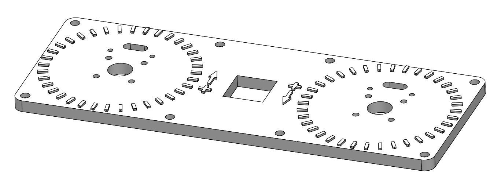  
* [Dual Motor Testbed Cover - STL file](stl_files/dual_motor_testbed_cover.STL) 
* the recommended printing direction is the positive z direction of the stl file
---
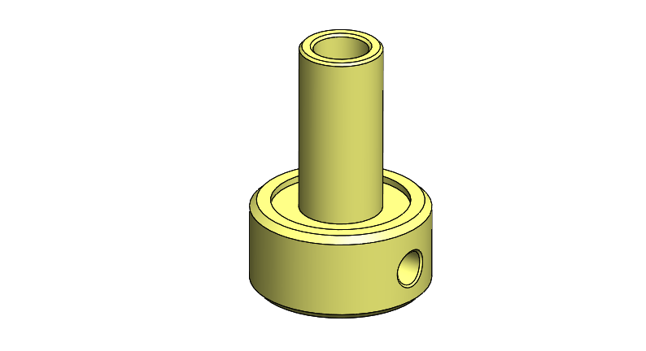  
* [Encoder Code Wheel Mount - STL file](stl_files/encoder_code_wheel_mount.STL) 
* the recommended printing direction is the positive z direction of the stl file
---
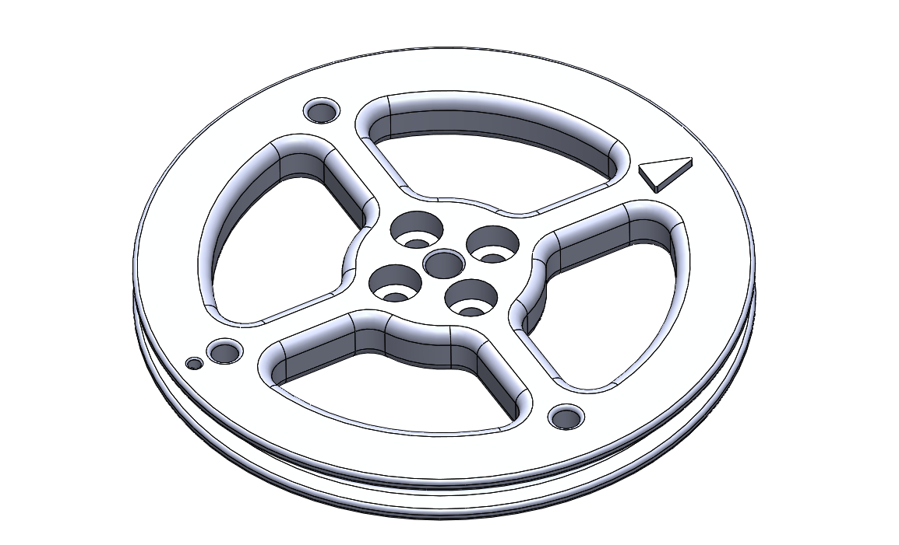  
* [Hand Wheel - STL file](stl_files/hand_wheel.STL) 
* the recommended printing direction is the positive z direction of the stl file
---
# Bill of Materials - Dual Motor Testbed
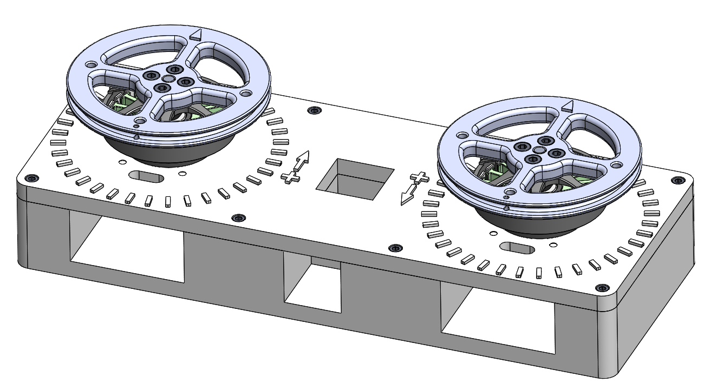

| Part Name | Quantity | Ordering Information | Comments |  
| --- | --- | --- | --- |  
| Brushless Motor | 2 | T-Motor Antigravity 4004 300kV | Sold in set of two pieces |  
| Optical Encoder with Codewheel | 2 | Broadcom Encoder Kit AEDM-5810-Z12 Digi-Key 516-3253-ND | Kit has do be disassembled |      
| Custom Motor Shaft | 2 | [PDF Drawing](details/motor_antigravity_4004_custom_shaft.PDF) | Machined part |  
| Testbed Base | 1 | [STL file](stl_files/dual_motor_testbed_base.STL) | 3d printed part |
| Testbed Cover | 1 | [STL file](stl_files/dual_motor_testbed_cover.STL) | 3d printed part |
| Code Wheel Mount | 2 | [STL file](stl_files/encoder_code_wheel_mount.STL) | 3d printed part |
| Hand Wheel | 2 | [STL file](stl_files/hand_wheel.STL) | 3d printed part |
| Rubber Feet | 6 | RS 236-509 | Optional |
| Fasteners Stator and Hand Wheel | 16 | Socket Head Cap Screw M3x6 | Stainless steel |
| Fasteners Testbed Cover | 8 | Socket Head Cap Screw M2,5x8 | Stainless steel |
| Fasteners Code Wheel Mount | 4 | Set Screw M3x4 | Stainless steel |
| Fasteners Encoder | 4 | Flat Head Phillips Screw M3x16 Conrad 839967 | Nylon |

---
# Dual Motor Electronics Box
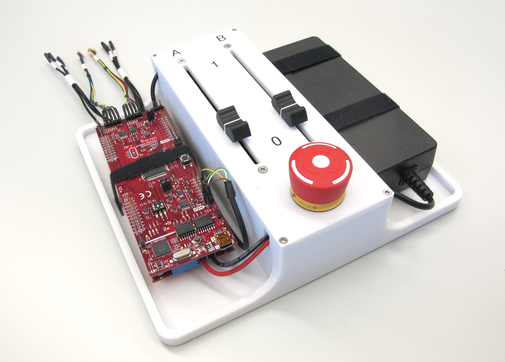  *Dual Motor Electronics Box*

## Off-the-shelf Components

### Texas Instruments Dual Motor Evaluation Boards

  *Texas Instruments dual motor control electronics stack*

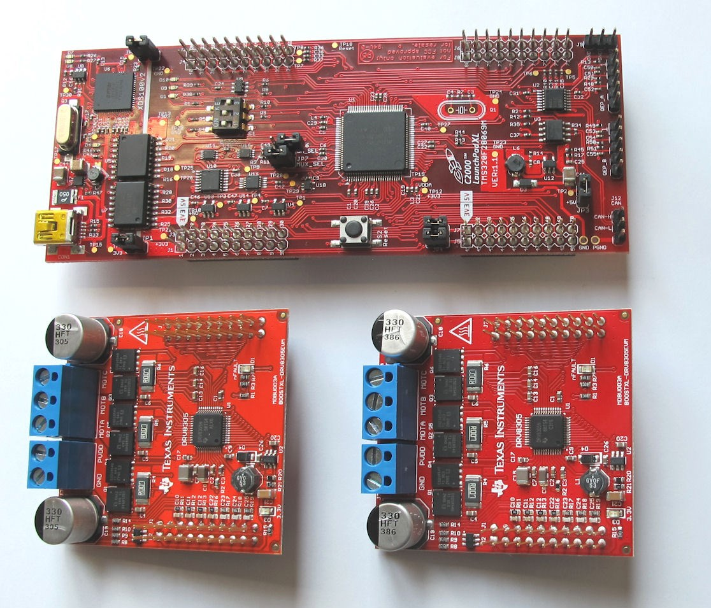  *Components dual motor control electronics stack*
* 1 x Microcontroller: TI Launchpad F28069M -> [Launchpad Product Page](http://www.ti.com/tool/LAUNCHXL-F28069M)
* 2 x Motor Driver Card: TI Boosterpacks DRV8305  -> [Booster Pack Product Page](http://www.ti.com/tool/BOOSTXL-DRV8305EVM)

### Analog Linear Potentiometers
    
* Linear potentiometer 10 kohm
* Alps Alpine RSA0K12B1019

### E-Stop Switch
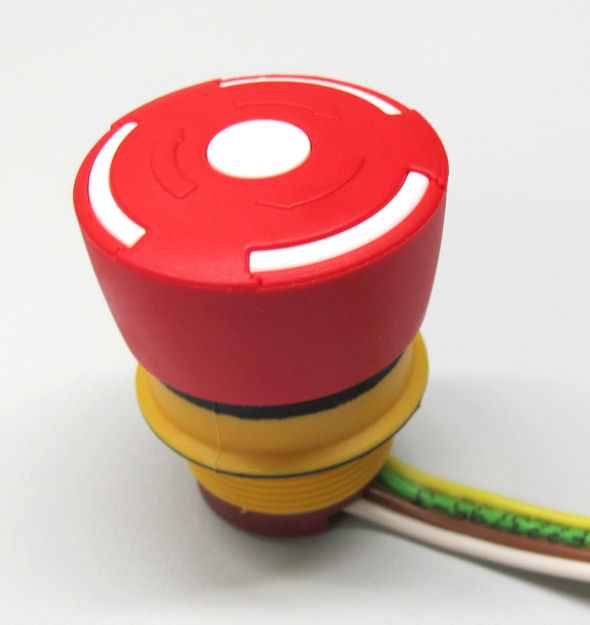    
* E-stop switch 32mm
* Pilz 84-5040.0040

### Power Supply
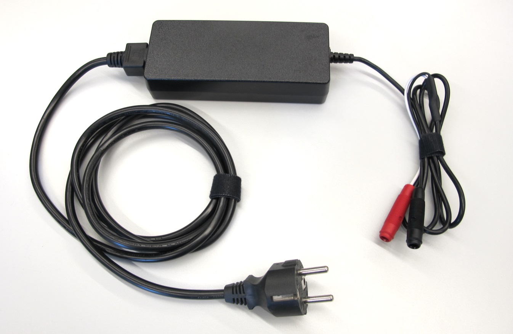    
* Power Supply 24V
* Meanwell GST90A24

### CAN Card
    
* PEAK PCAN PCI Express Card
* dual channel - galvanically  isolated

### CAN Connector
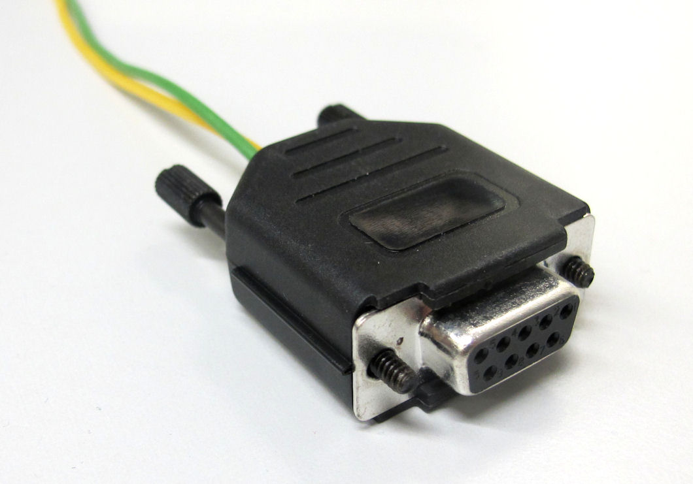  
* 9 pole D-Sub connector
---
## 3D Printed Parts
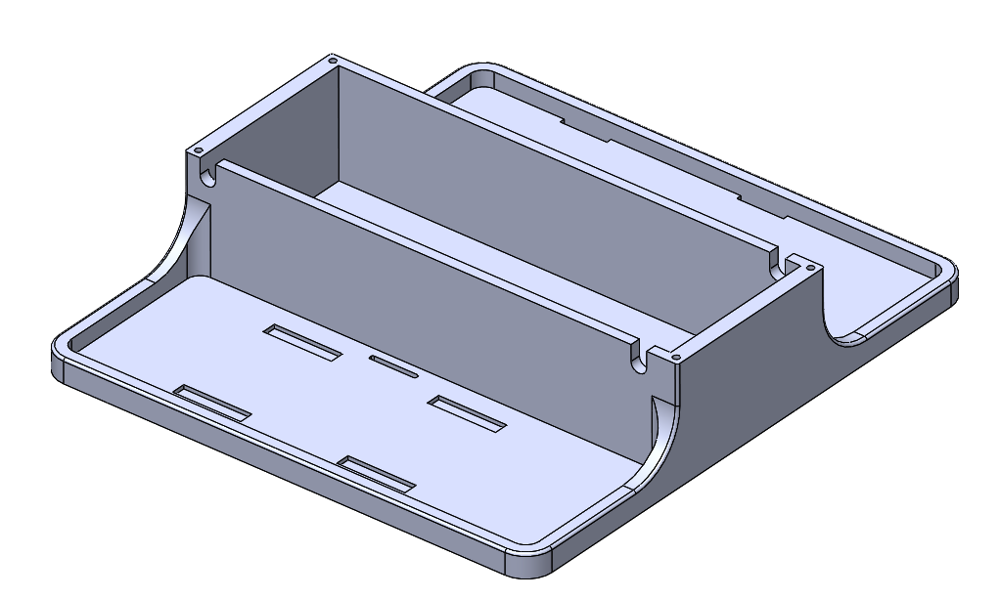  
* [Dual Motor Electronics Box Base - STL file](stl_files/electronics_box_base.STL) 
* the recommended printing direction is the positive z direction of the stl file
---
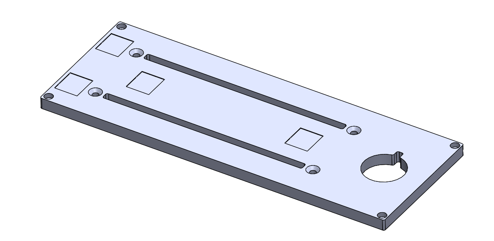  
* [Dual Motor Electronics Box Cover - STL file](stl_files/electronics_box_cover.STL) 
* the recommended printing direction is the positive z direction of the stl file
---
# Bill of Materials - Dual Motor Electronics Box
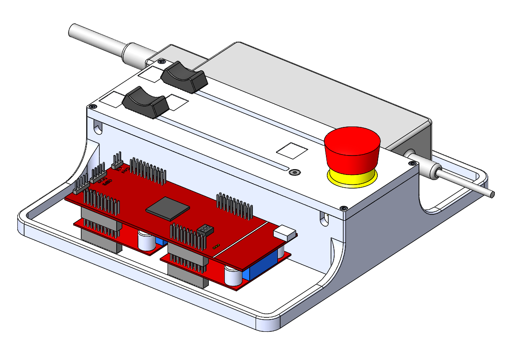

| Part Name | Quantity | Ordering Information | Comments |  
| --- | --- | --- | --- |   
| Texas Instruments Microcontroller | 1 | TI Launchpad F28069M  Digi-Key 296-38832-ND| [Launchpad Product Page](http://www.ti.com/tool/LAUNCHXL-F28069M) |  
| Texas Instruments Motor Driver Electronics  | 2 |  TI Boosterpack DRV8305EVM  Digi-Key 296-43181-ND | [Booster Pack Product Page](http://www.ti.com/tool/BOOSTXL-DRV8305EVM) |
| Linear Potentiometer | 2 | Alps Alpine RSA0K12B1019 RS 234-6544 |  |
| Linear Potentiometer Knob | 2 | RS 281-7197 |  |
| E-Stop Switch | 1 | Pilz 	84-5040.0040   RS 690-6954 |  |
| Power Supply 24V | 1 | Meanwell GST90A24  RS 880-8427 |  |
| Electronics Box Base | 1 | [STL file](stl_files/electronics_box_base.STL) | 3d printed part |
| Electronics Box Cover | 1 | [STL file](stl_files/electronics_box_cover.STL) | 3d printed part |
| Fasteners Linear Potentiometer | 4 | Flat Head Screw M3x10 | Stainless steel |
| Fasteners Electronics Box Cover | 4 | Socket Head Cap Screw M2,5x8 | Stainless steel |
| Rubber Feet | 6 | RS 236-509 | Optional |
| CAN PCI Express Card | 1 | PEAK IPEH-003027 | Dual channel |
| CAN Connector | 1 | 9 pole D-Sub connector RS 765-9555 |  |

---
## How to work with this

* I recommend downloading the free eDrawings viewer for Windows, Mac, iOS and Android [here](https://www.edrawingsviewer.com/download-edrawings).
* The eDrawing Viewer Software allows you to open and explore the 3d cad assembly files below.

 *Dual Motor Testbed - Click on picture to download and view the 3d assembly file.*

 *Dual Motor Electronics Box - Click on picture to download and view the 3d assembly file.*

## Authors
Felix Grimminger

## License
BSD 3-Clause License

## Copyright
Copyright (c) 2019-2020, Max Planck Gesellschaft and New York University

## More Information
[Open Dynamic Robot Initiative - Webpage](https://open-dynamic-robot-initiative.github.io)  
[Open Dynamic Robot Initiative - YouTube Channel](https://www.youtube.com/channel/UCx32JW2oIrax47Gjq8zNI-w)   
[Open Dynamic Robot Initiative - Forum](https://odri.discourse.group/categories)  
[Open Dynamic Robot Initiative - Paper](https://arxiv.org/pdf/1910.00093.pdf)  
[Hardware Overview](../../README.md#open-robot-actuator-hardware)  
[Software Overview](https://github.com/open-dynamic-robot-initiative/open-dynamic-robot-initiative.github.io/wiki)
