# FingerEdu v1

  
*Finger module assembled. Weight: 930g*   
  
*The finger can be completely retracted into the base structure for  transport.*   

## Description

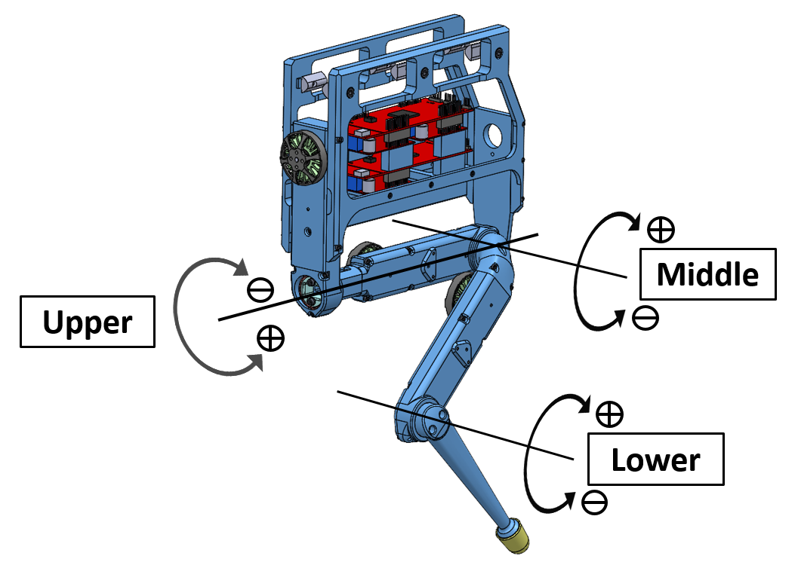  
*Finger Edu - Joint Labels*   

## Actuator Modules
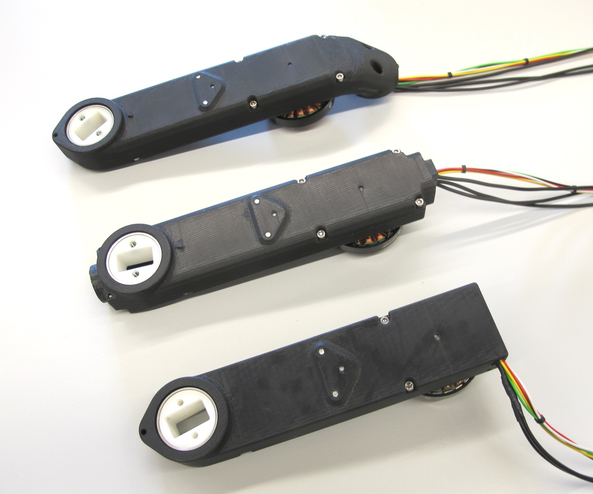  
*Each finger consists of 3 different actuator modules*   

For the finger we are using the same actuator modules that are used for the 12dof quadruped legs.  There is more detailed information here: [Leg 3dof](../leg_3dof_v1)
* Hip AA actuator module - 148g
* Hip FE actuator module - 160g
* Upper Leg actuator module - 155g

## Finger Base Frame
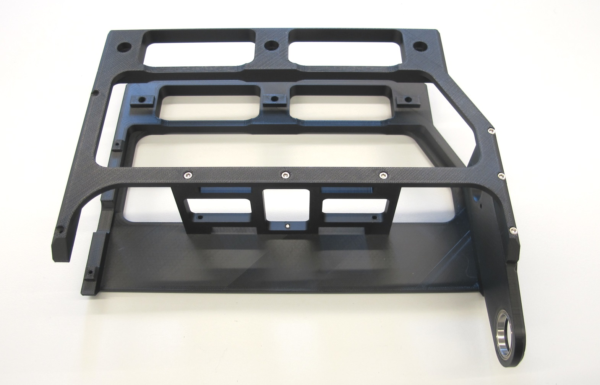  
*Assembled base frame - weight: 226g* 

The STL files for 3d printing the finger base frame can be found here: [STL files](stl_files)

## Finger Link
 *Finger link with finger tip - weight: 22g*

The finger link was printed on a FDM printer with the setting: "sparse double dense".  
The STL file for 3d printing the finger link can be found here: [STL files](stl_files)

  *Rubber finger tip - weight 2g* 
* we ordered the rubber finger tip from Amazon
* it's a standard office product for handling paper
* look for "Rubber Thimblette" - size 2 - large

## Electronics
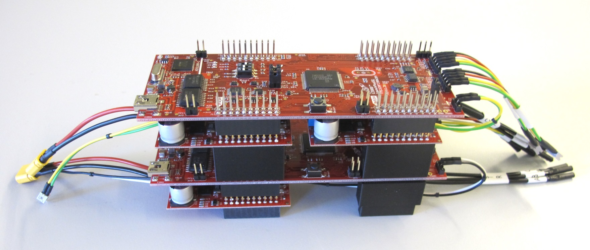  *Texas Instruments dual motor driver stack* 

Since space and weight isn't a concern here we are using the [Texas Instruments evaluation motor driver electronics](../../electronics/ti_electronics/README.md). 
Each finger module requires 24V power supply and 2 CAN communication channels.

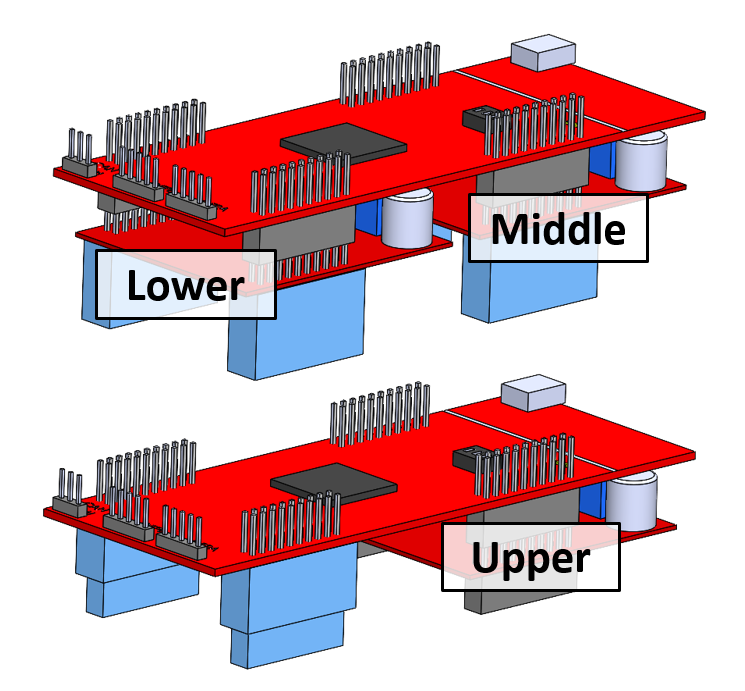  
*Finger Edu - Motor Driver Card Assignment*   

## 3D Printed Parts

  

`The recommended printing direction for all the parts below is the positive z direction of the stl files.`

* All the STL files for 3d printing the frame and the finger tip can be found here: [STL Files Frame Structure](stl_files)  

* All the STL files for 3d printing the actuator shells can be found here: [STL Files Actuator Module Shells](../leg_3dof_v1/stl_files)  

---
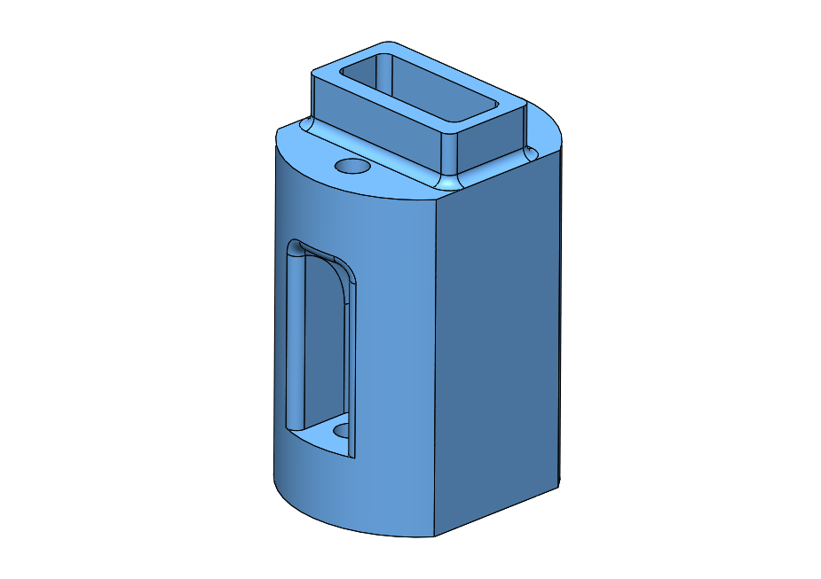  
* [Finger Adapter - STL file](stl_files/finger_adapter.STL) 
* weight: 10g
---
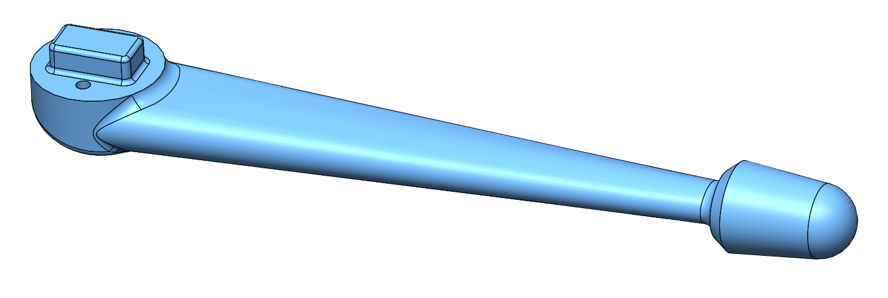  
* [Finger Tip - STL file](stl_files/finger_tip.STL) 
* weight: 20g
---
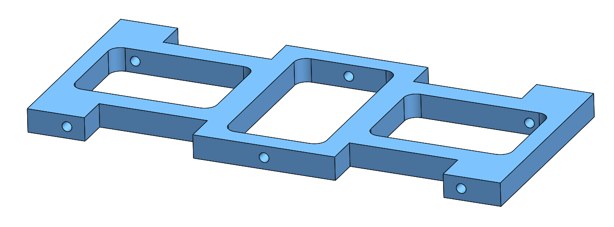  
* [Structure Bottom Plate - STL file](stl_files/structure_bottom_plate.STL) 
* weight: 16g
---
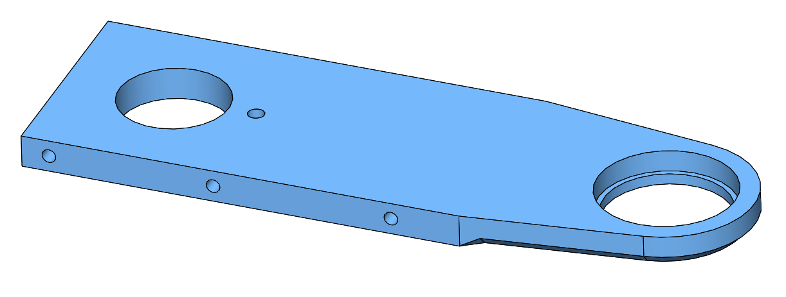  
* [Structure Front Plate - STL file](stl_files/structure_front_plate.STL) 
* weight: 23g
---
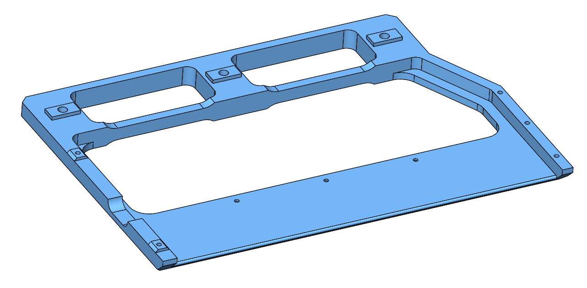  
* [Structure Side Plate Left- STL file](stl_files/structure_side_plate_left.STL) 
* weight: 100g
---
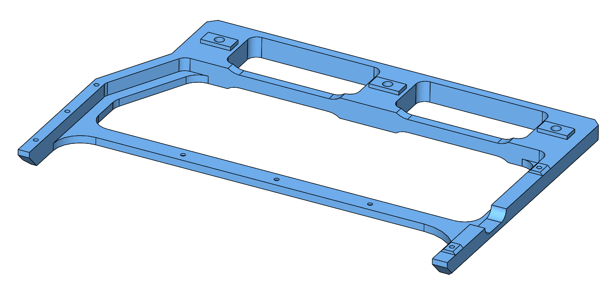  
* [Structure Side Plate Right- STL file](stl_files/structure_side_plate_right.STL) 
* weight: 71g
---
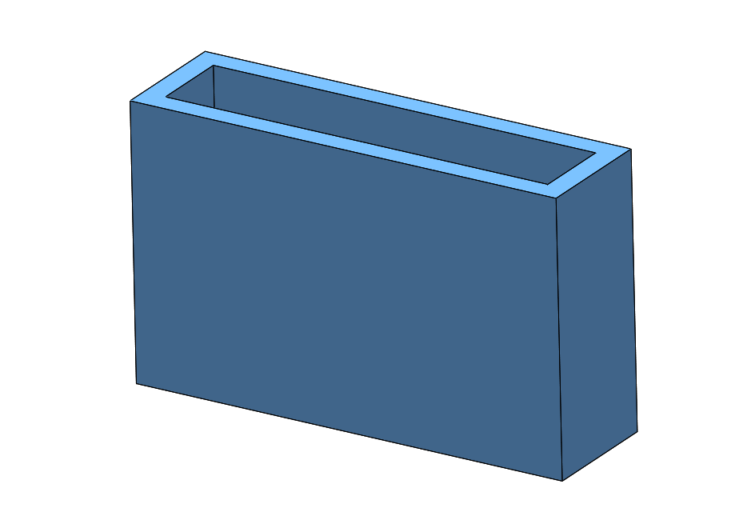  
* [TI Stack Spacer- STL file](stl_files/ti_stack_spacer.STL) 
* weight: 2g
---
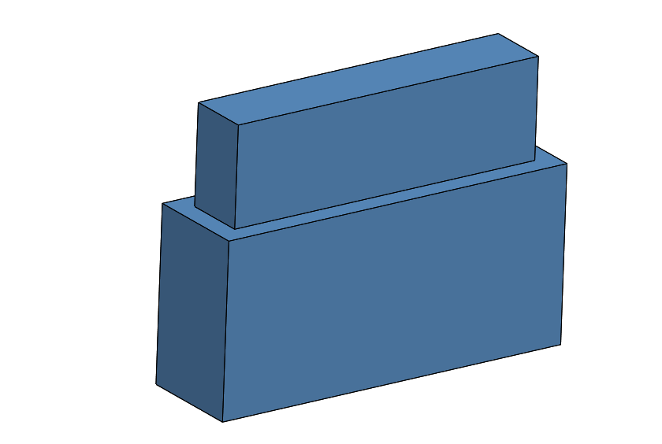  
* [TI Stack Support- STL file](stl_files/ti_stack_support.STL) 
* weight: 3g

-------------
## Authors
Felix Grimminger

## License
BSD 3-Clause License

## Copyright
Copyright (c) 2019-2021, Max Planck Gesellschaft and New York University

## More Information
[Open Dynamic Robot Initiative - Webpage](https://open-dynamic-robot-initiative.github.io)  
[Open Dynamic Robot Initiative - YouTube Channel](https://www.youtube.com/channel/UCx32JW2oIrax47Gjq8zNI-w)   
[Open Dynamic Robot Initiative - Forum](https://odri.discourse.group/categories)  
[Open Dynamic Robot Initiative - Paper](https://arxiv.org/pdf/1910.00093.pdf)  
[Hardware Overview](../../README.md#open-robot-actuator-hardware)  
[Software Overview](https://github.com/open-dynamic-robot-initiative/open-dynamic-robot-initiative.github.io/wiki)
