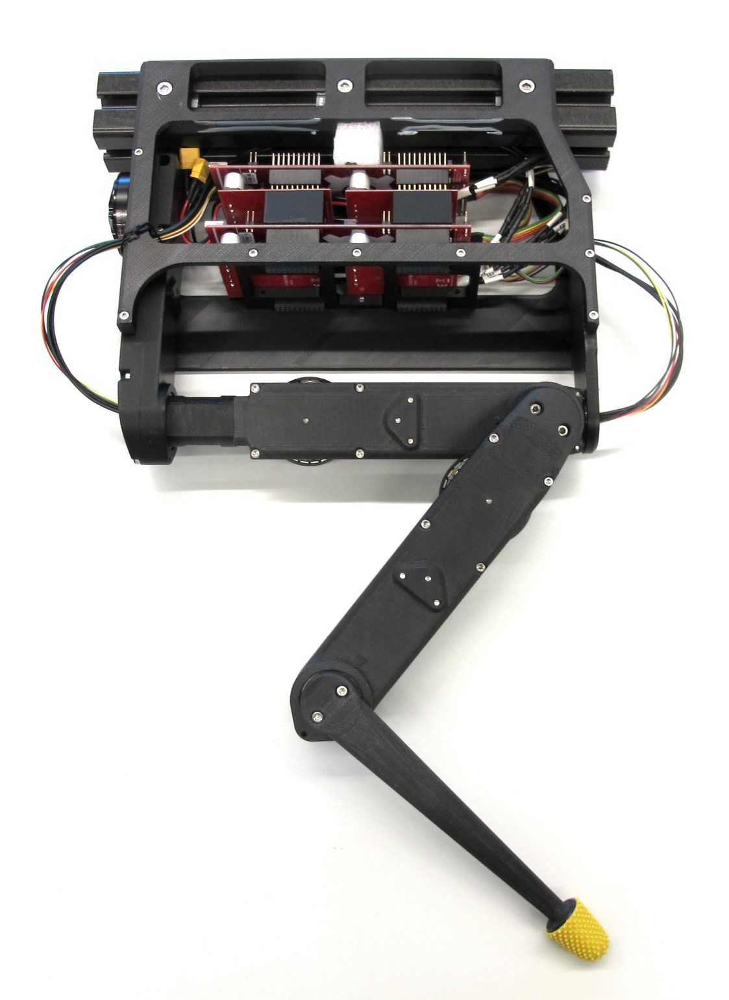
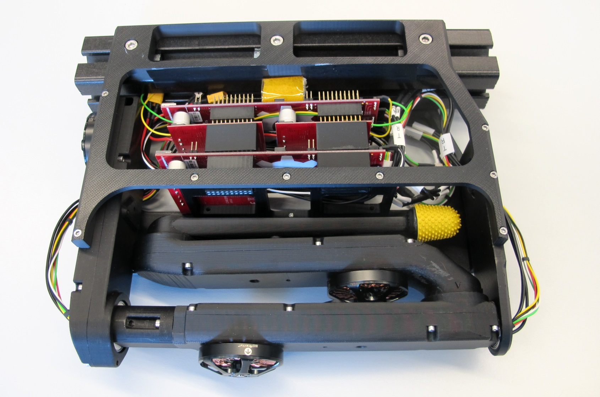
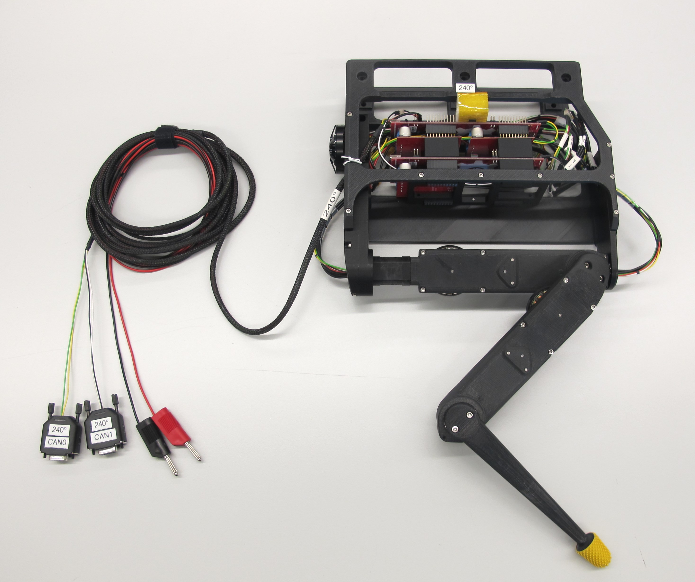
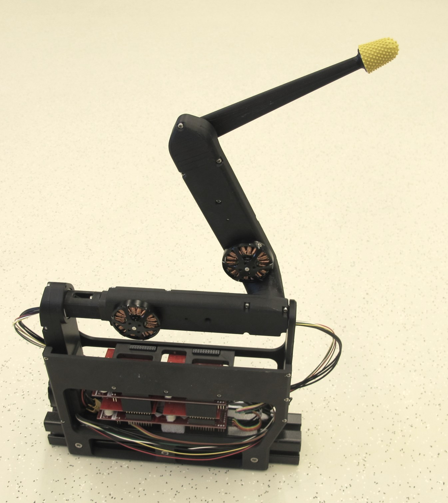
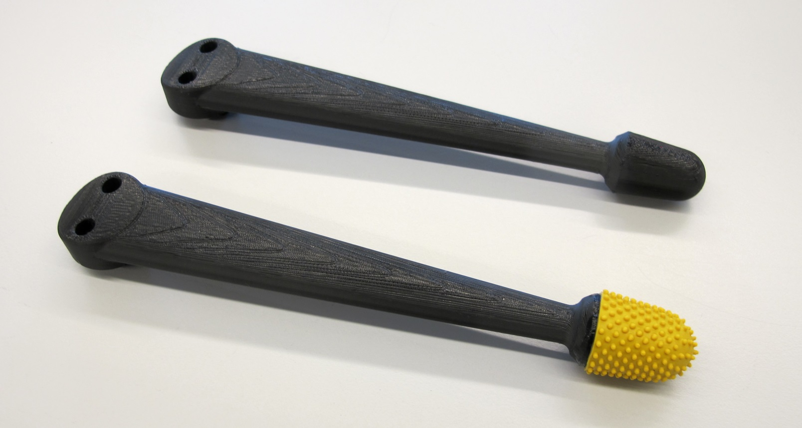

FingerEdu v1
=======================

Pictures
-----------
    
    
    
    

Finger Tip
------------
    
* the fingertip was printed on a FDM printer with the setting: "sparse double dense"
* the weight of the finger tip is 22g

    

3D Model for Visualization
-------------------------

The simplified STL files for visualization and simulation can be found here: [STL Files Visualization](stl_files_for_visualization)

 *Click on picture above to view the PDF drawing*

-------------
Authors
--------
Felix Grimminger

License
-------
BSD 3-Clause License

Copyright
-----------
Copyright (c) 2019, Max Planck Gesellschaft, New York University

More Information
----------------
[Open Dynamic Robot Initiative - Webpage](https://open-dynamic-robot-initiative.github.io)  
[Open Dynamic Robot Initiative - YouTube Channel](https://www.youtube.com/channel/UCx32JW2oIrax47Gjq8zNI-w)   
[Hardware Overview](../../README.md)  
[Software Overview](https://github.com/open-dynamic-robot-initiative/open-dynamic-robot-initiative.github.io/wiki)
