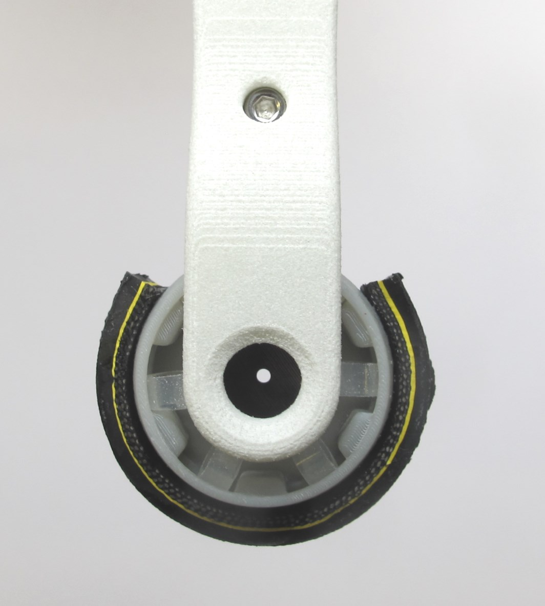
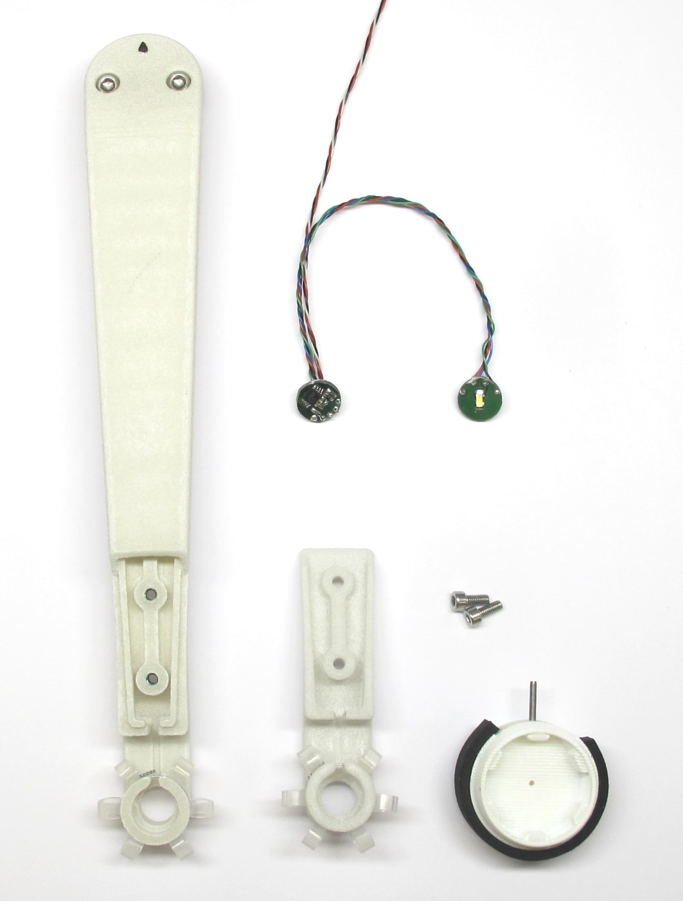

Foot Contact Switch v1
=======================
    

    

    

    

    

Description
------------

weight 10g / weight of the lower leg structure
12 elastic silicone elements / 6 on each side
pin prevents rotation

3.3V supply
0V-3V analog Signal
2ms reponse time - measured 8cm drop with respect to ATI sensor 1kHz data rate
Red/Green LED on each side outer side of the boards
Comperator 2V trigger level
For verification of the sensor working
Foot deflects up to 2mm
270 degree angular sensing range

No load - 3V output - foot leds red
Contact - 0V output - foot leds green

Sensitivity can be adjusted to the application
by number of elements / diameter / wall thickness / length / material / diameter aperture
distance between emitter and receiver and emitter led brightness

Off-the-shelf-Parts
--------------------

Silicone tube - outer diameter 6mm / inner diameter 4mm / length 3mm

Pin 1,5mm x 12mm

Bicycle trire bonded with Loctite 404

Machined Parts
---------------

3D Printed Parts
-----------------

Foot structure with 1,5mm hole in the center

Sensor characteristics
------------------------
    

x - axis vertical force [N] measured with ATI Sensor
y - sensor ouput signal inverted!
0-1 corresponds to 0V to 3.3V range
64.000 resolution on microcontroller???

Next Steps / Future Work
------------------------

3d print elastic elements
Reduce weight of traction element on the foot
Reduce signal noise

  

  

Authors
--------
Felix Grimminger  
Joshi Walzog

License
-------
BSD 3-Clause License

Copyright
-----------
Copyright (c) 2019, Max Planck Gesellschaft, New York University

More Information
----------------
[Open Dynamic Robot Initiative](https://open-dynamic-robot-initiative.github.io)  
[Hardware Overview](../../README.md)  
[Software Overview](https://github.com/open-dynamic-robot-initiative/open-dynamic-robot-initiative.github.io/wiki/Open-Dynamic-Robot-Initiative-Documentation)
