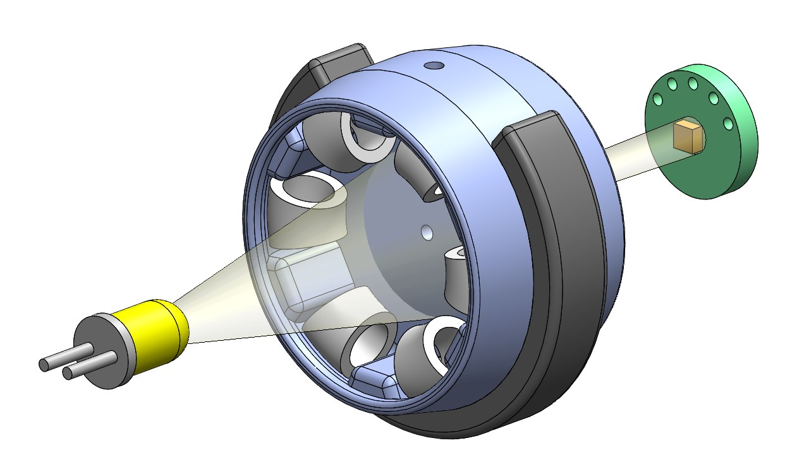
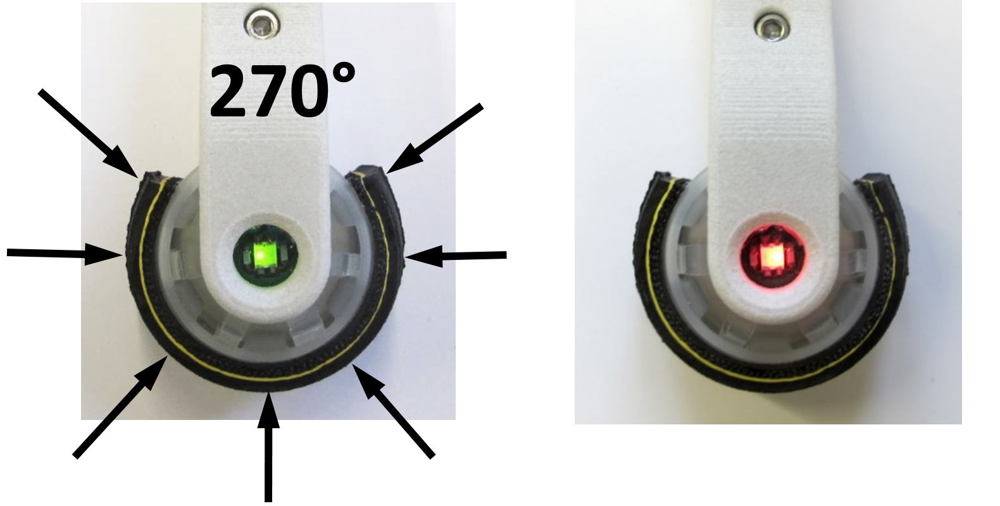
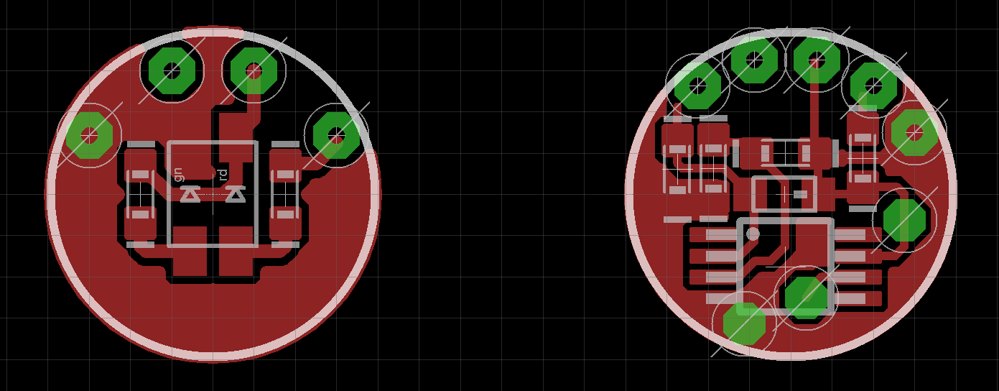
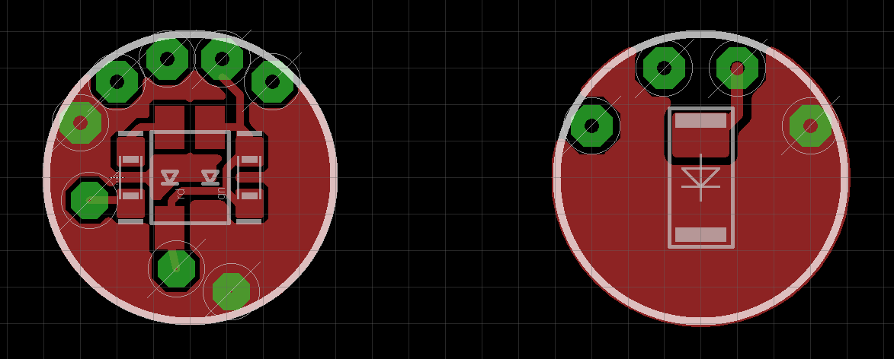
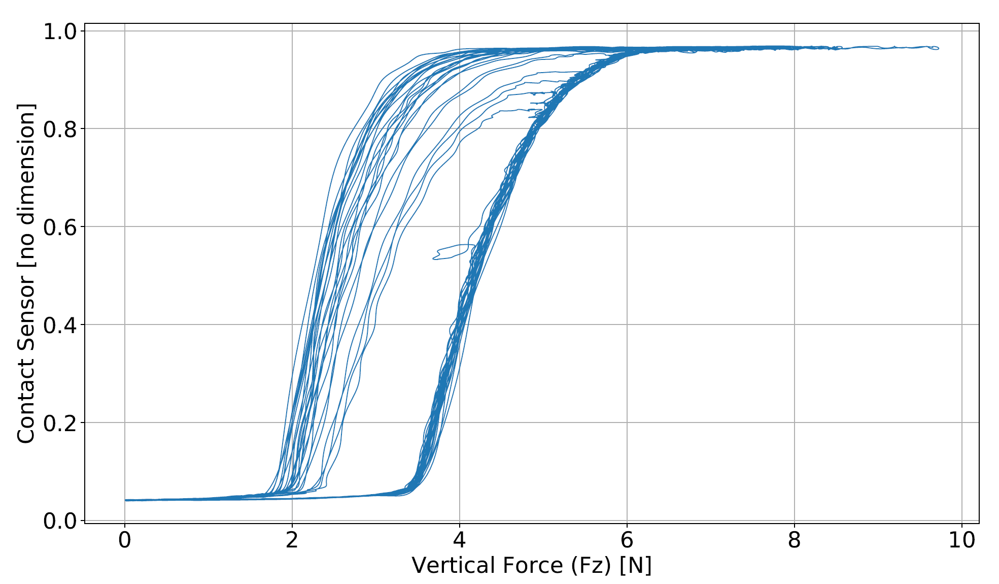
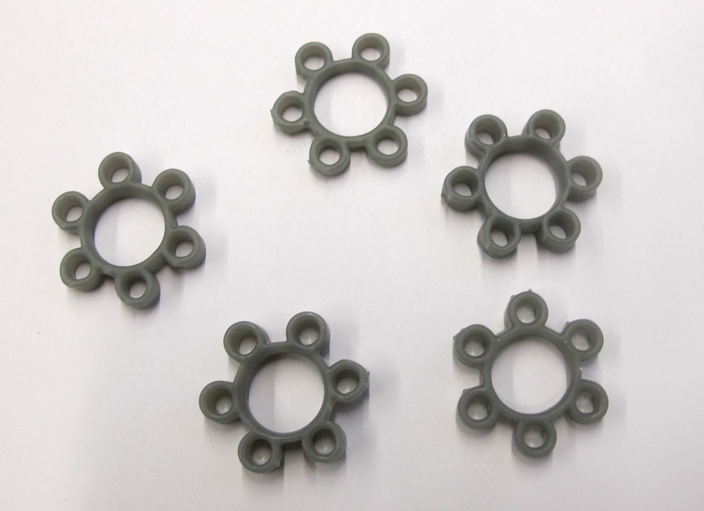
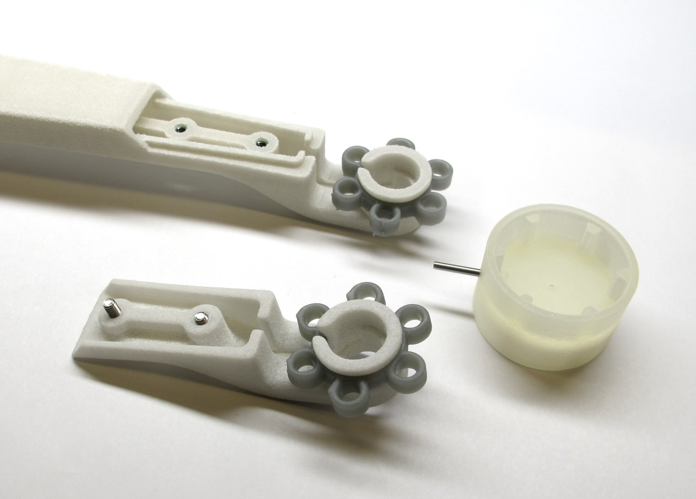

Foot Contact Switch v1
=======================
  *Working principle of the optical foot contact switch*

Description
------------
We designed simple, low cost, lightweight and robust optical foot contact switch for our legged quadruped robot.  
The contact switch consists of a spring loaded aperture that is located between a led light source and a light sensor.  
External loads displace the aperture and change the light intensity measured by the sensor.  
For centering the foot we use 12 elastic silicone elements (6 on each side).   
The foot contact switch is symmetric and can detect forces from a wide range of different angles (270 degrees).  
For visual feedback and monitoring there are bi-color leds mounted on each side of the foot.

 *Left side: Foot Contact Switch loaded / Right side: Foot Contact Switch unloaded*

Lower Leg and Foot Contact Switch
---------------------------------
  *Lower Leg and Foot Contact Switch Component Overview - the weigth of the lower leg assembly is 35g*

The weight of the foot, the contact switch electronics and the silicone elements is about 10g.  
To prevent the foot from rotating we use a steel pin that is guided by the lower leg structure.   
Under load the foot deflects up to 2mm from its neutral position.  
The electronics are supplied with 3.3V and generate an analog output signal between 3V and 0V.  
The signal is converted by the microcontroller ADC and transmitted over CAN at 1kHz.  
We measured the delay of the foot contact switch with respect to a ATI Mini40 force sensor for a drop of the 2dof leg from a height of 8cm.   
The measured delay between the ATI force sensor signal and the foot contact signal was 2ms.  
The data was logged at 1kHz using a Realtime Linux PC.

  *Foot Contact Switch Electronics*

Custom Electronic Boards
--------------------
The foot contact switch consists of two boards with traces and components on all four sides.  
The diameter of the electronics boards is 10mm.  

  *Foot Contact Switch Main Board  - Left: Outer side / Right: Inner Side*

  *Foot Contact Switch Satellite Board  - Left: Outer side / Right: Inner Side*

Details Lower Leg
---------
* [Details Lower Leg - STL files and component information](../leg_2dof_v1/README.md)

Details Foot Contact Switch
-------------------------------
Special thanks to Joshi Walzog for designing and manufacturing the electronics boards!

* [Bill Of Materials Foot Contact Switch - PDF Document](documentation/bom_foot_contact_switch_v1.pdf)
* [Bill Of Materials - Excel Document](documentation/bom_foot_contact_switch_v1.xlsx)  

To view the files below can download the free [Eagle PCB Design Software](https://www.autodesk.com/products/eagle/free-download#) for Windows, Mac and Linux.
* [Eagle Board File](documentation/foot_contact_switch_v1.brd)
* [Eagle Schematic File](documentation/foot_contact_switch_v1.sch)

Foot Contact Switch Wiring
----------------------------
  *Foot Contact Switch Connectors and Wiring*

Sensor characteristics
------------------------
    

* x-axis -> vertical force [N] measured with ATI Mini40 Sensor  
* y-axis -> foot contact sensor ouput signal inverted and normalized
* 0-1 on the y-axis corresponds to 3V - 0V range

Adjusting the sensitivity
-----------------------------
The sensitivity of the switch can be adjusted depending on the application by changing:
* the number of elastic elements
* the diameter of elastic elements
* the wall thickness, length or material of the elastic elements
* the diameter of the aperture  
* the distance between emitter and receiver
* the emitter led brightness

Next Steps / Future Work
------------------------

* 3d print elastic elements  
* Reduce weight of traction element on the foot  
* Reduce sensor signal noise  

  

  

Authors
--------
Felix Grimminger  
Joshi Walzog

License
-------
BSD 3-Clause License

Copyright
-----------
Copyright (c) 2019, Max Planck Gesellschaft, New York University

More Information
----------------
[Open Dynamic Robot Initiative](https://open-dynamic-robot-initiative.github.io)  
[Hardware Overview](../../README.md)  
[Software Overview](https://github.com/open-dynamic-robot-initiative/open-dynamic-robot-initiative.github.io/wiki/Open-Dynamic-Robot-Initiative-Documentation)
