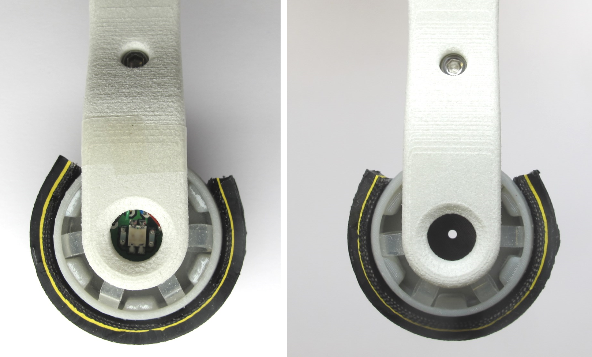
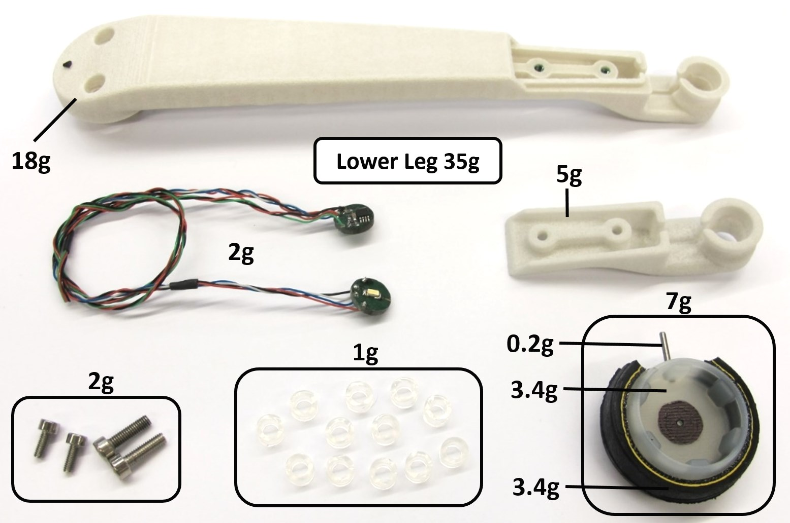
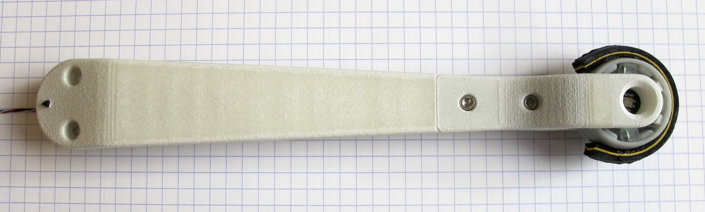
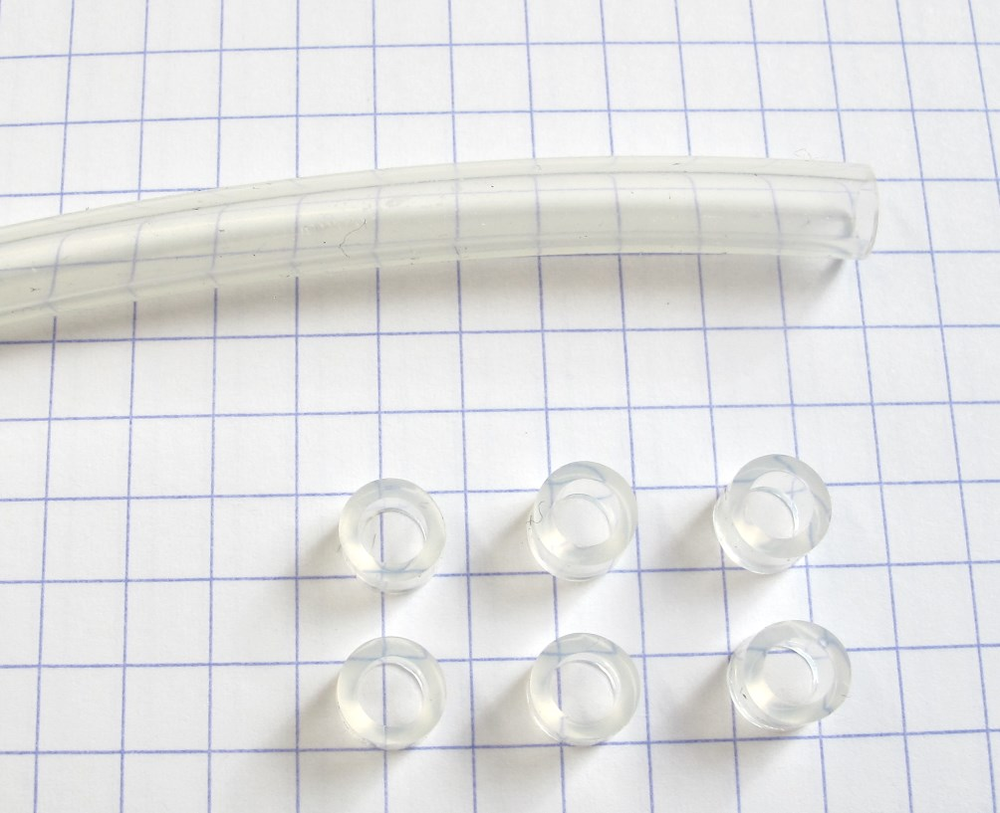
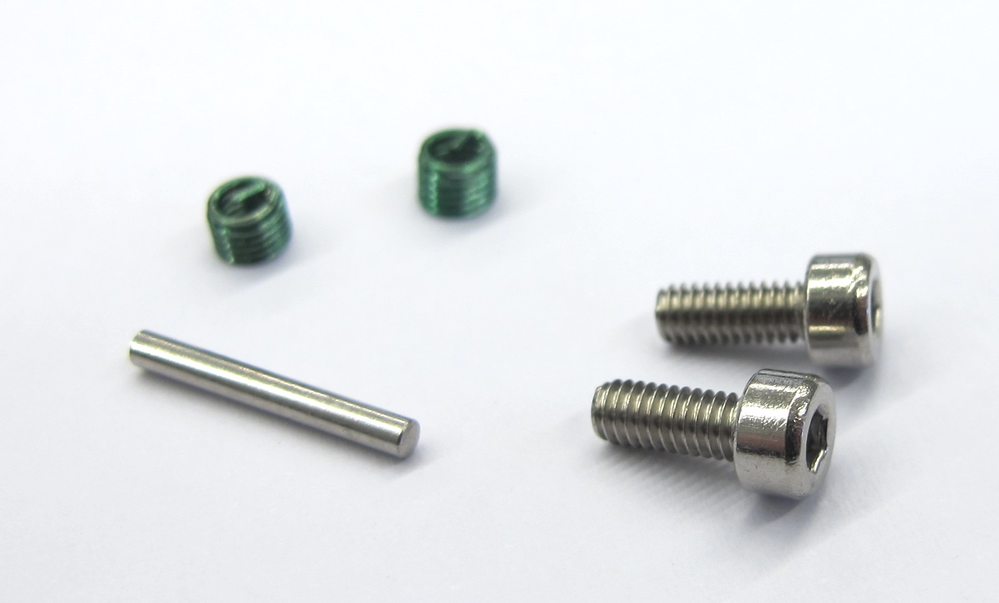
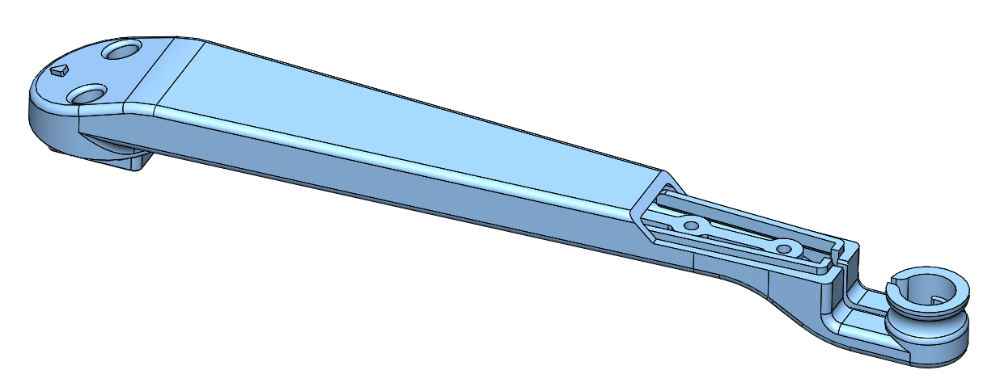
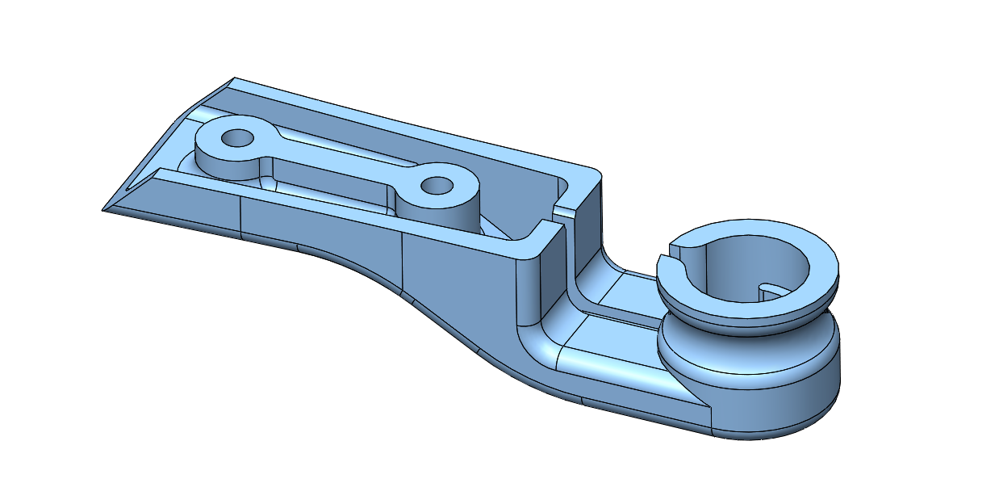
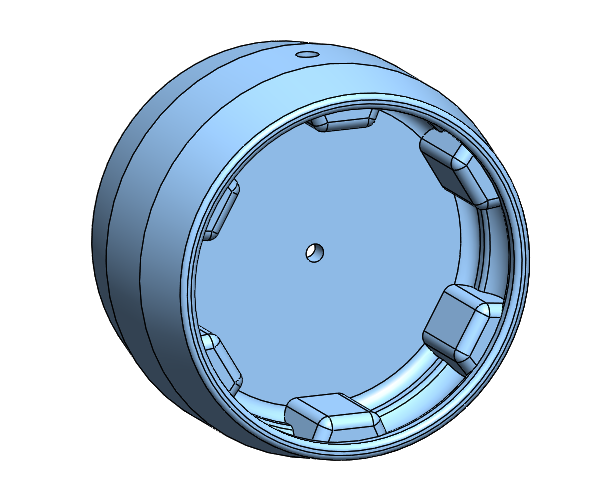
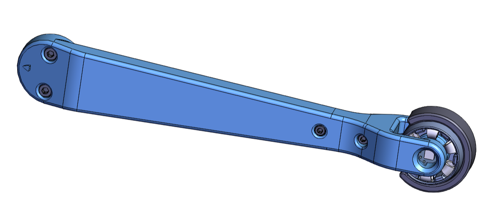

# Foot Contact Switch v1
  *Working principle of the optical foot contact switch*

## Description
We designed simple, low cost, lightweight and robust optical foot contact switch for our [quadruped robot.](../quadruped_robot_8dof_v1#quadruped-robot-8dof-v1)  
The contact switch consists of a spring loaded aperture that is located between a led light source and a light sensor.  
External loads displace the aperture and change the light intensity measured by the sensor.  
For centering the foot we use 12 elastic silicone elements (6 on each side).

The foot contact switch is symmetric and can detect forces from a wide range of different angles (270 degrees).  
For visual feedback and monitoring there are bi-color leds mounted on each side of the foot.

 *Left side: Foot Contact Switch loaded / Right side: Foot Contact Switch unloaded*

## Lower Leg and Foot Contact Switch
  *Lower Leg and Foot Contact Switch Component Overview*

  *Lower Leg and Foot Contact Switch assembled - weight: 35g*

The weight of the foot, the contact switch electronics and the silicone elements is about 10g.  
To prevent the foot from rotating we use a steel pin that is guided by the lower leg structure.   
Under load the foot deflects up to 2mm from its neutral position.  
The electronics are supplied with 3.3V and generate an analog output signal between 3V and 0V.  
The signal is converted by the microcontroller ADC and transmitted over CAN at 1kHz.  
We measured the delay of the foot contact switch with respect to a ATI Mini40 force sensor for a drop of the 2dof leg from a height of 8cm.   
The measured delay between the ATI force sensor signal and the foot contact signal was 2ms.  
The data was logged at 1kHz using a Realtime Linux PC.

 *Foot Contact Switch Electronics*

## Video

## Sensor Characteristics
  
* x-axis -> vertical force [N] measured with ATI Mini40 Sensor  
* y-axis -> foot contact sensor ouput signal inverted and normalized
* 0-1 on the y-axis corresponds to 3V - 0V range

## Off-the-shelf Components
### Silicone Tube
 

* Silicone tube - outer diameter: 6mm / inner diameter: 4mm / length: 3mm  
* 12 elements / 6 on each side
* a [tube cutter](../actuator_module_v1/details/details_tools.md#tube-cutter) can be used to prepare the segments

### Bicycle Tire
 

* a bicycle tire segment is bonded to the surface of the foot
* we use Schwalbe Lugano 28" 23-622 tire
* cut to 65mm x 10mm pieces
* bond to the foot with [Loctite 406](../actuator_module_v1/details/details_tools.md#loctite)
* [Instructions Foot Preparation](../general/lower_legs.md#preparing-the-lower-legs)

### Fasteners
 

* Steel Pin 1,5mm x 12mm  
* Socket Head Cap Screws M2,5x6
* Helicoil Thread Inserts M2,5 x 3.75mm

## 3D Printed Parts
  

`The recommended printing direction for all the parts below is the positive z direction of the stl files.`

The STL files for 3d printing the parts are available in the [STL folder](stl_files).

  
* [Lower Leg Structure Base - 18g](stl_files/lower_leg_structure_base.STL)
* FDM or SLS printer

  
* [Lower Leg Structure Fork - 5g](stl_files/lower_leg_structure_fork.STL)
* FDM or SLS printer

  
* [Foot Structure - 3.4g](stl_files/foot_structure.STL)
* SLA printer - Accura Extreme Gray

## Custom Electronic Boards
The foot contact switch consists of two boards with traces and components on all four sides.  
The diameter of the electronics boards is 10mm.  

  *Foot Contact Switch Main Board  - Left: Outer side / Right: Inner Side*

  *Foot Contact Switch Satellite Board  - Left: Outer side / Right: Inner Side*

## Details Foot Contact Switch
Special thanks to Joshi Walzog for designing and manufacturing the electronics boards!

* [Bill Of Materials Foot Contact Switch - PDF Document](documentation/bom_foot_contact_switch_v1.pdf)
* [Bill Of Materials - Excel Document](documentation/bom_foot_contact_switch_v1.xlsx)  
* [Eagle Files - Zipped Folder](documentation/eagle_files.zip)
* [Gerber Files - Zipped Folder](documentation/gerber_files.zip)

To view the Eagle files you need to download the free [Eagle PCB Design Software](https://www.autodesk.com/products/eagle/free-download#) for Windows, Mac and Linux.

## Foot Contact Switch Wiring
  *Foot Contact Switch Connectors and Wiring*

## Alternative Lower Leg Versions

    

* alternative lower leg versions without contact sensor are documented here: [Lower Leg Documentation](../general/lower_legs.md#lower-legs)

---
## View the foot contact switch cad model in your web browser
 

  *Foot Contact Switch - Click on the picture to view the cad model in your browser*

## How to work with this
* To get an better overview of the assembly you can view this [pdf file](lower_leg.PDF)
* I recommend downloading the free eDrawings viewer for Windows, Mac, iOS and Android [here](https://www.edrawingsviewer.com/download-edrawings).
* The eDrawing Viewer Software allows you to open and explore this [easm cad assembly file](lower_leg.EASM)

## More Information
[Open Dynamic Robot Initiative - Webpage](https://open-dynamic-robot-initiative.github.io)  
[Open Dynamic Robot Initiative - YouTube Channel](https://www.youtube.com/channel/UCx32JW2oIrax47Gjq8zNI-w)   
[Open Dynamic Robot Initiative - Forum](https://odri.discourse.group/categories)  
[Open Dynamic Robot Initiative - Paper](https://arxiv.org/pdf/1910.00093.pdf)  
[Hardware Overview](../../README.md#open-robot-actuator-hardware)  
[Software Overview](https://github.com/open-dynamic-robot-initiative/open-dynamic-robot-initiative.github.io/wiki)  

## Authors
Felix Grimminger

## License
BSD 3-Clause License

## Copyright
Copyright (c) 2019-2021, Max Planck Gesellschaft and New York University
