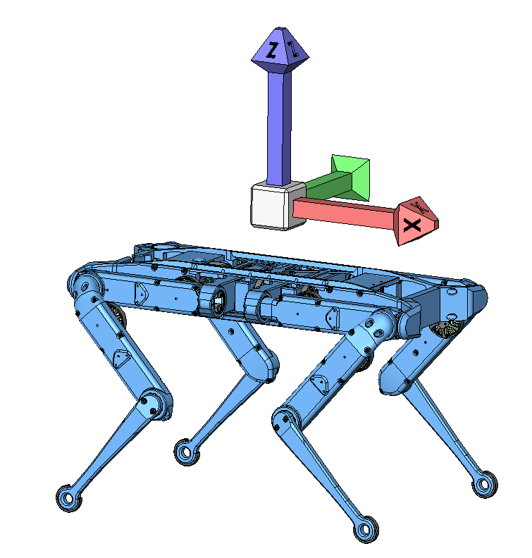
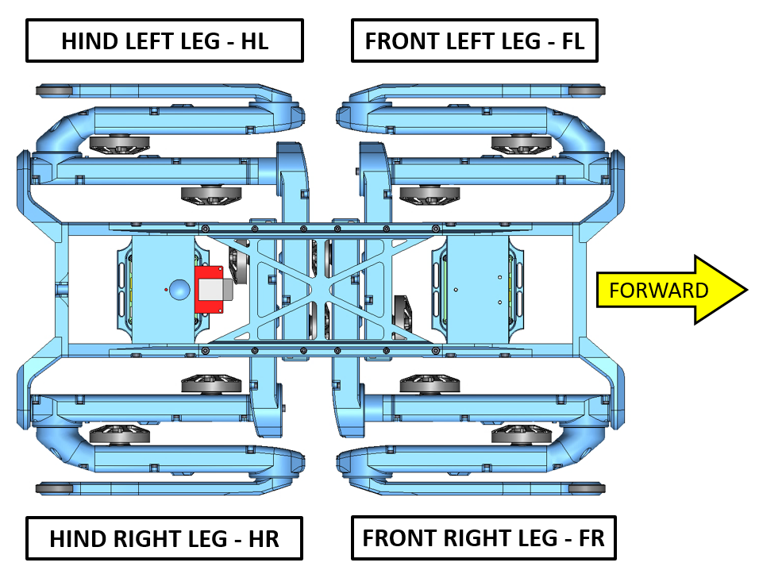
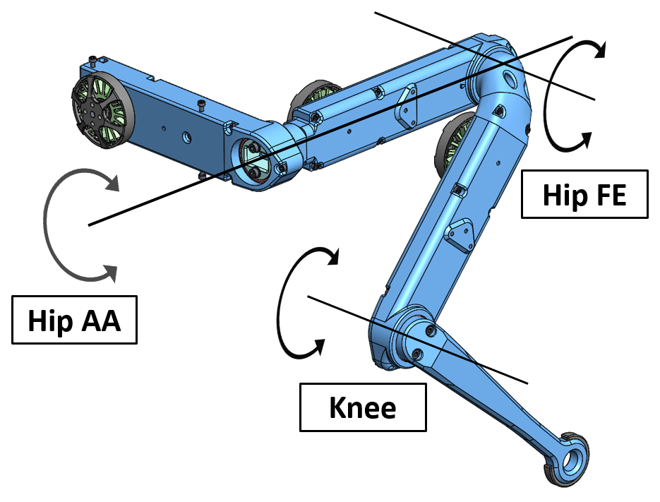
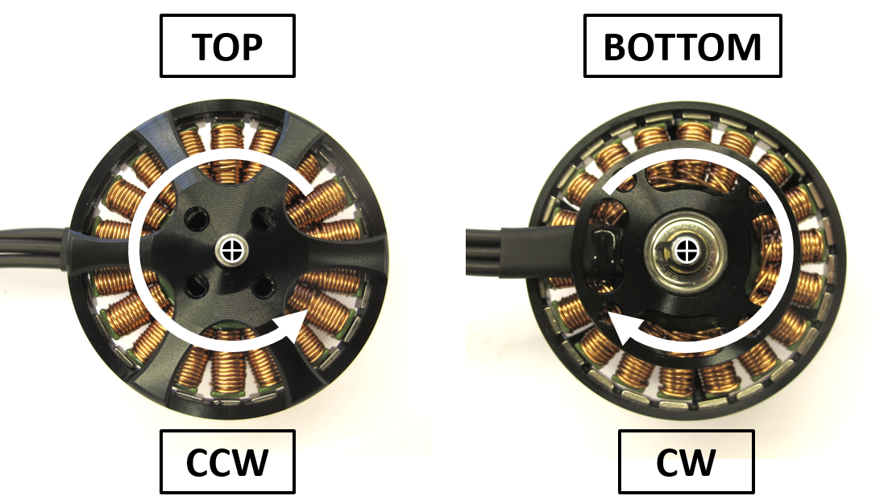
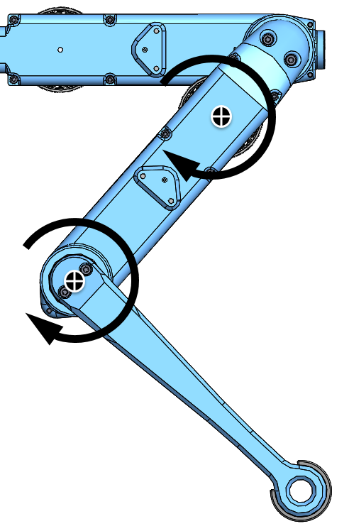
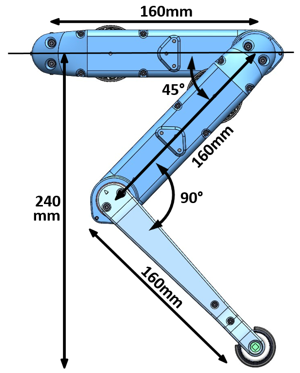

# Conventions

## General
### Robot Coordinate System

 *Robot Coordinate System Convention*

* all our robot coordinate systems are oriented as shown above
* Positive X Axis = Forward  
* Positive Y Axis = Left  
* Positive Z Axis = Upwards

### Leg Naming Convention

 *Naming Convention Legs - Quadruped Robot*

* Front Right Leg = FR
* Front Left Leg = FL
* Hind Right Leg = HR
* Hind Left Leg = HL

### Degree of Freedom Naming Convention

 *Naming Convention Degrees of Freedom - 3dof leg*

* Hip Abduction Adduction = Hip AA
* Hip Flexion Extension = Hip FE
* Knee Flexion Extension = Knee
* we use the following abbreviations to label the degrees of freedom

|DOF Abbreviation |DOF Name|
|---|---|
|FRHAA|Front Right Hip Abduction Adduction|
|FRHFE|Front Right Hip Flexion Extension|
|FRK|Front Right Knee|
|FLHAA|Front Left Hip Abduction Adduction|
|FLHFE|Front Left Hip Flexion Extension|
|FLK|Front Left Knee|
|HRHAA|Hind Right Hip Abduction Adduction|
|HRHFE|Hind Right Hip Flexion Extension|
|HRK|Hind Right Knee|
|HLHAA|Hind Left Hip Abduction Adduction|
|HLHFE|Hind Left Hip Flexion Extension|
|HLK|Hind Left Knee|

### Direction of Rotation Motor
 *The positive direction of rotation is counterclockwise when looking at the motor from the top.* 

### Direction of Rotation Leg
 *The positive direction of rotation is clockwise when looking at the robot leg from the side.* 

### Neutral standing height
 *Neutral standing height* 

We consider the leg to be at neutral standing height when the Hip FE angle is at 45 degrees and the knee angle is at 90 degrees.
Our quadrupeds have a segment length of 16cm and a neutral standing height of 24cm.

---
## Mechanics
### 3D Printing

 *The recommended printing direction is the positive z-axis-direction of the STL files.* 

### Mechanical Interface

---
## Electronics

### Wiring Conventions

 *Click on picture to view the wiring documentation page*

The wiring conventions for the actuator modules and the electronics are documented here: [Details Wiring](../../electronics/details/details_wiring.md)

---
## More Information
[Open Dynamic Robot Initiative - Webpage](https://open-dynamic-robot-initiative.github.io)  
[Open Dynamic Robot Initiative - YouTube Channel](https://www.youtube.com/channel/UCx32JW2oIrax47Gjq8zNI-w)   
[Open Dynamic Robot Initiative - Forum](https://odri.discourse.group/categories)  
[Open Dynamic Robot Initiative - Paper](https://arxiv.org/pdf/1910.00093.pdf)  
[Hardware Overview](../../README.md#open-robot-actuator-hardware)  
[Software Overview](https://github.com/open-dynamic-robot-initiative/open-dynamic-robot-initiative.github.io/wiki)  

## Authors
Felix Grimminger

## License
BSD 3-Clause License

## Copyright
Copyright (c) 2019-2020, Max Planck Gesellschaft and New York University
