# Robot Calibration
## Description
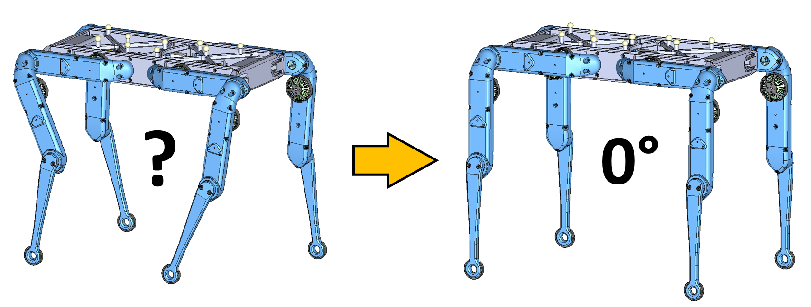

* when the robot is turned on the joint angles are unknown
* therefore we manually align the legs before startup such that the joints are roughly in zero position
* the software moves all the joints and finds the closest encoder index position for each joint
* when the index position is found the software adds an offset to the actual position and moves all the joints into zero position
* in order for this procedure to work the offsets between the index positions and the zero joint positions have to be measured and saved for each degree of freedom before once
* if an actuator module is repaired, replaced or modified the offset between the index pulse and the zero joint position has to be measured and saved again

## Calibration Tools
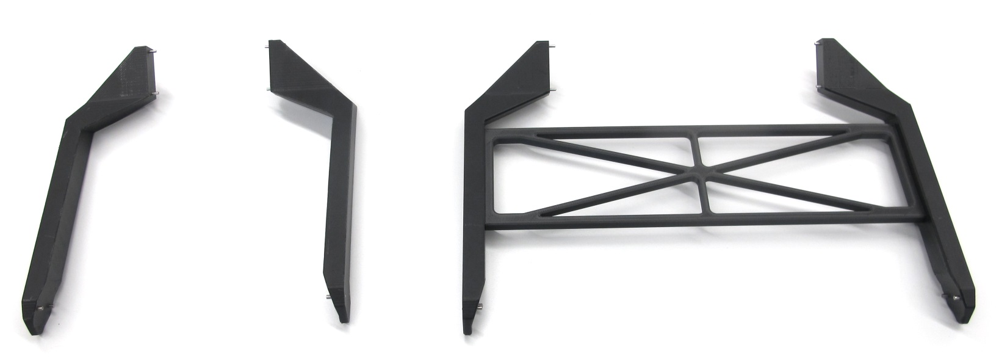

* we use 3d printed calibration tools to align the legs in the zero position
* this helps to determine the correct offsets from the index position for each joint
* steel pins that fit into the screw heads of the actuator modules are used to align the segments

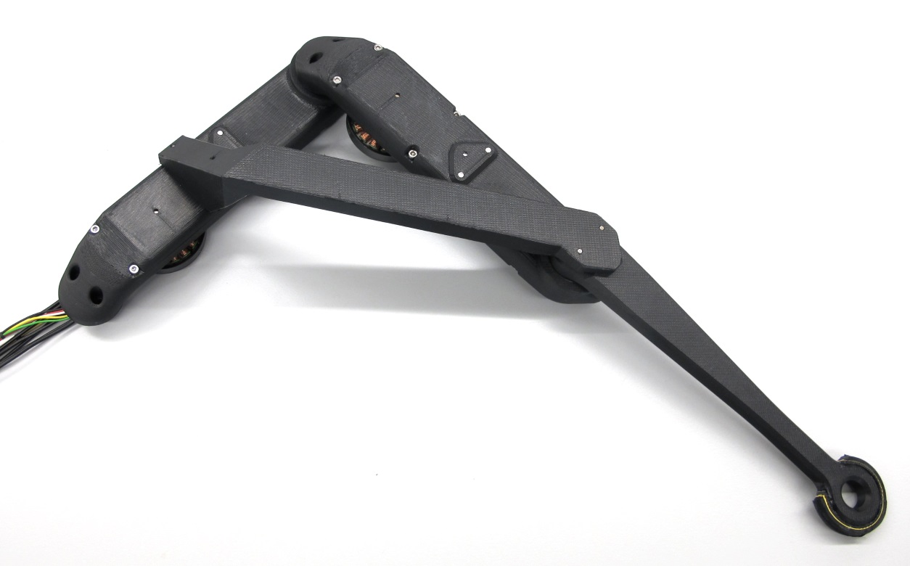

---
## Calibration Tool Quadruped 8dof
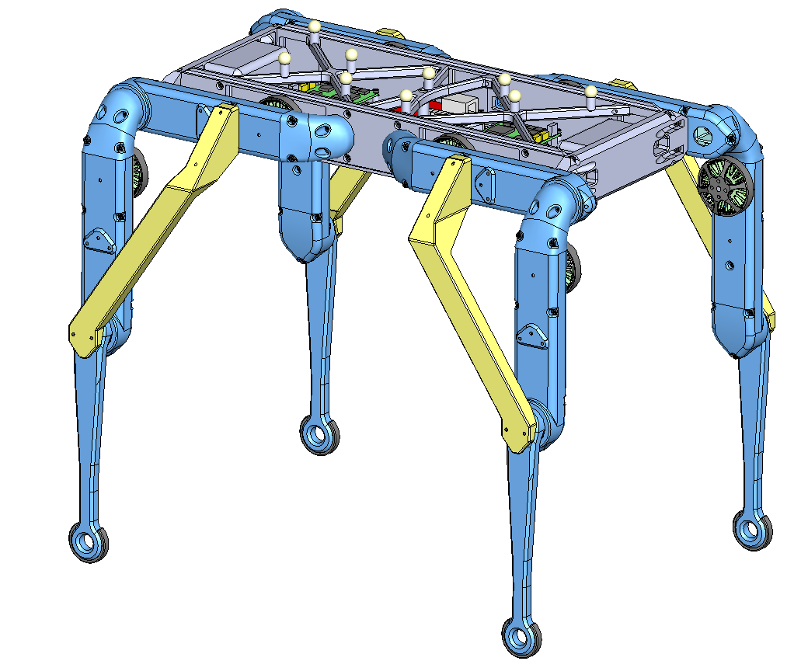 *8dof quadruped cad model with calibration tools.* 

* this calibration tool can be used for the [Quadruped Robot 8dof v1](../quadruped_robot_8dof_v1#quadruped-robot-8dof-v1) and the [Quadruped Robot 8dof v2](../quadruped_robot_8dof_v2#quadruped-robot-8dof-v2)

### Bill of Materials - Calibration Tool Quadruped 8dof
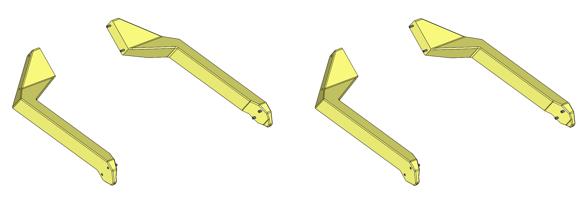

|Description|Quantity|Ordering Information|Comments|
|---|---|---|---|
|Calibration Tool Quadruped 8dof|2|[STL file](stl_files/calibration_tool_quadruped_8dof.STL)|3d printed part We print this part with the "sparse double dense" setting on our FDM printer.|
|Calibration Tool Quadruped 8dof - Mirrored version|2|[STL file](stl_files/calibration_tool_quadruped_8dof_mirror.STL)|3d printed part We print this part with the "sparse double dense" setting on our FDM printer.|
|Pin Spacer Tool 5mm|1|[STL file](stl_files/pin_spacer_5mm.STL)|3d printed tool|
|Pin 2mm x 16mm|8|[Online Schrauben](https://online-schrauben.de/shop/Stifte-ohne-Gewinde/DIN-7-Toleranzfeld-m6-Zylinderstifte-Toleranzfeld-m6-aehnl.-ISO-2338-Form-A/Edelstahl-Rostfrei-A1-1.4305/2,0-mm-Durchmesser)|Stainless Steel A1|
|Pin 2,5mm x 12mm|8|[Online Schrauben](https://online-schrauben.de/shop/Stifte-ohne-Gewinde/DIN-7-Toleranzfeld-m6-Zylinderstifte-Toleranzfeld-m6-aehnl.-ISO-2338-Form-A/Edelstahl-Rostfrei-A1-1.4305/2,5-mm-Durchmesser)|Stainless Steel A1|

### Preparing the Calibration Tools
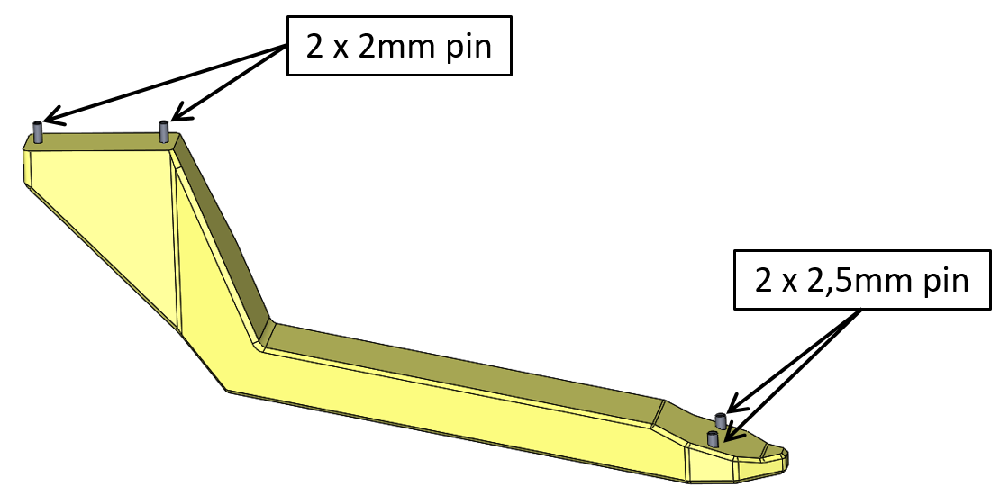 *Calibration tool - pin locations.* 

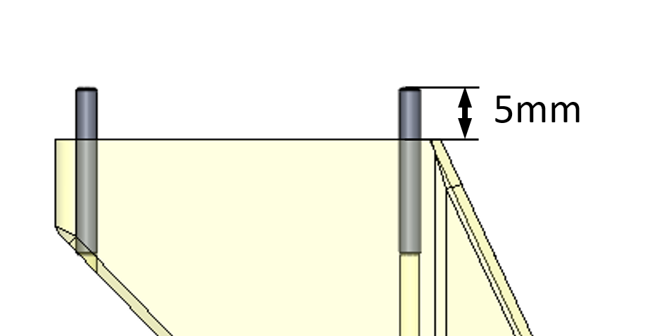 *Use a 1,9mm drill bit to adjust the hole diameters for the 2mm pins. Install the 2mm pins using a hammer. The pins should protrude 5mm from the surface. The [Pin Spacer Tool](stl_files/pin_spacer_5mm.STL) can help to position the pin correctly.* 

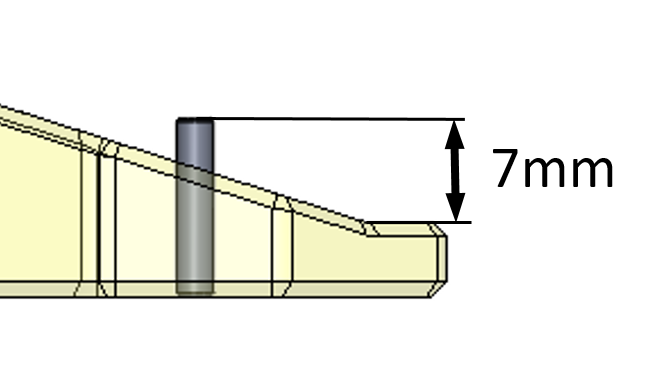 *Use a 2,4mm drill bit to adjust the hole diameters for the 2,5mm pins. Install the 2,5mm pins using a hammer. * 

### Installing the Calibration Tools
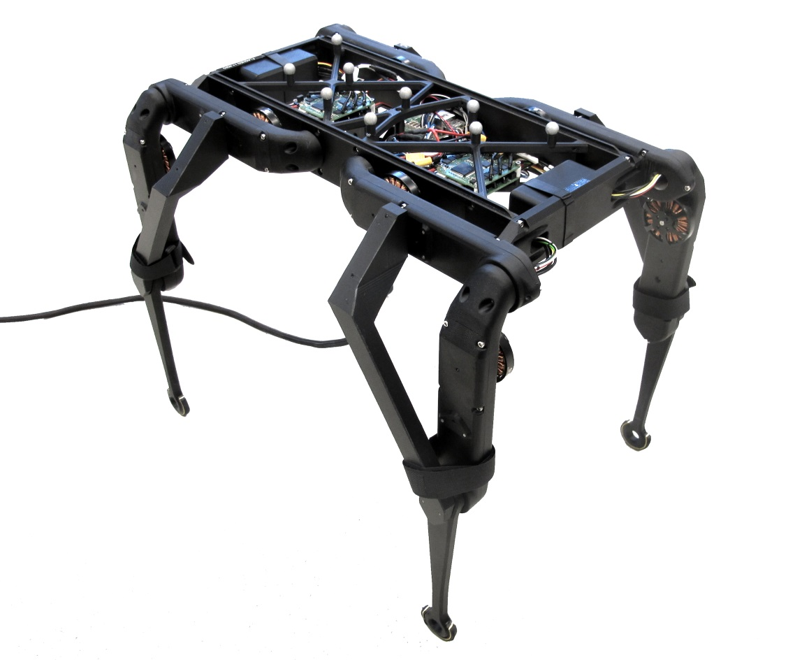 *Insert the pins into the screw heads of the actuator module and the lower leg. Make sure that the tool is fully seated and that there is no gap between the parts. We use velcro straps around the knee to keep the calibration tools in place.* 

---
## Calibration Tool Quadruped 12dof
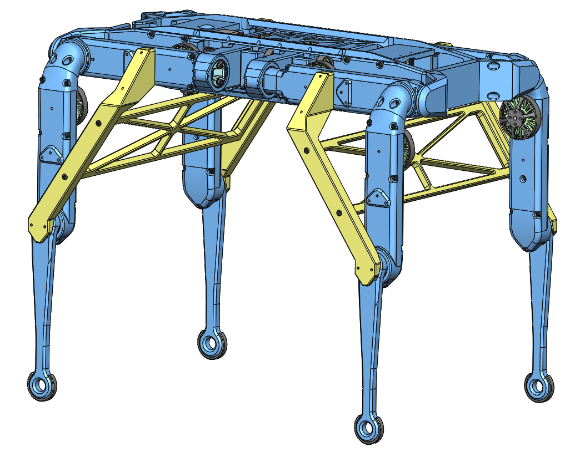 *12dof quadruped cad model with calibration tools.* 

* this calibration tool can be used for the [Quadruped Robot 12 dof  v1](../quadruped_robot_12dof_v1#quadruped-robot-12dof-v1)

### Bill of Materials - Calibration Tool Quadruped 12dof
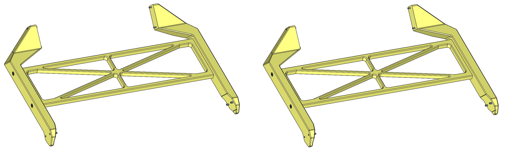 

|Description|Quantity|Ordering Information|Comments|
|---|---|---|---|
|Calibration Tool Quadruped 12dof v1|2|[STL file](stl_files/calibration_tool_quadruped_12dof_v1.STL)|3d printed part We print this part with the "sparse double dense" setting on our FDM printer.|
|Calibration Tool Quadruped 12dof v1 - Mirrored version|2|[STL file](stl_files/calibration_tool_quadruped_12dof_v1_mirror.STL)|3d printed part We print this part with the "sparse double dense" setting on our FDM printer.|
|Calibration Tool Quadruped 12dof v1 Connector|2|[STL file](stl_files/calibration_tool_quadruped_12dof_v1_connector.STL)|3d printed part|
|Pin Spacer Tool 4mm|1|[STL file](stl_files/pin_spacer_4mm.STL)|3d printed tool|
|Pin 2mm x 16mm|8|[Online Schrauben](https://online-schrauben.de/shop/Stifte-ohne-Gewinde/DIN-7-Toleranzfeld-m6-Zylinderstifte-Toleranzfeld-m6-aehnl.-ISO-2338-Form-A/Edelstahl-Rostfrei-A1-1.4305/2,0-mm-Durchmesser)|Stainless Steel A1|
|Pin 2,5mm x 12mm|8|[Online Schrauben](https://online-schrauben.de/shop/Stifte-ohne-Gewinde/DIN-7-Toleranzfeld-m6-Zylinderstifte-Toleranzfeld-m6-aehnl.-ISO-2338-Form-A/Edelstahl-Rostfrei-A1-1.4305/2,5-mm-Durchmesser)|Stainless Steel A1|
|Socket Head Cap Screw M3 x 16|8|[Online Schrauben](https://online-schrauben.de/shop/Schrauben/Innensechskantschrauben/ISO-4762-DIN-912-Zylinderkopfschrauben-mit-Innensechskant-aehnl.-DIN-912/Edelstahl-Rostfrei-A2/M-3-Gewinde-M-metrisches-Regelgewinde)|Stainless Steel A2|
|Threaded Inserts M3 x 4,5|8|[Hoffmann](https://www.hoffmann-group.com/US/en/hus/Power-tools-and-workshop-supplies/Soldering-tools-cleaning-devices-thread-repair/Thread-insert-set%2C-100-pieces-1-5×D/p/082818) [McMaster](https://www.mcmaster.com/91732A647/)|Helicoil|

### Preparing the Calibration Tools
 *Calibration tool - pin locations.* 

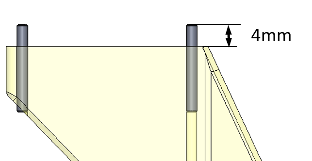 *Use a 1,9mm drill bit to adjust the hole diameters for the 2mm pins. Install the 2mm pins using a hammer. The pins should protrude 4mm from the surface. The [Pin Spacer Tool](stl_files/pin_spacer_4mm.STL) can help to position the pin correctly.* 

 *Use a 2,4mm drill bit to adjust the hole diameters for the 2,5mm pins. Install the 2,5mm pins using a hammer. * 

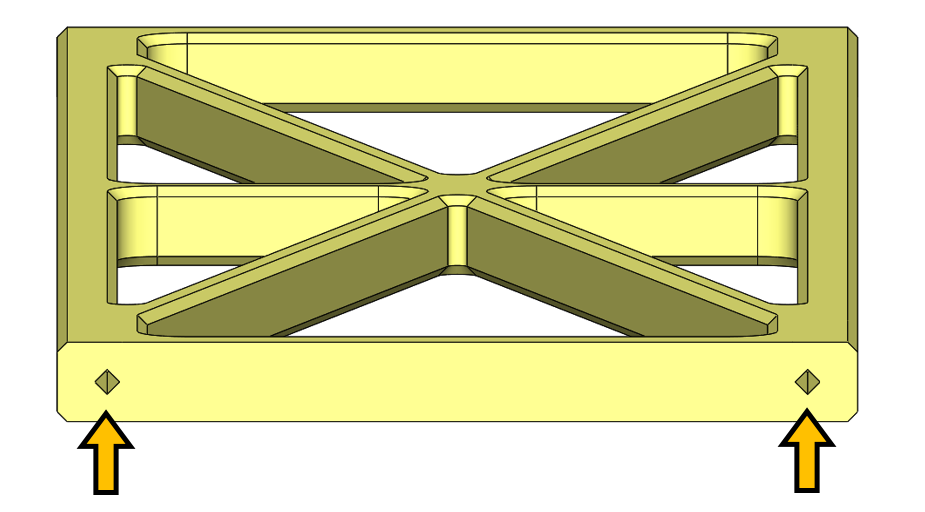 *Increase the square holes on the side of the connector in small steps. Drill with 2,5mm / 2,7mm / 2,9mm and 3,1mm diameter. Install M3x4,5 Helicoil threaded inserts in all four locations.* 

### Installing the Calibration Tools
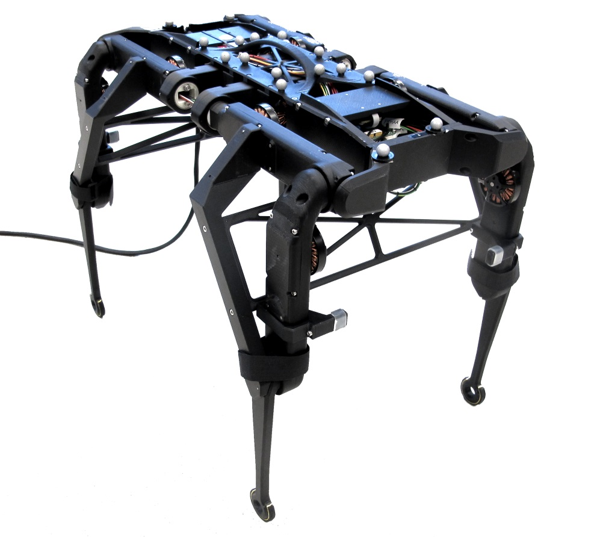 *Insert the pins into the screw heads of the actuator module and the lower leg. Make sure that the tool is fully seated and that there is no gap between the parts. We use velcro straps around the knees to keep the calibration tools in place. Use M3x16 screws to install the connector part.* 

---
## Calibration Tool Biped 6dof
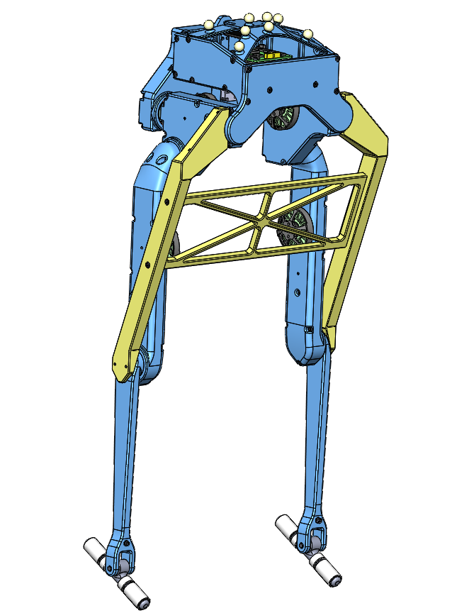 *6dof biped cad model with calibration tools.* 

* this calibration tool can be used for the [Biped Robot 6 dof  v1](../biped_6dof_v1/README.md#biped-robot-6dof-v1)

### Bill of Materials - Calibration Tool Biped 6dof
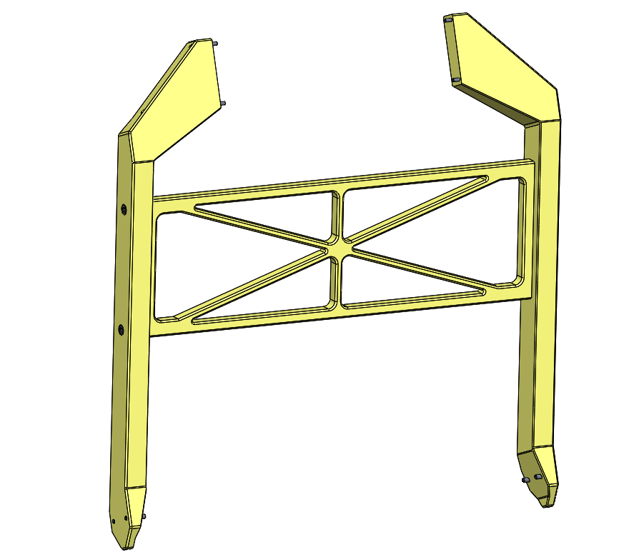 

|Description|Quantity|Ordering Information|Comments|
|---|---|---|---|
|Calibration Tool Biped 6dof v1|1|[STL file](stl_files/calibration_tool_biped_6dof_v1.STL)|3d printed part We print this part with the "sparse double dense" setting on our FDM printer.|
|Calibration Tool Biped 6dof v1 - Mirrored version|1|[STL file](stl_files/calibration_tool_biped_6dof_v1_mirror.STL)|3d printed part We print this part with the "sparse double dense" setting on our FDM printer.|
|Calibration Tool Biped 6dof v1 Connector|1|[STL file](stl_files/calibration_tool_biped_6dof_v1_connector.STL)|3d printed part|
|Pin Spacer Tool 4mm|1|[STL file](stl_files/pin_spacer_4mm.STL)|3d printed tool|
|Pin 2mm x 16mm|4|[Online Schrauben](https://online-schrauben.de/shop/Stifte-ohne-Gewinde/DIN-7-Toleranzfeld-m6-Zylinderstifte-Toleranzfeld-m6-aehnl.-ISO-2338-Form-A/Edelstahl-Rostfrei-A1-1.4305/2,0-mm-Durchmesser)|Stainless Steel A1|
|Pin 2,5mm x 12mm|4|[Online Schrauben](https://online-schrauben.de/shop/Stifte-ohne-Gewinde/DIN-7-Toleranzfeld-m6-Zylinderstifte-Toleranzfeld-m6-aehnl.-ISO-2338-Form-A/Edelstahl-Rostfrei-A1-1.4305/2,5-mm-Durchmesser)|Stainless Steel A1|
|Socket Head Cap Screw M3 x 16|4|[Online Schrauben](https://online-schrauben.de/shop/Schrauben/Innensechskantschrauben/ISO-4762-DIN-912-Zylinderkopfschrauben-mit-Innensechskant-aehnl.-DIN-912/Edelstahl-Rostfrei-A2/M-3-Gewinde-M-metrisches-Regelgewinde)|Stainless Steel A2|
|Threaded Inserts M3 x 4,5|4|[Hoffmann](https://www.hoffmann-group.com/US/en/hus/Power-tools-and-workshop-supplies/Soldering-tools-cleaning-devices-thread-repair/Thread-insert-set%2C-100-pieces-1-5×D/p/082818) [McMaster](https://www.mcmaster.com/91732A647/)|Helicoil|

### Preparing the Calibration Tools
 *Calibration tool - pin locations.* 

 *Use a 1,9mm drill bit to adjust the hole diameters for the 2mm pins. Install the 2mm pins using a hammer. The pins should protrude 4mm from the surface. The [Pin Spacer Tool](stl_files/pin_spacer_4mm.STL) can help to position the pin correctly.* 

 *Use a 2,4mm drill bit to adjust the hole diameters for the 2,5mm pins. Install the 2,5mm pins using a hammer. * 

 *Increase the square holes on the side of the connector in small steps. Drill with 2,5mm / 2,7mm / 2,9mm and 3,1mm diameter. Install M3x4,5 Helicoil threaded inserts in all four locations.* 

### Installing the Calibration Tools
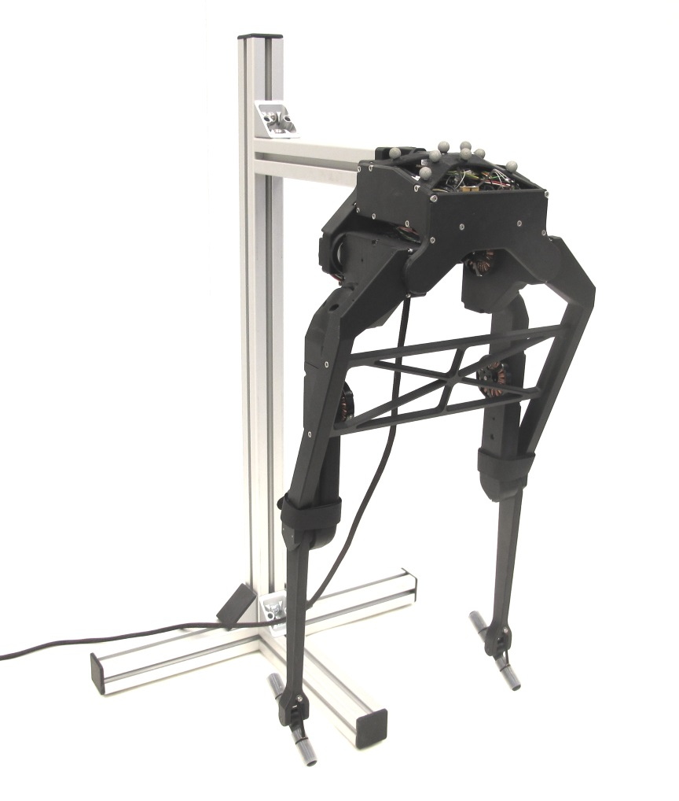 *Insert the pins into the screw heads of the actuator module and the lower leg. Make sure that the tool is fully seated and that there is no gap between the parts. We use velcro straps around the knees to keep the calibration tools in place. Use M3x16 screws to install the connector part.* 

## More Information
[Open Dynamic Robot Initiative - Webpage](https://open-dynamic-robot-initiative.github.io)  
[Open Dynamic Robot Initiative - YouTube Channel](https://www.youtube.com/channel/UCx32JW2oIrax47Gjq8zNI-w)   
[Open Dynamic Robot Initiative - Forum](https://odri.discourse.group/categories)  
[Open Dynamic Robot Initiative - Paper](https://arxiv.org/pdf/1910.00093.pdf)  
[Hardware Overview](../../README.md#open-robot-actuator-hardware)  
[Software Overview](https://github.com/open-dynamic-robot-initiative/open-dynamic-robot-initiative.github.io/wiki)  

---
## Authors
Felix Grimminger

## License
BSD 3-Clause License

## Copyright
Copyright (c) 2019-2021, Max Planck Gesellschaft and New York University
