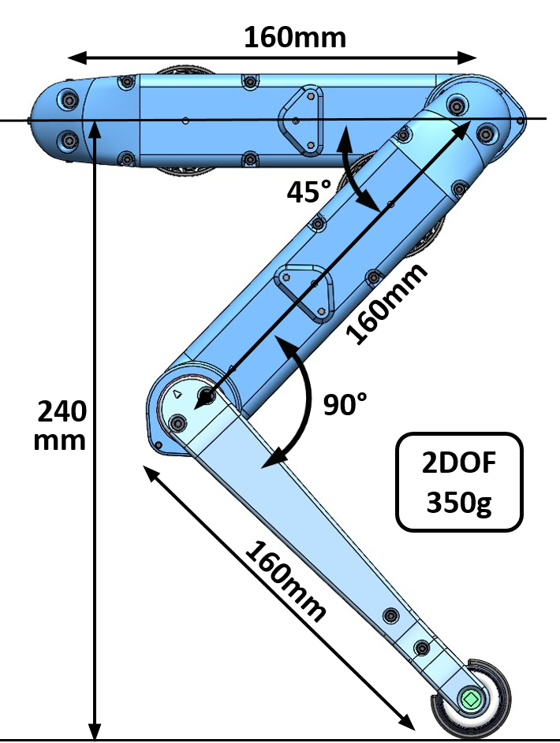

Leg 2dof v1
=======================
    

    

    

Description
------------

2dof - degree of freedom

Machined Parts
---------------

3D Printed Parts
-----------------

How to work with this
---------------------
* To get an better overview of the assembly you can view this [pdf file](https://github.com/open-dynamic-robot-initiative/open_robot_actuator_hardware/blob/master/mechanics/actuator_module_v1/_actuator_module.PDF)
* I recommend downloading the free eDrawings viewer for Windows, Mac, iOS and Android [here](https://www.edrawingsviewer.com/download-edrawings).
* The eDrawing Viewer Software allows you to open and explore this [easm cad assembly file](https://github.com/open-dynamic-robot-initiative/open_robot_actuator_hardware/blob/master/mechanics/actuator_module_v1/_actuator_module.EASM)

Authors
--------
Felix Grimminger

License
-------
BSD 3-Clause License

Copyright
-----------
Copyright (c) 2019, Max Planck Gesellschaft, New York University

More Information
----------------
[Open Dynamic Robot Initiative](https://open-dynamic-robot-initiative.github.io)  
[Hardware Overview](../../README.md)  
[Software Overview](https://github.com/open-dynamic-robot-initiative/open-dynamic-robot-initiative.github.io/wiki/Open-Dynamic-Robot-Initiative-Documentation)
