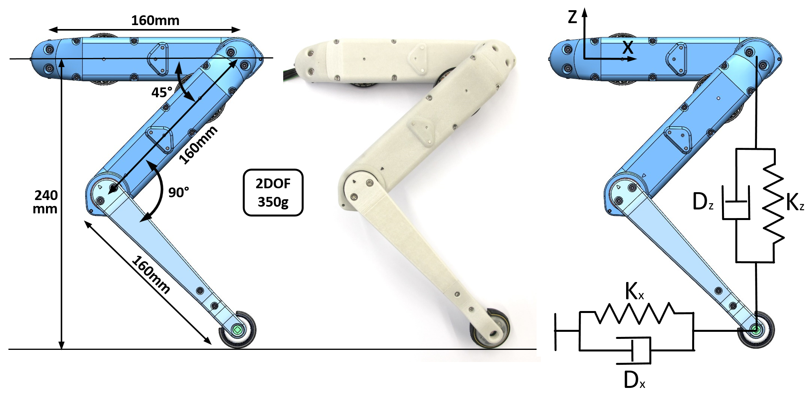
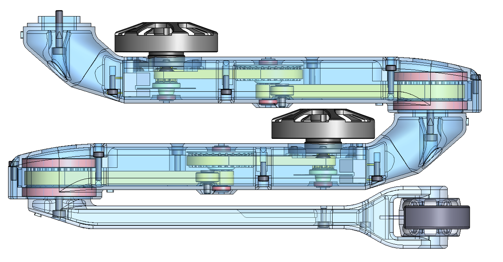
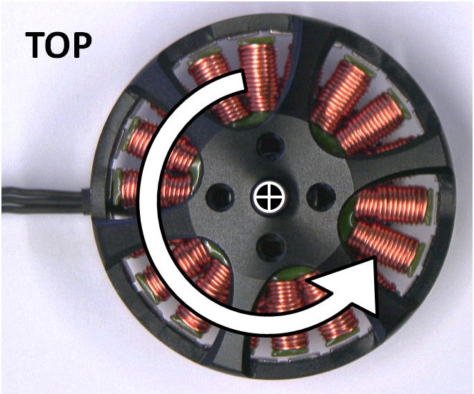
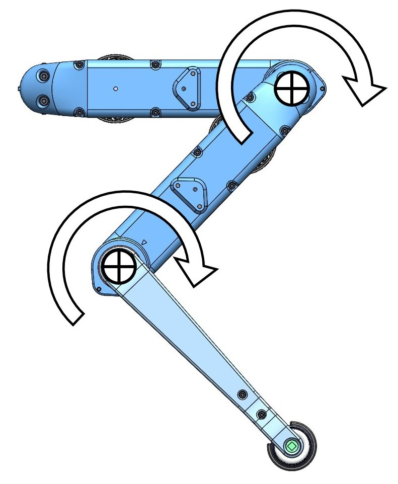
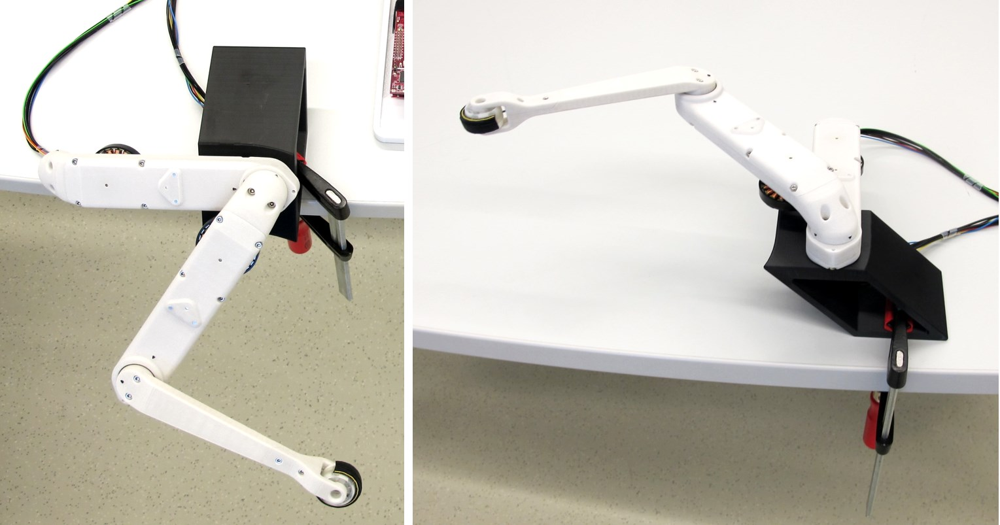
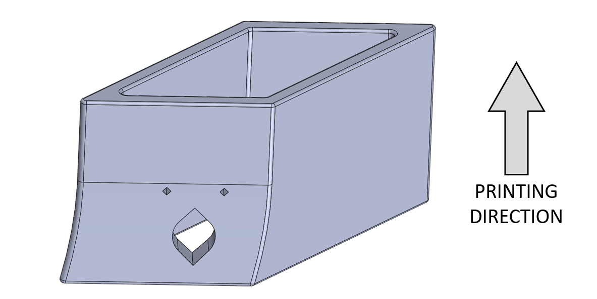

Leg 2dof v1
=======================
  

Description 2dof leg - (2 degree of freedom leg)
------------

The 2dof leg consists of two identical actuator modules, the lower leg and a foot with a optical contact switch.  
The actuator modules are capable of continuous output rotation and there are no mechanical end stops on the leg.  
Since there are wires routed through the hollow shell structures the output rotation should be limited to 3 turns in each direction in software.

The segment lenght is 160mm and results in a neutral standing height of 240mm (at 45 degree hip angle and 90 degree knee angle).

   *Leg Dimensions - the neutral standing height of the leg is 240mm*

The actuator module details are described here -> [Actuator module](../actuator_module_v1)  
The foot contact switch and lower leg details are described here -> [Foot Contact Switch](../foot_contact_switch_v1)

The leg can be used for experiments and measurements with external sensors in the leg test stand. -> [Leg Test stand](../leg_test_stand_v1)  
4 of the leg modules can be used to assemble a 8dof quadruped robot. -> [Quadruped Robot](../quadruped_robot_8dof_v1)

  *The leg segments are stacked and can rotate past each other*

Convention Positive Motor Rotation
-----------------------------------
  *Counterclockwise when looking at the motor from the top*

Convention Positive Joint Rotation
-----------------------------------
  *Clockwise when looking at the robot from the side*

Video Cicle Art
-------

Drawing circles with a 2 dof leg module, developed during a high school student project at New York University.
Credit: Brandon G. Knox

Table Attachment
-----------------

 *Leg mounted at 45 degrees and in parallel to the table*

The 3d printed table attachment can be used to attach the leg to the table and orient it at 45 degrees or in parallel with the table.  
The table attachment was designed to print without support on a FDM printer (fused deposition modelling printer) in the orientation documented below.  

How to work with this
---------------------
* To get an better overview of the assembly you can view this [pdf file](leg_2dof.PDF)
* I recommend downloading the free eDrawings viewer for Windows, Mac, iOS and Android [here](https://www.edrawingsviewer.com/download-edrawings).
* The eDrawing Viewer Software allows you to open and explore this [easm cad assembly file](leg_2dof.EASM)

Authors
--------
Felix Grimminger

License
-------
BSD 3-Clause License

Copyright
-----------
Copyright (c) 2019, Max Planck Gesellschaft, New York University

More Information
----------------
[Open Dynamic Robot Initiative](https://open-dynamic-robot-initiative.github.io)  
[Hardware Overview](../../README.md)  
[Software Overview](https://github.com/open-dynamic-robot-initiative/open-dynamic-robot-initiative.github.io/wiki/Open-Dynamic-Robot-Initiative-Documentation)
