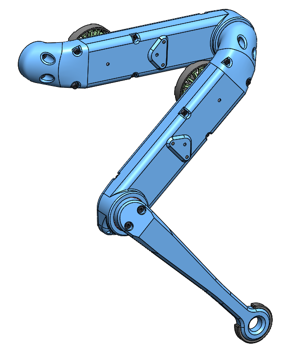
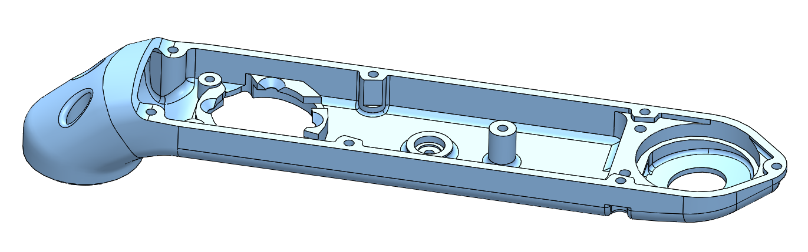
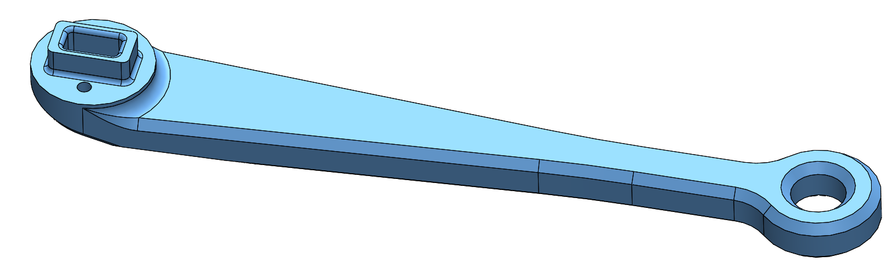

# Leg 2dof v2
  

## Description

## 3d printed parts

  

`The recommended printing direction for all the parts below is the positive z direction of the stl files.`

* All the STL files for 3d printing the leg structure can be found here: [STL Files Leg Structure](stl_files).  

---
  
* [Hip Module Shell Base - STL file](stl_files/hip_module_shell_base.STL) 
* weight: ?g
---
  
* [Hip Module Shell Cover - STL file](stl_files/hip_module_shell_cover.STL) 
* weight: ?g
---
  
* [Upper Leg Module Shell Base - STL file](stl_files/upper_leg_module_shell_base.STL) 
* weight: ?g
---
  
* [Upper Leg Module Shell Cover - STL file](stl_files/upper_leg_module_shell_cover.STL) 
* weight: ?g
---
  
* [Lower Leg - STL file](stl_files/lower_leg_solid_v1.STL) 
* weight: ?g
---

## Authors
Felix Grimminger

## License
BSD 3-Clause License

## Copyright
Copyright (c) 2019-2020, Max Planck Gesellschaft and New York University

## More Information
[Open Dynamic Robot Initiative - Webpage](https://open-dynamic-robot-initiative.github.io)  
[Open Dynamic Robot Initiative - YouTube Channel](https://www.youtube.com/channel/UCx32JW2oIrax47Gjq8zNI-w)   
[Open Dynamic Robot Initiative - Forum](https://odri.discourse.group/categories)  
[Open Dynamic Robot Initiative - Paper](https://arxiv.org/pdf/1910.00093.pdf)  
[Hardware Overview](../../README.md#open-robot-actuator-hardware)  
[Software Overview](https://github.com/open-dynamic-robot-initiative/open-dynamic-robot-initiative.github.io/wiki)
