# Leg 3dof v1

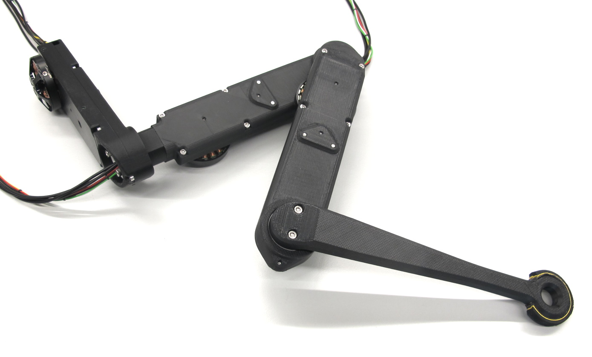 *Leg 3dof - weight: 485g* 

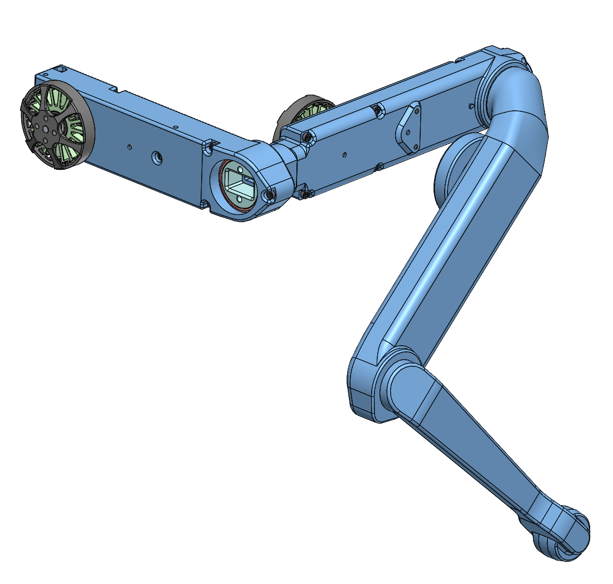 *CAD Model Leg 3dof*  

## Description

* this page describes the 3dof leg that is used for the [Quadruped Robot 12dof](../quadruped_robot_12dof_v1#quadruped-robot-12dof-v1)
* the same actuator modules are also used for the [FingerEdu](../finger_edu_v1/README.md#fingeredu-v1) and the [NYU Finger](../nyu_finger_v1/README.md#nyu-finger-v1)
* the internal components of all the actuator modules are identical: [Core Components](../actuator_module_v1#core-components)

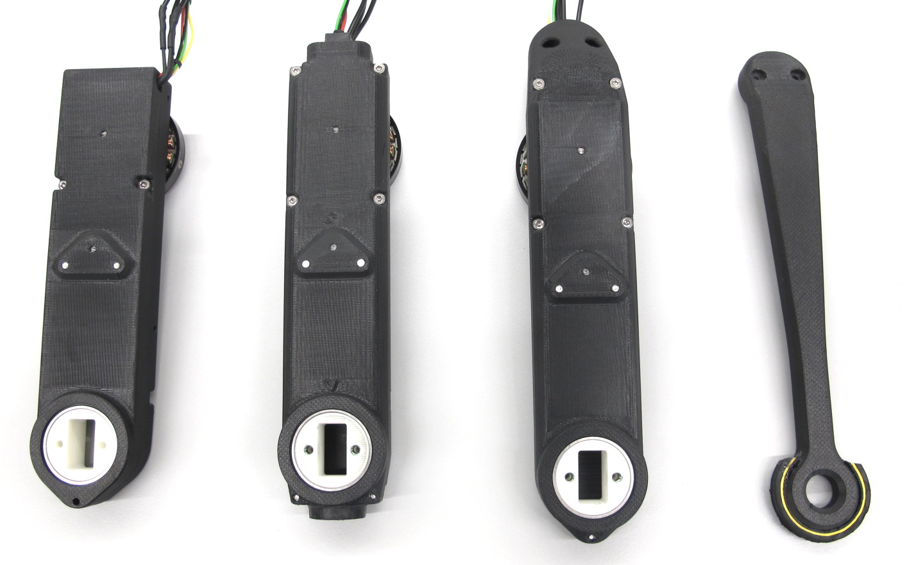 *Submodules: Hip AA, Hip FE, Upper Leg and Lower Leg*

## Core Components

  *Actuator Module Core Components - weight: 95g* 

The internal components of the actuator modules are described here:
* [Actuator Module Core v1](../actuator_module_v1/README.md#brushless-actuator-module-core-v1)
* [Actuator Module Core v1.1](../actuator_module_v1/actuator_module_v1.1.md#brushless-actuator-module-core-v11)

## Lower Leg

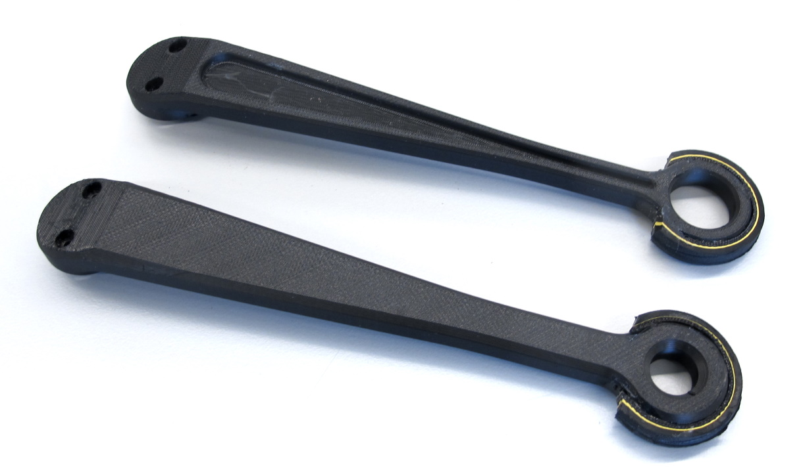  *Lower Leg Version v2 and v3 - weight: 22g each* 

* the Lower Legs are describes here: [Lower Leg Documentation](../general/lower_legs.md#lower-legs)

## 3D Printed Parts

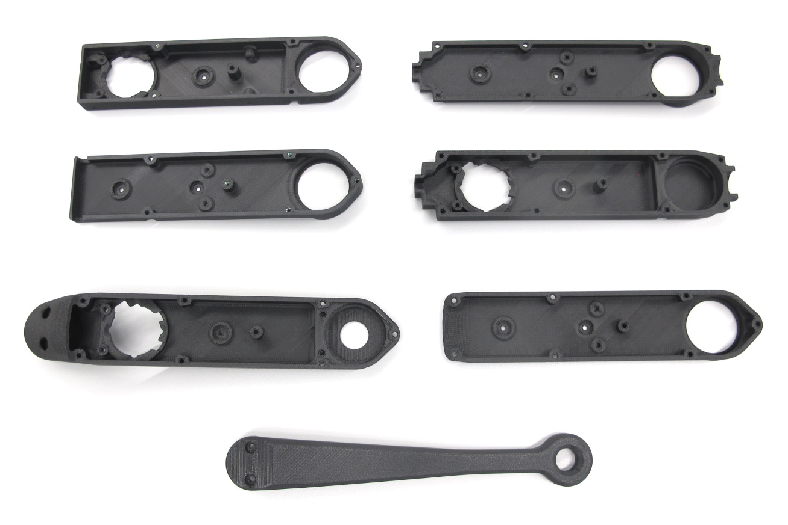 *3D Printed Parts Leg 3dof - weight: 139g*

  

`The recommended printing direction for all the parts below is the positive z direction of the stl files.`

* The STL files for 3d printing the shells of the 3dof leg can be found here: [STL files 3dof leg](stl_files).
---

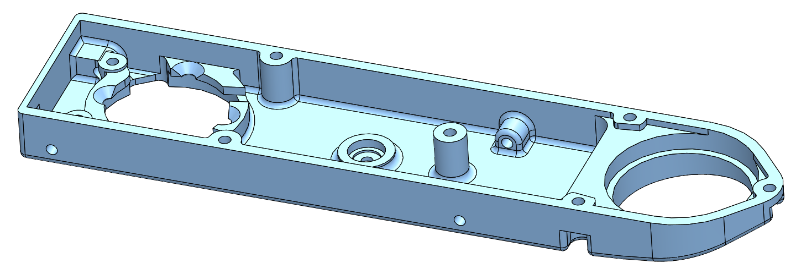 
* [Hip AA Module Shell Base - STL file](stl_files/hip_aa_module_shell_base.STL) 
* weight: 21g
---
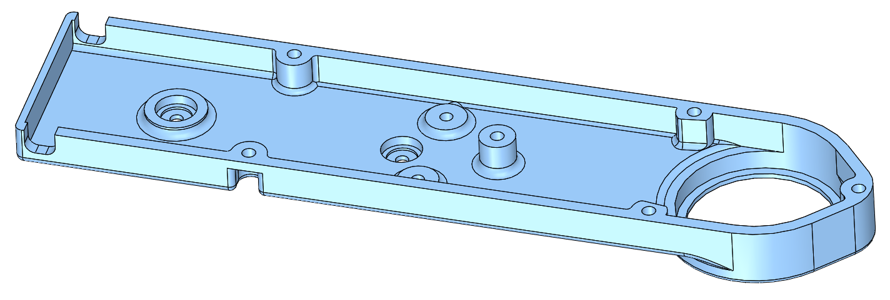 
* [Hip AA Module Shell Cover - STL file](stl_files/hip_aa_module_shell_cover.STL) 
* weight: 16g
---
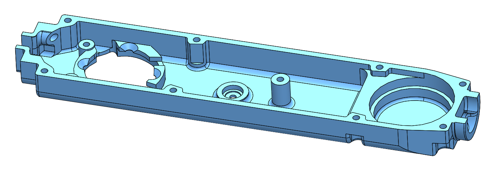 
* [Hip FE Module Shell Base - STL file](stl_files/hip_fe_module_shell_base.STL) 
* weight: 25g
---
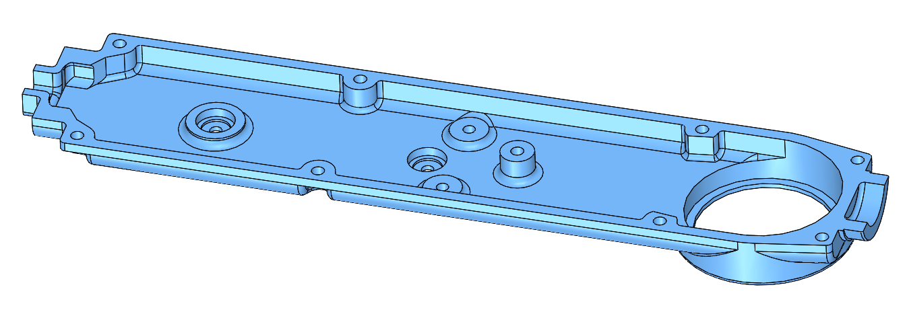 
* [Hip FE Module Shell Cover - STL file](stl_files/hip_fe_module_shell_cover.STL) 
* weight: 16g
---
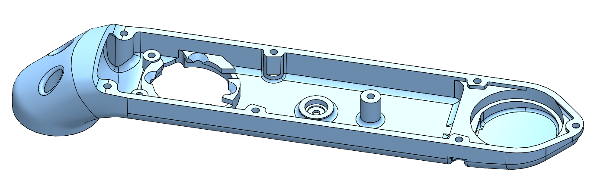 
* [Upper Leg Module Shell Base - STL file](stl_files/upper_leg_module_shell_base.STL) 
* weight: 27g
---
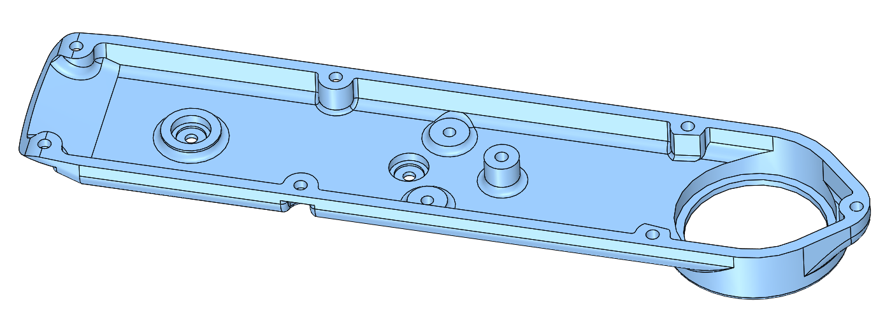 
* [Upper Leg Module Shell Cover - STL file](stl_files/upper_leg_module_shell_cover.STL) 
* weight: 15g
---
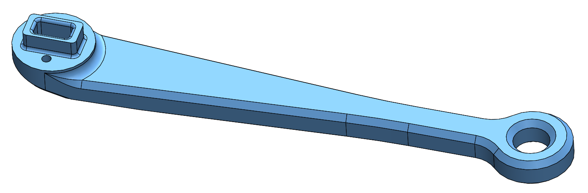 
* [Lower Leg v2 - STL file](stl_files/lower_leg_v2.STL) 
* we print the lower leg on a FDM printer using the "sparse double dense" setting
* alternative Lower Leg Version 3 below
* [Lower Leg Documentation](../general/lower_legs.md#lower-leg-v2)
* weight: 20g
---
  
* [Lower Leg v3 - STL file](stl_files/lower_leg_v3.STL) 
* this lower leg is meant for printing as a solid part
* [Lower Leg Documentation](../general/lower_legs.md#lower-leg-v3)
* weight: 20g

## Off-the-shelf Components

### Fasteners

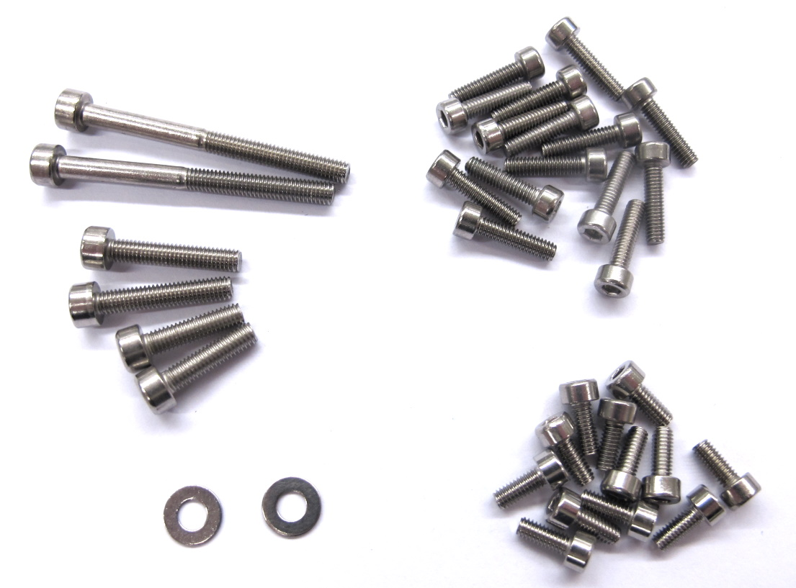  

* M2,5 and M3 fasteners
* we use stainless steel fasteners

### Helicoil Thread Inserts

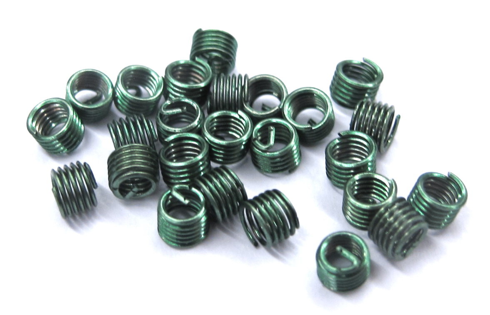  

* we use Helicoil inserts to reinforce the threads of the 3d printed parts
* you need the [Helicoil Tools](../actuator_module_v1/details/details_tools.md#helicoil-tools) to install the threaded inserts
* Helicoil ordering information [below](#bill-of-materials---leg-3dof)

## Bill of Materials - Leg 3dof
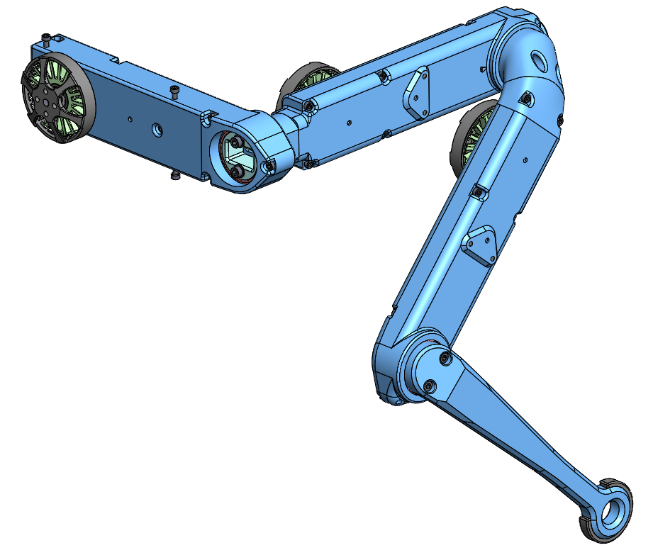 

| Description | Quantity | Ordering Information | Comments |  
| --- | --- | --- | --- |
|Core Components|3|[Actuator Module Core v1](../actuator_module_v1/README.md#brushless-actuator-module-core-v1)  [Actuator Module Core v1.1](../actuator_module_v1/actuator_module_v1.1.md#brushless-actuator-module-core-v11)||  
|Hip AA Module Shell Base |1|[STL file](stl_files/hip_aa_module_shell_base.STL)|[3d printed part](../actuator_module_v1/details/details_3d_printed_parts.md#details-3d-printed-parts)|
|Hip AA Module Shell Cover |1|[STL file](stl_files/hip_aa_module_shell_cover.STL)|[3d printed part](../actuator_module_v1/details/details_3d_printed_parts.md#details-3d-printed-parts)|
|Hip FE Module Shell Base |1|[STL file](stl_files/hip_fe_module_shell_base.STL)|[3d printed part](../actuator_module_v1/details/details_3d_printed_parts.md#details-3d-printed-parts)|
|Hip FE Module Shell Cover |1|[STL file](stl_files/hip_fe_module_shell_cover.STL)|[3d printed part](../actuator_module_v1/details/details_3d_printed_parts.md#details-3d-printed-parts)|
|Upper Leg Module Shell Base |1|[STL file](stl_files/upper_leg_module_shell_base.STL)|[3d printed part](../actuator_module_v1/details/details_3d_printed_parts.md#details-3d-printed-parts)|
|Upper Leg Module Shell Cover |1|[STL file](stl_files/upper_leg_module_shell_cover.STL)|[3d printed part](../actuator_module_v1/details/details_3d_printed_parts.md#details-3d-printed-parts)|
|Lower Leg v2|1|[STL file](stl_files/lower_leg_v2.STL)|[3d printed part](../actuator_module_v1/details/details_3d_printed_parts.md#details-3d-printed-parts) FDM printer setting: sparse double dense|
|Lower Leg v3 |1|[STL file](stl_files/lower_leg_v3.STL)|[3d printed part](../actuator_module_v1/details/details_3d_printed_parts.md#details-3d-printed-parts) Print as a solid part. Alternative for Lower Leg v2|
|Rubber Foot ||Bicycle tire - for example: Schwalbe Lugano 28" 23-622 |Cut 75mm x 7mm segments|
|Fasteners M3x35|2|M3x35 Socket Head Cap Screw|Stainless Steel For Hip AA to Hip FE connection with adapter.|
|Fasteners M3x22|2|M3x22 Socket Head Cap Screw|Stainless Steel For Hip AA to Hip FE connection without adapter.|
|Fasteners M3x16|2|M3x16 Socket Head Cap Screw|Stainless Steel|
|Fasteners M3x12|2|M3x12 Socket Head Cap Screw|Stainless Steel|
|Washer M3|2||Stainless Steel|
|Fasteners M2,5x6|12|M2,5x6 Socket Head Cap Screw|Stainless Steel|
|Fasteners M2,5x10|15|M2,5x10 Socket Head Cap Screw|Stainless Steel|
|Helical Inserts M2,5x3,75|27|Hoffmann 082814 M2,5 McMaster 91732A767|M2,5 Helicoil tools required|

## View the 3dof Leg Cad Model in your Web Browser

<a href="https://open-dynamic-robot-initiative.github.io/cad_files/leg_3dof_v1">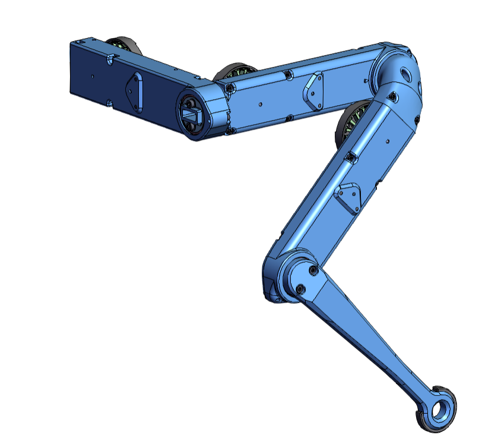</a>  *Leg 3dof v1 - Click on the picture to view the cad model in your browser* 

## Joint Rotation Limiters

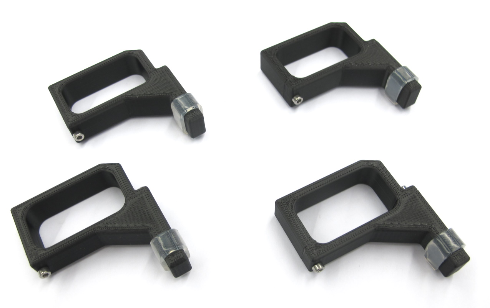  *Joint Rotation Limiters - weight: 14g each* 

* the lower leg and the upper leg can perform multiple rotations
* to prevent multiple rotations and winding up the wires you can install a stopper on the upper leg
* we use silicone tube sections to soften impacts

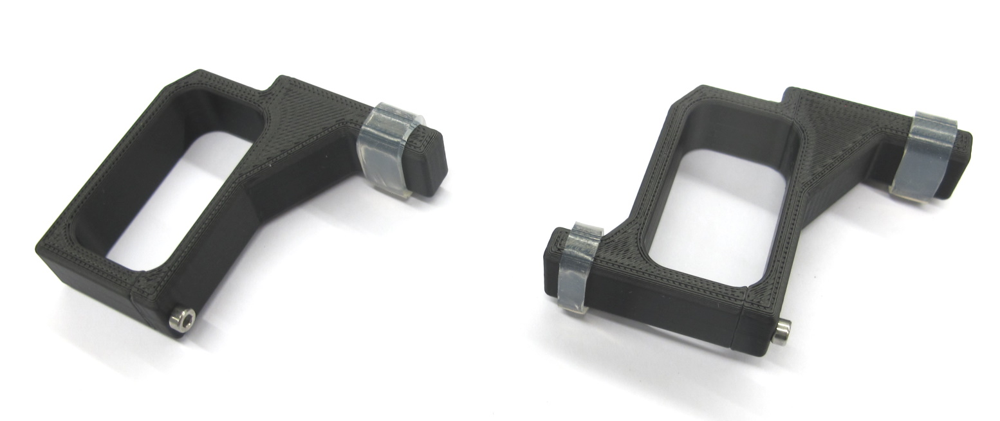  *Comparision Single Stopper and Double Stopper* 

* there's an alternative version that also prevents the lower leg from performing multiple rotations
* that version can be installed if a foot-switch is used

All the STL files for 3d printing can be found here: [STL Files Leg 3dof](stl_files) 

### 3D Printed Parts

 
* [Stopper Upper Leg Base - STL file](stl_files/stopper_upper_leg_base.STL) 
* weight: 5g
----

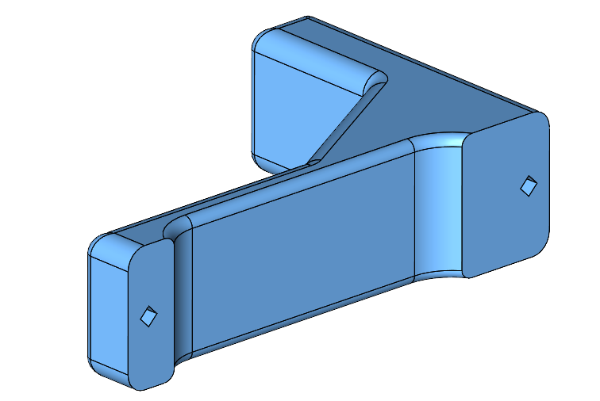 
* [Stopper Upper Leg Cover - STL file](stl_files/stopper_upper_leg_cover.STL) 
* weight: 7g

### Bill of Materials - Joint Rotation Limiter

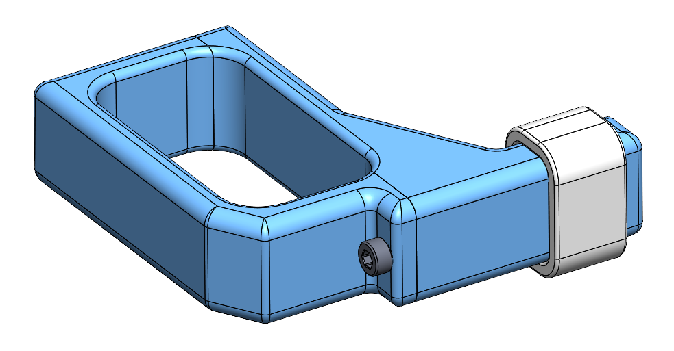 

| Description | Quantity | Ordering Information | Comments |  
| --- | --- | --- | --- |
|Stopper Upper Leg Base|1|[STL file](stl_files/stopper_upper_leg_base.STL)|[3d printed part](../actuator_module_v1/details/details_3d_printed_parts.md#details-3d-printed-parts)|
|Stopper Upper Leg Cover|1|[STL file](stl_files/stopper_upper_leg_cover.STL)|[3d printed part](../actuator_module_v1/details/details_3d_printed_parts.md#details-3d-printed-parts)|
|M2,5x6 Socket Head Cap Screw|1|[Online Schrauben](https://online-schrauben.de/shop/Schrauben/Innensechskantschrauben/ISO-4762-DIN-912-Zylinderkopfschrauben-mit-Innensechskant-aehnl.-DIN-912/Edelstahl-Rostfrei-A2/M-2,5-Gewinde-M-metrisches-Regelgewinde)|Stainless steel. Online Schrauben ships within Europe.|
|M2,5x10 Socket Head Cap Screw|1|[Online Schrauben](https://online-schrauben.de/shop/Schrauben/Innensechskantschrauben/ISO-4762-DIN-912-Zylinderkopfschrauben-mit-Innensechskant-aehnl.-DIN-912/Edelstahl-Rostfrei-A2/M-2,5-Gewinde-M-metrisches-Regelgewinde)|Stainless steel. Online Schrauben ships within Europe.|
|Silicone Tube 10mm Segment|1|O.D. 12mm I.D. 8mm|[Tube Cutter](../actuator_module_v1/details/details_tools.md#tube-cutter)|

## Preparing the 3d Printed Parts

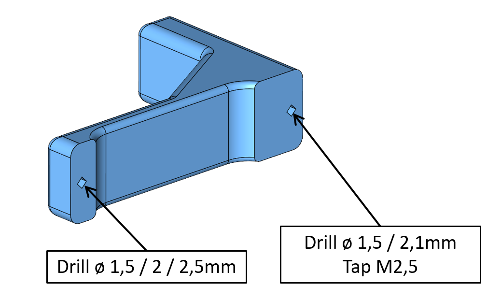 

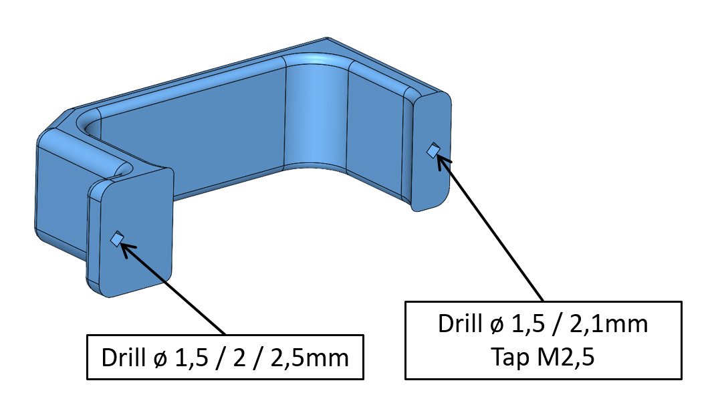 

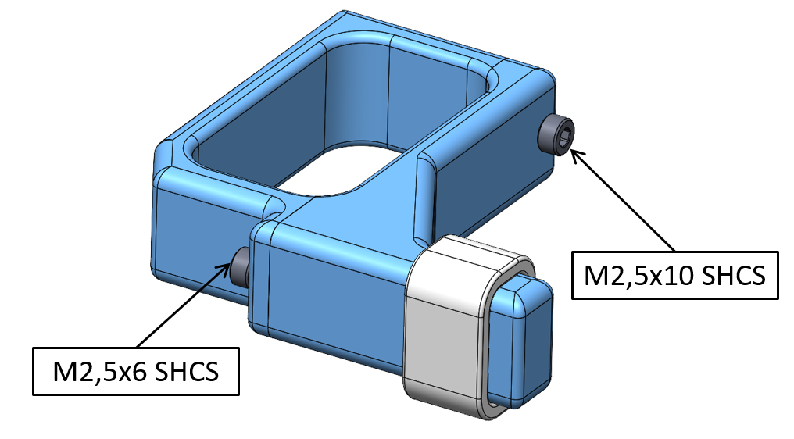 

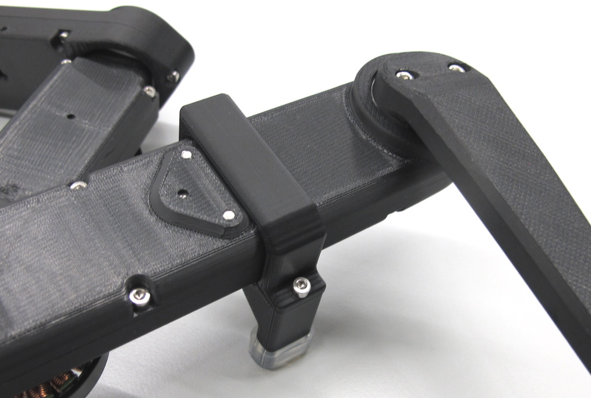 *Joint Rotation Limiter installed on the Upper Leg.* 

## More Information
[Open Dynamic Robot Initiative - Webpage](https://open-dynamic-robot-initiative.github.io)  
[Open Dynamic Robot Initiative - YouTube Channel](https://www.youtube.com/channel/UCx32JW2oIrax47Gjq8zNI-w)   
[Open Dynamic Robot Initiative - Forum](https://odri.discourse.group/categories)  
[Open Dynamic Robot Initiative - Paper](https://arxiv.org/pdf/1910.00093.pdf)  
[Hardware Overview](../../README.md#open-robot-actuator-hardware)  
[Software Overview](https://github.com/open-dynamic-robot-initiative/open-dynamic-robot-initiative.github.io/wiki)  

## Authors
Felix Grimminger

## License
BSD 3-Clause License

## Copyright
Copyright (c) 2019-2021, Max Planck Gesellschaft and New York University
