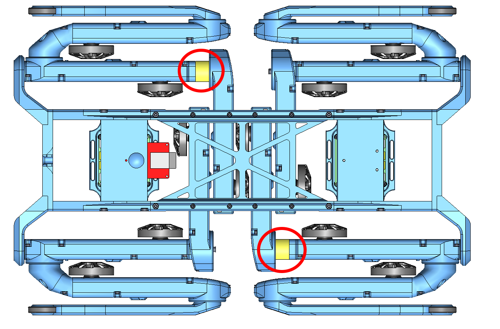
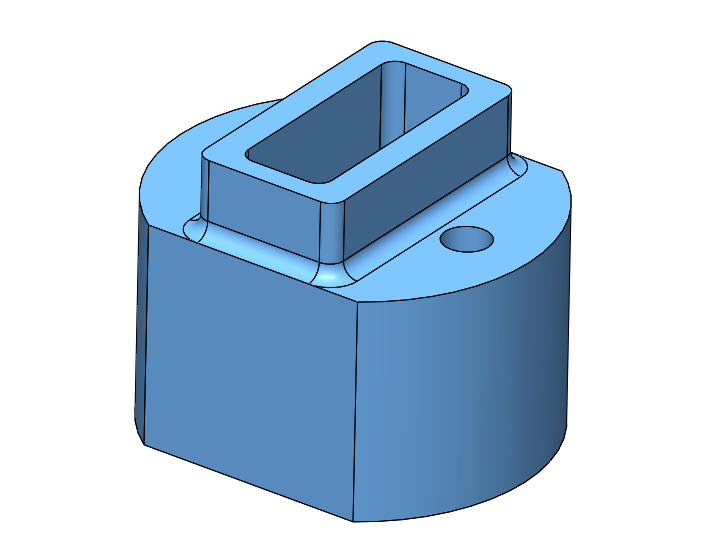
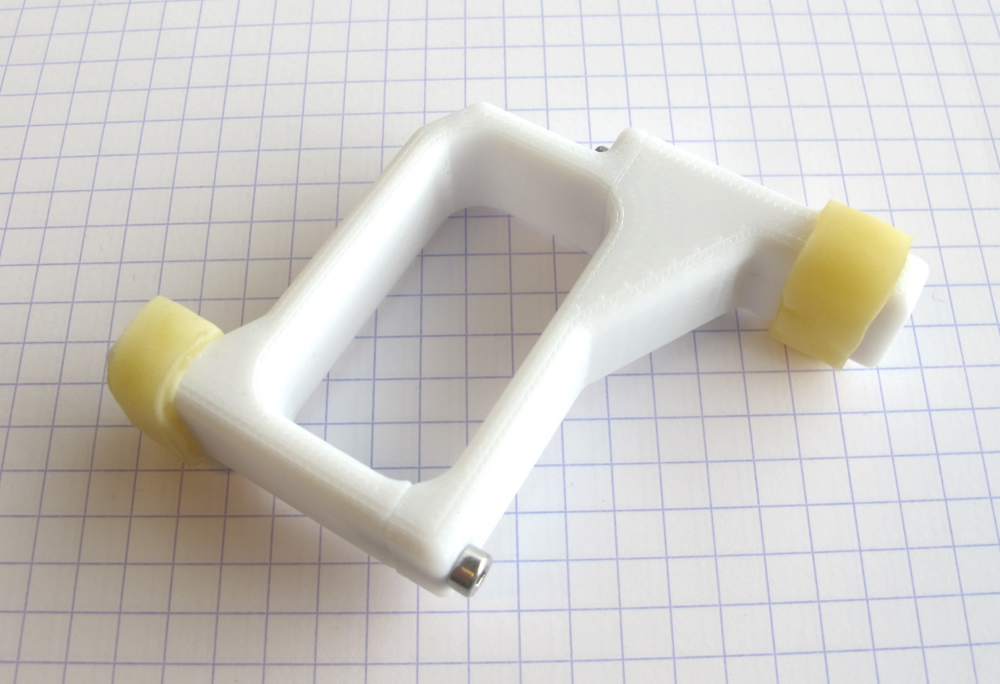
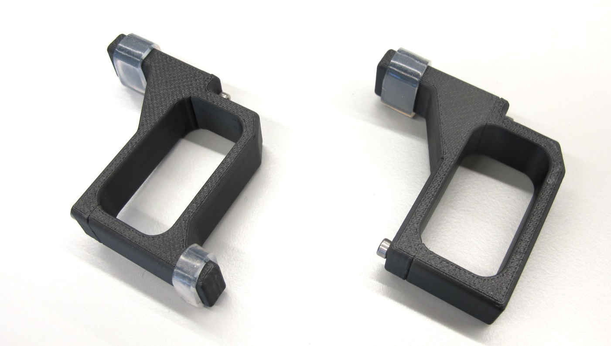

# Leg 3dof v1

 *CAD model 3 dof leg*  

## Description

* the 3dof leg is used for the [12dof quadruped robot](../quadruped_robot_12dof_v1#quadruped-robot-12dof-v1)
* the [core components](../actuator_module_v1#core-components) of all 12 actuator modules are identical

 *The hip adapters are installed on the front right and the hind left leg.*

 *Actuator modules - Upper Leg, Hip FE and Hip AA*

## 3D Printed Parts

  

`The recommended printing direction for all the parts below is the positive z direction of the stl files.`

* The STL files for 3d printing the shells of the 3dof leg can be found here: [STL files 3dof leg](stl_files).
---

 
* [Hip AA Module Shell Base - STL file](stl_files/hip_aa_module_shell_base.STL) 
* weight: 21g
---
 
* [Hip AA Module Shell Cover - STL file](stl_files/hip_aa_module_shell_cover.STL) 
* weight: 16g
---
 
* [Hip FE Module Shell Base - STL file](stl_files/hip_fe_module_shell_base.STL) 
* weight: 25g
---
 
* [Hip FE Module Shell Cover - STL file](stl_files/hip_fe_module_shell_cover.STL) 
* weight: 16g
---
 
* [Upper Leg Module Shell Base - STL file](stl_files/upper_leg_module_shell_base.STL) 
* weight: 27g
---
 
* [Upper Leg Module Shell Cover - STL file](stl_files/upper_leg_module_shell_cover.STL) 
* weight: 15g
---
 
* [Hip Adapter - STL file](stl_files/hip_adapter.STL) 
* weight: 3g
* only required for 2 of the 4 legs
---

 
* [Lower Leg v2 - STL file](stl_files/lower_leg_v2.STL) 
* we print the lower leg on a FDM printer using the "sparse double dense" setting
* alternative Lower Leg Version 3 below
* [Lower Leg Documentation](../general/lower_legs.md#lower-leg-v2)
* weight: 20g
---
  
* [Lower Leg v3 - STL file](stl_files/lower_leg_v3.STL) 
* this lower leg is meant for printing as a solid part
* [Lower Leg Documentation](../general/lower_legs.md#lower-leg-v3)
* weight: 20g

---
## Bill of Materials
 

| Part Name | Quantity | Ordering Information | Comments |  
| --- | --- | --- | --- |
|Core Components|3|[Documentation Core Components](../actuator_module_v1#core-components)||  
|Hip AA Module Shell Base |1|[STL file](stl_files/hip_aa_module_shell_base.STL)|3d printed part|
|Hip AA Module Shell Cover |1|[STL file](stl_files/hip_aa_module_shell_cover.STL)|3d printed part|
|Hip FE Module Shell Base |1|[STL file](stl_files/hip_fe_module_shell_base.STL)|3d printed part|
|Hip FE Module Shell Cover |1|[STL file](stl_files/hip_fe_module_shell_cover.STL)|3d printed part|
|Upper Leg Module Shell Base |1|[STL file](stl_files/upper_leg_module_shell_base.STL)|3d printed part|
|Upper Leg Module Shell Cover |1|[STL file](stl_files/upper_leg_module_shell_cover.STL)|3d printed part|
|Hip Adapter |1|[STL file](stl_files/hip_adapter.STL)|3d printed part Only required for 2 of the 4 legs.|
|Lower Leg v2|1|[STL file](stl_files/lower_leg_v2.STL)|3d printed part FDM printer setting: sparse double dense|
|Lower Leg v3 |1|[STL file](stl_files/lower_leg_v3.STL)|3d printed part Print as a solid part. Alternative for Lower Leg v2|
|Rubber Foot ||Bicycle tire - for example: Schwalbe Lugano 28" 23-622 |Cut 75mm x 7mm segments|
|Fasteners M3x35|2|M3x35 Socket Head Cap Screw|Stainless Steel For Hip AA to Hip FE connection with adapter.|
|Fasteners M3x22|2|M3x22 Socket Head Cap Screw|Stainless Steel For Hip AA to Hip FE connection without adapter.|
|Fasteners M3x16|2|M3x16 Socket Head Cap Screw|Stainless Steel|
|Fasteners M3x12|2|M3x12 Socket Head Cap Screw|Stainless Steel|
|Washer M3|2||Stainless Steel|
|Fasteners M2,5x6|12|M2,5x6 Socket Head Cap Screw|Stainless Steel|
|Fasteners M2,5x10|15|M2,5x10 Socket Head Cap Screw|Stainless Steel|
|Helical Inserts M2,5x3,75|27|Hoffmann 082814 M2,5 McMaster 91732A767|M2,5 Helicoil tools required|

---

## Joint Rotation Limiter

 *Joint rotation limiter for upper leg and lower leg- weight: 15g*

* the lower leg and the upper leg can perform multiple rotations
* to prevent multiple rotations you can install a stopper on the upper leg
* there is one version to prevent multiple upper leg and lower leg rotation
* and another version to prevent multiple upper leg rotation only
* we use 12mm x 8mm latex hose sections to soften impacts
* drill the square holes to 2mm and tap for M2,5
* use M2,5 x 8 and M2,5 x 10 screws for attachment
* Stopper upper leg and lower leg base : [STL file](stl_files/stopper_upper_lower_leg_base.STL)
* Stopper upper leg and lower leg cover : [STL file](stl_files/stopper_upper_lower_leg_cover.STL)
* Stopper upper leg base : [STL file](stl_files/stopper_upper_leg_base.STL)
* Stopper upper leg cover : [STL file](stl_files/stopper_upper_leg_cover.STL)  

 

---
## More Information
[Open Dynamic Robot Initiative - Webpage](https://open-dynamic-robot-initiative.github.io)  
[Open Dynamic Robot Initiative - YouTube Channel](https://www.youtube.com/channel/UCx32JW2oIrax47Gjq8zNI-w)   
[Open Dynamic Robot Initiative - Forum](https://odri.discourse.group/categories)  
[Open Dynamic Robot Initiative - Paper](https://arxiv.org/pdf/1910.00093.pdf)  
[Hardware Overview](../../README.md#open-robot-actuator-hardware)  
[Software Overview](https://github.com/open-dynamic-robot-initiative/open-dynamic-robot-initiative.github.io/wiki)  

## Authors
Felix Grimminger

## License
BSD 3-Clause License

## Copyright
Copyright (c) 2019-2021, Max Planck Gesellschaft and New York University
