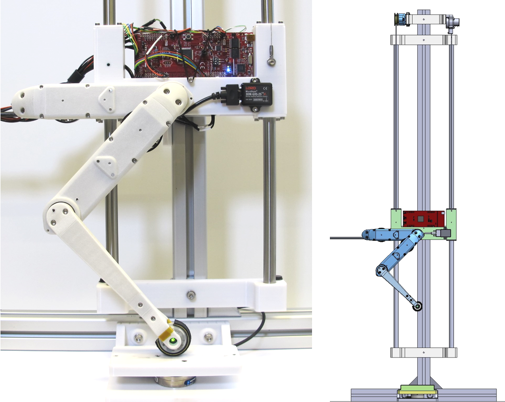
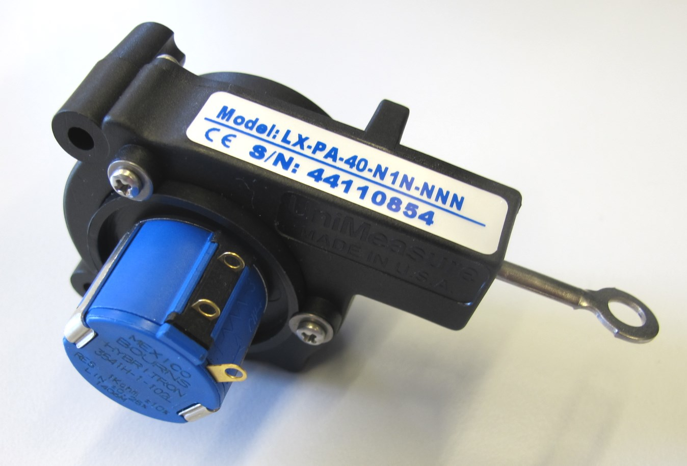
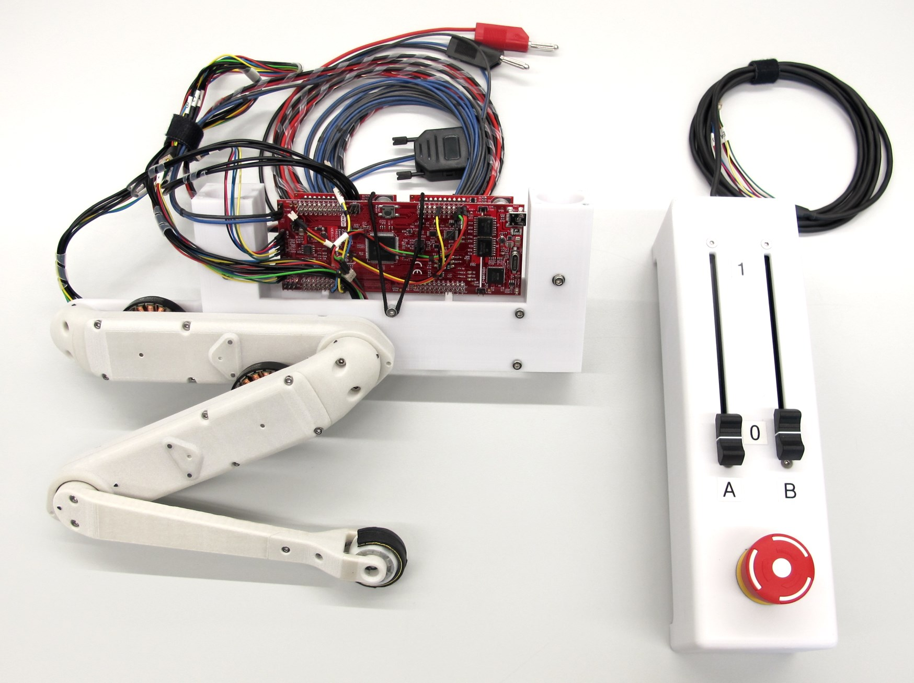

Leg Test Stand v1
=======================
    

Description
------------

2 x Actuator module  
1 x Lower leg with foot contact switch  
TI evaluation board electronics  
Vertical Range: 85cm
Hip height: 7cm - 92cm  
Weight of sliding carriage: 650g

Off-the-shelf Components
-------------------
### Height Sensor
    

Waycon String potentiometer 1000mm

### Force Torque Sensor
    

ATI Mini 40 force-torque-sensor with SI-40-2 Calibration

### Inertia Measurement Unit
    

Lord Microstrain 3DM-GX5-25

### Linear Guide

* Linear ball bearings: KB-1 14mm diameter
* Linear motion rods: Precision Stainless Steel Rods X46 14h6 x 1000mm

Machined Parts
---------------

3D Printed Parts
-----------------

Components Teststand
----------------------
    

How to work with this
---------------------
* To get an better overview of the assembly you can view this [pdf file](https://github.com/open-dynamic-robot-initiative/open_robot_actuator_hardware/blob/master/mechanics/actuator_module_v1/_actuator_module.PDF)
* I recommend downloading the free eDrawings viewer for Windows, Mac, iOS and Android [here](https://www.edrawingsviewer.com/download-edrawings).
* The eDrawing Viewer Software allows you to open and explore this [easm cad assembly file](https://github.com/open-dynamic-robot-initiative/open_robot_actuator_hardware/blob/master/mechanics/actuator_module_v1/_actuator_module.EASM)

Authors
--------
Felix Grimminger

License
-------
BSD 3-Clause License

Copyright
-----------
Copyright (c) 2019, Max Planck Gesellschaft, New York University

More Information
----------------
[Open Dynamic Robot Initiative](https://open-dynamic-robot-initiative.github.io)  
[Hardware Overview](../../README.md)  
[Software Overview](https://github.com/open-dynamic-robot-initiative/open-dynamic-robot-initiative.github.io/wiki/Open-Dynamic-Robot-Initiative-Documentation)
