# Leg Test Stand v1
    

## Description

This teststand allows us to evaluate the performance of a single 2dof leg with external sensors.
The teststand has a linear guided vertical degree of freedom and a carriage that holds the leg and the motor driver electronics. The ground reaction forces are measured with a 6 axis force-torque-sensor and are transmitted to the control pc at 1kHz. The vertial position of the carriage is measured with an analog string potentiometer. The acceleration can be measured with an inertia measurement unit which is mounted to the carriage. The test stand can be equipped with a pull-up-motor module for automated resetting to the initial position for machine learning experiments.

* The details of the 2dof leg are described here: [Leg 2dof](../leg_2dof_v1/README.md)
* The details of the lower leg and the foot contact switch are described here: [Lower Leg and Foot Contact Switch](../foot_contact_switch_v1/README.md)
* The details of the TI evaluation board electronics are described here: [TI Electronics](../../electronics/ti_electronics/README.md)

## Details Leg Test Stand

* Vertical Range: 85cm  
* Hip height: 7cm - 92cm  

  *Carriage with 2dof leg and motor driver electronics / Slider Box*

## Electronics

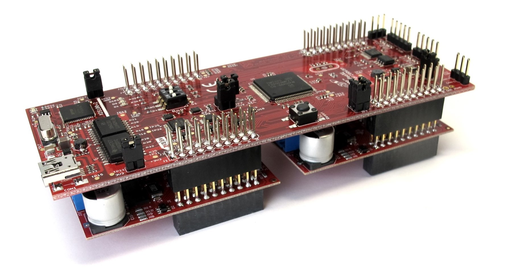  *Texas Instruments Dual Motor Driver stack*

* [Texas Instruments evaluation motor driver electronics](../../electronics/ti_electronics/README.md) 
* The leg test stand requires a 24V power supply and 1 CAN communication channel

### Height Sensor
 *Waycon String potentiometer - 1000mm measurement range*

### Force Torque Sensor
  *ATI Mini 40 force-torque-sensor with SI-40-2 Calibration*

### Inertia Measurement Unit
    *Lord Microstrain IMU 3DM-GX5-25*

## Off-the-shelf Components

### Linear Guide

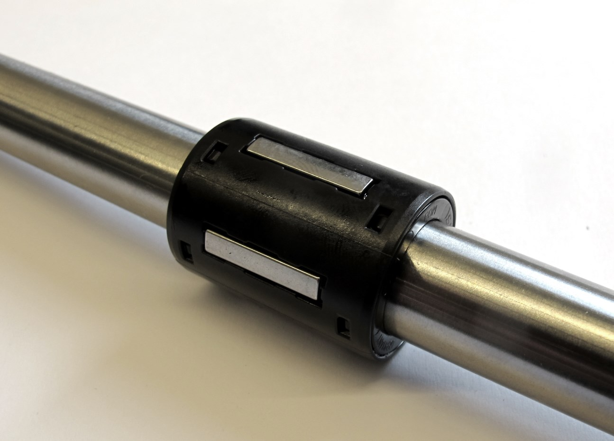  *Linear ball bearings and linear motion rod*  

* Linear ball bearings: KB-1 14mm diameter
* Linear motion rods: Precision Stainless Steel Rods X46 14h6 x 1000mm

### Aluminum profiles
   *Item Aluminum profile*
* Item aluminum profiles - Size 8 - 40mm x 40mm - Item part number: 0.0.026.33

### Angle brackets
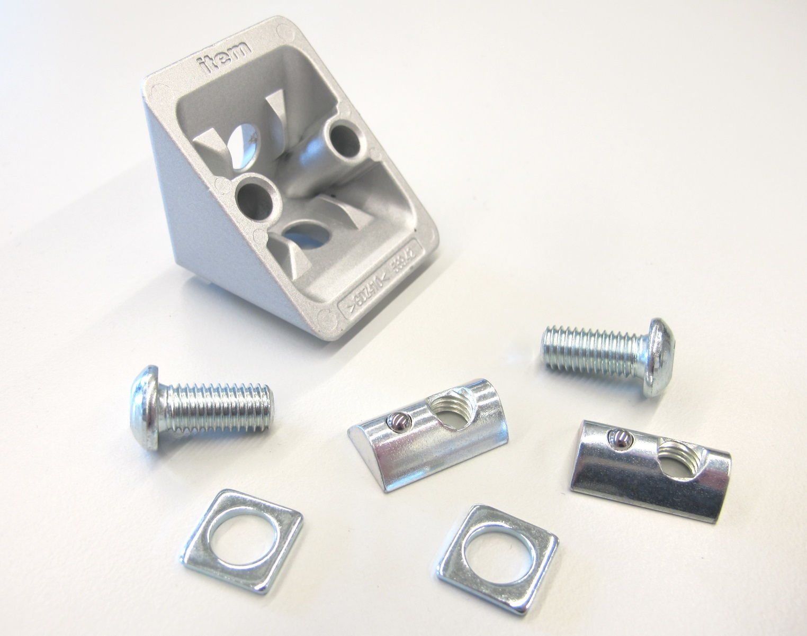   *Item 90 degree angle bracket 40mm*
* 90 degree 40mm angle brackets - Item part number: 0.0.411.15

### End caps
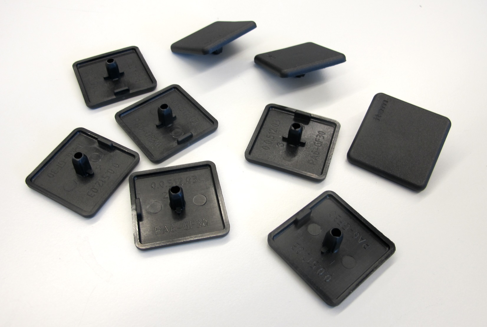   *Item end caps*
* end caps - size 8 - Item part number: 0.0.026.01

### T-slot nuts
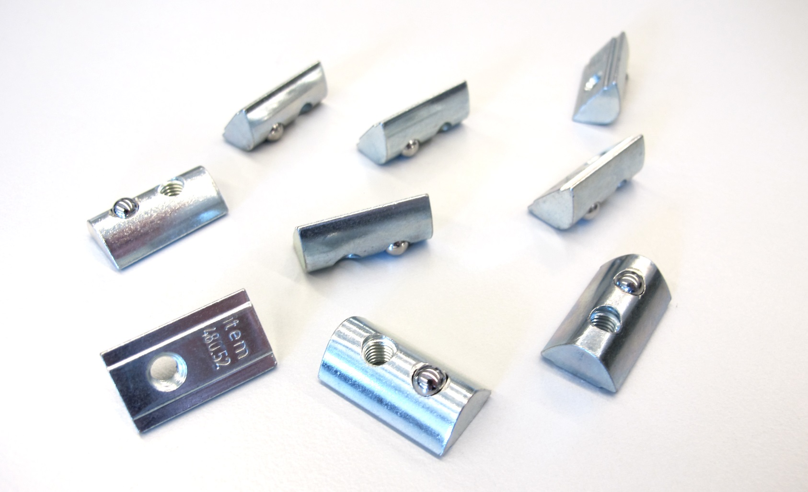   *Item M5 t-slot nuts*
* T-slot nuts M4 - Item part number: 0.0.480.57
* T-slot nuts M5 - Item part number: 0.0.480.54
* T-slot nuts M6 - Item part number: 0.0.480.50
---
## 3D Printed Parts

  

`The recommended printing direction for all the parts below is the positive z direction of the stl files.`

All the STL files for 3d printing the Leg Test Stand can be found here: [STL Files Leg Test Stand](stl_files).

---
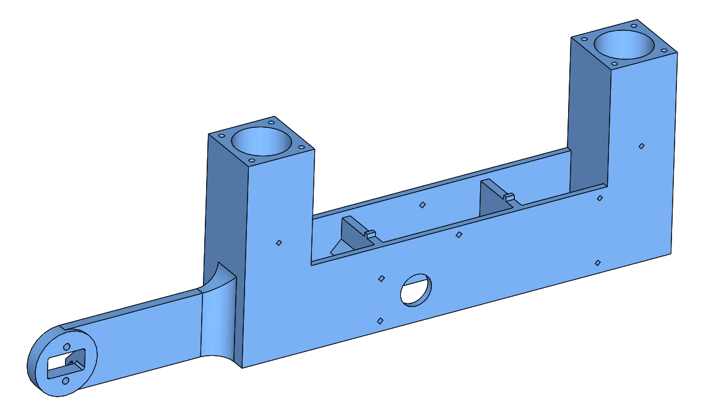  
* [Carriage - STL file](stl_files/carriage.STL) 
---
  
* [Linear Bearing Cover - STL file](stl_files/linear_bearing_cover.STL) 
---

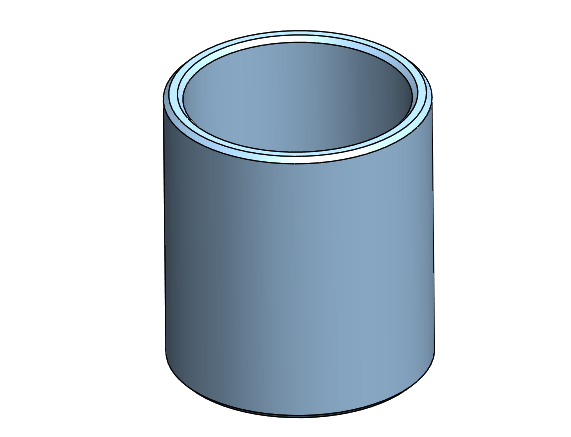  
* [Adjustment Sleeve - STL file](stl_files/adjustment_sleeve.STL) 
---
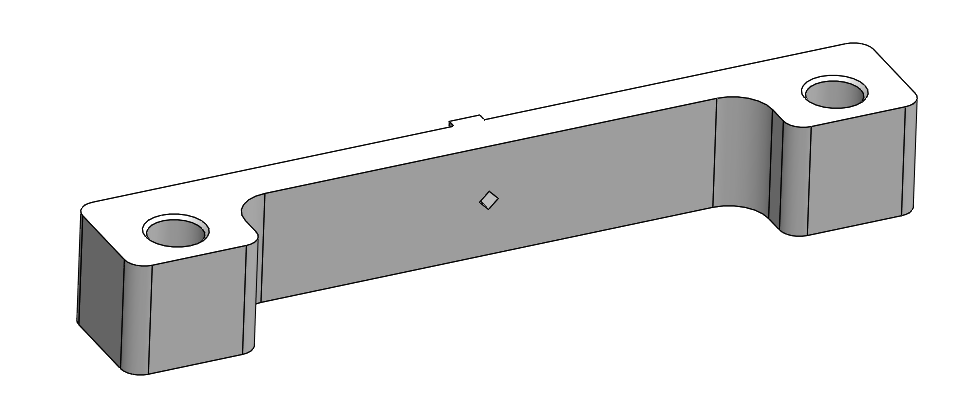  
* [Linear Motion Rod Attachment - STL file](stl_files/linear_motion_rod_attachment.STL) 
---
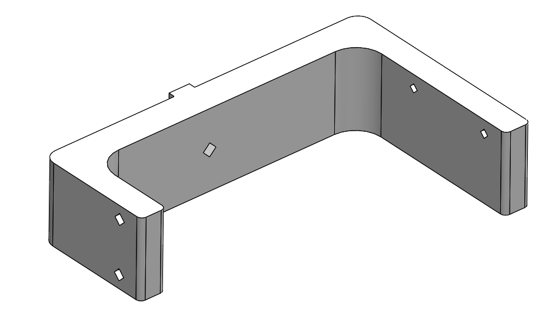  
* [String Potentiometer and Pullup Motor Mount - STL file](stl_files/string_potentiometer_pullup_motor_mount.STL) 
---
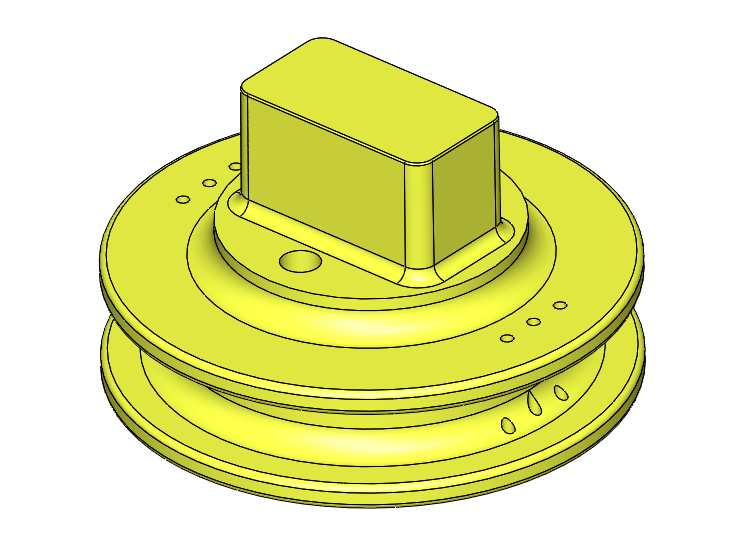  
* [Pulley Pullup Module - STL file](stl_files/pulley_pull_up_module.STL) 
---
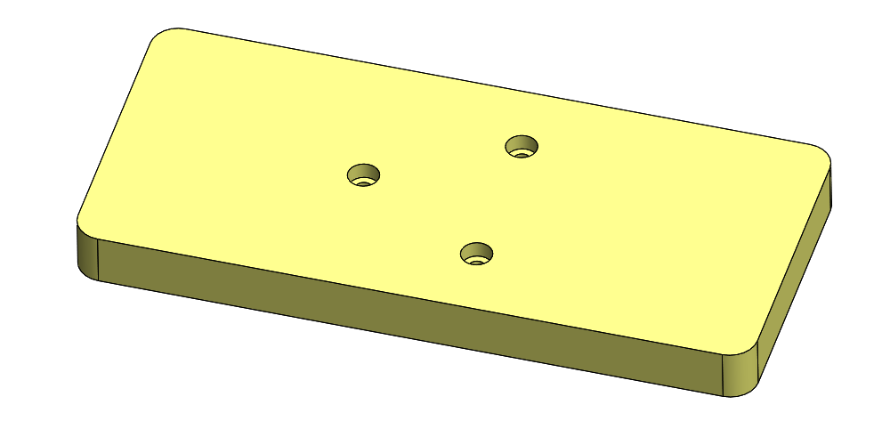  
* [ATI Sensor Top Plate - STL file](stl_files/ati_sensor_top_plate.STL) 
---
  
* [ATI Sensor Bottom Plate - STL file](stl_files/ati_sensor_bottom_plate.STL) 
---

  
* [Motor Driver Electronics Attachment - STL file](stl_files/motor_driver_electronics_attachment.STL) 
---

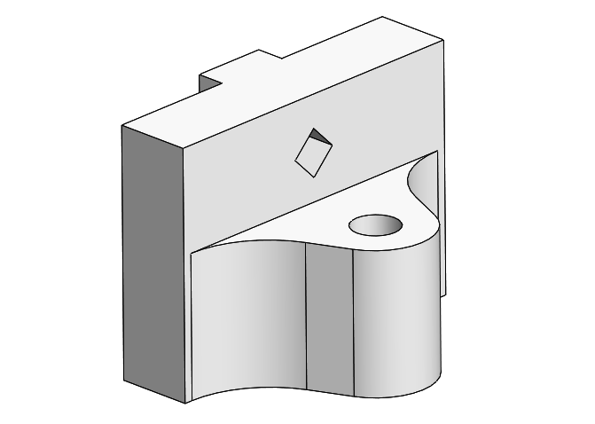  
* [Stopper Attachment - STL file](stl_files/stopper_attachment.STL) 
---
  
* [Stopper Wing - STL file](stl_files/stopper_wing.STL) 
---

## Bill of Materials - Leg Test Stand 2dof
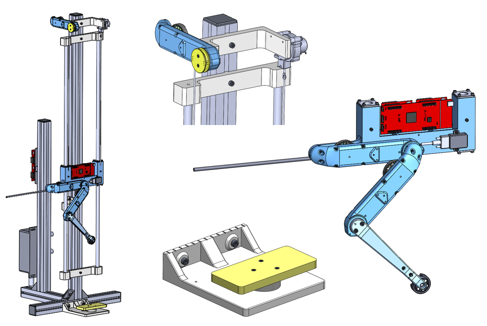

| Part Name | Quantity | Ordering Information | Comments |  
| --- | --- | --- | --- |   
|2DOF Leg |1|Custom assembly|[2DOF Leg Documentation](../leg_2dof_v1/README.md)|
|TI Launchpad Microcontroller |1|TI Launchpad F28069M | |
|TI Booster Packs|2|TI Boosterpacks DRV8305||
|String Potentiometer|1|Waycon LX-PA-40||
|6 Axis Force-Torque-Sensor|1|ATI Mini-40-E SI-40-2 calibration||
|IMU|1|Lord Microstrain 3DM-GX5-25|USB|
|Linear Ball Bearings|4|KB-1 14mm Mädler 64699814||
|Linear Motion Rods|2|Precision Stainless Steel Rods X46 14h6 x 1000mm Mädler: 64799214||
|Aluminum Profiles|4|120cm / 70cm / 30cm / 23cm||
|Angle Brackets|4|||
|End Caps|5|||
|T-Slot Nuts||||
|Carriage|1|[STL file](stl_files/carriage.STL)|3d printed part|
|Linear Bearing Cover|4|[STL file](stl_files/linear_bearing_cover.STL)|3d printed part|
|Adjustment Sleeve|4|[STL file](stl_files/adjustment_sleeve.STL)|3d printed part|
|Linear Motion Rod Attachment|2|[STL file](stl_files/linear_motion_rod_attachment.STL)|3d printed part|
|String Potentiometer and Pullup Motor Mount|1|[STL file](stl_files/string_potentiometer_pullup_motor_mount.STL)|3d printed part|
|Pulley Pullup Module|1|[STL file](stl_files/pulley_pull_up_module.STL)|3d printed part / optional|
|ATI Sensor Top Plate|1|[STL file](stl_files/ati_sensor_top_plate.STL)|3d printed part|
|ATI Sensor Bottom Plate|1|[STL file](stl_files/ati_sensor_bottom_plate.STL)|3d printed part|
|Motor Driver Electronics Attachment|1|[STL file](stl_files/motor_driver_electronics_attachment.STL)|3d printed part / optional|
|Stopper Attachment|2|[STL file](stl_files/stopper_attachment.STL)|3d printed part|
|Stopper Wing|1|[STL file](stl_files/stopper_wing.STL)|3d printed part|

## View the Leg Test Stand cad model in your web browser
 

<a href="https://open-dynamic-robot-initiative.github.io/cad_files/leg_test_stand_v1">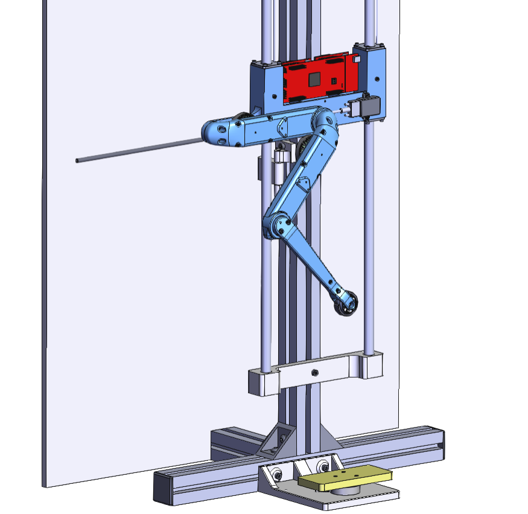</a>  *Leg Test Stand v1 - Click on the picture to view the cad model in your browser*

---
## How to work with this
* To get an better overview of the assembly you can view this [pdf file](details/leg_test_stand_v1.PDF)
* I recommend downloading the free eDrawings viewer for Windows, Mac, iOS and Android [here](https://www.edrawingsviewer.com/download-edrawings).

<a href="details/leg_test_stand_v1.EASM">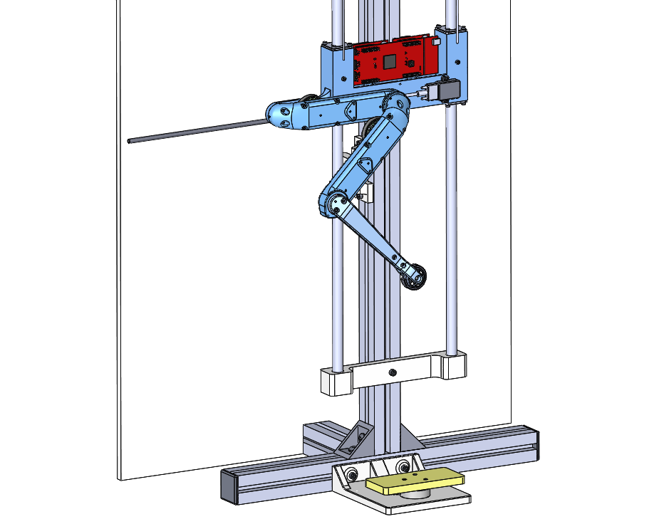</a> *Leg Test Stand 2dof - Click on picture to download and view the 3d eDrawings assembly file.*

* You can download the Solidworks CAD files [here](details/leg_test_stand_v1_solidworks_files.zip).

## Authors
Felix Grimminger

## License
BSD 3-Clause License

## Copyright
Copyright (c) 2019-2021, Max Planck Gesellschaft and New York University

## More Information
[Open Dynamic Robot Initiative - Webpage](https://open-dynamic-robot-initiative.github.io)  
[Open Dynamic Robot Initiative - YouTube Channel](https://www.youtube.com/channel/UCx32JW2oIrax47Gjq8zNI-w)   
[Open Dynamic Robot Initiative - Forum](https://odri.discourse.group/categories)  
[Open Dynamic Robot Initiative - Paper](https://arxiv.org/pdf/1910.00093.pdf)  
[Hardware Overview](../../README.md#open-robot-actuator-hardware)  
[Software Overview](https://github.com/open-dynamic-robot-initiative/open-dynamic-robot-initiative.github.io/wiki)
