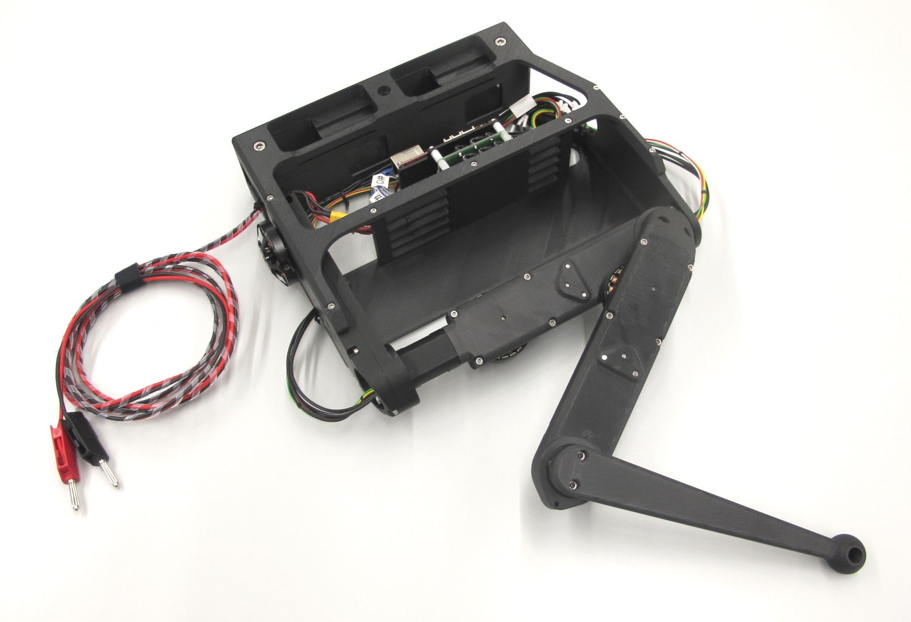
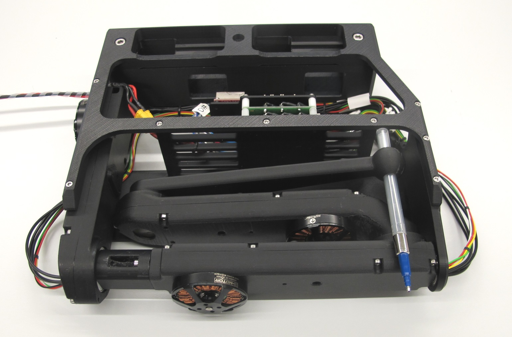
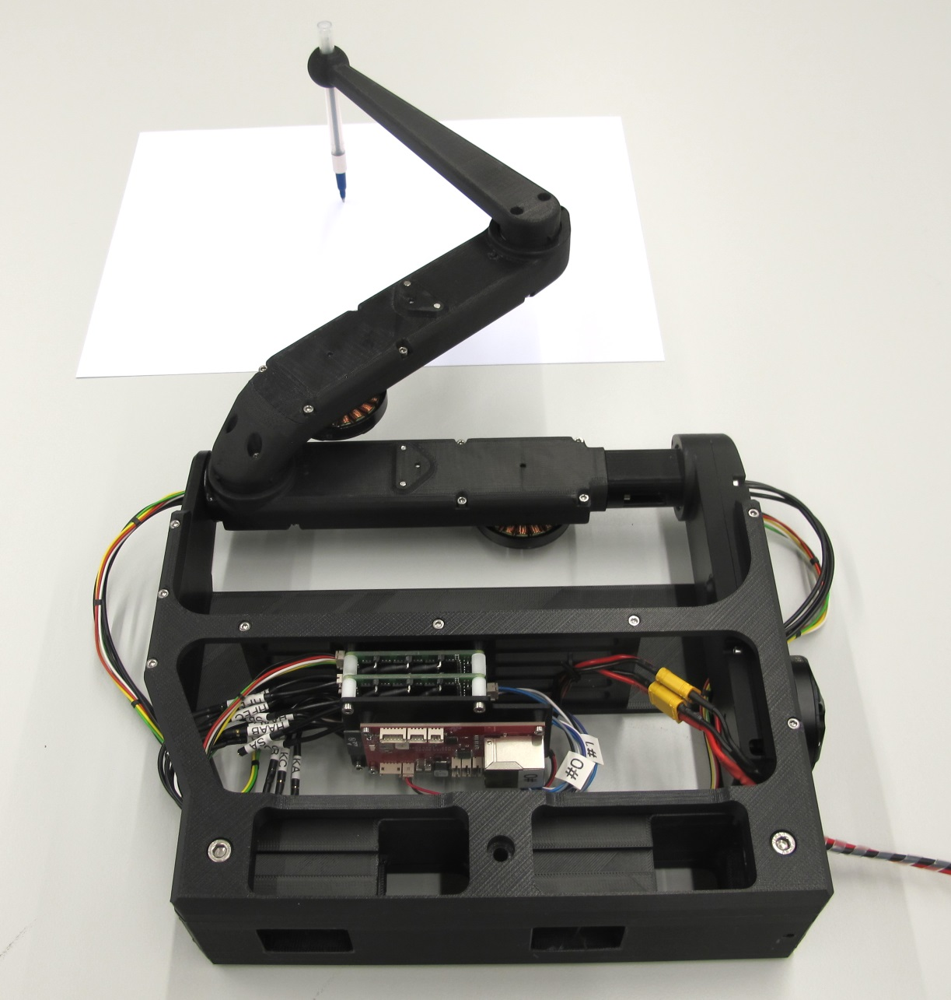
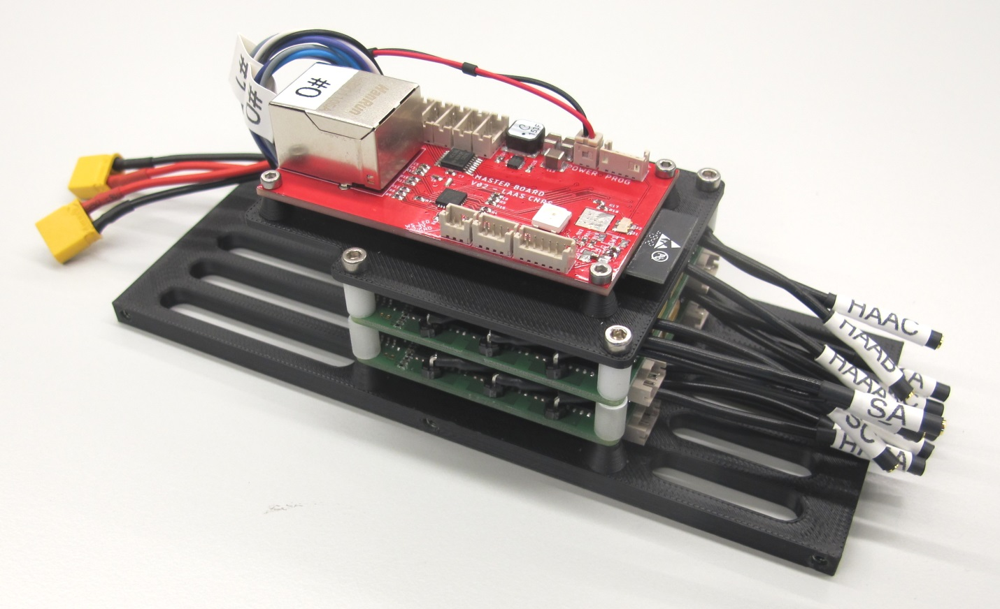
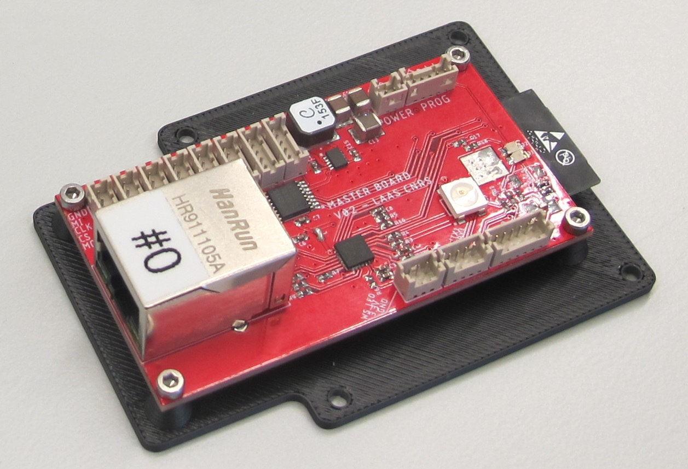
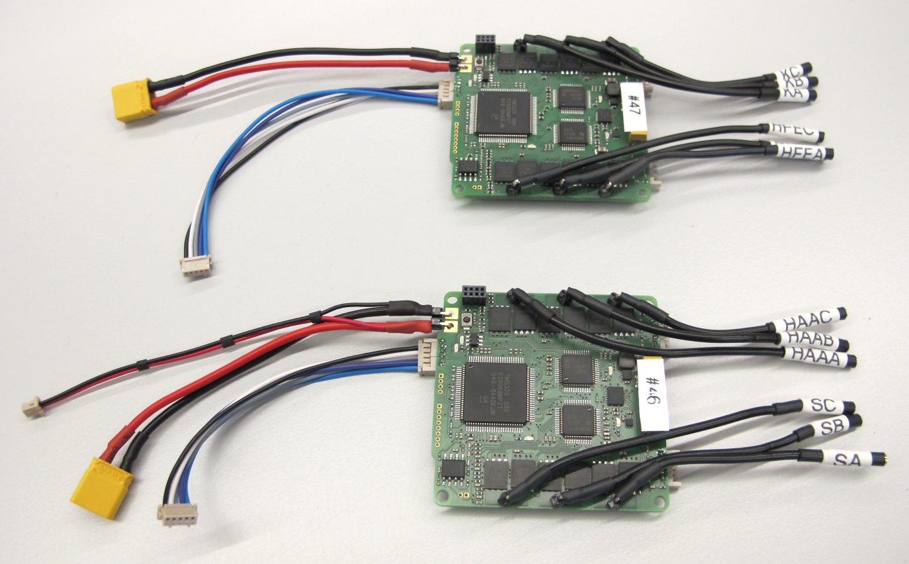
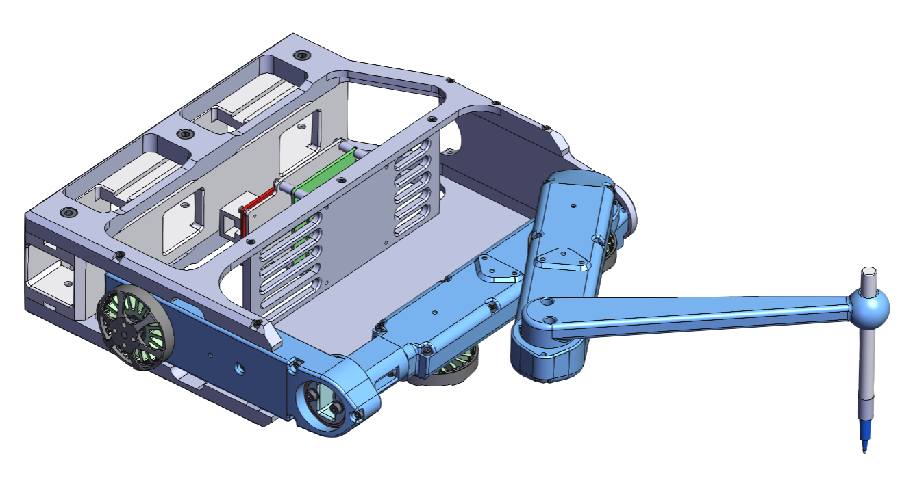

# NYU Finger v1
 *NYU Finger Assembly*  

 *NYU Finger retracted*

 *NYU Finger with pen*

## Description
* 3dof - 3 degree of freedom robot
* consisting of the same actuator modules as the 3dof leg
* external wire for power supply and ethernet communication

## Electronics
   *Electronics stack - consisting of two micro driver boards and a master board*

### Master Board
   *Master board with adapter plate*
* Custom electronics board -> [Master Board Documentation](https://github.com/open-dynamic-robot-initiative/master-board#master-board)
---
### Micro Driver Boards
   *Micro Driver Cards*

* Custom electronics board -> [Micro Driver Board Documentation](../../electronics/micro_driver_electronics/README.md)
---

## 3D Printed Parts
`The recommended printing direction for all the parts below is the positive z direction of the stl files.`
* All the STL files for 3d printing the NYU Finger can be found here: [STL Files NYU Finger](stl_files).  

---

## Bill of Materials - NYU Finger

| Part Name | Quantity | Ordering Information | Comments |  
| --- | --- | --- | --- |   
|Actuator Module Shell Base |1|[STL file](stl_files/actuator_module_shell_base.STL)|3d printed part|
|Actuator Module Shell Cover |1|[STL file](stl_files/actuator_module_shell_cover.STL)|3d printed part|
|Finger Adapter |1|[STL file](stl_files/finger_adapter.STL)|3d printed part|
|Hip AA Module Shell Base |1|[STL file](stl_files/hip_aa_module_shell_base.STL)|3d printed part|
|Hip AA Module Shell Cover |1|[STL file](stl_files/hip_aa_module_shell_cover.STL)|3d printed part|
|Hip FE Module Shell Base |1|[STL file](stl_files/hip_fe_module_shell_base.STL)|3d printed part|
|Hip FE Module Shell Cover |1|[STL file](stl_files/hip_fe_module_shell_cover.STL)|3d printed part|
|Master Board Support |1|[STL file](stl_files/master_board_support.STL)|3d printed part|
|Pen Holder|1|[STL file](stl_files/pen_holder.STL)|3d printed part|
|Spacer Micro Driver Stack|8|[STL file](stl_files/spacer_micro_driver_stack.STL)|3d printed part|
|Structure Bottom Plate|1|[STL file](stl_files/structure_bottom_plate.STL)|3d printed part|
|Structure Front Plate|1|[STL file](stl_files/structure_front_plate.STL)|3d printed part|
|Structure Side Plate Left|1|[STL file](stl_files/structure_side_plate_left.STL)|3d printed part|
|Structure Side Plate Right|1|[STL file](stl_files/structure_side_plate_right.STL)|3d printed part|
| Master Board v2 | 1 | [Master Board Documentation](https://github.com/open-dynamic-robot-initiative/master-board#master-board) | Custom Electronics |
| Micro Driver Board v2 | 2 | [Micro Driver Documentation](../../electronics/micro_driver_electronics/README.md)  | Custom electronics |
|Fasteners Structure Front Plate|6|M2,5x12 Socket Head Cap Screw|Stainless steel|
|Fasteners Structure Bottom Plate|6|M2,5x6 Socket Head Cap Screw|Stainless steel|
|Fasteners Hip AA Modules|4|M2,5x16 Socket Head Cap Screw|Stainless steel|
|Fasteners Hip FE Module|2|M3x12 Socket Head Cap Screw|Stainless steel|
|Fasteners Finger Adapter|2|M3x22 Socket Head Cap Screw|Stainless steel|
|Washers Finger Adapter|2|M3 Washer|Stainless steel|
|Fastener Pen Holder|1|M3x6 Set Screw|Stainless steel|
|Fasteners Master Board|4|M2x6 Socket Head Cap Screw|Stainless steel|
|Fasteners Electronics Stack|4|M2,5x25 Socket Head Cap Screw|Stainless steel|
|Fasteners T-Slotted Aluminium Profile|6|M5x16 Socket Head Cap Screw|Stainless steel|
|Nuts for T-Slotted Aluminium Profile|6|M5 T-Slot Nuts|Stainless steel|

## Wire Lengths
| Wire Name | Quantity |Length | Comments |  
| --- | --- | --- | --- |
|SPI Wires|2|8cm|5 poles|
|Power Wires Micro Driver Boards|2|10cm|2 poles XT30 Connector|
|Motor Phase Wires Micro Driver Board|12|5cm||
|Master Board Power Wires|1|10cm|2 poles|
|Hip AA Motor Phase Wires|3|26cm||
|Hip AA Encoder Wires|1|30cm|5poles|
|Hip FE Motor Phase Wires|3|50cm||
|Hip FE Encoder Wires|1|54cm|5poles|
|Knee Motor Phase Wires|3|27cm||
|Knee Encoder Wires|1|30cm|5 poles|

## Joint Mapping
| Joint ID | Joint Name | Motor Driver Card | Motor Port |Motor Index |
| --- | --- | --- | --- | ---|
|0|HipAA|0|0|0|
|1|HipFE|1|1|3|
|2|Knee|1|0|2|
|3|Spare|0|1|1|

---
## View the NYU finger cad model in your web browser  

  *NYU Finger   Click on the picture to view the NYU finger cad model in your browser*

---

## Authors
Felix Grimminger

## License
BSD 3-Clause License

## Copyright
Copyright (c) 2019-2020, Max Planck Gesellschaft and New York University

## More Information
[Open Dynamic Robot Initiative - Webpage](https://open-dynamic-robot-initiative.github.io)  
[Open Dynamic Robot Initiative - YouTube Channel](https://www.youtube.com/channel/UCx32JW2oIrax47Gjq8zNI-w)   
[Open Dynamic Robot Initiative - Forum](https://odri.discourse.group/categories)  
[Open Dynamic Robot Initiative - Paper](https://arxiv.org/pdf/1910.00093.pdf)  
[Hardware Overview](../../README.md#open-robot-actuator-hardware)  
[Software Overview](https://github.com/open-dynamic-robot-initiative/open-dynamic-robot-initiative.github.io/wiki)
