# Quadruped Robot 12dof v1.1
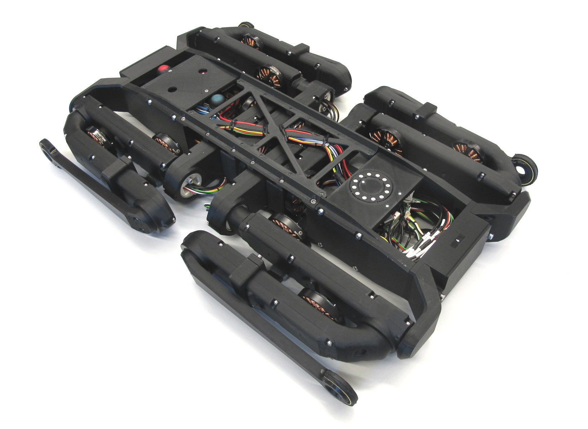 *Quadruped Robot 12dof v1.1 - Autonomy Upgrade - Weight: 2,8kg* 

## Description

### `Untested - not recommended for replication!`

* this page describes the autonomy upgrade for the [Quadruped 12dof v1 Robot](../quadruped_robot_12dof_v1/README.md#quadruped-robot-12dof-v1)
* onboard batteries and wireless communication will enable the robot to operate without power and ethernet wires
* using the onboard imu for state estimation will enable the robot to operate outside of the motion capture area
* the robot will carry two lithium polymer batteries - one battery pack in the front and one battery pack in the back of the robot
* the custom power management board will enable safe operation of the batteries, e-stop handling and real-time current and battery voltage measurements
* there is a status led ring with 12 RGB leds on the top of the robot
* there are two payload interfaces with mounting holes to attach additional components to the top or the bottom of the robot
* the estimated weight increase for this upgrade is about 300g
* the components that were upgraded are marked red in the screenshot below

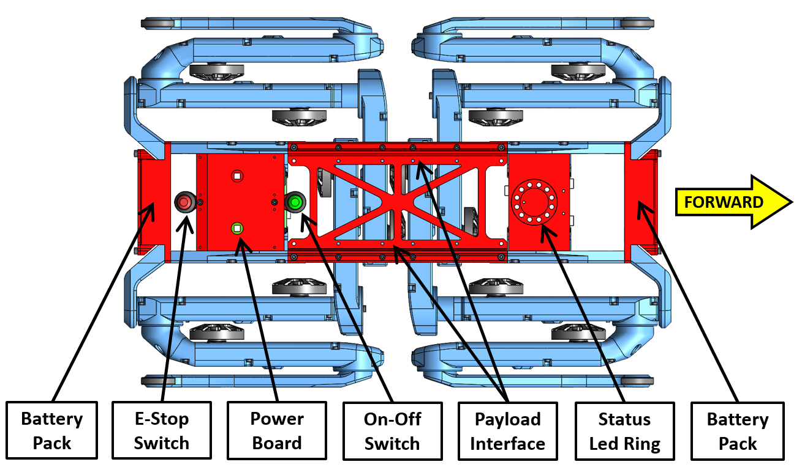 *Quadruped 12dof v1.1 Overview - the updated components are marked in red.*  

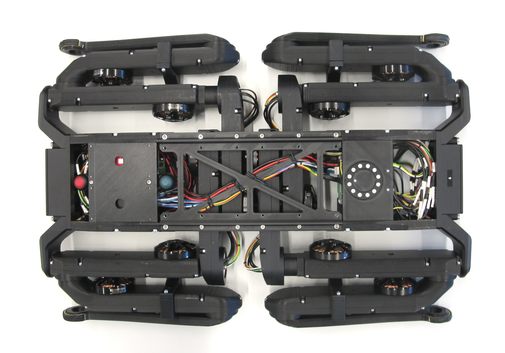 *Quadruped Robot 12dof v1.1 - Top View* 

---
## Electronics
### Power Management Board

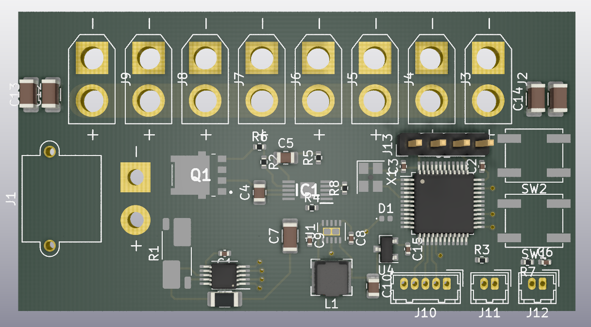 *Power Management Board - Screenshot Top Side - Source: Thomas Flayols*   

* this custom Power Management Board is being developed by Thomas Flayols
* Documentation: [Power Board GitHub Page](https://github.com/thomasfla/power-board)
*	inrush current limitation
*	supply voltage and current measurement with 20bit resolution
*	SPI interface for communication with the Master Board
*	8 x XT30 outputs connectors
* dimensions: 65mm x 35mm
* mounting holes: ø 2,1mm / spacing 61mm x 31mm

## Off-the-shelf Components

### Lithium Polymer Batteries
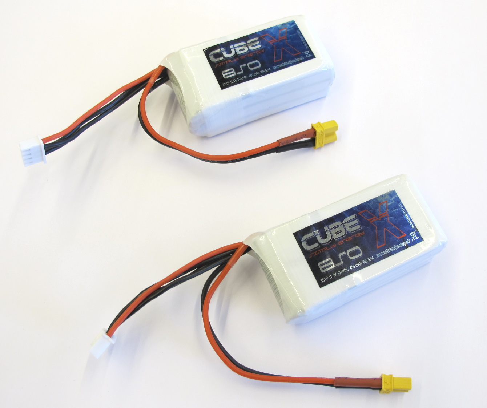 *Lithium Polymer Batteries - weight: 68g each*   

* SLS X-Cube 850mAh lithium polymer batteries
* 3S1P / 11,1V / 30C / 60C
* weight: 68g
* dimensions: 60mm x 30mm x 21mm
* power connector: XT 30
* balancer connector: XH
* don't use the lipo batteries without a power management board!

### Switches
 *Push Button Switches - weight: 3,5g each*   
* E-Stop Switch: red button - normally closed - momentarily open while pushed
* On-Off Switch: green button - normally open - momentarily closed while pushed
* ø13,6mm / weight: 3,5g

### Status Led Ring
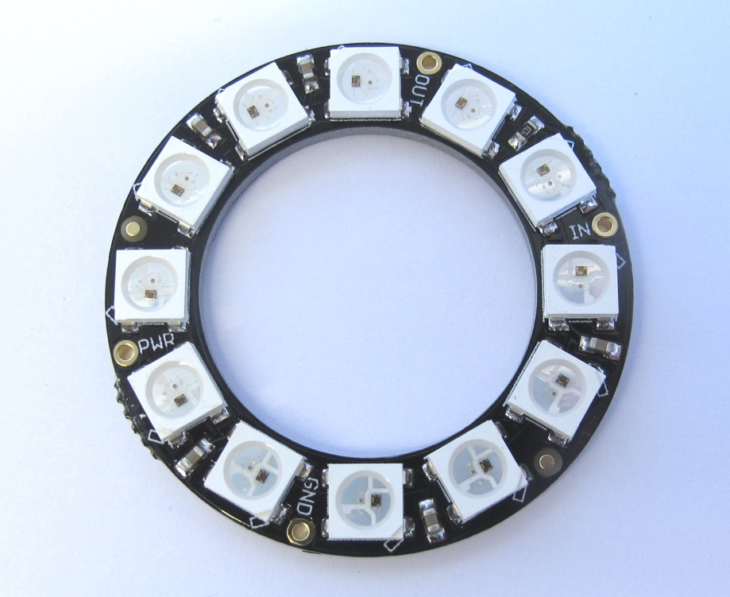 *Status Led Ring - weight: 3,3g*   
* Status Led Ring with 12 Neopixel RGB leds
* dimensions: OD: 36,9mm / ID: 23,3mm
* weight: 3,3g
---
## 3D Printed Parts

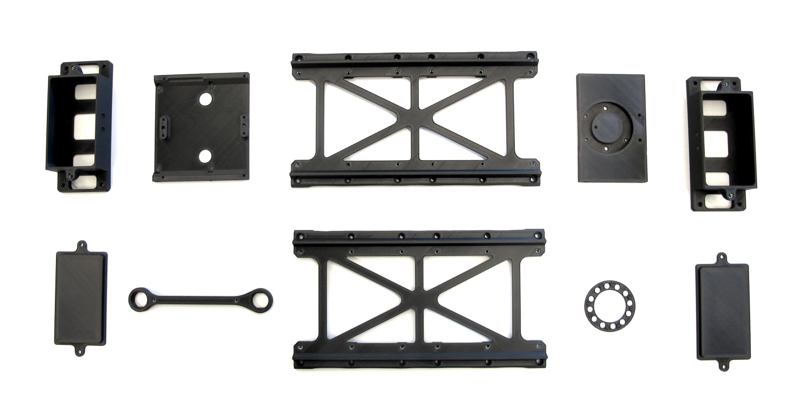 

* All the STL files for 3d printing the parts below can be found here: [STL Files](stl_files).  

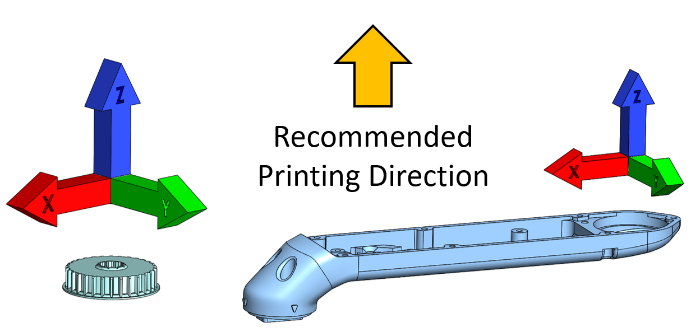 

`The recommended printing direction for all the parts below is the positive z direction of the stl files.`

---
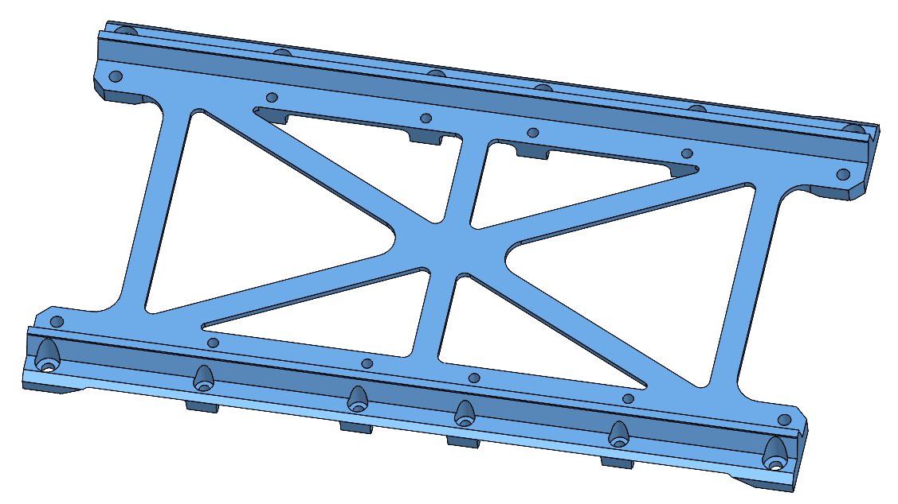  
* [Body Structure Center Payload - STL file](stl_files/body_structure_center_payload.STL) 
* this part can be used on the top and the bottom side of the robot
* weight: 31g
---
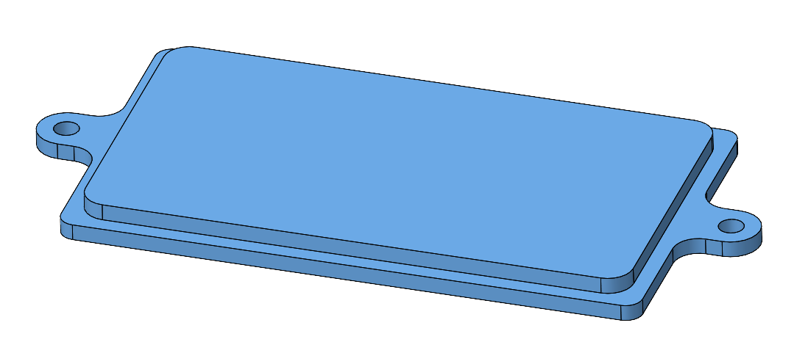  
* [Body Structure Front Batterie Lid - STL file](stl_files/body_structure_front_batterie_lid.STL) 
* weight: 11g
---
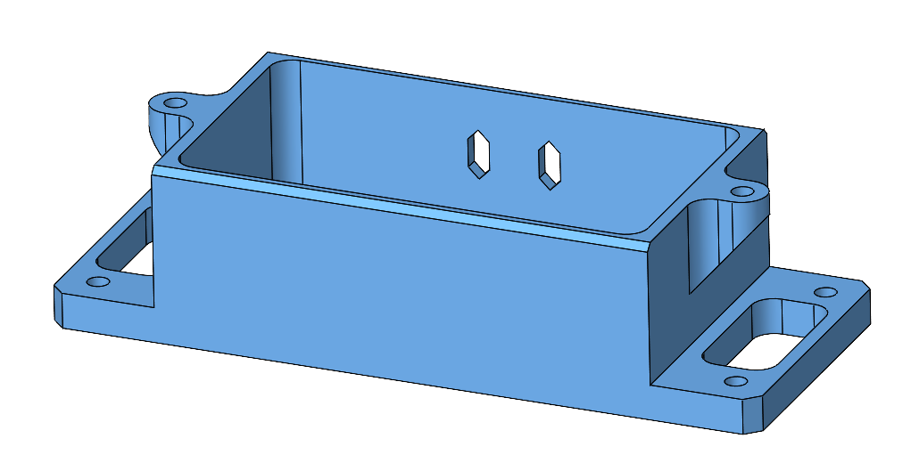  
* [Body Structure Front Batterie - STL file](stl_files/body_structure_front_batterie.STL) 
* weight: 18g

---
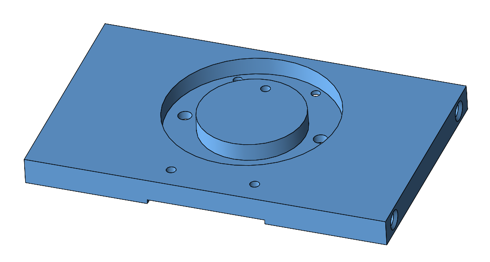  
* [Body Structure Top IMU Leds - STL file](stl_files/body_structure_top_imu_leds.STL) 
* weight: 15g
---
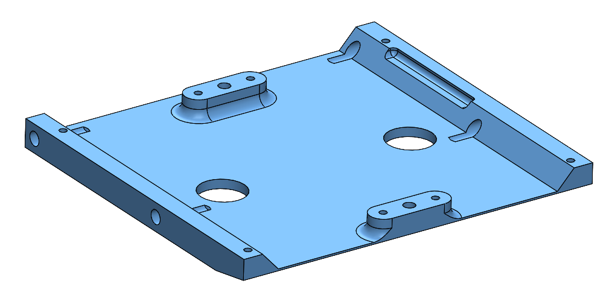  
* [Body Structure Top Master Power Board - STL file](stl_files/body_structure_top_master_power_board.STL) 
* weight: 15g
---
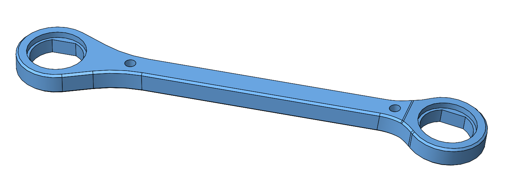  
* [Mount Switches - STL file](stl_files/mount_switches.STL) 
* weight: 4g
---
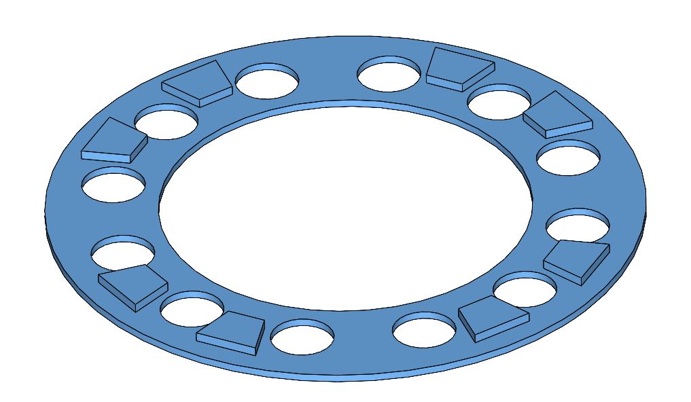  
* [Neo Pixel Cover - STL file](stl_files/neo_pixel_cover.STL) 
* weight: 0,3g
---

## Bill of Materials - Upgrade Quadruped Robot 12dof v1.1
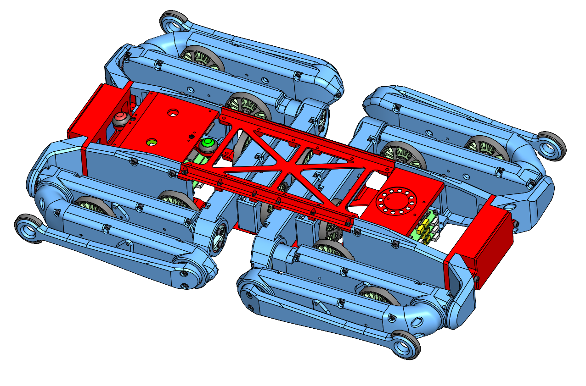

| Part Name | Quantity | Ordering Information | Comments |  
| --- | --- | --- | --- |   
|Power Management Board|1|[Power Board GitHub Page](https://github.com/thomasfla/power-board)|Custom Electronics|
|LiPo Battery SLS X-Cube 850mAh|2|[SLS Product Page](https://www.stefansliposhop.de/en/batteries/sls-x-cube/sls-x-cube-30c/sls-x-cube-850mah-3s1p-11-1v-30c-60c::1534.html) SLSCUX08503130|[Charging and Safey Accessories](../../electronics/details/details_components.md#batteries-and-charging-accessories)|
|E-Stop Switch|1|RS 820-7587|Red Push Button Switch|
|On-Off Switch|1|RS 820-7593|Green Push Button Switch|
|Status Led Ring|1|Adafruit 1643 Mouser 485-1643  Conrad 1516560|NeoPixel Ring RGB LED 12 x WS2812|
|Body Structure Center Payload|2|[STL File](stl_files/body_structure_center_payload.STL)|3d printed part|
|Body Structure Front Batterie Lid|2|[STL File](stl_files/body_structure_front_batterie_lid.STL)|3d printed part|
|Body Structure Front Batterie|2|[STL File](stl_files/body_structure_front_batterie.STL)|3d printed part|
|Body Structure Top IMU Leds|1|[STL File](stl_files/body_structure_top_imu_leds.STL)|3d printed part|
|Body Structure Top Master Power Board|1|[STL File](stl_files/body_structure_top_master_power_board.STL)|3d printed part|
|Mount Switches|1|[STL File](stl_files/mount_switches.STL)|3d printed part|
|Neo Pixel Cover|1|[STL File](stl_files/neo_pixel_cover.STL)|3d printed part|
|Fastener M2 x 6 SHCS|8||Power Board and Master Board|
|Fastener M2,5 x 6 SHCS|1||Switch Mount Back|
|Fastener M2,5 x 8 SHCS|1||Switch Mount Front|
|Fastener M3 x 6 SHCS|4||Batterie Lid|
|Helicoil M2,5 x 3,75mm|10|||
|Helicoil M3 x 4,5mm|20|||

---
## Preparing the 3D Printed Parts

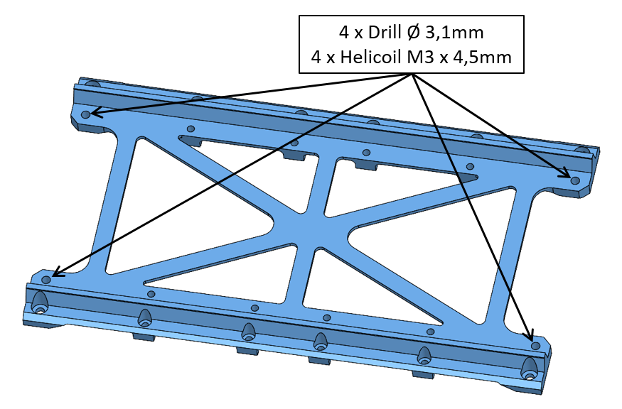 

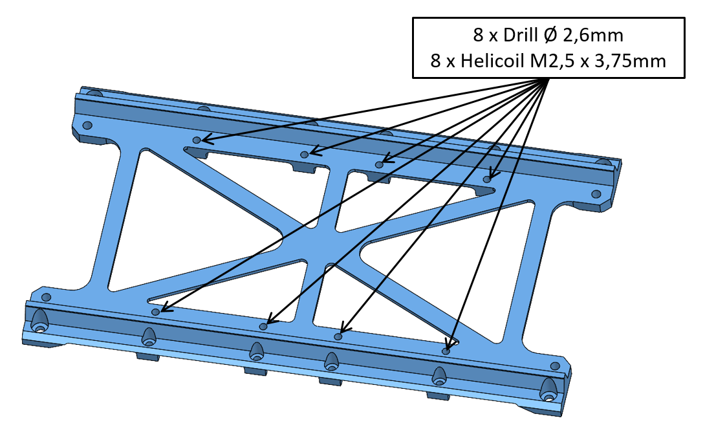 

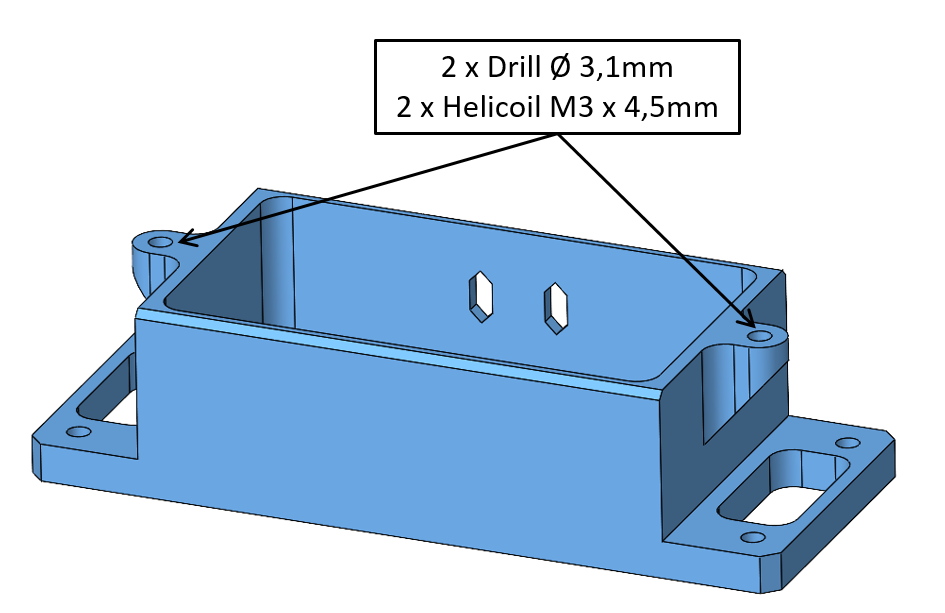 

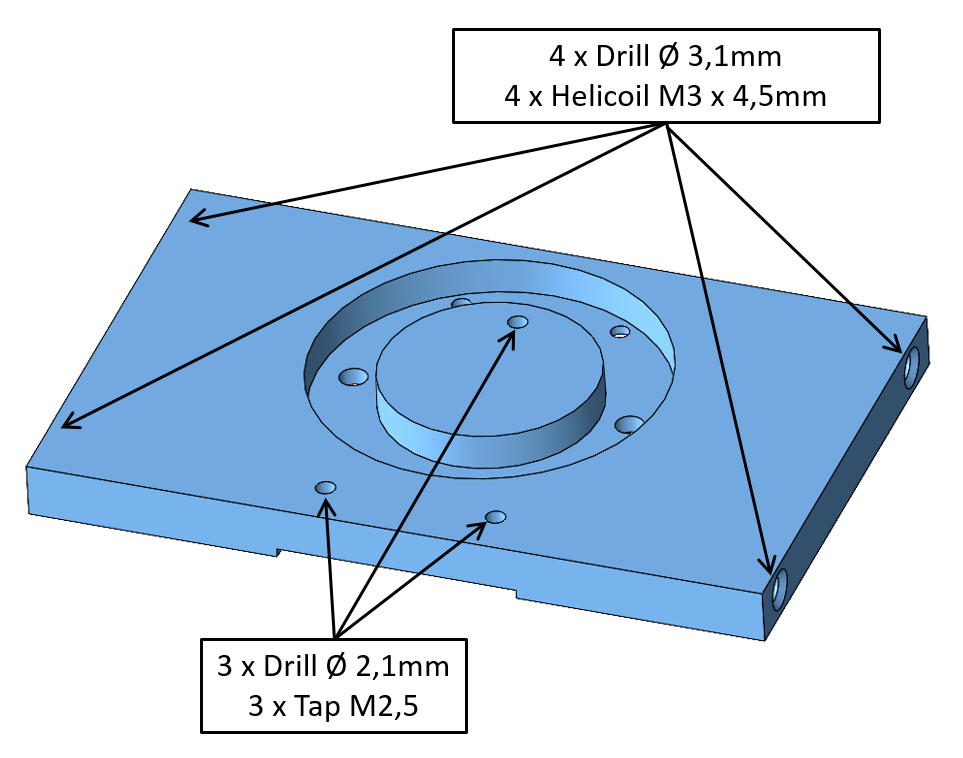 

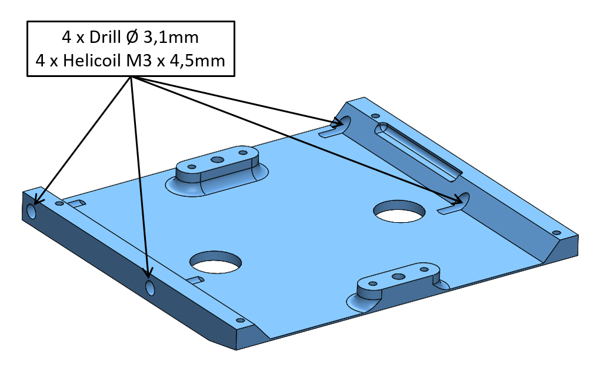 

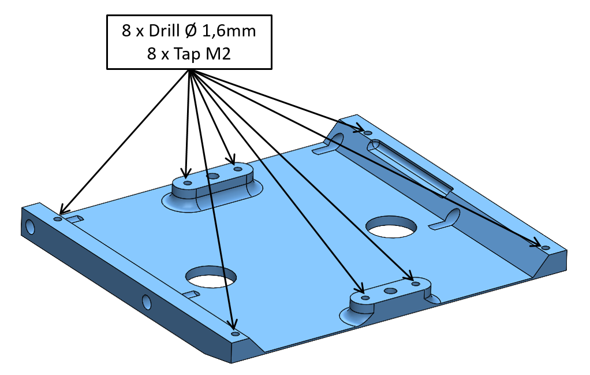 

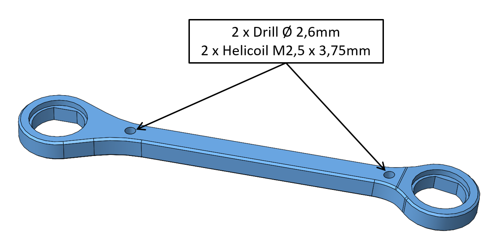 

---
## More Information
[Open Dynamic Robot Initiative - Webpage](https://open-dynamic-robot-initiative.github.io)  
[Open Dynamic Robot Initiative - YouTube Channel](https://www.youtube.com/channel/UCx32JW2oIrax47Gjq8zNI-w)   
[Open Dynamic Robot Initiative - Forum](https://odri.discourse.group/categories)  
[Open Dynamic Robot Initiative - Paper](https://arxiv.org/pdf/1910.00093.pdf)  
[Hardware Overview](../../README.md#open-robot-actuator-hardware)  
[Software Overview](https://github.com/open-dynamic-robot-initiative/open-dynamic-robot-initiative.github.io/wiki)  

---
## Authors
Felix Grimminger

## License
BSD 3-Clause License

## Copyright
Copyright (c) 2019-2021, Max Planck Gesellschaft and New York University
